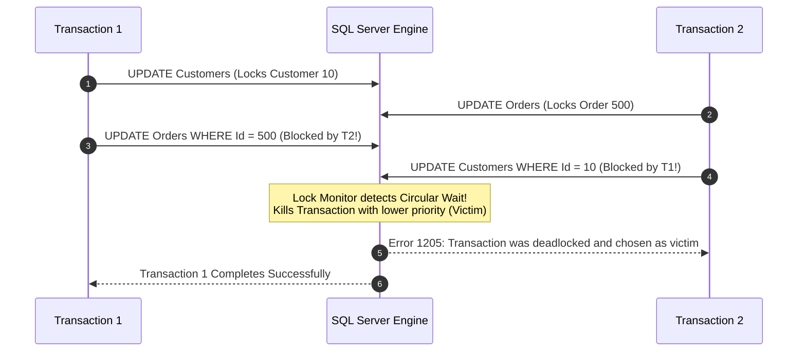

# Section 15: SQL Server Joins, Indexing & Query Execution Engine

> **Curriculum Navigation:**  
> ⏪ [Previous: Section 14 – SQL Server Fundamentals & Relational Algebra](./14_sql_basics.md) | 🏠 [Master Index](./README.md) | ⏩ [Next: Section 16 – Stored Procedures, Functions, CTEs & Transactions](./16_sql_stored_procedures_functions_and_more.md)

---

### Q128. What are Joins in SQL?

#### 1. Executive Summary & Core Concept
- A **Join** is a relational algebraic operation used to **combine rows from two or more tables based on a logical relationship between common columns** (typically a Foreign Key referencing a Primary Key).
- In normalized database designs, data is partitioned across multiple tables to eliminate redundancy (e.g., `Customers` and `Orders`). Joins allow querying these related records as a single consolidated tabular result set.

#### 2. Deep-Dive Architecture & Runtime Internals
- **Physical Join Algorithms in the SQL Server Execution Engine**:
  - Regardless of the logical join syntax (`INNER`, `LEFT`), SQL Server's Query Optimizer chooses one of 3 physical join operators:
  1. **Nested Loops Join**: For each outer row, searches the inner table using an index. Best when the outer table is small and the inner table has an index.
  2. **Merge Join**: Both inputs must be **pre-sorted on the join keys** (via an index). Scans both tables in parallel like a zipper. Extremely fast ($O(N + M)$).
  3. **Hash Match Join**: Builds an in-memory hash table of the smaller input in `tempdb` and probes it with the larger input. Used for large, unsorted, unindexed tables; high memory and CPU cost.

```
SQL Server Physical Join Engines:
Nested Loops: Outer Row ──▶ Index Seek on Inner Table (Best for OLTP)
Merge Join:   Sorted Stream A ──▶ [ Zipper Match ] ◀── Sorted Stream B (Fastest for large sorted streams)
Hash Match:   Input A ──▶ [ In-Memory Hash Table ] ◀── Scans Input B (Fallback for unsorted datasets)
```

#### 3. Production-Ready Code Implementation
```sql
USE EnterpriseCommerceDb;
GO

-- Standard ANSI SQL Join across related entities
SELECT 
    c.CustomerId,
    c.CustomerCode,
    o.OrderId,
    o.OrderTotal,
    o.OrderDateUtc
FROM dbo.Customers c
INNER JOIN dbo.Orders o ON c.CustomerId = o.CustomerId
WHERE o.OrderDateUtc >= '2026-01-01';
GO
```

#### 4. Line-by-Line Code Walkthrough
- `FROM dbo.Customers c INNER JOIN dbo.Orders o ON c.CustomerId = o.CustomerId`: Combines parent and child records where `CustomerId` matches identically in both tables.

#### 5. Real-World Enterprise Use Case & Application
E-commerce checkout pipelines: Joining order headers, line items, product catalogs, shipping addresses, and payment transactions into an invoice view model.

#### 6. Common Pitfalls, Memory Traps & Anti-Patterns
- **Cartesian Product (Accidental CROSS JOIN)**: Forgetting the `ON` clause in legacy syntax (`FROM Customers, Orders`). If `Customers` has 10,000 rows and `Orders` has 100,000 rows, the query generates **1 Billion rows**, bringing the server down with an out-of-memory error!

#### 7. Senior / Architect Interview Follow-ups
- **Interviewer**: *"What causes a Hash Match Join to spill into `tempdb` (Hash Warning event), and how do you fix it?"*
- **Expert Answer**: A Hash Spill occurs when the Query Optimizer's **Cardinality Estimation** underestimates the number of rows (due to stale table statistics). It allocates an insufficient memory grant to the query. When the hash table exceeds available memory, SQL Server spills hash buckets onto physical disk in `tempdb`, causing catastrophic I/O performance drops. Fix by updating table statistics (`UPDATE STATISTICS TableName WITH FULLSCAN`) or indexing the join columns so the optimizer chooses a Merge Join or Nested Loop instead.

---

### Q129. What are the types of Joins in SQL Server?

#### 1. Executive Summary & Core Concept
SQL Server supports 5 primary logical join types:
1. **`INNER JOIN`**: Returns only rows that have **matching values in BOTH tables**.
2. **`LEFT (OUTER) JOIN`**: Returns **all rows from the left table**, plus matching rows from the right table. Non-matching right columns are populated with **`NULL`**.
3. **`RIGHT (OUTER) JOIN`**: Returns **all rows from the right table**, plus matching rows from the left table.
4. **`FULL (OUTER) JOIN`**: Returns **all rows from both tables**. Matching rows are combined; non-matching rows on either side contain `NULL`.
5. **`CROSS JOIN`**: Produces the **Cartesian Product** of both tables (multiplies every row of table A by every row of table B).

#### 2. Deep-Dive Architecture & Runtime Internals
Venn Diagram Representation:
```
INNER JOIN:        [  A ∩ B  ] (Only overlapping rows)
LEFT OUTER JOIN:   [ (A  ) B ] (All of A, plus matched B)
RIGHT OUTER JOIN:  [  A (  B)] (All of B, plus matched A)
FULL OUTER JOIN:   [ (A ∪ B) ] (Everything from A and B)
CROSS JOIN:        A × B       (Every permutation)
```

#### 3. Production-Ready Code Implementation
```sql
USE EnterpriseCommerceDb;
GO

-- 1. INNER JOIN: Customers who HAVE placed orders
SELECT c.CustomerCode, o.OrderId, o.OrderTotal
FROM Customers c
INNER JOIN Orders o ON c.CustomerId = o.CustomerId;

-- 2. LEFT OUTER JOIN: ALL customers, including those who have NEVER placed an order
SELECT c.CustomerCode, o.OrderId, o.OrderTotal
FROM Customers c
LEFT JOIN Orders o ON c.CustomerId = o.CustomerId;

-- 3. LEFT ANTI-JOIN: Find customers who have NEVER ordered (Crucial for marketing re-engagement!)
SELECT c.CustomerCode, c.EmailAddress
FROM Customers c
LEFT JOIN Orders o ON c.CustomerId = o.CustomerId
WHERE o.OrderId IS NULL; -- The Anti-Join filter!

-- 4. FULL OUTER JOIN: Reconciling ledger batches (identifies orphans on either side)
SELECT c.CustomerId, o.OrderId
FROM Customers c
FULL OUTER JOIN Orders o ON c.CustomerId = o.CustomerId;

-- 5. CROSS JOIN: Generating date x store matrices for inventory reporting
SELECT s.StoreName, d.CalendarDate
FROM Stores s
CROSS JOIN CalendarDates d;
GO
```

#### 4. Line-by-Line Code Walkthrough
- `WHERE o.OrderId IS NULL`: Transforms a `LEFT JOIN` into a **Left Anti-Join**, returning exclusively parent records that have zero matching children.
- `CROSS JOIN`: Generates every combination without requiring an `ON` clause.

#### 5. Real-World Enterprise Use Case & Application
Reporting customer churn: A `LEFT JOIN` with `WHERE o.OrderId IS NULL` identifies inactive customers who haven't placed an order in the last 180 days for automated re-engagement campaigns.

#### 6. Common Pitfalls, Memory Traps & Anti-Patterns
- **Accidental Inner Join via WHERE Clause**: Writing `FROM Customers c LEFT JOIN Orders o ON ... WHERE o.OrderTotal > 100`. Because `o.OrderTotal > 100` evaluates to false for rows where `o.OrderTotal` is `NULL`, the `LEFT JOIN` is silently converted into an `INNER JOIN`! Move the condition into the `ON` clause (`LEFT JOIN Orders o ON ... AND o.OrderTotal > 100`) to preserve outer rows.

#### 7. Senior / Architect Interview Follow-ups
- **Interviewer**: *"What is a `CROSS APPLY` and `OUTER APPLY` in SQL Server, and how do they differ from `INNER JOIN` and `LEFT JOIN`?"*
- **Expert Answer**: `APPLY` operators invoke a **Table-Valued Function (TVF) or correlated subquery once for every row** returned by the outer table. A standard `JOIN` operates on static tables and cannot pass outer row column values as parameters to the right-hand table. `CROSS APPLY` behaves like an `INNER JOIN` against a dynamic per-row table expression; `OUTER APPLY` behaves like a `LEFT OUTER JOIN`, preserving outer rows even if the TVF returns zero rows.

---

### Q130. What is a Self-Join?

#### 1. Executive Summary & Core Concept
- A **Self-Join** is a regular join in which a table is **joined with itself**.
- It requires using **table aliases** to treat the single physical table as two distinct logical instances.
- **When to Use**:
  1. **Hierarchical / Tree Structures**: Employee-to-Manager reporting chains, multi-level category taxonomies.
  2. **Sequential Row Comparison**: Comparing values between consecutive rows in the same table (e.g., tracking price changes).

#### 2. Deep-Dive Architecture & Runtime Internals
- In the execution engine, SQL Server opens **two independent scan/seek cursors** on the same physical table or index.
- If the table has an index on the parent foreign key column (`ManagerId`), the engine executes a fast **Nested Loops** join. If unindexed, it performs an expensive self-table scan.

```
Self-Join Hierarchy Model:
Employees Table (Physical):
[ Id: 1, Name: 'CEO Alice', ManagerId: NULL ]
[ Id: 2, Name: 'VP Bob',    ManagerId: 1    ]
[ Id: 3, Name: 'Dev Carol', ManagerId: 2    ]

Logical Self-Join:
Employees (Worker) ──(Joined on Worker.ManagerId = Boss.Id)──▶ Employees (Boss)
```

#### 3. Production-Ready Code Implementation
```sql
USE EnterpriseCommerceDb;
GO

-- 1. HIERARCHICAL TABLE
CREATE TABLE Staff (
    StaffId INT PRIMARY KEY,
    FullName NVARCHAR(100) NOT NULL,
    ManagerId INT NULL, -- Self-referencing foreign key!
    CONSTRAINT FK_Staff_Manager FOREIGN KEY (ManagerId) REFERENCES Staff(StaffId)
);
GO

-- 2. SELF-JOIN: Resolving Worker to Manager names
SELECT 
    w.StaffId AS WorkerId,
    w.FullName AS WorkerName,
    ISNULL(m.FullName, 'TOP EXECUTIVE') AS ManagerName
FROM Staff w
-- Left join with ITSELF using aliases
LEFT JOIN Staff m ON w.ManagerId = m.StaffId;
GO
```

#### 4. Line-by-Line Code Walkthrough
- `FROM Staff w`: Treats `Staff` as the worker table.
- `LEFT JOIN Staff m ON w.ManagerId = m.StaffId`: Self-joins the same table to resolve the manager's name, preserving workers with no managers (CEOs).

#### 5. Real-World Enterprise Use Case & Application
Organizational charts, Bill of Materials (BOM) manufacturing assemblies, and category breadcrumb trees in e-commerce stores (`Electronics` $\rightarrow$ `Computers` $\rightarrow$ `Laptops`).

#### 6. Common Pitfalls, Memory Traps & Anti-Patterns
- Using self-joins 5 times to traverse 5 hierarchy levels. Use a **Recursive Common Table Expression (CTE)** instead for arbitrary tree depths!

#### 7. Senior / Architect Interview Follow-ups
- **Interviewer**: *"How do you prevent infinite loops when traversing hierarchical self-referential tables?"*
- **Expert Answer**: Infinite loops occur when circular references exist (Employee A manages B, B manages C, C manages A). In recursive queries, architects enforce a cycle check by concatenating visited IDs into an audit path (`/1/2/3/`) and using `WHERE Path NOT LIKE '%/' + CAST(Id AS VARCHAR) + '/%'`, or restricting execution depth using `OPTION (MAXRECURSION 100)`.

---

### Q131. What are Indexes in SQL Server?

#### 1. Executive Summary & Core Concept
- An **Index** is an on-disk data structure (typically a **Balanced B+ Tree**) that accelerates data retrieval from tables, analogous to an index in the back of a textbook.
- Without an index, SQL Server must perform a **Table Scan (or Clustered Index Scan)**, reading every single 8 KB data page from disk into memory ($O(N)$).
- With an index, SQL Server performs an **Index Seek**, traversing B-Tree nodes to locate target rows in logarithmic time ($O(\log N)$).
- **The Tradeoff**: Indexes accelerate `SELECT` read queries, but **slow down `INSERT`, `UPDATE`, and `DELETE` operations** because the database engine must maintain all index B-Trees on every mutation.

#### 2. Deep-Dive Architecture & Runtime Internals
- **B+ Tree Architecture in SQL Server**:
  - **Root Node**: The single top-level 8 KB page that the query engine reads first.
  - **Intermediate Nodes**: Direct search flow to lower page ranges.
  - **Leaf Nodes**: The bottom level of the B-Tree:
    - In a **Clustered Index**: The leaf pages **ARE the physical table rows**.
    - In a **Non-Clustered Index**: The leaf pages contain the index keys plus a **Row Locator** (a clustered key or heap RID pointer).
  - Every node page is exactly **8,192 bytes (8 KB)**.

```
B+ Tree Search Structure (Index Seek):
                    ┌─────────────────────────┐
                    │     Root Page (8KB)     │ ──▶ Range: Keys 1 to 1000
                    └────────────┬────────────┘
         ┌───────────────────────┴───────────────────────┐
         ▼                                               ▼
┌─────────────────────────┐                     ┌─────────────────────────┐
│  Intermediate Page 1    │                     │  Intermediate Page 2    │ (Keys 501 - 1000)
│   (Keys 1 to 500)       │                     └────────────┬────────────┘
└────────────┬────────────┘                                  │
             ▼                                               ▼
┌─────────────────────────┐                     ┌─────────────────────────┐
│     Leaf Page (8KB)     │                     │     Leaf Page (8KB)     │
│ [Actual Data Rows / PK] │                     │ [Actual Data Rows / PK] │
└─────────────────────────┘                     └─────────────────────────┘
(Only 3 Page I/O Reads to locate any row among 10 Million rows!)
```

#### 3. Production-Ready Code Implementation
```sql
USE EnterpriseCommerceDb;
GO

-- 1. TABLE STORAGE AUDIT: Inspecting index structure and page metrics
SELECT 
    i.name AS IndexName,
    i.type_desc AS IndexType,
    ps.page_count AS TotalPagesAllocated,
    ps.record_count AS TotalRows,
    (ps.page_count * 8) / 1024 AS SizeInMegabytes,
    ps.avg_fragmentation_in_percent AS FragmentationPercent
FROM sys.indexes i
CROSS APPLY sys.dm_db_index_physical_stats(DB_ID(), i.object_id, i.index_id, NULL, 'LIMITED') ps
WHERE i.object_id = OBJECT_ID('Orders');
GO
```

#### 4. Line-by-Line Code Walkthrough
- `sys.dm_db_index_physical_stats`: Dynamic Management Function (DMF) querying physical B-tree depth, page counts, and fragmentation.

#### 5. Real-World Enterprise Use Case & Application
Optimizing high-frequency search queries in customer portals: Reducing query time from 8 seconds (full table scan) to **1.5 milliseconds** (index seek).

#### 6. Common Pitfalls, Memory Traps & Anti-Patterns
- **Over-Indexing**: Creating 25 indexes on a high-write transactional table. Every insert triggers 25 separate write operations to disk, choking database throughput.

#### 7. Senior / Architect Interview Follow-ups
- **Interviewer**: *"What is the difference between an Index Seek and an Index Scan in an execution plan?"*
- **Expert Answer**: An **Index Seek** uses the B-Tree navigation pointers to jump directly to the exact target page matching the filter predicate ($O(\log N)$). An **Index Scan** traverses the leaf pages of the entire index from start to finish ($O(N)$), essentially performing a full table scan over the index because the search criteria lacked the leading key or contained non-SARGable operators (`LIKE '%xyz'`).

---

### Q132. What is a Clustered index?

#### 1. Executive Summary & Core Concept
- A **Clustered Index** dictates the **physical storage order of the actual table data rows on disk**.
- Because physical rows can only be sorted in one order, a table can have **ONLY ONE Clustered Index**.
- The **leaf nodes of a clustered index DO NOT point to data—THEY ARE THE DATA**.
- A table without a clustered index is stored as an unordered, unsorted pool of pages called a **Heap**.

#### 2. Deep-Dive Architecture & Runtime Internals
- In a Clustered Index:
  - The rows are physically arranged in 8 KB data pages sorted by the clustered index key columns.
  - The pages are doubly linked in a chain (`NextPage` and `PreviousPage` pointers).
  - An `Index Seek` navigates the B-Tree root and intermediate levels down to the exact data page and row offset.
- **Selection Criteria for a Clustered Key**:
  1. **Monotonically Increasing**: Prevents **B-Tree Page Splits** (e.g., `IDENTITY`, sequential numbers).
  2. **Narrow**: Kept as small as possible (`INT`, `BIGINT`), because the clustered key is duplicated inside **every non-clustered index row locator**!
  3. **Static**: Rarely updated to prevent shifting physical rows across pages.
  4. **Unique**: Avoids hidden 4-byte uniquifier overhead added by SQL Server.

```
Clustered Index Physical Layout:
Root ──▶ Intermediate ──▶ Leaf Level (Page 101) ──▶ Leaf Level (Page 102)
                          ┌─────────────────────┐   ┌─────────────────────┐
                          │ Row 1: Alice | $100 │   │ Row 3: Carol | $300 │
                          │ Row 2: Bob   | $200 │   │ Row 4: Dave  | $400 │
                          └─────────────────────┘   └─────────────────────┘
                          (THE LEAF NODES ARE THE ACTUAL PHYSICAL TABLE ROWS!)
```

#### 3. Production-Ready Code Implementation
```sql
USE EnterpriseCommerceDb;
GO

-- Explicitly defining a Clustered Index on a custom business column
CREATE TABLE TransactionLedger (
    LedgerEntryId BIGINT IDENTITY(1,1) NOT NULL,
    AccountId INT NOT NULL,
    PostingDateUtc DATETIME2(3) NOT NULL,
    Amount DECIMAL(18,2) NOT NULL,
    Description NVARCHAR(255)
);
GO

-- Create Clustered Index: Physically sorts table by PostingDateUtc and AccountId
CREATE CLUSTERED INDEX CIX_TransactionLedger_Date_Account
ON TransactionLedger (PostingDateUtc ASC, AccountId ASC);
GO
```

#### 4. Line-by-Line Code Walkthrough
- `CREATE CLUSTERED INDEX ... ON (PostingDateUtc ASC, AccountId ASC)`: Physically sorts ledger records on disk by timestamp and account. Ideal for range-based reporting queries (`WHERE PostingDateUtc BETWEEN ...`).

#### 5. Real-World Enterprise Use Case & Application
Time-series and audit ledger data: Ordering by date clusters historical logs together on contiguous disk pages, allowing range scans to read sequential disk blocks at maximum NVMe drive throughput.

#### 6. Common Pitfalls, Memory Traps & Anti-Patterns
- Using non-sequential GUIDs (`NEWID()`) as the clustered index key. Random GUID insertions force SQL Server to split existing 8 KB pages in half to make room (**Page Splits**), causing massive I/O spikes and 95% fragmentation.

#### 7. Senior / Architect Interview Follow-ups
- **Interviewer**: *"What is a 'Page Split' in a clustered index, and why is it devastating to transactional performance?"*
- **Expert Answer**: An 8 KB data page holds a fixed number of rows. When a new row must be inserted into an already full page (due to random clustered key ordering), SQL Server must allocate a new 8 KB page, move **50% of the rows** from the full page to the new page, and rewire the B-Tree and linked-list pointers. This incurs synchronous disk I/O, heavy transaction log writes, and leaves pages half-empty, doubling storage requirements and cache memory usage.

---

### Q133. What is a Non-Clustered index?

#### 1. Executive Summary & Core Concept
- A **Non-Clustered Index** is an independent B-Tree structure stored **separately from the physical table data pages**.
- The leaf nodes of a non-clustered index contain **the indexed key columns plus a pointer (Row Locator)** pointing to the actual data row:
  - If the table has a **Clustered Index**: The pointer is the **Clustered Index Key**.
  - If the table is a **Heap (no clustered index)**: The pointer is a **Row ID (RID)** consisting of `File:Page:Slot`.
- A table can have **up to 999 Non-Clustered Indexes** in modern SQL Server.

#### 2. Deep-Dive Architecture & Runtime Internals
- **The Key Lookup / Bookmark Lookup Penalty**:
  - If a query selects columns that are **not** present in the non-clustered index, the engine must navigate the non-clustered B-Tree to find the clustered key, and then perform a **Key Lookup (Clustered Index Seek)** to retrieve the remaining columns from the physical table page.
  - If many rows match, the cost of thousands of random Key Lookups exceeds a full table scan!
- **Covering Index (`INCLUDE`)**:
  - You can eliminate Key Lookups by adding non-key columns to the leaf level of the non-clustered index using the **`INCLUDE`** clause:
  - Included columns live *only at the leaf level*, not in the B-Tree intermediate navigation nodes, keeping the index narrow and fast!

```
Non-Clustered Index with Key Lookup vs Covering Index:
WITHOUT INCLUDE (Key Lookup):
Non-Clustered Seek (Finds Email) ──▶ Clustered Key (Id 42) ──▶ Key Lookup to Clustered Index (Fetches Name, Balance)
(2x Page I/O Overhead!)

WITH INCLUDE (Covering Index):
Non-Clustered Seek (Contains Email, Name, Balance in Leaf Page!) ──▶ Immediate Return! (Zero Key Lookups!)
```

#### 3. Production-Ready Code Implementation
The following code demonstrates creating an enterprise-grade **Covering Index**:

```sql
USE EnterpriseCommerceDb;
GO

-- HIGH-PERFORMANCE COVERING INDEX:
-- 1. Indexed Key: EmailAddress (Used for B-Tree Seeks in WHERE/JOIN)
-- 2. Included Leaf Columns: CustomerCode, CreatedAtUtc (Satisfies SELECT list with ZERO Key Lookups!)
CREATE NONCLUSTERED INDEX NCIX_Customers_Email_Covering
ON Customers (EmailAddress ASC)
INCLUDE (CustomerCode, CreatedAtUtc);
GO

-- THIS QUERY RUNS AS A 100% COVERED INDEX SEEK (Fastest possible read!)
SELECT CustomerCode, CreatedAtUtc
FROM Customers
WHERE EmailAddress = 'alice@enterprise.corp';
GO
```

#### 4. Line-by-Line Code Walkthrough
- `ON Customers (EmailAddress ASC)`: Primary seek key in the B-Tree.
- `INCLUDE (CustomerCode, CreatedAtUtc)`: Copies data directly into leaf nodes. Eliminates all secondary lookups to the base table.

#### 5. Real-World Enterprise Use Case & Application
Customer login lookup: Querying `SELECT Id, PasswordHash, Salt, IsLocked FROM Users WHERE Email = @email`. Creating a covering index on `Email` including the other fields allows authentication to execute in under **0.5 milliseconds**.

#### 6. Common Pitfalls, Memory Traps & Anti-Patterns
- Putting too many columns into the `INCLUDE` clause. If you include 20 columns, the index duplicates almost the entire table, bloating disk and memory cache footprints.

#### 7. Senior / Architect Interview Follow-ups
- **Interviewer**: *"What is the difference between placing a column in the index key list vs placing it in the `INCLUDE` clause?"*
- **Expert Answer**:
  - **Index Key Columns**: Stored in **all levels of the B-Tree** (root, intermediate, leaf). They are physically sorted and can be used for **filtering (`WHERE`)**, **joining (`ON`)**, and **sorting (`ORDER BY`)**. Count is limited to 32 keys and 1,700 bytes.
  - **Included Columns**: Stored **only at the leaf level**. They are **not sorted** and cannot be used for seek predicates. They exist purely to satisfy the `SELECT` projection list to avoid Key Lookups, and do not count toward index key size limits.

---

### Q134. What is the difference between Clustered and Non-Clustered index?

#### 1. Executive Summary & Core Concept
- **Clustered Index**:
  - Determines the **physical storage order** of the table data pages.
  - Only **ONE** per table.
  - The leaf level **IS the physical data**.
  - Faster for range scans (`BETWEEN`, `>`, `<`).
- **Non-Clustered Index**:
  - Stored as a **separate, independent B-Tree** structure pointing to the table.
  - Up to **999** per table.
  - The leaf level contains **index keys + row locator pointers** to the base data.
  - Faster for point lookups on specific business keys (`Email`, `SSN`).

#### 2. Deep-Dive Architecture & Runtime Internals
Architectural Comparison Matrix:
| Dimension | Clustered Index | Non-Clustered Index |
| :--- | :--- | :--- |
| **Max Allowed Per Table** | Exactly **1** | Up to **999** |
| **Leaf Node Content** | Physical data rows (All columns) | Index Key + Row Locator pointer (or Included columns) |
| **Physical Table Order** | Physically sorted on disk by index key | Unrelated to physical disk sort order |
| **Storage Overhead** | None (It *is* the table) | Additional disk and memory buffer pool space |
| **Best Query Type** | Range scans (`BETWEEN`, `>`, `ORDER BY`) | Exact point lookups (`WHERE Id = @x`) |
| **Default Creation** | Primary Key constraint | Unique constraint |

```
Clustered Index:
Leaf Level: [ Key 1 | All Columns... ][ Key 2 | All Columns... ]

Non-Clustered Index:
Leaf Level: [ Key A | ClusteredKey 1 ][ Key B | ClusteredKey 2 ]
```

#### 3. Production-Ready Code Implementation
```sql
USE EnterpriseCommerceDb;
GO

-- Table illustrating both index types working together
CREATE TABLE ProductInventory (
    ProductId INT NOT NULL,               -- Will be Clustered Key
    SkuNumber VARCHAR(50) NOT NULL,       -- Will be Non-Clustered Key
    WarehouseId INT NOT NULL,             -- Will be Non-Clustered Key
    QuantityOnHand INT NOT NULL,
    LastStockedDate DATE NOT NULL
);
GO

-- 1. CLUSTERED INDEX: Physically sorts inventory by ProductId
CREATE CLUSTERED INDEX CIX_ProductInventory_ProductId
ON ProductInventory (ProductId ASC);
GO

-- 2. NON-CLUSTERED INDEX: Fast lookup by SkuNumber pointing back to ProductId
CREATE NONCLUSTERED INDEX NCIX_ProductInventory_Sku
ON ProductInventory (SkuNumber ASC)
INCLUDE (QuantityOnHand);
GO
```

#### 4. Line-by-Line Code Walkthrough
- `CIX_ProductInventory_ProductId`: Establishes physical table storage.
- `NCIX_ProductInventory_Sku`: Secondary B-tree structure. When searched by SKU, reads `QuantityOnHand` directly from the leaf node.

#### 5. Real-World Enterprise Use Case & Application
Enterprise warehouse logistics: Physical rows sorted by `ProductId` (clustered) for batch processing, with non-clustered indexes on `Barcode` and `WarehouseLocation` for mobile handheld scanner lookups.

#### 6. Common Pitfalls, Memory Traps & Anti-Patterns
- Choosing a wide string column (e.g., `VARCHAR(100)`) as the clustered index key. Because the clustered key is copied into every single non-clustered index leaf row, a wide clustered key artificially inflates the size of all secondary indexes!

#### 7. Senior / Architect Interview Follow-ups
- **Interviewer**: *"What happens to Non-Clustered Indexes when you rebuild or drop a Clustered Index?"*
- **Expert Answer**: When you drop or rebuild a Clustered Index, **EVERY NON-CLUSTERED INDEX on the table is automatically rebuilt twice!** When dropped, the table becomes a Heap, so all non-clustered index row locators must be rewritten from clustered keys to Heap RIDs. When a new clustered index is created, all non-clustered indexes must be rebuilt again to replace the RIDs with the new clustered keys.

---

### Q135. How to create Clustered and Non-Clustered index in a table?

#### 1. Executive Summary & Core Concept
Indexes are created in SQL Server using Data Definition Language (DDL):
- **Clustered Index**: `CREATE CLUSTERED INDEX IndexName ON TableName(Column ASC);`
- **Non-Clustered Index**: `CREATE NONCLUSTERED INDEX IndexName ON TableName(Column ASC);`
- **Filtered Index**: Adds a `WHERE` clause to index only a subset of rows (`WHERE IsActive = 1`).
- **Options**: `WITH (FILLFACTOR = 85, ONLINE = ON)` allows online rebuilding without locking users out of production tables.

#### 2. Deep-Dive Architecture & Runtime Internals
- **Fill Factor (`FILLFACTOR`)**:
  - Specifies the percentage of space on each 8 KB leaf page to fill with data during index creation, leaving the remainder free as **buffer headroom**.
  - `FILLFACTOR = 100` (or `0`): Completely fills pages. Best for read-only tables.
  - `FILLFACTOR = 80`: Leaves 20% free space per page. Accommodates future `INSERT`s without triggering page splits!
- **Online Index Operations (`ONLINE = ON`)**:
  - In Enterprise Edition, creates or rebuilds indexes while holding only a brief shared intent lock, allowing live users to continue reading and writing to the table concurrently.

```
Page Fill Factor Visualization (8KB Page):
FILLFACTOR = 100%: [ Data ][ Data ][ Data ][ Data ] (FULL - Next insert causes Page Split!)
FILLFACTOR = 80%:  [ Data ][ Data ][ Data ][ FREE HEADROOM ] (Safe - Absorbs next insert!)
```

#### 3. Production-Ready Code Implementation
```sql
USE EnterpriseCommerceDb;
GO

-- 1. Create Clustered Index with Compression
CREATE CLUSTERED INDEX CIX_Orders_OrderDate
ON Orders (OrderDateUtc ASC)
WITH (
    DATA_COMPRESSION = PAGE, -- Reduces disk and memory usage by up to 60%!
    FILLFACTOR = 90          -- Leaves 10% page headroom for inserts
);
GO

-- 2. Create Composite Non-Clustered Index with Covered Columns
CREATE NONCLUSTERED INDEX NCIX_Orders_Customer_Status
ON Orders (CustomerId ASC, OrderStatus ASC)
INCLUDE (OrderTotal)
WITH (
    FILLFACTOR = 85,
    ONLINE = ON -- Production safety: Does not block live transactions!
);
GO

-- 3. Create Filtered Non-Clustered Index (Minimal footprint!)
-- Indexes ONLY active pending orders for high-speed queue dispatching!
CREATE NONCLUSTERED INDEX NCIX_Orders_PendingQueue
ON Orders (OrderId ASC)
INCLUDE (CustomerId, OrderTotal)
WHERE OrderStatus = 'PENDING';
GO
```

#### 4. Line-by-Line Code Walkthrough
- `DATA_COMPRESSION = PAGE`: Enterprise feature compressing repeated dictionary values, fitting 3x more rows per 8 KB page.
- `ONLINE = ON`: Ensures production uptime during index creation.
- `WHERE OrderStatus = 'PENDING'`: Filtered index. If 99% of orders are completed and 1% are pending, this index is 99% smaller than a full index!

#### 5. Real-World Enterprise Use Case & Application
High-velocity message queuing inside SQL Server: Filtered indexes on `WHERE Processed = 0` keep index sizes minimal, enabling instant queue polling without scanning millions of processed records.

#### 6. Common Pitfalls, Memory Traps & Anti-Patterns
- Setting `FILLFACTOR = 50` globally. This halves the amount of data stored per page, doubling total database size and wasting half of the SQL Server buffer pool RAM! Use 85-90% only on tables with proven page split issues.

#### 7. Senior / Architect Interview Follow-ups
- **Interviewer**: *"How do you perform Index Maintenance (Reorganize vs Rebuild) based on fragmentation thresholds?"*
- **Expert Answer**:
  - **Fragmentation between 5% and 30%**: Execute **`ALTER INDEX ... REORGANIZE`**. This defragments leaf nodes in-place, runs completely online, and does not require extra disk space.
  - **Fragmentation > 30%**: Execute **`ALTER INDEX ... REBUILD WITH (ONLINE = ON)`**. This drops and recreates the B-tree structure completely, resets the fill factor, and updates index statistics.

---

### Q136. In which column will you apply indexing to optimize this query?

#### 1. Executive Summary & Core Concept
When given a target query, index design follows the **E-S-R Rule (Equality, Sort, Range)**:
1. **Equality Columns (`=`)**: Put columns filtered by exact equality first in the index key.
2. **Sort Columns (`ORDER BY`)**: Put columns used for sorting next to eliminate expensive sort operators.
3. **Range Columns (`<`, `>`, `BETWEEN`, `LIKE 'A%'`)**: Put range-filtered columns next.
4. **Projection Columns (`SELECT`)**: Add remaining columns that appear in the `SELECT` list to the **`INCLUDE`** clause to make the index 100% **Covering**.

#### 2. Deep-Dive Architecture & Runtime Internals
- **Analyzing the Target Scenario**:
  ```sql
  SELECT CustomerId, OrderTotal, OrderDateUtc
  FROM Orders
  WHERE CustomerId = 105 AND OrderStatus = 'SHIPPED'
  ORDER BY OrderDateUtc DESC;
  ```
- **Why Index Column Order Matters (Composite Index Navigation)**:
  - If you index `(CustomerId, OrderStatus, OrderDateUtc)`:
    - Equality on `CustomerId = 105` seeks directly to customer 105.
    - Equality on `OrderStatus = 'SHIPPED'` narrows down to shipped orders.
    - The remaining rows are **already physically sorted by `OrderDateUtc`**, eliminating an in-memory `SORT` operator!
  - If you placed `OrderDateUtc` first in the key, SQL Server could not seek on `CustomerId` efficiently!

```
Execution Plan Transformation:
WITHOUT INDEX: Table Scan ──▶ Filter ──▶ Sort (Expensive TempDB spill!) ──▶ Output
OPTIMIZED INDEX: Index Seek ──▶ Zero Sort Required! ──▶ Instant Output!
```

#### 3. Production-Ready Code Implementation
The complete optimization walkthrough:

```sql
USE EnterpriseCommerceDb;
GO

-- THE TARGET QUERY TO OPTIMIZE:
-- SELECT CustomerId, OrderTotal, OrderDateUtc
-- FROM Orders
-- WHERE CustomerId = 105 AND OrderStatus = 'SHIPPED'
-- ORDER BY OrderDateUtc DESC;

-- STEP 1: APPLY THE E-S-R RULE TO BUILD THE PERFECT INDEX
CREATE NONCLUSTERED INDEX NCIX_Orders_Customer_Status_Date_Covering
ON Orders (
    CustomerId ASC,       -- 1. Equality Filter 1
    OrderStatus ASC,      -- 2. Equality Filter 2
    OrderDateUtc DESC     -- 3. Sort Order (Eliminates Sort Operator!)
)
INCLUDE (
    OrderTotal            -- 4. Satisfies SELECT list (Zero Key Lookups!)
);
GO

-- STEP 2: VERIFY WITH STATISTICAL EXECUTION I/O PROFILING
SET STATISTICS IO ON;
SET STATISTICS TIME ON;

SELECT CustomerId, OrderTotal, OrderDateUtc
FROM Orders
WHERE CustomerId = 105 AND OrderStatus = 'SHIPPED'
ORDER BY OrderDateUtc DESC;

SET STATISTICS IO OFF;
SET STATISTICS TIME OFF;
GO
```

#### 4. Line-by-Line Code Walkthrough
- `CustomerId ASC, OrderStatus ASC`: B-tree equality seek keys.
- `OrderDateUtc DESC`: Matches query's `ORDER BY`, allowing the storage engine to read matching rows in pre-sorted order with zero CPU sort overhead.
- `INCLUDE (OrderTotal)`: Eliminates the clustered index key lookup.
- `SET STATISTICS IO ON`: Verifies that logical reads drop from thousands to single digits (2-3 page reads).

#### 5. Real-World Enterprise Use Case & Application
Customer portal dashboards displaying recent order history: Instant response time under load because queries require zero table scans, zero bookmark lookups, and zero memory sorts.

#### 6. Common Pitfalls, Memory Traps & Anti-Patterns
- **Non-SARGable Expressions**: Writing `WHERE YEAR(OrderDateUtc) = 2026`. Applying a scalar function to an indexed column invalidates index seeks, forcing a full table scan! Always rewrite as range predicates: `WHERE OrderDateUtc >= '2026-01-01' AND OrderDateUtc < '2027-01-01'`.

#### 7. Senior / Architect Interview Follow-ups
- **Interviewer**: *"What makes a query predicate SARGable (Search Argument Able), and give 3 examples of non-SARGable code?"*
- **Expert Answer**: A predicate is **SARGable** if the database engine can leverage an index seek directly along the B-Tree without evaluating expressions on every row.
  - **Non-SARGable 1 (Functions on Columns)**: `WHERE SUBSTRING(Code, 1, 3) = 'NYC'` $\rightarrow$ Fix: `WHERE Code LIKE 'NYC%'`.
  - **Non-SARGable 2 (Implicit Type Conversion)**: Filtering a `VARCHAR` column with an `NVARCHAR` parameter (`WHERE VarcharCol = N'123'`). SQL Server converts every column value to Unicode, causing a full scan!
  - **Non-SARGable 3 (Leading Wildcards)**: `WHERE Name LIKE '%Smith'`. The engine cannot seek on unknown prefixes; it must scan the entire index.

---

## 🏛️ Architectural Appendix: Concurrency Control, RCSI & Deadlock Forensics

### 1. Read Committed Snapshot Isolation (RCSI)
In default SQL Server databases, reading rows acquires Shared Locks (`S`), and writing rows acquires Exclusive Locks (`X`). **Writers block readers, and readers block writers**, leading to concurrency bottlenecks under high Web API loads.

#### The Solution: RCSI (Row Versioning via `tempdb`)
When RCSI is enabled:
- Readers do **not** take shared locks (`S`). Instead, they read the pre-update version of rows from the `tempdb` Version Store.
- **Writers never block readers, and readers never block writers!**
- Eliminates dirty reads without the locking overhead of traditional `READ COMMITTED`.

```sql
-- Enabling RCSI at Database Level (One-time administrative command)
ALTER DATABASE EnterpriseCommerceDb
SET READ_COMMITTED_SNAPSHOT ON WITH ROLLBACK IMMEDIATE;
GO

-- Verify RCSI Status
SELECT name, is_read_committed_snapshot_on, snapshot_isolation_state_desc
FROM sys.databases
WHERE name = 'EnterpriseCommerceDb';
```

---

### 2. Deadlock Forensics & Elimination (SQL Error 1205)
A **Deadlock** occurs when two or more transactions hold exclusive locks on separate resources and each attempts to acquire a lock on the resource held by the other, creating a circular dependency.



#### Capturing & Diagnosing Deadlock Graphs via Extended Events:
```sql
-- Querying Deadlock XML Graphs directly from system health session
SELECT 
    XEvent.query('(event/data/value/deadlock)[1]') AS DeadlockGraphXml,
    XEvent.value('(event/@timestamp)[1]', 'datetime2') AS UtcTimestamp
FROM (
    SELECT CAST(target_data AS XML) AS TargetData
    FROM sys.dm_xe_session_targets st
    JOIN sys.dm_xe_sessions s ON s.address = st.event_session_address
    WHERE s.name = 'system_health' AND st.target_name = 'ring_buffer'
) AS Data
CROSS APPLY TargetData.nodes('//RingBufferTarget/event[@name="xml_deadlock_report"]') AS XEventData(XEvent);
```

#### The 3 Golden Rules to Prevent Deadlocks:
1. **Access Objects in Identical Order**: Always access tables in the same sequence across all stored procedures (e.g., Table A then Table B; never Table B then Table A).
2. **Keep Transactions Short**: Perform non-database work (API calls, emails, token generation) *outside* the SQL transaction boundary.
3. **Use Resilient Application Retries with Polly**: Handle SQL error 1205 by catching `SqlException` where `Number == 1205` and executing an exponential backoff retry.

