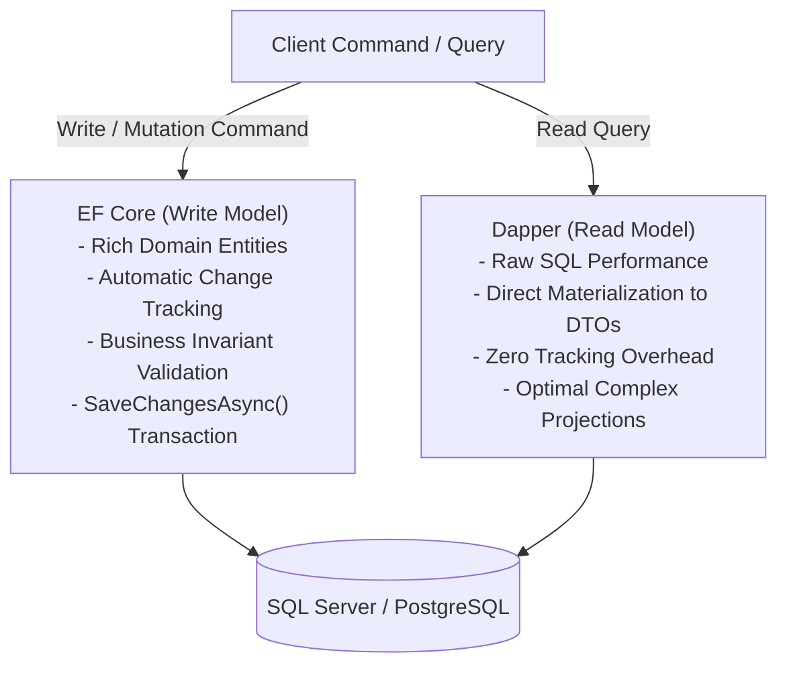

# Section 17: ADO.NET & Entity Framework Core Architecture

> **Curriculum Navigation:**  
> ⏪ [Previous: Section 16 – Stored Procedures, Functions, CTEs & Transactions](./16_sql_stored_procedures_functions_and_more.md) | 🏠 [Master Index](./README.md) | ⏩ [Next: Section 18 – ASP.NET Core Web API Fundamentals](./18_web_api_basics.md)

---

### Q171. What are the main components of ADO.NET?

#### 1. Executive Summary & Core Concept
- **ADO.NET (ActiveX Data Objects for .NET)** is the foundational data access technology within the .NET runtime (`System.Data` / `Microsoft.Data.SqlClient`) that enables applications to connect to relational databases and execute commands.
- It is composed of two primary sub-architectures:
  1. **Data Provider Components (Connected Architecture)**: Interacts directly with the physical database engine over network sockets (`SqlConnection`, `SqlCommand`, `SqlDataReader`, `SqlTransaction`).
  2. **DataSet Components (Disconnected Architecture)**: Represents an in-memory relational database store independent of any live database connection (`DataSet`, `DataTable`, `DataRow`, `DataColumn`, `SqlDataAdapter`).

#### 2. Deep-Dive Architecture & Runtime Internals
- **Physical Wire Protocol (TDS - Tabular Data Stream)**:
  - When `SqlConnection` connects to SQL Server, it negotiates a raw binary network socket over port 1433 using the **TDS Protocol**.
  - `SqlCommand` packages SQL text and parameters into TDS packets.
  - `SqlDataReader` reads the raw binary network stream sequentially into a memory buffer without allocating unnecessary objects.

```
ADO.NET Architecture Diagram:
┌────────────────────────────────────────────────────────────────────────┐
│                        APPLICATION LAYER                               │
└───────────────────────┬────────────────────────┬───────────────────────┘
                        │                        │
       [ Connected Architecture ]       [ Disconnected Architecture ]
                        ▼                        ▼
       ┌────────────────────────┐       ┌────────────────────────┐
       │     SqlConnection      │       │     SqlDataAdapter     │
       ├────────────────────────┤       ├────────────────────────┤
       │      SqlCommand        │       │  DataSet / DataTable   │
       ├────────────────────────┤       └────────────────────────┘
       │     SqlDataReader      │ (Fills & Reconciles In-Memory Store)
       └───────────┬────────────┘
                   │ TDS Protocol (Port 1433)
                   ▼
       ┌────────────────────────┐
       │   SQL Server Engine    │
       └────────────────────────┘
```

#### 3. Production-Ready Code Implementation
The following code demonstrates a resilient, parameterized ADO.NET query using modern `Microsoft.Data.SqlClient`:

```csharp
using System;
using System.Data;
using System.Threading;
using System.Threading.Tasks;
using Microsoft.Data.SqlClient;

namespace EnterpriseArchitecture.AdoNet;

public record CustomerDto(int Id, string Code, string Email);

public sealed class NativeAdoNetRepository
{
    private readonly string _connectionString;

    public NativeAdoNetRepository(string connectionString)
    {
        _connectionString = connectionString;
    }

    public async Task<CustomerDto?> GetCustomerByIdAsync(int customerId, CancellationToken ct = default)
    {
        const string sql = @"
            SELECT CustomerId, CustomerCode, EmailAddress
            FROM dbo.Customers WITH (NOLOCK)
            WHERE CustomerId = @CustomerId;";

        // 1. CONNECTION COMPONENT: Managed pooled connection
        await using var connection = new SqlConnection(_connectionString);
        await connection.OpenAsync(ct);

        // 2. COMMAND COMPONENT: Parameterized execution
        await using var command = new SqlCommand(sql, connection);
        // Explicitly typed parameters prevent implicit conversion & SQL Injection!
        command.Parameters.Add("@CustomerId", SqlDbType.Int).Value = customerId;

        // 3. DATA READER COMPONENT: High-performance streaming cursor
        await using var reader = await command.ExecuteReaderAsync(CommandBehavior.SingleRow, ct);

        if (await reader.ReadAsync(ct))
        {
            return new CustomerDto(
                Id: reader.GetInt32(0),
                Code: reader.GetString(1),
                Email: reader.GetString(2)
            );
        }

        return null;
    }
}
```

#### 4. Line-by-Line Code Walkthrough
- `await using var connection`: Ensures `SqlConnection.DisposeAsync()` closes the connection and returns it to the ADO.NET connection pool.
- `command.Parameters.Add("@CustomerId", SqlDbType.Int)`: Explicitly typed parameter preventing SQL injection and type conversion full scans.
- `CommandBehavior.SingleRow`: Optimization hint informing the TDS driver to expect at most one row.

#### 5. Real-World Enterprise Use Case & Application
High-performance ingestion pipelines and Dapper: Low-level ADO.NET provides the maximum possible query execution speed and lowest allocation footprint in .NET, outperforming full ORMs.

#### 6. Common Pitfalls, Memory Traps & Anti-Patterns
- **Connection Leaks**: Opening a connection without `using` or `await using`. If an exception occurs, the connection remains open, exhausting the connection pool (`Timeout expired. The timeout elapsed prior to obtaining a connection from the pool`).

#### 7. Senior / Architect Interview Follow-ups
- **Interviewer**: *"How does ADO.NET Connection Pooling work internally?"*
- **Expert Answer**: Creating a physical TCP socket to SQL Server takes ~50ms of handshake, authentication, and token exchange. ADO.NET maintains an internal **Connection Pool** indexed by the exact connection string. When you call `connection.Close()` or `Dispose()`, ADO.NET does **not** terminate the physical TCP connection—it clears the session state (`sp_reset_connection`) and places the connection into an idle pool. The next `OpenAsync()` retrieves the pre-established socket in **under 0.1 milliseconds**.

---

### Q172. What is Connected architecture and Disconnected architecture?

#### 1. Executive Summary & Core Concept
- **Connected Architecture**:
  - Requires an **active, continuous, open physical network connection** to the database during the entire data retrieval process.
  - Read-only, forward-only streaming.
  - Primary Component: **`SqlDataReader`**.
  - **Best For**: Real-time web APIs, high-throughput queries, minimal memory overhead.
- **Disconnected Architecture**:
  - Fetches data, populates an **in-memory data structure (`DataSet`/`DataTable`)**, and **immediately closes the physical database connection**.
  - Modifications (inserts, updates, deletes) are performed offline in memory.
  - Later, a single batch update reconciles changes back to the database.
  - Primary Component: **`SqlDataAdapter`**.
  - **Best For**: Legacy desktop applications (WinForms/WPF), intermittent network connections.

#### 2. Deep-Dive Architecture & Runtime Internals
| Dimension | Connected Architecture (`SqlDataReader`) | Disconnected Architecture (`DataSet`) |
| :--- | :--- | :--- |
| **Connection State** | **Must stay open** while reading | Connection opened briefly, then closed |
| **Memory Footprint** | **Minimal ($O(1)$)**: Streams one row at a time | **Heavy ($O(N)$)**: Holds all tables and rows in RAM |
| **Direction** | Forward-only, read-only | Bidirectional navigation, paging, sorting |
| **Network Latency** | High throughput, instant first row return | Delayed: Must download entire dataset before returning |
| **Data Manipulation**| Cannot mutate data directly through reader | Supports full offline CRUD and change tracking |

```
Memory and Connection Architecture:
Connected Architecture:
[ SQL Server ] ──(Open Socket Stream)──▶ [ App Server: Reads 1 row at a time in 8KB buffer ]

Disconnected Architecture:
[ SQL Server ] ──▶ [ SqlDataAdapter ] ──▶ [ Closes Connection! ]
                                                  │
                                                  ▼
                                      [ App Server RAM: 100,000 Rows in DataTable ]
```

#### 3. Production-Ready Code Implementation
The following code contrasts both architectures side-by-side:

```csharp
using System;
using System.Data;
using Microsoft.Data.SqlClient;

namespace EnterpriseArchitecture.ConnectedVsDisconnected;

public static class ArchitectureComparison
{
    private const string ConnString = "Server=localhost;Database=EnterpriseCommerceDb;Integrated Security=SSPI;TrustServerCertificate=True;";

    // 1. CONNECTED ARCHITECTURE: Low-memory streaming (Modern Standard)
    public static void ReadStreamConnected()
    {
        using var conn = new SqlConnection(ConnString);
        using var cmd = new SqlCommand("SELECT CustomerId, CustomerCode FROM Customers", conn);
        
        conn.Open(); // Connection stays open during the entire loop!
        using var reader = cmd.ExecuteReader();
        while (reader.Read())
        {
            Console.WriteLine($"Streaming Customer: {reader.GetString(1)}");
        }
        // Connection closes here
    }

    // 2. DISCONNECTED ARCHITECTURE: In-memory offline cache (Legacy Standard)
    public static void ReadDatasetDisconnected()
    {
        var dataSet = new DataSet();
        using (var conn = new SqlConnection(ConnString))
        using (var adapter = new SqlDataAdapter("SELECT CustomerId, CustomerCode FROM Customers", conn))
        {
            // Fill opens connection, downloads ALL rows into RAM, and CLOSES connection!
            adapter.Fill(dataSet, "CustomersTable");
        }

        // Connection is NOW CLOSED! We can navigate and modify data completely offline:
        DataTable table = dataSet.Tables["CustomersTable"]!;
        foreach (DataRow row in table.Rows)
        {
            Console.WriteLine($"Offline Customer: {row["CustomerCode"]}");
        }
    }
}
```

#### 4. Line-by-Line Code Walkthrough
- `adapter.Fill(...)`: Automatically handles opening the connection, filling the in-memory `DataTable`, and immediately closing the connection.

#### 5. Real-World Enterprise Use Case & Application
Modern microservices strictly use Connected Architecture (`SqlDataReader` or EF Core streams). Disconnected Architecture (`DataSet`) is obsolete in web APIs because loading 50,000 rows into in-memory `DataTables` wastes megabytes of server RAM per request.

#### 6. Common Pitfalls, Memory Traps & Anti-Patterns
- Using `DataSet` in high-concurrency web services. It bloats Gen 2 heap memory and triggers heavy GC pauses.

#### 7. Senior / Architect Interview Follow-ups
- **Interviewer**: *"How does the `SqlDataAdapter.Update()` method reconcile offline changes made to a `DataTable` back to the database?"*
- **Expert Answer**: Every `DataRow` inside a `DataTable` maintains a **`RowState` flag** (`Unchanged`, `Added`, `Modified`, `Deleted`) and stores two sets of values: `DataRowVersion.Original` and `DataRowVersion.Current`. When `adapter.Update(dataTable)` is called, the adapter scans the table, identifies dirty rows, generates parameterized `INSERT`, `UPDATE`, or `DELETE` statements (configured via `SqlCommandBuilder`), and executes them in batch against the database.

---

### Q173. What are the different Execute Methods of ADO.NET?

#### 1. Executive Summary & Core Concept
`SqlCommand` provides four primary execution methods tailored to different return data types:
1. **`ExecuteReaderAsync()`**: Executes queries returning **multiple rows and columns** (returns a `SqlDataReader`).
2. **`ExecuteScalarAsync()`**: Executes queries returning a **single scalar value** (1 row, 1 column), such as `COUNT(*)` or `SCOPE_IDENTITY()`.
3. **`ExecuteNonQueryAsync()`**: Executes DML/DDL statements (`INSERT`, `UPDATE`, `DELETE`) that do not return a result set; returns the **number of rows affected** as an integer.
4. **`ExecuteXmlReaderAsync()`**: Executes queries with the `FOR XML` clause, returning an `XmlReader`.

#### 2. Deep-Dive Architecture & Runtime Internals
| Method | Expected Output | Return Type | Internal TDS Processing |
| :--- | :--- | :--- | :--- |
| **`ExecuteReader`** | Full tabular result set | `SqlDataReader` | Sets up a forward-only streaming network cursor |
| **`ExecuteScalar`** | First column of first row | `object?` | Reads only the very first field token in the TDS stream; discards the rest |
| **`ExecuteNonQuery`**| DML / DDL status | `int` (Rows Affected) | Reads only the `DONE_IN_PROC` status token from the TDS stream |
| **`ExecuteXmlReader`**| XML document stream | `XmlReader` | Consumes binary XML chunks directly |

#### 3. Production-Ready Code Implementation
```csharp
using System;
using System.Data;
using System.Threading.Tasks;
using Microsoft.Data.SqlClient;

namespace EnterpriseArchitecture.ExecuteMethods;

public static class AdoCommandShowcase
{
    private const string ConnString = "Server=localhost;Database=EnterpriseCommerceDb;Integrated Security=SSPI;TrustServerCertificate=True;";

    public static async Task RunCommandMethodsAsync()
    {
        await using var connection = new SqlConnection(ConnString);
        await connection.OpenAsync();

        // 1. ExecuteNonQuery: Ideal for INSERT, UPDATE, DELETE (Returns rows affected)
        await using var updateCmd = new SqlCommand("UPDATE Orders SET OrderStatus = 'ARCHIVED' WHERE OrderDateUtc < '2020-01-01'", connection);
        int rowsModified = await updateCmd.ExecuteNonQueryAsync();
        Console.WriteLine($"Rows Affected: {rowsModified}");

        // 2. ExecuteScalar: Ideal for single aggregated values (COUNT, MAX, SUM)
        await using var countCmd = new SqlCommand("SELECT COUNT(*) FROM Orders WITH (NOLOCK)", connection);
        // Note: Returns object, must unbox cleanly!
        int totalOrders = (int)(await countCmd.ExecuteScalarAsync())!;
        Console.WriteLine($"Total Orders (Scalar): {totalOrders}");

        // 3. ExecuteReader: Ideal for streaming full tabular records
        await using var readCmd = new SqlCommand("SELECT TOP 5 OrderId, OrderTotal FROM Orders", connection);
        await using var reader = await readCmd.ExecuteReaderAsync();
        while (await reader.ReadAsync())
        {
            Console.WriteLine($"Order #{reader.GetInt32(0)}: {reader.GetDecimal(1):C}");
        }
    }
}
```

#### 4. Line-by-Line Code Walkthrough
- `updateCmd.ExecuteNonQueryAsync()`: Reads the row count from the TDS stream without allocating readers.
- `countCmd.ExecuteScalarAsync()`: Reads the scalar integer cleanly.

#### 5. Real-World Enterprise Use Case & Application
Using `ExecuteScalar` to capture `SELECT SCOPE_IDENTITY()` immediately after a record insert in low-latency transaction processing.

#### 6. Common Pitfalls, Memory Traps & Anti-Patterns
- Using `ExecuteReader` to fetch a single integer value (e.g., `SELECT COUNT(*)`). This creates unnecessary `SqlDataReader` object allocations. Always use `ExecuteScalar`.

#### 7. Senior / Architect Interview Follow-ups
- **Interviewer**: *"What happens if a query returns 5 columns and 100 rows, but you invoke it using `ExecuteScalar()`?"*
- **Expert Answer**: `ExecuteScalar()` will read **only the first column of the first row** and return it as an `object`. It will read and discard all remaining columns and rows in the stream before closing the command. While it does not throw an error, running a heavy multi-row query with `ExecuteScalar` is an anti-pattern because the database still performs the work of generating all 100 rows.

---

### Q174. What are the Authentication techniques used to connect to SQL Server?

#### 1. Executive Summary & Core Concept
SQL Server supports two fundamental authentication modes:
1. **Windows Authentication (Integrated Security)**: **(Most Secure & Recommended)** Uses Windows / Active Directory domain accounts or Kerberos tokens. The database validates identity using the active OS user credentials. No database passwords are transmitted or stored in configuration files.
2. **SQL Server Authentication**: Uses a username and password created and maintained directly inside SQL Server. Credentials must be passed inside the connection string (`User Id=sa;Password=...`).
- **Mixed Mode**: Enables both Windows Authentication and SQL Server Authentication.
- **Modern Cloud Addition**: **Microsoft Entra ID (Azure Active Directory)**: Supports Managed Identities, Interactive MFA, and OAuth Service Principals for Azure SQL.

#### 2. Deep-Dive Architecture & Runtime Internals
Security & Kerberos Negotiation:
- **Windows Authentication**: The client application contacts the Active Directory Domain Controller (KDC), obtains a **Kerberos Ticket**, and passes the ticket to SQL Server over TDS. The server validates the cryptographic ticket against the domain.
- **Connection Strings**:
  - Windows Auth: `Server=db-prod;Database=Commerce;Integrated Security=SSPI;TrustServerCertificate=True;`
  - SQL Auth: `Server=db-prod;Database=Commerce;User Id=api_user;Password=SecurePassword123!;`
  - Azure Managed Identity (Zero Passwords in Cloud!): `Server=tcp:sql-cloud.database.windows.net;Database=Commerce;Authentication=Active Directory Managed Identity;`

```
Authentication Topologies:
Windows Auth (Kerberos):
Client ──▶ Active Directory (KDC) ──(Returns Ticket)──▶ Validates with SQL Server (No Passwords!)

SQL Server Auth:
Client ──(Sends Plaintext Password in Connection String)──▶ Matches hash in sys.sql_logins
```

#### 3. Production-Ready Code Implementation
```csharp
using System;
using Microsoft.Data.SqlClient;

namespace EnterpriseArchitecture.AuthenticationModes;

public static class ConnectionStringFactory
{
    // 1. ENTERPRISE ON-PREM STANDARD: Windows Integrated Security (Zero Passwords!)
    public static string GetWindowsAuthConnectionString(string server, string database)
    {
        var builder = new SqlConnectionStringBuilder
        {
            DataSource = server,
            InitialCatalog = database,
            IntegratedSecurity = true, // Uses active Windows Identity / Kerberos
            Encrypt = true,
            TrustServerCertificate = false
        };
        return builder.ConnectionString;
    }

    // 2. MODERN CLOUD STANDARD: Azure Managed Identity (Zero Passwords in Azure Cloud!)
    public static string GetAzureManagedIdentityConnectionString(string azureSqlServer, string database)
    {
        return $"Server=tcp:{azureSqlServer}.database.windows.net,1433;Database={database};Authentication=Active Directory Managed Identity;Encrypt=True;";
    }
}
```

#### 4. Line-by-Line Code Walkthrough
- `SqlConnectionStringBuilder`: Best practice for building connection strings; protects against connection string injection attacks.
- `IntegratedSecurity = true`: Automatically leverages the execution thread's Windows identity.

#### 5. Real-World Enterprise Use Case & Application
In Kubernetes and Azure App Services, pods use **Azure Managed Identities** to authenticate to Azure SQL Database without storing any database passwords in `appsettings.json` or source control.

#### 6. Common Pitfalls, Memory Traps & Anti-Patterns
- Hardcoding `sa` user passwords inside `appsettings.json` or Git repositories. Always use Integrated Security, Managed Identities, or Azure Key Vault.

#### 7. Senior / Architect Interview Follow-ups
- **Interviewer**: *"What is Connection String Injection, and how do you protect against it?"*
- **Expert Answer**: Connection String Injection occurs when an application dynamically concatenates unvalidated user input into a connection string (`$"Server={server};Database={db}"`). A malicious user can input `test;Integrated Security=true;` to override security settings. Protect against this by always using **`SqlConnectionStringBuilder`**, which validates keys and escapes delimiters safely.

---

### Q175. What is ORM? What are the different types of ORM?

#### 1. Executive Summary & Core Concept
- An **ORM (Object-Relational Mapper)** is an architectural bridge that **abstracts the relational database layer, allowing developers to interact with relational tables and columns using object-oriented classes and properties**.
- It eliminates tedious boilerplate ADO.NET code (opening connections, building SQL parameters, mapping readers to DTOs).
- **Categories of ORM**:
  1. **Full-Featured Heavy ORM**: Provides rich domain entity mapping, change tracking, identity maps, lazy loading, and schema migrations. Examples: **Entity Framework Core (EF Core)**, NHibernate.
  2. **Micro-ORM**: Focuses purely on **ultra-high-performance object mapping** without change tracking or automatic SQL generation. You write the raw SQL; the micro-ORM maps results to objects in nanoseconds. Example: **Dapper**.

#### 2. Deep-Dive Architecture & Runtime Internals
| Architectural Feature | Full ORM (EF Core) | Micro-ORM (Dapper) |
| :--- | :--- | :--- |
| **SQL Generation** | **Automatic** via LINQ Expression Trees | **Manual**: Developer writes raw SQL |
| **Change Tracking** | **Yes** (Tracks dirty objects in memory) | **No** (Stateless) |
| **Database Migrations** | **Yes** (`Add-Migration`, `dotnet ef`) | **No** (Use DbUp or Flyway) |
| **Query Performance** | Fast (~90-95% of raw ADO.NET in EF 8) | **Blazing (~99% of raw ADO.NET)** |
| **Memory Overhead** | Moderate (Identity map & tracker state) | **Minimal** (Zero tracking overhead) |

```
ORM Architectural Spectrum:
[ Low-Level ADO.NET ] ──────▶ [ Micro-ORM: Dapper ] ──────▶ [ Full ORM: EF Core ]
(Max Speed, High Code)       (High Speed, Low Code)        (Max Productivity, Rich Features)
```

#### 3. Production-Ready Code Implementation
The following code demonstrates a modern CQRS architecture combining EF Core for writes (with change tracking) and Dapper for ultra-fast reads:

```csharp
using System.Collections.Generic;
using System.Threading.Tasks;
using Dapper;
using Microsoft.Data.SqlClient;
using Microsoft.EntityFrameworkCore;

namespace EnterpriseArchitecture.OrmComparison;

// DAPPER FOR ULTRA-FAST READS (CQRS Query Side)
public sealed class DapperOrderQueryService
{
    private readonly string _connectionString;
    public DapperOrderQueryService(string connectionString) => _connectionString = connectionString;

    public async Task<IEnumerable<dynamic>> GetRecentOrderSummariesAsync()
    {
        await using var connection = new SqlConnection(_connectionString);
        // Dapper maps raw SQL to objects at near-native ADO.NET speed!
        return await connection.QueryAsync("SELECT OrderId, OrderTotal FROM Orders WHERE OrderDateUtc >= '2026-01-01'");
    }
}
```

#### 4. Line-by-Line Code Walkthrough
- `connection.QueryAsync(...)`: Dapper extension method using dynamic code emission to map raw TDS columns directly to objects.

#### 5. Real-World Enterprise Use Case & Application
Hybrid CQRS Enterprise Architecture: Using **Entity Framework Core** for complex business transactions (Order Checkout, Payment Settlement) where rich domain encapsulation and change tracking are vital, and using **Dapper** for high-volume read reporting endpoints.

#### 6. Common Pitfalls, Memory Traps & Anti-Patterns
- Using a full ORM with change tracking enabled for massive read-only queries (fetching 50,000 rows with change tracking enabled consumes significant RAM). Always use `.AsNoTracking()` in EF Core for read-only queries!

#### 7. Senior / Architect Interview Follow-ups
- **Interviewer**: *"How does Dapper achieve near-native ADO.NET mapping speeds under the hood?"*
- **Expert Answer**: When Dapper executes a query for the first time, it inspects the returned SQL column schema and generates specialized **Dynamic IL Bytecode via `DynamicMethod` (Reflection.Emit)**. It compiles an optimized, strongly typed deserializer in memory and caches it in a delegate cache. On subsequent calls, Dapper executes the cached native delegate, reading columns by ordinal directly with zero runtime reflection overhead!

---

### Q176. What is Entity Framework?

#### 1. Executive Summary & Core Concept
- **Entity Framework (EF)** is Microsoft's flagship open-source Object-Relational Mapper (ORM) for .NET.
- **EF Core** is the completely re-written, cross-platform, modular, and high-performance modern successor to legacy EF 6.
- **Core Capabilities**:
  1. **LINQ to Entities**: Translates C# LINQ expressions into optimized native SQL.
  2. **Change Tracker**: Automatically detects property modifications on loaded entities and issues corresponding SQL updates.
  3. **Code-First Migrations**: Automatically manages database schema versioning directly from C# model classes.
  4. **Relationship Mapping**: Handles One-to-One, One-to-Many, and Many-to-Many relationships with cascading rules.

#### 2. Deep-Dive Architecture & Runtime Internals
Internal Query Processing Pipeline in EF Core:
1. **Compilation / Parsing**: LINQ query is analyzed into an Abstract Syntax Tree (AST).
2. **Query Translation**: The relational model maps entities to database tables and columns.
3. **SQL Generation**: The database provider (e.g., `Microsoft.EntityFrameworkCore.SqlServer`) converts the AST into a parameterized T-SQL statement.
4. **Plan Caching**: The compiled SQL query is stored in the **EF Core Query Cache** so subsequent executions skip translation overhead.
5. **Materialization & Tracking**: Results are read from the database, entity objects are instantiated, and snapshots are recorded in the **Change Tracker**.

```
EF Core Query Execution Engine:
C# LINQ: dbContext.Orders.Where(o => o.Total > 100)
               │
               ▼ (Compiled via Query Compiler)
Abstract Syntax Tree (AST)
               │
               ▼ (Translated by SQL Server Provider)
Parameterized T-SQL: SELECT [o].[Id], [o].[Total] FROM [Orders] AS [o] WHERE [o].[Total] > 100
               │
               ▼ (Executed via ADO.NET)
Materializes C# Objects + Registers in Change Tracker
```

#### 3. Production-Ready Code Implementation
The following code demonstrates a complete modern EF Core 8 entity model with clean fluent configuration:

```csharp
using System;
using System.Collections.Generic;
using Microsoft.EntityFrameworkCore;
using Microsoft.EntityFrameworkCore.Metadata.Builders;

namespace EnterpriseArchitecture.EntityFramework;

// DOMAIN ENTITY
public sealed class Customer
{
    public int CustomerId { get; set; }
    public string CustomerCode { get; set; } = string.Empty;
    public string EmailAddress { get; set; } = string.Empty;
    public List<Order> Orders { get; set; } = new();
}

public sealed class Order
{
    public int OrderId { get; set; }
    public int CustomerId { get; set; }
    public decimal OrderTotal { get; set; }
    public Customer Customer { get; set; } = null!;
}

// FLUENT API CONFIGURATION (Separation of Concerns)
public sealed class CustomerConfiguration : IEntityTypeConfiguration<Customer>
{
    public void Configure(EntityTypeBuilder<Customer> builder)
    {
        builder.ToTable("Customers");
        builder.HasKey(c => c.CustomerId);
        builder.Property(c => c.CustomerCode).HasMaxLength(20).IsRequired();
        builder.Property(c => c.EmailAddress).HasMaxLength(255).IsRequired();
        
        // Relationship definition
        builder.HasMany(c => c.Orders)
               .WithOne(o => o.Customer)
               .HasForeignKey(o => o.CustomerId)
               .OnDelete(DeleteBehavior.Restrict);
    }
}
```

#### 4. Line-by-Line Code Walkthrough
- `IEntityTypeConfiguration<Customer>`: Modern EF Core Fluent API standard. Moves schema configuration out of `DbContext`, adhering to Single Responsibility.
- `builder.HasMany(...).WithOne(...)`: Configures one-to-many relationship with foreign keys and delete behaviors.

#### 5. Real-World Enterprise Use Case & Application
Used across modern enterprise ASP.NET Core applications to manage transactional domain models, enforce business rules, and manage database migrations across deployment pipelines.

#### 6. Common Pitfalls, Memory Traps & Anti-Patterns
- **Cartesian Explosion**: Using multiple `.Include()` statements on sibling collections (`.Include(c => c.Orders).Include(c => c.Invoices)`). This triggers a SQL Cartesian product that can return millions of duplicate rows! Modern EF Core solves this with **`.AsSplitQuery()`**.

#### 7. Senior / Architect Interview Follow-ups
- **Interviewer**: *"What is `.AsSplitQuery()` in EF Core, and when should an architect mandate its use?"*
- **Expert Answer**: When an entity includes multiple child collections via `.Include()`, EF Core's default behavior is to generate a single monolithic SQL query with multiple `LEFT JOIN`s. This causes a **Cartesian Explosion**, duplicating parent columns for every child combination. Adding `.AsSplitQuery()` instructs EF Core to generate **separate, independent SQL queries** for each included collection, assembling them cleanly in memory and drastically reducing network transmission size.

---

### Q177. How will you differentiate ADO.NET from Entity Framework?

#### 1. Executive Summary & Core Concept
- **ADO.NET**:
  - Low-level data access library.
  - Requires writing raw SQL strings manually.
  - Manual connection lifecycle and manual object mapping via `reader.GetString()`.
  - **Fastest possible performance**, but requires significant boilerplate code.
- **Entity Framework (EF Core)**:
  - High-level Object-Relational Mapper built **on top of ADO.NET**.
  - Automatically generates SQL from LINQ expressions.
  - Automated object materialization, relationship navigation, change tracking, and migrations.
  - **Highest developer productivity and maintainability**.

#### 2. Deep-Dive Architecture & Runtime Internals
| Architectural Dimension | ADO.NET | Entity Framework Core |
| :--- | :--- | :--- |
| **Abstractions** | Low (Works directly with TDS connections, commands) | High (Works with Domain Entities, `DbSet<T>`) |
| **Query Mechanism** | Raw T-SQL string queries | Strongly typed **LINQ Expressions** |
| **Change Tracking** | Manual (Developer must write explicit `UPDATE` SQL) | **Automatic** via Change Tracker snapshot engine |
| **Database Migrations** | Manual T-SQL migration scripts | **Automated** (`dotnet ef migrations add`) |
| **Performance** | Maximum potential throughput | ~95% of ADO.NET (Negligible difference in EF 8) |
| **Development Speed** | Slow (Heavy repetitive boilerplate) | Rapid (Focus on domain business logic) |

#### 3. Production-Ready Code Implementation
```csharp
using System.Threading.Tasks;
using Microsoft.EntityFrameworkCore;

namespace EnterpriseArchitecture.AdoVsEf;

public static class UpdatingDataComparison
{
    // 1. UPDATING VIA ADO.NET (Manual, verbose, prone to typo errors)
    // Requires ~25 lines of boilerplate: connection, command, parameters, ExecuteNonQuery.

    // 2. UPDATING VIA EF CORE (Concise, robust, automated change tracking!)
    public static async Task UpdateCustomerEmailEfCore(AppDbContext context, int customerId, string newEmail)
    {
        // Fetch entity (Enters Change Tracker)
        var customer = await context.Customers.FindAsync(customerId);
        if (customer != null)
        {
            customer.EmailAddress = newEmail; // Mutate property in memory
            
            // Change Tracker detects modification automatically and emits targeted UPDATE SQL!
            await context.SaveChangesAsync();
        }
    }
}
```

#### 4. Line-by-Line Code Walkthrough
- `await context.SaveChangesAsync()`: Scans the change tracker, generates the exact parameterized SQL `UPDATE Customers SET EmailAddress = @p0 WHERE CustomerId = @p1`, and executes it in a transaction.

#### 5. Real-World Enterprise Use Case & Application
Architects choose EF Core for 90% of business CRUD logic for rapid delivery and automated migrations, reserving raw ADO.NET or Dapper for high-frequency bulk insertion tasks (e.g., streaming 100,000 IoT events per second via `SqlBulkCopy`).

#### 6. Common Pitfalls, Memory Traps & Anti-Patterns
- Manually writing raw ADO.NET for standard CRUD operations simply because of a dogmatic belief that "ORMs are too slow." Modern EF Core 8 is highly optimized.

#### 7. Senior / Architect Interview Follow-ups
- **Interviewer**: *"What is `SqlBulkCopy` in ADO.NET, and why is it hundreds of times faster than EF Core's `AddRange()` for bulk operations?"*
- **Expert Answer**: `EF Core AddRange()` wraps each entity in change tracking and generates multi-row `INSERT INTO ... VALUES` statements that must parse through the SQL relational engine. **`SqlBulkCopy`** bypasses the relational query parser entirely! It streams raw memory buffers directly into SQL Server's storage engine using the **Bulk Copy Protocol (BCP)** with minimal logging, inserting 1,000,000 rows in **under 2 seconds**.

---

### Q178. How does Entity Framework work? OR How to setup EF?

#### 1. Executive Summary & Core Concept
Setting up and using Entity Framework Core involves four architectural steps:
1. **Install NuGet Packages**: Add the database provider package (e.g., `Microsoft.EntityFrameworkCore.SqlServer`) and tooling (`Microsoft.EntityFrameworkCore.Tools`).
2. **Define Domain Entities**: Author POCO (Plain Old CLR Object) classes representing domain concepts.
3. **Create the `DbContext`**: Inherit from `DbContext`, expose `DbSet<T>` properties, and configure mappings.
4. **Register in Dependency Injection**: Register the `DbContext` with a scoped lifetime in `Program.cs` via `builder.Services.AddDbContext<AppDbContext>(options => ...)`.

#### 2. Deep-Dive Architecture & Runtime Internals
The `DbContext` Lifecycle in ASP.NET Core:
- Injected with a **Scoped Lifetime** (one `DbContext` instance per incoming HTTP request).
- At the start of the request, DI creates the `DbContext`.
- As queries execute, `DbContext` caches entities in its **First-Level Cache (Identity Map)**: If query A and query B both ask for `Customer #5`, EF Core returns the **exact same in-memory object reference**!
- At the end of the HTTP request, ASP.NET Core disposes the `DbContext` scope, closing connections and clearing tracker memory.

```
DbContext Scoped Lifecycle:
HTTP Request Arrives ──▶ DI Container instantiates Scoped DbContext
 ├─▶ Query 1: Fetches Customer #5 ──▶ Instantiates object & registers in Identity Map
 ├─▶ Query 2: Fetches Customer #5 ──▶ Returns cached instance from Identity Map! (Zero DB Query!)
 └─▶ SaveChangesAsync() ──▶ Emits SQL Updates
HTTP Request Concluded ──▶ DI disposes DbContext ──▶ Connection returned to pool!
```

#### 3. Production-Ready Code Implementation
The complete end-to-end setup for an enterprise ASP.NET Core application:

```csharp
using Microsoft.EntityFrameworkCore;
using Microsoft.Extensions.DependencyInjection;
using Microsoft.Extensions.Hosting;

namespace EnterpriseArchitecture.EfSetup;

// 1. THE DBCONTEXT
public sealed class CommerceDbContext : DbContext
{
    public DbSet<Customer> Customers => Set<Customer>();
    public DbSet<Order> Orders => Set<Order>();

    public CommerceDbContext(DbContextOptions<CommerceDbContext> options) : base(options) { }

    protected override void OnModelCreating(ModelBuilder modelBuilder)
    {
        base.OnModelCreating(modelBuilder);
        // Automatically discover and apply all IEntityTypeConfiguration classes in the assembly!
        modelBuilder.ApplyConfigurationsFromAssembly(typeof(CommerceDbContext).Assembly);
    }
}

// 2. REGISTRATION IN PROGRAM.CS
public static class ApplicationStartup
{
    public static void ConfigureServices(IServiceCollection services, string connectionString)
    {
        // Registers DbContext as SCOPED with SQL Server connection pooling!
        services.AddDbContextPool<CommerceDbContext>(options =>
        {
            options.UseSqlServer(connectionString, sqlOptions =>
            {
                // Resilient connection retries for transient cloud network failures!
                sqlOptions.EnableRetryOnFailure(
                    maxRetryCount: 5, 
                    maxRetryDelay: TimeSpan.FromSeconds(30), 
                    errorNumbersToAdd: null);
            });
        });
    }
}
```

#### 4. Line-by-Line Code Walkthrough
- `services.AddDbContextPool<CommerceDbContext>(...)`: High-performance pooling that reuses `DbContext` instances, eliminating allocation overhead across HTTP requests.
- `sqlOptions.EnableRetryOnFailure(...)`: Enterprise resilience pattern (Polly-like retry logic) handling transient Azure SQL disconnections automatically.
- `modelBuilder.ApplyConfigurationsFromAssembly(...)`: Automatically scans the assembly for all entity configuration mappings.

#### 5. Real-World Enterprise Use Case & Application
Cloud-native microservices: Using `EnableRetryOnFailure` is mandatory for enterprise Azure SQL deployments to ensure failovers during cloud infrastructure patching do not crash user requests.

#### 6. Common Pitfalls, Memory Traps & Anti-Patterns
- Registering `DbContext` as a **Singleton**. `DbContext` is **NOT thread-safe**! Using a singleton `DbContext` across parallel web requests causes data corruption, race conditions, and `InvalidOperationException: A second operation was started on this context before a previous operation completed`.

#### 7. Senior / Architect Interview Follow-ups
- **Interviewer**: *"What is the difference between `AddDbContext` and `AddDbContextPool` in ASP.NET Core?"*
- **Expert Answer**: `AddDbContext` allocates a brand new `DbContext` instance on the managed heap for every incoming HTTP request. **`AddDbContextPool`** maintains an internal pool of pre-allocated `DbContext` instances. When an HTTP request completes, the context state is reset and returned to the pool, eliminating object allocation overhead and reducing Gen 0 GC collections by up to **20%** under heavy traffic.

---

### Q179. What is meant by DBContext and DBSet?

#### 1. Executive Summary & Core Concept
- **`DbContext`**: The primary coordinator class in Entity Framework that represents an active session with the database.
  - Implements the **Unit of Work** and **Repository Patterns**.
  - Manages database connections, executes queries, and tracks changes across entities.
- **`DbSet<TEntity>`**: Represents a collection of a specific entity type in the context that maps to a specific **table or view** in the database.
  - Implements `IQueryable<TEntity>` and `IEnumerable<TEntity>`.
  - Serves as the starting point for LINQ queries against that specific table.

#### 2. Deep-Dive Architecture & Runtime Internals
- **Unit of Work Pattern (`DbContext`)**:
  - Maintains an internal **Change Tracker Graph**.
  - When you call `.SaveChangesAsync()`, all insertions, updates, and deletions across all `DbSet` collections are wrapped in a **single atomic database transaction**.
- **Repository Pattern (`DbSet<T>`)**:
  - Exposes standard repository CRUD methods: `.Add()`, `.Attach()`, `.Remove()`, `.Find()`.
  - Evaluates LINQ queries into SQL via its internal `IQueryProvider`.

```
Unit of Work & Repository Integration:
┌─────────────────────────────────────────────────────────────┐
│                 DbContext (Unit of Work)                    │
│                                                             │
│   ┌──────────────────────┐        ┌──────────────────────┐  │
│   │ DbSet<Customer> Repo │        │   DbSet<Order> Repo  │  │
│   └──────────┬───────────┘        └──────────┬───────────┘  │
│              │                               │              │
│              ▼                               ▼              │
│   ┌─────────────────────────────────────────────────────┐   │
│   │     Change Tracker (Records Snapshots of Entities)  │   │
│   └──────────────────────────┬──────────────────────────┘   │
└──────────────────────────────┼──────────────────────────────┘
                               │ SaveChangesAsync()
                               ▼
        Executes all mutations inside ONE Atomic SQL Transaction!
```

#### 3. Production-Ready Code Implementation
```csharp
using System;
using System.Threading.Tasks;
using Microsoft.EntityFrameworkCore;

namespace EnterpriseArchitecture.DbContextInternals;

public static class UnitOfWorkDemonstration
{
    public static async Task ExecuteTransactionalWorkflow(CommerceDbContext context)
    {
        // 1. REPOSITORY USAGE: Interacting with DbSets
        var newCustomer = new Customer { CustomerCode = "CUST_99", EmailAddress = "new@corp.com" };
        context.Customers.Add(newCustomer); // Marks entity as 'Added' in Change Tracker

        var newOrder = new Order { Customer = newCustomer, OrderTotal = 250.00m };
        context.Orders.Add(newOrder); // Marks entity as 'Added'

        // 2. UNIT OF WORK USAGE: Atomic Commit across multiple DbSets
        // Generates INSERT for Customer, captures generated CustomerId, 
        // and generates INSERT for Order using the foreign key in ONE SQL TRANSACTION!
        int affectedRows = await context.SaveChangesAsync();
        Console.WriteLine($"Persisted {affectedRows} entities atomically.");
    }
}
```

#### 4. Line-by-Line Code Walkthrough
- `context.Customers.Add(...)`: Modifies the in-memory tracker state; zero SQL has been executed yet.
- `await context.SaveChangesAsync()`: The Unit of Work resolves foreign key dependencies, opens the connection, and executes both inserts within an atomic transaction.

#### 5. Real-World Enterprise Use Case & Application
All multi-table business mutations: Creating an order header, deducting inventory quantities from `DbSet<Product>`, and inserting billing records into `DbSet<Payment>` in a single atomic commit.

#### 6. Common Pitfalls, Memory Traps & Anti-Patterns
- Creating multiple `DbContext` instances inside the same HTTP request to save related records. This breaks the Unit of Work pattern, resulting in split transactions that can cause partial failures.

#### 7. Senior / Architect Interview Follow-ups
- **Interviewer**: *"What is the difference between `context.Entry(entity).State` and checking the Change Tracker directly?"*
- **Expert Answer**: `context.Entry(entity)` returns an `EntityEntry<T>` providing direct access to the metadata, original values, current values, and `EntityState` (`Added`, `Modified`, `Unchanged`, `Deleted`, `Detached`) for a single entity. The **`context.ChangeTracker`** exposes the entire graph of all tracked entities (`ChangeTracker.Entries()`), allowing architects to implement global audit interceptors that inspect every modified entity and automatically stamp `LastModifiedBy` and `LastModifiedUtc` before saving.

---

### Q180. What are the different types of development approaches used with EF?

#### 1. Executive Summary & Core Concept
Historically and modernly, Entity Framework supports three architectural development paradigms:
1. **Code-First (The Modern Enterprise Standard)**: You write C# domain classes first. EF Core automatically generates and manages the database schema and versioning using **EF Migrations**.
2. **Database-First (Reverse Engineering)**: An existing relational database schema already exists. EF Core generates C# classes and a `DbContext` using the scaffolding CLI command (`dotnet ef dbcontext scaffold`).
3. **Model-First (Legacy & Obsolete)**: Visual diagramming via EDMX files in Visual Studio. **Completely removed and unsupported in EF Core.**

#### 2. Deep-Dive Architecture & Runtime Internals
| Approach | Starting Point | Schema Management | Best For |
| :--- | :--- | :--- | :--- |
| **Code-First** | C# Model Classes | **EF Migrations** (`dotnet ef migrations add`) | Greenfield projects, Agile domain modeling, CI/CD automated deployments |
| **Database-First** | Pre-existing SQL Database | Reverse Engineering Scaffold | Brownfield projects, strict DBA-controlled environments, legacy database integration |
| **Model-First** | Visual EDMX designer | Generated SQL / C# | **Obsolete**: Dropped entirely in modern .NET Core |

```
Modern Code-First CI/CD Pipeline:
Developer edits C# Domain Model ──▶ Runs: dotnet ef migrations add AddUserRole
                                                  │
                                                  ▼
Generates C# Migration Script (.cs) with Up() and Down() methods
                                                  │
                                                  ▼ (In CI/CD Deployment Pipeline)
dotnet ef database update ──▶ Executes idempotent SQL against Production Database!
```

#### 3. Production-Ready Code Implementation
The following code shows a generated EF Core Code-First Migration with rollback support:

```csharp
using System;
using Microsoft.EntityFrameworkCore.Migrations;

#nullable disable

namespace EnterpriseArchitecture.Migrations;

// AUTO-GENERATED CODE-FIRST MIGRATION SCRIPT
public partial class AddCustomerLoyaltyTier : Migration
{
    // UP: Applies the schema change forward
    protected override void Up(MigrationBuilder migrationBuilder)
    {
        migrationBuilder.AddColumn<string>(
            name: "LoyaltyTier",
            table: "Customers",
            type: "nvarchar(20)",
            maxLength: 20,
            nullable: false,
            defaultValue: "STANDARD");

        // Create an index automatically as part of migration
        migrationBuilder.CreateIndex(
            name: "IX_Customers_LoyaltyTier",
            table: "Customers",
            column: "LoyaltyTier");
    }

    // DOWN: Reverts the schema change backward (Rollback capability!)
    protected override void Down(MigrationBuilder migrationBuilder)
    {
        migrationBuilder.DropIndex(
            name: "IX_Customers_LoyaltyTier",
            table: "Customers");

        migrationBuilder.DropColumn(
            name: "LoyaltyTier",
            table: "Customers");
    }
}
```

#### 4. Line-by-Line Code Walkthrough
- `Up(MigrationBuilder migrationBuilder)`: Declarative C# DDL statements executed when upgrading the database.
- `Down(...)`: Rollback script executed if a deployment must be safely reverted.

#### 5. Real-World Enterprise Use Case & Application
Automated Continuous Integration and Continuous Deployment (CI/CD) pipelines: Executing `dotnet ef migrations script --idempotent` in GitHub Actions to generate a bulletproof, idempotent SQL script reviewed by DBAs before deployment.

#### 6. Common Pitfalls, Memory Traps & Anti-Patterns
- Calling `context.Database.Migrate()` on application startup in multi-instance cloud environments (e.g., 10 Kubernetes pods launching simultaneously). The pods race to apply migrations concurrently, causing database corruption or schema deadlocks! Run migrations as a dedicated Kubernetes initialization job.

#### 7. Senior / Architect Interview Follow-ups
- **Interviewer**: *"What is an 'Idempotent' Migration Script in EF Core, and how do you generate one?"*
- **Expert Answer**: An idempotent script checks whether a migration has already been applied before attempting to run it. Generated via `dotnet ef migrations script --idempotent`. It wraps each migration block in an `IF NOT EXISTS (SELECT 1 FROM [__EFMigrationsHistory] WHERE MigrationId = '...')` check. This allows the exact same SQL script to be safely executed multiple times against any environment without failing if partially applied.

---

### Q181. What is the difference between LINQ to SQL and Entity Framework?

#### 1. Executive Summary & Core Concept
- **LINQ to SQL (`System.Data.Linq`)**:
  - Introduced in .NET 3.5 (2008).
  - Lightweight, rapid ORM strictly limited to **Microsoft SQL Server only**.
  - Supported only 1-to-1 mapping between C# classes and database tables.
  - **Legacy & Obsolete**: Deprecated by Microsoft; superseded by Entity Framework.
- **Entity Framework (EF Core)**:
  - Enterprise, full-featured ORM supporting **any database** (SQL Server, PostgreSQL, MySQL, SQLite, Oracle, CosmosDB).
  - Supports complex domain modeling: Table-per-Hierarchy (TPH), Table-per-Type (TPT), many-to-many relationships, shadow properties, and spatial data.
  - Active, high-performance open-source project maintained by Microsoft.

#### 2. Deep-Dive Architecture & Runtime Internals
| Architectural Feature | LINQ to SQL (Legacy) | Entity Framework Core (Modern) |
| :--- | :--- | :--- |
| **Database Support** | **Microsoft SQL Server ONLY** | **Provider-Agnostic** (PostgreSQL, SQL Server, MySQL, SQLite, CosmosDB) |
| **Inheritance Mapping** | Table-per-Hierarchy (TPH) only | Full support for **TPH, TPT (Table-per-Type), and TPC (Table-per-Concrete-Type)** |
| **Relationship Mapping** | Weak many-to-many support (requires explicit join entity) | Native **Many-to-Many** without manual join entities |
| **Active Development** | **Dead / Deprecated** | **Active Modern .NET Standard** |
| **File Format** | `.dbml` XML file in Visual Studio | Clean, POCO classes configured via Fluent API |

```
Architecture Comparison:
LINQ to SQL: C# Class ──(1:1 Direct Binding)──▶ Physical SQL Server Table (SQL Server ONLY!)

EF Core:     Domain Entity ──▶ Conceptual Model ──▶ Storage Mapping ──▶ Any Database Engine!
```

#### 3. Production-Ready Code Implementation
Demonstrating advanced EF Core capabilities impossible in LINQ to SQL (Table-per-Hierarchy Inheritance Mapping):

```csharp
using Microsoft.EntityFrameworkCore;

namespace EnterpriseArchitecture.AdvancedEfCore;

// BASE CLASS
public abstract class BillingAccount
{
    public int Id { get; set; }
    public string AccountNumber { get; set; } = string.Empty;
}

// DERIVED CLASS 1
public sealed class CreditCardAccount : BillingAccount
{
    public string CardNumberMasked { get; set; } = string.Empty;
}

// DERIVED CLASS 2
public sealed class BankTransferAccount : BillingAccount
{
    public string IbanCode { get; set; } = string.Empty;
}

public class InheritanceDbContext : DbContext
{
    public DbSet<BillingAccount> Accounts => Set<BillingAccount>();

    protected override void OnModelCreating(ModelBuilder modelBuilder)
    {
        // Table-Per-Hierarchy (TPH) Inheritance Mapping with Discriminator column!
        modelBuilder.Entity<BillingAccount>()
            .HasDiscriminator<string>("AccountType")
            .HasValue<CreditCardAccount>("CREDIT_CARD")
            .HasValue<BankTransferAccount>("BANK_WIRE");
    }
}
```

#### 4. Line-by-Line Code Walkthrough
- `.HasDiscriminator<string>("AccountType")`: Configures TPH inheritance. All derived types map to a single database table with an `AccountType` column distinguishing concrete types, a feature executed with extreme elegance in EF Core.

#### 5. Real-World Enterprise Use Case & Application
Migrating legacy applications: Converting old .NET Framework 3.5 systems using LINQ to SQL into modern .NET 8 microservices running EF Core against PostgreSQL or SQL Server.

#### 6. Common Pitfalls, Memory Traps & Anti-Patterns
- Attempting to use LINQ to SQL in new .NET 8 greenfield projects. LINQ to SQL is dead technology; always use EF Core.

#### 7. Senior / Architect Interview Follow-ups
- **Interviewer**: *"How does Table-Per-Hierarchy (TPH) compare to Table-Per-Type (TPT) in EF Core regarding query performance?"*
- **Expert Answer**:
  - **TPH (Table-Per-Hierarchy)** stores the entire inheritance hierarchy in a **single database table** using nullable columns and a discriminator. Query performance is **fastest** because queries require zero SQL `JOIN`s, but database columns must be nullable.
  - **TPT (Table-Per-Type)** creates a separate physical database table for every class in the hierarchy. Querying derived entities requires **complex relational SQL `JOIN`s across all ancestor tables**, causing significant performance degradation when hierarchies grow deep. TPH is almost always preferred for enterprise performance.

---

## 🏛️ Architectural Appendix: High-Performance EF Core & CQRS Hybrid Patterns

### 1. Cartesian Explosion & `AsSplitQuery()`
When querying an entity with multiple 1-to-many relationships (e.g., `Customer` with `Orders` and `Addresses`), EF Core's default behavior emits a single massive SQL `JOIN`:
```sql
SELECT c.*, o.*, a.*
FROM Customers c
LEFT JOIN Orders o ON c.Id = o.CustomerId
LEFT JOIN Addresses a ON c.Id = a.CustomerId;
```
If a customer has 50 orders and 10 addresses, the database returns $50 \times 10 = 500$ rows over the network, duplicating customer and order data dozens of times!

#### The Solution: `AsSplitQuery()`
```csharp
// Splits into 3 separate, clean SQL queries: 1 for Customers, 1 for Orders, 1 for Addresses
var customerGraph = await context.Customers
    .Include(c => c.Orders)
    .Include(c => c.Addresses)
    .AsSplitQuery() // Eliminates the Cartesian Explosion!
    .FirstOrDefaultAsync(c => c.Id == customerId);
```

---

### 2. High-Frequency Micro-Optimizations

#### A. Compiled Queries (`EF.CompileAsyncQuery`)
Bypasses the LINQ expression tree compilation and SQL generation pipeline for hot endpoints:
```csharp
public static class CompiledQueries
{
    private static readonly Func<AppDbContext, int, Task<CustomerSummaryDto?>> GetCustomerSummaryCompiled =
        EF.CompileAsyncQuery((AppDbContext db, int id) =>
            db.Customers
              .AsNoTracking()
              .Where(c => c.Id == id)
              .Select(c => new CustomerSummaryDto(c.Id, c.Name, c.Email))
              .FirstOrDefault());

    public static Task<CustomerSummaryDto?> GetCustomerSummaryAsync(AppDbContext db, int id)
        => GetCustomerSummaryCompiled(db, id);
}

public record CustomerSummaryDto(int Id, string Name, string Email);
```

#### B. `AsNoTrackingWithIdentityResolution()`
When executing complex read-only queries with multiple joins, standard `AsNoTracking()` creates duplicate entity instances in memory if the same row is referenced multiple times. `AsNoTrackingWithIdentityResolution()` ensures a single instance exists while still skipping change-tracking overhead.

---

### 3. The Enterprise CQRS Data Architecture: EF Core + Dapper Hybrid
Rather than forcing EF Core to handle every query or writing raw SQL for every update, enterprise architectures combine both tools where each excels:



```csharp
// Example: The Hybrid Repository Pattern
public class OrderRepository : IOrderRepository
{
    private readonly AppDbContext _efContext;
    private readonly IDbConnection _dbConnection;

    public OrderRepository(AppDbContext efContext, IDbConnection dbConnection)
    {
        _efContext = efContext;
        _dbConnection = dbConnection;
    }

    // WRITE MODEL: EF Core enforces domain rules and tracks entity changes
    public async Task CreateOrderAsync(Order order, CancellationToken ct)
    {
        await _efContext.Orders.AddAsync(order, ct);
        await _efContext.SaveChangesAsync(ct);
    }

    // READ MODEL: Dapper executes raw optimized SQL directly into lightweight DTOs
    public async Task<IEnumerable<OrderReportDto>> GetOrderReportsByCustomerAsync(int customerId)
    {
        const string sql = """
            SELECT o.Id AS OrderId, o.TotalAmount, o.OrderDateUtc, COUNT(i.Id) AS ItemCount
            FROM Orders o
            JOIN OrderItems i ON o.Id = i.OrderId
            WHERE o.CustomerId = @CustomerId
            GROUP BY o.Id, o.TotalAmount, o.OrderDateUtc
            ORDER BY o.OrderDateUtc DESC;
            """;

        return await _dbConnection.QueryAsync<OrderReportDto>(sql, new { CustomerId = customerId });
    }
}

public record OrderReportDto(int OrderId, decimal TotalAmount, DateTime OrderDateUtc, int ItemCount);
```

