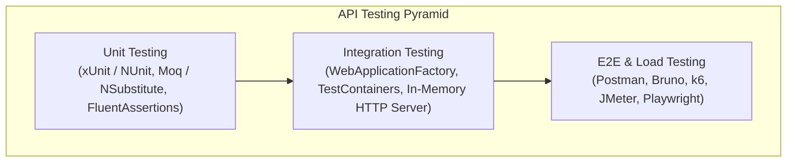
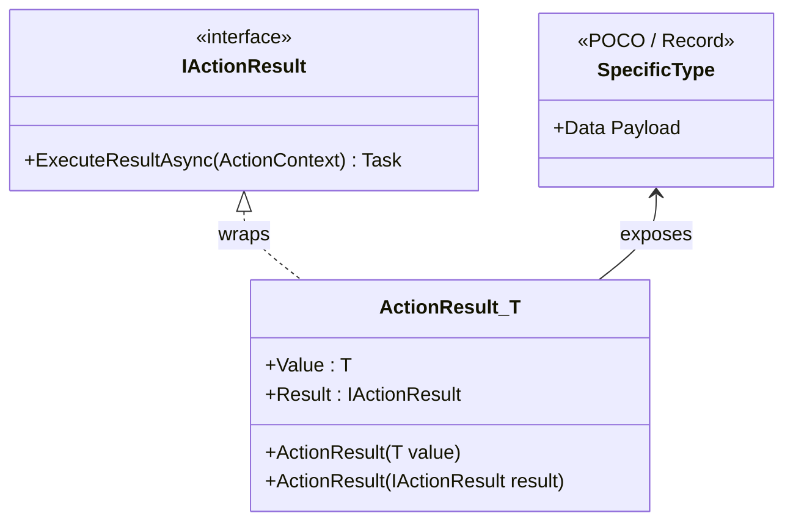
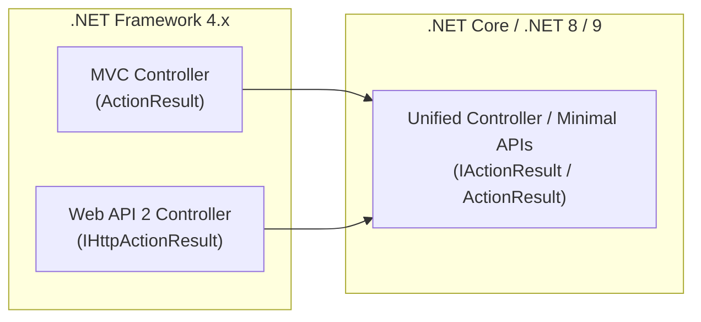
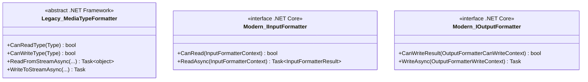
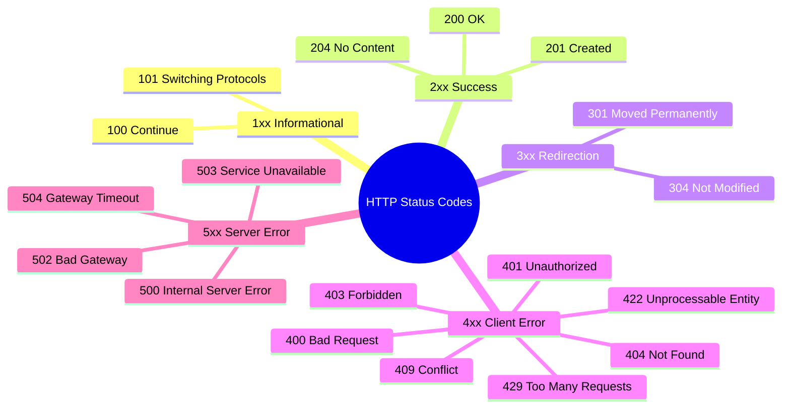

# Section 20: Web API - Advanced Concepts, Formatting, & Testing

---

### Navigation
- **Previous Section**: [Section 19: Web API Authentication & JWT](./19_web_api_authentication_and_jwt.md)
- **Next Section**: [Section 21: .NET Core Basics](./21_dotnet_core_basics.md)
- **Curriculum Master Index**: [README.md](./README.md)

---

## Q197. How to test Web API? What are the tools?

### 1. Executive Summary & Core Concept
Testing a Web API involves verifying HTTP interfaces across multiple testing tiers: **Unit Testing** (testing individual controller actions and business services in complete isolation via mocks), **Integration Testing** (verifying the HTTP pipeline, routing, model binding, filters, and database interactions in-memory using `WebApplicationFactory<TEntryPoint>`), and **End-to-End (E2E) / Manual Testing** (exercising deployed APIs across network boundaries using tooling such as Postman, Bruno, curl, Swagger UI, and automated load-testing tools like k6 or JMeter).



### 2. Deep-Dive Architecture & Runtime Internals
1. **In-Memory Integration Testing (`WebApplicationFactory<Program>`)**:
   - Rather than launching an external Kestrel web server on an OS network port (which causes socket exhaustion, port collisions in CI, and slow execution), ASP.NET Core provides `Microsoft.AspNetCore.Mvc.Testing`.
   - `WebApplicationFactory<TProgram>` spins up an in-memory `TestServer`. Requests sent via `factory.CreateClient()` bypass the OS network stack entirely; HTTP request bytes are passed directly into the ASP.NET Core middleware pipeline in memory via `HttpConnectionContext`.
2. **Component Isolation & Service Replacement**:
   - In integration tests, external dependencies (such as cloud payment gateways, SMS providers, or real identity servers) are replaced in the DI container using `builder.ConfigureTestServices(services => ...)`.
   - Databases can be tested using real containerized databases via **Testcontainers** (Docker containers managed programmatically in C# test fixtures) to prevent "in-memory database" behavioral mismatches (e.g., EF Core InMemory provider ignoring transactions and relational constraints).

### 3. Production-Ready Code Implementation
```csharp
// File: PaymentControllerIntegrationTests.cs
using System.Net;
using System.Net.Http.Json;
using Microsoft.AspNetCore.Hosting;
using Microsoft.AspNetCore.Mvc.Testing;
using Microsoft.Extensions.DependencyInjection;
using Xunit;

public class PaymentControllerIntegrationTests : IClassFixture<WebApplicationFactory<Program>>
{
    private readonly WebApplicationFactory<Program> _factory;

    public PaymentControllerIntegrationTests(WebApplicationFactory<Program> factory)
    {
        _factory = factory.WithWebHostBuilder(builder =>
        {
            builder.UseEnvironment("Testing");
            builder.ConfigureServices(services =>
            {
                // Replace external payment gateway with mock/stub
                var descriptor = services.SingleOrDefault(d => d.ServiceType == typeof(IPaymentGateway));
                if (descriptor != null)
                {
                    services.Remove(descriptor);
                }
                services.AddSingleton<IPaymentGateway, FakePaymentGateway>();
            });
        });
    }

    [Fact]
    public async Task ProcessPayment_ValidPayload_Returns201Created()
    {
        // Arrange
        var client = _factory.CreateClient();
        var request = new PaymentRequestDto
        {
            CustomerId = Guid.NewGuid(),
            Amount = 149.99m,
            Currency = "USD"
        };

        // Act
        var response = await client.PostAsJsonAsync("/api/v1/payments", request);

        // Assert
        Assert.Equal(HttpStatusCode.Created, response.StatusCode);
        var paymentResult = await response.Content.ReadFromJsonAsync<PaymentResponseDto>();
        Assert.NotNull(paymentResult);
        Assert.Equal("SUCCESS", paymentResult.Status);
    }
}

public interface IPaymentGateway
{
    Task<string> ChargeAsync(decimal amount, string currency);
}

public class FakePaymentGateway : IPaymentGateway
{
    public Task<string> ChargeAsync(decimal amount, string currency) => Task.FromResult("TXN_MOCK_SUCCESS");
}

public record PaymentRequestDto
{
    public Guid CustomerId { get; init; }
    public decimal Amount { get; init; }
    public string Currency { get; init; } = string.Empty;
}

public record PaymentResponseDto
{
    public Guid TransactionId { get; init; }
    public string Status { get; init; } = string.Empty;
}
```

### 4. Line-by-Line Code Walkthrough
- `IClassFixture<WebApplicationFactory<Program>>`: Shares a single `WebApplicationFactory` instance across all test methods within the test class, eliminating the overhead of initializing the app runtime for every test.
- `_factory.WithWebHostBuilder(builder => ...)`: Creates a custom fork of the host builder specifically tailored for this test suite.
- `builder.UseEnvironment("Testing")`: Switches the runtime configuration to load `appsettings.Testing.json`.
- `services.Remove(descriptor)` / `services.AddSingleton<IPaymentGateway, FakePaymentGateway>()`: Swaps the real production payment gateway (e.g., Stripe/Braintree) with a deterministically controlled stub.
- `var client = _factory.CreateClient()`: Creates an `HttpClient` backed by the in-process `TestServer`.
- `client.PostAsJsonAsync(...)`: Serializes the C# record to JSON and dispatches it directly into the in-memory request pipeline.

### 5. Real-World Enterprise Use Case & Application
In enterprise CI/CD pipelines (GitHub Actions, Azure DevOps, GitLab CI), every Pull Request automatically runs:
1. **Unit Tests** (10,000+ tests run in < 15 seconds) verifying business domain invariants.
2. **Integration Tests via Testcontainers** (spinning up ephemeral PostgreSQL or SQL Server Docker containers to test migrations, concurrency locks, and EF queries).
3. **Automated Smoke Tests & Contract Tests** (Pact.io) ensuring frontend client interfaces are not broken before artifact deployment.

### 6. Common Pitfalls, Memory Traps & Anti-Patterns
- **Using EF Core In-Memory Provider for Integration Tests**: EF InMemory does not enforce foreign keys, unique indexes, or raw SQL syntax. Tests pass green in CI but throw fatal SQL runtime exceptions in production. Use **Testcontainers** with real database engines instead.
- **Port Collisions**: Using physical `HttpClient` pointing to `localhost:5001` instead of `TestServer`. If two CI builds run concurrently on the same runner agent, the port binding fails.
- **Leaking `HttpClient` instances**: Instantiating thousands of physical `new HttpClient()` instances in performance tests leading to socket exhaustion (`SocketException: Only one usage of each socket address`).

### 7. Senior / Architect Interview Follow-ups
- **Interviewer**: *How do you load-test an API to identify bottlenecks before high-traffic events like Black Friday?*
- **Candidate Answer**: We utilize distributed k6 or Locust scripts executing ramp-up user profiles against staging environments provisioned identically to production. We monitor P95/P99 latency, CPU/memory saturation on Kestrel nodes, SQL Server connection pool exhaustion, and thread pool starvation using OpenTelemetry and Prometheus/Grafana.

---

## Q198. What are the main Return Types supported in Web API?

### 1. Executive Summary & Core Concept
Modern ASP.NET Core Web API supports four primary action return types:
1. **Specific Type (`T` or `Task<T>`)**: Returns primitive or complex object instances directly; ASP.NET Core automatically serializes it to JSON/XML with an implicit HTTP 200 OK.
2. **`IActionResult` / `Task<IActionResult>`**: Non-generic contract representing an action result (e.g., `Ok()`, `NotFound()`, `BadRequest()`, `CreatedAtAction()`), providing total control over HTTP status codes and headers.
3. **`ActionResult<T>` / `Task<ActionResult<T>>` (Recommended)**: Hybrid type introduced in ASP.NET Core 2.1 that combines the compile-time type safety and OpenAPI documentation of specific types with the polymorphic status code flexibility of `IActionResult`.
4. **`IAsyncEnumerable<T>`**: Enables asynchronous streaming of data chunks over HTTP without buffering the entire dataset in server memory.



### 2. Deep-Dive Architecture & Runtime Internals
- When an action returns a raw type `T`, the MVC pipeline wraps the return value in an `ObjectResult`. The `ObjectResultExecutor` then initiates content negotiation (matching client `Accept` headers against registered `MediaTypeFormatter`s).
- When returning `IActionResult`, OpenAPI/Swagger tools cannot infer the response payload schema at compile-time without explicit `[ProducesResponseType(typeof(T), StatusCodes.Status200OK)]` attributes on the method.
- `ActionResult<T>` implements implicit conversion operators for both `T` and `ActionResult`:
  ```csharp
  public static implicit operator ActionResult<TValue>(TValue value) => new ActionResult<TValue>(value);
  public static implicit operator ActionResult<TValue>(ActionResult result) => new ActionResult<TValue>(result);
  ```
  This allows a controller action to return `NotFound()` (`IActionResult`) on error OR a concrete `UserDto` (`T`) on success, while Swagger automatically infers `UserDto` as the HTTP 200 response schema.

### 3. Production-Ready Code Implementation
```csharp
using Microsoft.AspNetCore.Http;
using Microsoft.AspNetCore.Mvc;

[ApiController]
[Route("api/v1/orders")]
public class OrdersController : ControllerBase
{
    private readonly IOrderService _orderService;

    public OrdersController(IOrderService orderService)
    {
        _orderService = orderService;
    }

    // Modern Enterprise Standard: ActionResult<T>
    [HttpGet("{id:guid}")]
    [ProducesResponseType(StatusCodes.Status200OK)]
    [ProducesResponseType(StatusCodes.Status404NotFound)]
    public async Task<ActionResult<OrderResponseDto>> GetOrderByIdAsync(Guid id, CancellationToken cancellationToken)
    {
        var order = await _orderService.FindByIdAsync(id, cancellationToken);
        if (order is null)
        {
            // Returns NotFoundResult (implements IActionResult)
            return NotFound(new ProblemDetails
            {
                Title = "Order Not Found",
                Detail = $"No order exists matching identifier: {id}",
                Status = StatusCodes.Status404NotFound
            });
        }

        // Implicitly converted to ActionResult<OrderResponseDto> with HTTP 200 OK
        return order;
    }

    // Streaming Large Datasets: IAsyncEnumerable<T>
    [HttpGet("stream")]
    public async IAsyncEnumerable<OrderAuditLogDto> StreamOrderLogsAsync([FromQuery] Guid orderId)
    {
        await foreach (var log in _orderService.GetAuditLogsStreamAsync(orderId))
        {
            yield return log;
        }
    }
}

public interface IOrderService
{
    Task<OrderResponseDto?> FindByIdAsync(Guid id, CancellationToken ct);
    IAsyncEnumerable<OrderAuditLogDto> GetAuditLogsStreamAsync(Guid orderId);
}

public record OrderResponseDto(Guid OrderId, decimal TotalAmount, string Status);
public record OrderAuditLogDto(DateTime Timestamp, string EventDescription);
```

### 4. Line-by-Line Code Walkthrough
- `[ProducesResponseType(StatusCodes.Status200OK)]`: Explicit metadata for Swagger/OpenAPI documentation.
- `if (order is null) return NotFound(...)`: Demonstrates returning an `IActionResult` from a method declaring `ActionResult<OrderResponseDto>`.
- `return order`: Demonstrates returning the raw POCO directly, utilizing the compiler's implicit conversion operator to yield an HTTP 200 OK response.
- `public async IAsyncEnumerable<OrderAuditLogDto>`: Returns an asynchronous stream. ASP.NET Core streams individual JSON array elements directly to the client as they are retrieved from the database, preventing server memory spikes.

### 5. Real-World Enterprise Use Case & Application
In microservice ecosystems where client SDKs (TypeScript, C#, Python) are auto-generated from OpenAPI specifications (via NSwag or OpenAPI Generator), using `ActionResult<T>` guarantees that generated TypeScript interfaces are strictly typed with the exact server schema rather than generic `any` or `unknown`.

### 6. Common Pitfalls, Memory Traps & Anti-Patterns
- **Returning raw `IActionResult` without `[ProducesResponseType]`**: Causes Swagger UI to generate empty response schemas, leaving frontend teams blind to the API response structure.
- **Returning raw POCO without handling `null`**: Returning `null` from a specific-type action results in HTTP 204 No Content instead of HTTP 404 Not Found, confusing REST API consumers.

### 7. Senior / Architect Interview Follow-ups
- **Interviewer**: *Why would you choose `IAsyncEnumerable<T>` over `Task<ActionResult<IEnumerable<T>>>`?*
- **Candidate Answer**: Returning `Task<ActionResult<IEnumerable<T>>>` buffers the entire collection in server RAM and serializes it in one monolithic JSON payload, creating massive Gen 2 GC pressure for large datasets. `IAsyncEnumerable<T>` pushes rows over the HTTP response stream incrementally using chunked transfer encoding, reducing the server memory footprint to $O(1)$.

---

## Q199. What is the difference between HttpResponseMessage and IHttpActionResult?

### 1. Executive Summary & Core Concept
`HttpResponseMessage` and `IHttpActionResult` were the two core response paradigms in legacy **ASP.NET Web API 2 (.NET Framework 4.x)**:
- **`HttpResponseMessage`**: An explicit HTTP response object containing status code, headers, and content stream. The developer manually constructs and manages low-level HTTP primitives.
- **`IHttpActionResult`**: An abstraction introduced in Web API 2 that acts as a factory for `HttpResponseMessage` via its single method `Task<HttpResponseMessage> ExecuteAsync(CancellationToken cancellationToken)`. It encapsulates HTTP response generation, promotes clean separation of concerns, and simplifies unit testing.

| Feature | `HttpResponseMessage` | `IHttpActionResult` |
| :--- | :--- | :--- |
| **Framework Version** | Legacy Web API 1 & 2 (.NET Framework) | Legacy Web API 2 (.NET Framework) |
| **Unit Testability** | Hard (requires inspecting raw HTTP headers and content streams) | Very Easy (cast result directly to `OkNegotiatedContentResult<T>`, inspect `.Content`) |
| **Modern .NET Core Successor**| `HttpResponse` / `HttpContext.Response` | `IActionResult` / `ActionResult<T>` |
| **Separation of Concerns** | Low (Controller action handles formatting, status code, and header construction) | High (Action returns intent; framework handles execution) |

### 2. Deep-Dive Architecture & Runtime Internals
In legacy ASP.NET Web API 2:
```csharp
public interface IHttpActionResult
{
    Task<HttpResponseMessage> ExecuteAsync(CancellationToken cancellationToken);
}
```
When an action returned `IHttpActionResult`, the Web API pipeline invoked `ExecuteAsync(...)`. Built-in implementations (e.g., `OkNegotiatedContentResult<T>`, `NotFoundResult`, `ConflictResult`) handled content negotiation and populated the resulting `HttpResponseMessage`. 

In unit testing, if an action returned `HttpResponseMessage`, the test had to initialize an entire `HttpRequestMessage`, `HttpConfiguration`, and route data context just to execute the action. With `IHttpActionResult`, test code can execute the controller method and inspect the returned object directly without mocking HTTP infrastructure:
```csharp
var result = controller.GetProduct(10) as OkNegotiatedContentResult<Product>;
Assert.IsNotNull(result);
Assert.AreEqual(10, result.Content.Id);
```

### 3. Production-Ready Code Implementation
```csharp
// Legacy Web API 2 Comparison Example
#if NET48
using System.Net;
using System.Net.Http;
using System.Web.Http;

public class LegacyProductController : ApiController
{
    // Old Style: HttpResponseMessage (Difficult to test, verbose)
    [HttpGet]
    [Route("legacy/products/{id}")]
    public HttpResponseMessage GetByHttpResponseMessage(int id)
    {
        var product = ProductRepository.Find(id);
        if (product == null)
        {
            return Request.CreateResponse(HttpStatusCode.NotFound, "Product not found");
        }
        return Request.CreateResponse(HttpStatusCode.OK, product);
    }

    // Modern Web API 2 Style: IHttpActionResult (Clean, highly testable)
    [HttpGet]
    [Route("v2/products/{id}")]
    public IHttpActionResult GetByIHttpActionResult(int id)
    {
        var product = ProductRepository.Find(id);
        if (product == null)
        {
            return NotFound(); // Returns NotFoundResult : IHttpActionResult
        }
        return Ok(product); // Returns OkNegotiatedContentResult<Product> : IHttpActionResult
    }
}
#endif
```

### 4. Line-by-Line Code Walkthrough
- `Request.CreateResponse(HttpStatusCode.OK, product)`: Directly instantiates an `HttpResponseMessage`. The controller must access `Request`, creating tight coupling to the HTTP context.
- `return NotFound()`: Returns a clean `IHttpActionResult` instance representing a 404 intent.
- `return Ok(product)`: Returns an `OkNegotiatedContentResult<Product>` that delays formatting and status code assignment until the framework invokes `ExecuteAsync`.

### 5. Real-World Enterprise Use Case & Application
Migrating enterprise monoliths from legacy .NET Framework 4.8 Web API to modern ASP.NET Core 8/9 requires understanding this distinction: all legacy `IHttpActionResult` implementations map almost 1:1 to modern `IActionResult` methods (`Ok()`, `NotFound()`, `BadRequest()`).

### 6. Common Pitfalls, Memory Traps & Anti-Patterns
- **Disposing `HttpResponseMessage` prematurely**: If manually creating an `HttpResponseMessage` with a stream content and disposing it before the client finishes reading, the client receives an aborted HTTP connection.
- **Tight coupling to `Request`**: Calling `Request.CreateResponse()` inside helper services or repositories violates clean architecture.

### 7. Senior / Architect Interview Follow-ups
- **Interviewer**: *How does `IHttpActionResult` in Web API 2 differ from `IActionResult` in ASP.NET Core?*
- **Candidate Answer**: `IHttpActionResult.ExecuteAsync` returns a `Task<HttpResponseMessage>`, tightly binding the result to the System.Net.Http object model. In ASP.NET Core, `IActionResult.ExecuteResultAsync(ActionContext context)` writes directly to the low-level `HttpContext.Response` stream, eliminating intermediate object allocations and maximizing high-throughput performance.

---

## Q200. What is the difference between IActionResult and IHttpActionResult?

### 1. Executive Summary & Core Concept
`IHttpActionResult` and `IActionResult` represent the architectural evolution of action result abstractions across generations of Microsoft's web stacks:
- **`IHttpActionResult`**: Exclusively part of legacy **ASP.NET Web API 2 (.NET Framework)** (`System.Web.Http`).
- **`IActionResult`**: The unified, high-performance action result contract in **ASP.NET Core** (`Microsoft.AspNetCore.Mvc`).



### 2. Deep-Dive Architecture & Runtime Internals
In legacy .NET Framework, Microsoft maintained two completely separate, bifurcated MVC stacks:
1. `System.Web.Mvc`: Contained `ActionResult` (for HTML Views).
2. `System.Web.Http`: Contained `IHttpActionResult` (for REST APIs).
Each stack had its own routing engines, filter attributes, model binders, and dependency resolvers.

In ASP.NET Core, Microsoft unified these into a single framework (`Microsoft.AspNetCore.Mvc`):
- `IActionResult` is the universal abstraction used for HTML Views, REST APIs, Razor Pages, and file downloads alike.
- **Allocation Efficiency**: `IHttpActionResult.ExecuteAsync` created intermediate `HttpResponseMessage` and `HttpContent` heap objects. In contrast, `IActionResult.ExecuteResultAsync(ActionContext)` writes response bytes directly to the Kestrel response stream buffers via `PipeWriter`, achieving zero-allocation pipelines.

### 3. Production-Ready Code Implementation
```csharp
// Modern ASP.NET Core Custom IActionResult Implementation
using Microsoft.AspNetCore.Http;
using Microsoft.AspNetCore.Mvc;

public class CsvResult<T> : IActionResult
{
    private readonly IEnumerable<T> _data;
    private readonly string _fileName;

    public CsvResult(IEnumerable<T> data, string fileName)
    {
        _data = data;
        _fileName = fileName;
    }

    public async Task ExecuteResultAsync(ActionContext context)
    {
        var response = context.HttpContext.Response;
        response.ContentType = "text/csv";
        response.Headers.Append("Content-Disposition", $"attachment; filename=\"{_fileName}\"");

        await using var writer = new StreamWriter(response.Body);
        var properties = typeof(T).GetProperties();

        // Write CSV Header
        await writer.WriteLineAsync(string.Join(",", properties.Select(p => p.Name)));

        // Write CSV Rows
        foreach (var item in _data)
        {
            var values = properties.Select(p => p.GetValue(item)?.ToString()?.Replace(",", " ") ?? string.Empty);
            await writer.WriteLineAsync(string.Join(",", values));
        }

        await writer.FlushAsync();
    }
}
```

### 4. Line-by-Line Code Walkthrough
- `public class CsvResult<T> : IActionResult`: Implements the ASP.NET Core action result interface.
- `public async Task ExecuteResultAsync(ActionContext context)`: Receives the ambient `ActionContext`, giving direct access to `HttpContext.Response`.
- `response.Headers.Append(...)`: Directly sets response headers on the underlying HTTP pipeline.
- `await using var writer = new StreamWriter(response.Body)`: Streams CSV records directly to the network socket without buffering a multi-megabyte string in memory.

### 5. Real-World Enterprise Use Case & Application
Enterprise systems frequently require custom export endpoints (CSV, Excel, PDF). Instead of polluting controller methods with serialization and stream plumbing, creating reusable custom `IActionResult` classes encapsulates formatting logic and keeps controllers clean.

### 6. Common Pitfalls, Memory Traps & Anti-Patterns
- **Mixing Namespaces during .NET Core Migration**: Accidentally importing `System.Web.Http` instead of `Microsoft.AspNetCore.Mvc` during code migration, causing compilation failures.
- **Blocking inside `ExecuteResultAsync`**: Using synchronous stream operations (`writer.WriteLine(...)`) instead of asynchronous equivalents (`await writer.WriteLineAsync(...)`), inducing thread pool starvation under load.

### 7. Senior / Architect Interview Follow-ups
- **Interviewer**: *What is the relationship between `IActionResult` and `IResult` in .NET 6/7/8?*
- **Candidate Answer**: `IActionResult` belongs to ASP.NET Core MVC controllers (`Microsoft.AspNetCore.Mvc`) and takes an `ActionContext`. `IResult` was introduced in .NET 6 for Minimal APIs (`Microsoft.AspNetCore.Http`) and takes an `HttpContext`. `IResult` is lightweight, avoids the entire MVC model-binding overhead, and in .NET 7+, `Results.Ok()` or `TypedResults.Ok()` can also be returned from controllers.

---

## Q201. What is Content Negotiation in Web API?

### 1. Executive Summary & Core Concept
**Content Negotiation ("ConNeg")** is the HTTP mechanism (RFC 9110) where the client and server negotiate the representation format of the exchange resource. The client advertises its capabilities and preferences using standard HTTP request headers (`Accept`, `Accept-Charset`, `Accept-Encoding`, `Accept-Language`), and the Web API pipeline selects the optimal formatter to serialize the response data (e.g., JSON, XML, MessagePack, or Protocol Buffers).

```mermaid
sequenceDiagram
    autonumber
    actor Client as Client App
    participant Pipeline as ASP.NET Core Pipeline
    participant ConNeg as Content Negotiation Filter
    participant Formatter as MediaTypeFormatter

    Client->>Pipeline: GET /api/v1/users/10<br/>Accept: application/xml
    Pipeline->>ConNeg: Inspect Accept header
    ConNeg->>Formatter: Match application/xml with XmlSerializerOutputFormatter
    Formatter->>Pipeline: Serialize User object to XML stream
    Pipeline-->>Client: 200 OK<br/>Content-Type: application/xml<br/>&lt;User&gt;&lt;Id&gt;10&lt;/Id&gt;&lt;/User&gt;
```

### 2. Deep-Dive Architecture & Runtime Internals
In ASP.NET Core, Content Negotiation is orchestrated by the `ObjectResultExecutor`:
1. **Formatter Inspection**: When an action returns `ObjectResult` (or `ActionResult<T>`), the framework scans registered `OutputFormatters` in `MvcOptions.OutputFormatters`.
2. **Match Evaluation**:
   - Compares the `Accept` header media types against the formatter's `SupportedMediaTypes`.
   - Supports media type quality parameters (e.g., `Accept: application/json;q=0.9, application/xml;q=0.8`).
3. **Fallback Behavior**:
   - If no match is found and `ReturnHttpNotAcceptable = false` (default), the framework falls back to the first formatter capable of writing the type (usually JSON).
   - If `ReturnHttpNotAcceptable = true`, the server rejects the request immediately with **HTTP 406 Not Acceptable**.

### 3. Production-Ready Code Implementation
```csharp
// File: Program.cs - Configuring Enterprise Content Negotiation
var builder = WebApplication.CreateBuilder(args);

builder.Services.AddControllers(options =>
{
    // Strict REST Compliance: Return 406 if client requests unsupported media type
    options.ReturnHttpNotAcceptable = true;

    // Enable XML support alongside JSON
    options.OutputFormatters.Add(new Microsoft.AspNetCore.Mvc.Formatters.XmlSerializerOutputFormatter());
    options.InputFormatters.Add(new Microsoft.AspNetCore.Mvc.Formatters.XmlSerializerInputFormatter(options));
})
.AddJsonOptions(options =>
{
    options.JsonSerializerOptions.PropertyNamingPolicy = System.Text.Json.JsonNamingPolicy.CamelCase;
    options.JsonSerializerOptions.DefaultIgnoreCondition = System.Text.Json.Serialization.JsonIgnoreCondition.WhenWritingNull;
});

var app = builder.Build();
app.MapControllers();
app.Run();
```

```csharp
// File: ProductController.cs - Restricting or Overriding ConNeg per Action
[ApiController]
[Route("api/v1/products")]
public class ProductController : ControllerBase
{
    [HttpGet("{id:guid}")]
    // Force specific representation regardless of client Accept header
    [Produces("application/json", "application/xml")]
    public ActionResult<ProductDto> GetProduct(Guid id)
    {
        return new ProductDto(id, "Enterprise Server License", 4999.00m);
    }
}

public record ProductDto(Guid Id, string Name, decimal Price);
```

### 4. Line-by-Line Code Walkthrough
- `options.ReturnHttpNotAcceptable = true`: Enforces RFC standards. If a client sends `Accept: application/yaml` and the server doesn't support YAML, the API returns HTTP 406 instead of silently returning JSON.
- `options.OutputFormatters.Add(new XmlSerializerOutputFormatter())`: Enables XML serialization support. By default, modern ASP.NET Core only includes `SystemTextJsonOutputFormatter`.
- `[Produces("application/json", "application/xml")]`: Restricts content negotiation for this specific endpoint to only JSON and XML.

### 5. Real-World Enterprise Use Case & Application
Financial and healthcare integration systems (HL7, FHIR, B2B EDI) frequently require both modern RESTful JSON for web/mobile applications and legacy XML or Protobuf payloads for mainframe banking integrations over the exact same URL endpoints. Content negotiation allows a single codebase to serve both consumer classes seamlessly based on headers.

### 6. Common Pitfalls, Memory Traps & Anti-Patterns
- **`ReturnHttpNotAcceptable` Left as `false`**: Obscures client integration bugs. If a client requests `text/csv` but receives `application/json` with HTTP 200 OK, client-side deserialization crashes downstream.
- **Expensive Serializers**: Using reflection-heavy third-party XML formatters without caching metadata, causing high CPU spikes under heavy load.

### 7. Senior / Architect Interview Follow-ups
- **Interviewer**: *How would you implement support for a custom binary format like MessagePack in ASP.NET Core ConNeg?*
- **Candidate Answer**: We implement a custom `OutputFormatter` by inheriting from `OutputFormatter` (or `TextInputFormatter`), configure `SupportedMediaTypes.Add("application/x-msgpack")`, override `CanWriteType(Type type)`, and implement `WriteResponseBodyAsync(OutputFormatterWriteContext context)` using the high-performance `MessagePackSerializer` writing directly to `context.HttpContext.Response.BodyWriter`. We then register it in `options.OutputFormatters`.

---

## Q202. What is MediaTypeFormatter class in Web API?

### 1. Executive Summary & Core Concept
In **legacy ASP.NET Web API 2 (.NET Framework)**, `MediaTypeFormatter` was the abstract base class responsible for serializing and deserializing HTTP request and response bodies based on media types (e.g., `application/json`, `application/xml`). 

In modern **ASP.NET Core**, this responsibility is split into two specialized, highly optimized interfaces:
1. `IInputFormatter`: Deserializes request body bytes into C# models.
2. `IOutputFormatter`: Serializes C# models into response body bytes.



### 2. Deep-Dive Architecture & Runtime Internals
- **Legacy `MediaTypeFormatter`**: Handled bidirectional serialization using `System.IO.Stream`. It lacked awareness of modern high-performance primitives like `ReadOnlySpan<byte>`, `PipeReader`, and `PipeWriter`.
- **Modern ASP.NET Core Split**:
  - `InputFormatter` operates directly on `context.HttpContext.Request.Body` or `PipeReader`.
  - `OutputFormatter` writes directly to `context.HttpContext.Response.BodyWriter` (`PipeWriter`), minimizing buffer allocations and avoiding the intermediate string creation that plagued legacy formatters.

### 3. Production-Ready Code Implementation
```csharp
// Modern Custom Output Formatter for Plain Text Key-Value Pairs
using System.Text;
using Microsoft.AspNetCore.Mvc.Formatters;
using Microsoft.Net.Http.Headers;

public class KeyValueTextOutputFormatter : TextOutputFormatter
{
    public KeyValueTextOutputFormatter()
    {
        SupportedMediaTypes.Add(MediaTypeHeaderValue.Parse("text/x-keyvalue"));
        SupportedEncodings.Add(Encoding.UTF8);
        SupportedEncodings.Add(Encoding.Unicode);
    }

    protected override bool CanWriteType(Type? type)
    {
        // Supports any dictionary or object with properties
        return type != null && (typeof(System.Collections.IDictionary).IsAssignableFrom(type) || type.IsClass);
    }

    public override async Task WriteResponseBodyAsync(OutputFormatterWriteContext context, Encoding selectedEncoding)
    {
        var response = context.HttpContext.Response;
        var buffer = new StringBuilder();

        if (context.Object is System.Collections.IDictionary dict)
        {
            foreach (var key in dict.Keys)
            {
                buffer.AppendLine($"{key}={dict[key]}");
            }
        }
        else if (context.Object != null)
        {
            foreach (var prop in context.ObjectType!.GetProperties())
            {
                buffer.AppendLine($"{prop.Name}={prop.GetValue(context.Object)}");
            }
        }

        await response.WriteAsync(buffer.ToString(), selectedEncoding);
    }
}
```

### 4. Line-by-Line Code Walkthrough
- `public class KeyValueTextOutputFormatter : TextOutputFormatter`: Inherits from `TextOutputFormatter`, which provides pre-built handling for character encodings.
- `SupportedMediaTypes.Add(MediaTypeHeaderValue.Parse("text/x-keyvalue"))`: Declares that this formatter handles requests where `Accept: text/x-keyvalue`.
- `CanWriteType(...)`: Restricts execution to valid reference objects or dictionaries.
- `WriteResponseBodyAsync(...)`: Executes the serialization and writes text asynchronously to the HTTP response stream.

### 5. Real-World Enterprise Use Case & Application
Specialized IoT gateways and embedded telematics devices often operate under severe bandwidth constraints and cannot parse complex JSON or XML. Implementing custom lightweight text or binary formatters allows edge hardware to consume standard enterprise Web API endpoints without specialized non-HTTP microservices.

### 6. Common Pitfalls, Memory Traps & Anti-Patterns
- **Synchronous Formatting**: Calling synchronous I/O operations (`Stream.Write()`) inside custom formatters. In ASP.NET Core, synchronous I/O is disabled by default (`AllowSynchronousIO = false`); attempting it throws an `InvalidOperationException`.
- **String Concatenation in Loops**: Building large text payloads using string concatenation (`+`) instead of `StringBuilder` or `ArrayPool<byte>`, generating severe GC allocations.

### 7. Senior / Architect Interview Follow-ups
- **Interviewer**: *Why did Microsoft decouple `MediaTypeFormatter` into `IInputFormatter` and `IOutputFormatter` in ASP.NET Core?*
- **Candidate Answer**: Separation of concerns and performance optimization. An API service often accepts one format (e.g., `multipart/form-data` or `application/x-www-form-urlencoded`) but outputs a completely different format (e.g., `application/json`). Decoupling them allows the framework to instantiate only the necessary formatter pipeline per direction, reducing memory allocations and simplifying custom middleware design.

---

## Q203. What are Response Codes in Web API?

### 1. Executive Summary & Core Concept
**HTTP Status Codes** are standardized 3-digit numeric codes defined in the RFC specifications (RFC 9110) that communicate the result of a client's HTTP request. In RESTful Web API design, correct status codes are mandatory to establish predictable, contract-driven client-server communication.



### 2. Deep-Dive Architecture & Runtime Internals
HTTP status codes are divided into five distinct semantic classes:
1. **`1xx` Informational**: Request received, continuing process (e.g., `100 Continue` during multi-part file uploads).
2. **`2xx` Success**: The action was successfully received, understood, and accepted.
   - `200 OK`: Standard response for successful `GET`, `PUT`, `PATCH`.
   - `201 Created`: Successful `POST` creating a new resource; must include a `Location` header pointing to the new resource.
   - `204 No Content`: Successful execution with empty response body (standard for `DELETE` or certain `PUT` updates).
3. **`3xx` Redirection**: Further action required to complete request (e.g., `304 Not Modified` for HTTP conditional caching via `ETag` / `If-None-Match`).
4. **`4xx` Client Error**: The client sent invalid data or violated authentication/authorization rules.
   - `400 Bad Request`: General validation failure.
   - `401 Unauthorized`: Missing or invalid authentication credentials (user identity unknown).
   - `403 Forbidden`: User identity is known and authenticated, but user lacks permissions/roles.
   - `404 Not Found`: Target resource URI does not exist.
   - `409 Conflict`: Business rule or concurrency violation (e.g., unique email already exists, EF Core `DbUpdateConcurrencyException`).
   - `422 Unprocessable Entity`: Syntactically correct JSON, but semantic business validation failed.
   - `429 Too Many Requests`: Rate-limiting threshold breached.
5. **`5xx` Server Error**: Server failed to fulfill an apparently valid request.
   - `500 Internal Server Error`: Unhandled exception.
   - `502 Bad Gateway`: Proxy/gateway received an invalid response from upstream microservice.
   - `503 Service Unavailable`: Server is overloaded or down for maintenance.
   - `504 Gateway Timeout`: Upstream dependency failed to respond within time threshold.

### 3. Production-Ready Code Implementation
```csharp
using Microsoft.AspNetCore.Http;
using Microsoft.AspNetCore.Mvc;

[ApiController]
[Route("api/v1/accounts")]
public class AccountsController : ControllerBase
{
    private readonly IAccountService _accountService;

    public AccountsController(IAccountService accountService)
    {
        _accountService = accountService;
    }

    [HttpPost]
    [ProducesResponseType(typeof(AccountResponseDto), StatusCodes.Status201Created)]
    [ProducesResponseType(typeof(ValidationProblemDetails), StatusCodes.Status400BadRequest)]
    [ProducesResponseType(typeof(ProblemDetails), StatusCodes.Status409Conflict)]
    public async Task<IActionResult> CreateAccountAsync([FromBody] CreateAccountDto dto, CancellationToken ct)
    {
        if (await _accountService.EmailExistsAsync(dto.Email, ct))
        {
            // 409 Conflict: Semantic resource collision
            return Conflict(new ProblemDetails
            {
                Title = "Account Collision",
                Detail = $"An account with email '{dto.Email}' already exists.",
                Status = StatusCodes.Status409Conflict,
                Instance = HttpContext.Request.Path
            });
        }

        var account = await _accountService.CreateAsync(dto, ct);

        // 201 Created: Sets HTTP Status 201 + 'Location' response header
        return CreatedAtAction(
            actionName: nameof(GetAccountByIdAsync),
            routeValues: new { id = account.Id },
            value: account);
    }

    [HttpGet("{id:guid}")]
    [ProducesResponseType(typeof(AccountResponseDto), StatusCodes.Status200OK)]
    [ProducesResponseType(StatusCodes.Status404NotFound)]
    public async Task<IActionResult> GetAccountByIdAsync(Guid id, CancellationToken ct)
    {
        var account = await _accountService.FindByIdAsync(id, ct);
        if (account is null)
        {
            // 404 Not Found
            return NotFound();
        }
        // 200 OK
        return Ok(account);
    }

    [HttpDelete("{id:guid}")]
    [ProducesResponseType(StatusCodes.Status204NoContent)]
    [ProducesResponseType(StatusCodes.Status404NotFound)]
    public async Task<IActionResult> DeleteAccountAsync(Guid id, CancellationToken ct)
    {
        var deleted = await _accountService.DeleteAsync(id, ct);
        if (!deleted)
        {
            return NotFound();
        }
        // 204 No Content
        return NoContent();
    }
}

public interface IAccountService
{
    Task<bool> EmailExistsAsync(string email, CancellationToken ct);
    Task<AccountResponseDto> CreateAsync(CreateAccountDto dto, CancellationToken ct);
    Task<AccountResponseDto?> FindByIdAsync(Guid id, CancellationToken ct);
    Task<bool> DeleteAsync(Guid id, CancellationToken ct);
}

public record CreateAccountDto(string Email, string Name);
public record AccountResponseDto(Guid Id, string Email, string Name);
```

### 4. Line-by-Line Code Walkthrough
- `return Conflict(new ProblemDetails { ... })`: Returns RFC 7807/9457 `ProblemDetails` compliant JSON with status code 409 Conflict when unique business constraints are violated.
- `return CreatedAtAction(nameof(GetAccountByIdAsync), ...)`: Emits status code `201 Created` and populates the `Location` header with the URI (e.g., `https://api.domain.com/api/v1/accounts/{id}`) to access the newly minted resource.
- `return NoContent()`: Emits status code `204 No Content` for idempotent resource deletions without an unnecessary response payload.

### 5. Real-World Enterprise Use Case & Application
Enterprise API Gateways (Kong, Azure API Management, Envoy) use status codes to implement automated circuit breaking and failover:
- Successes (`2xx`) and expected client errors (`4xx`) keep circuit breakers closed.
- Transient server faults (`500`, `502`, `503`, `504`) trip circuit breakers to prevent cascading failure across microservice meshes.

### 6. Common Pitfalls, Memory Traps & Anti-Patterns
- **The "Always 200 OK" Anti-Pattern**: Returning `200 OK` with `{ "success": false, "error": "User not found" }` inside the JSON body. This completely breaks HTTP caching, proxies, security firewalls, and API Gateways.
- **Confusing 401 Unauthorized and 403 Forbidden**: 401 means "Who are you? (Authenticate)"; 403 means "I know who you are, but you cannot enter (Authorize)".
- **Using 500 for Validation Errors**: Letting business validation exceptions bubble up into unhandled 500 errors instead of returning 400 or 422.

### 7. Senior / Architect Interview Follow-ups
- **Interviewer**: *When should you return `422 Unprocessable Entity` instead of `400 Bad Request`?*
- **Candidate Answer**: `400 Bad Request` should be returned when the request syntax itself is invalid (e.g., malformed JSON, unparseable headers, or schema validation failures). `422 Unprocessable Content` (RFC 9110) is returned when the payload syntax is 100% valid JSON and matches the schema, but semantic domain logic fails (e.g., `StartDate` is chronologically after `EndDate`).
