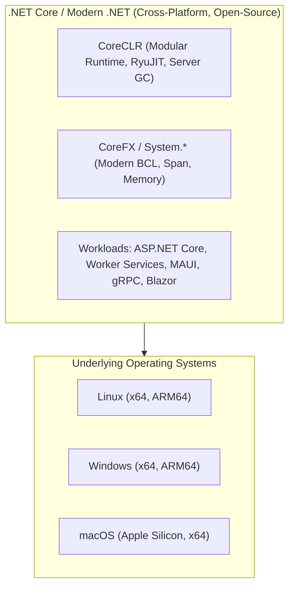
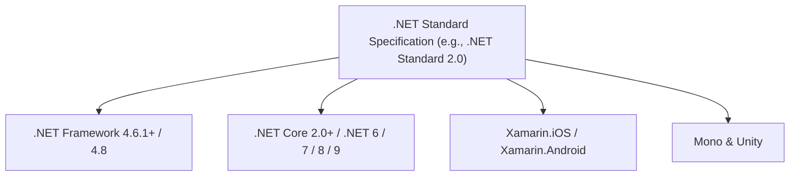
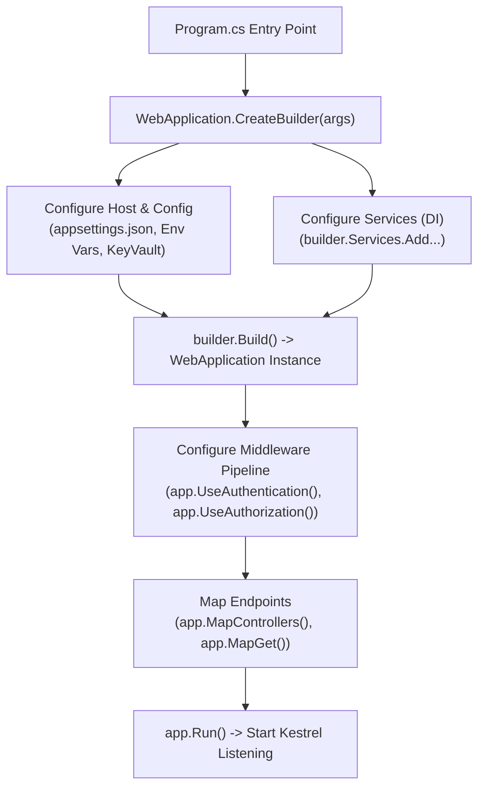
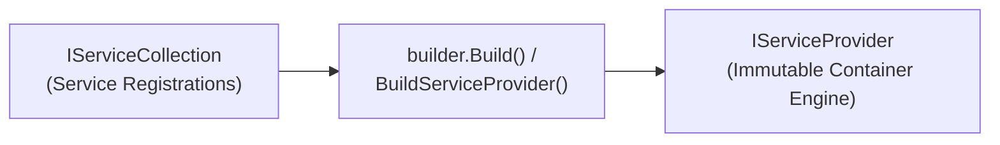
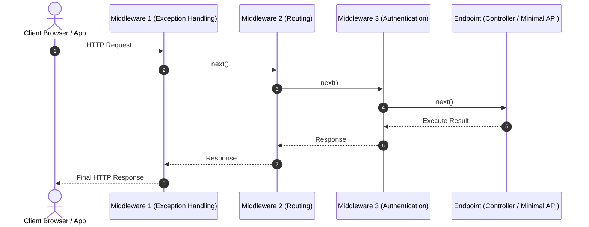
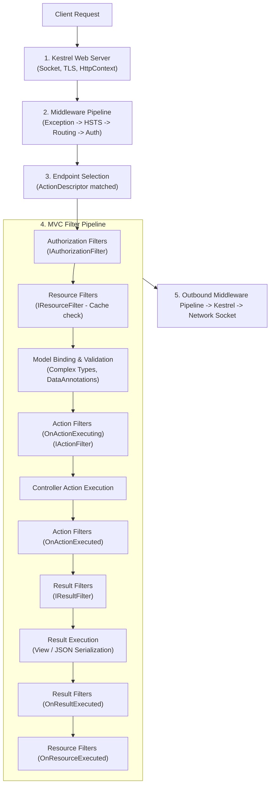
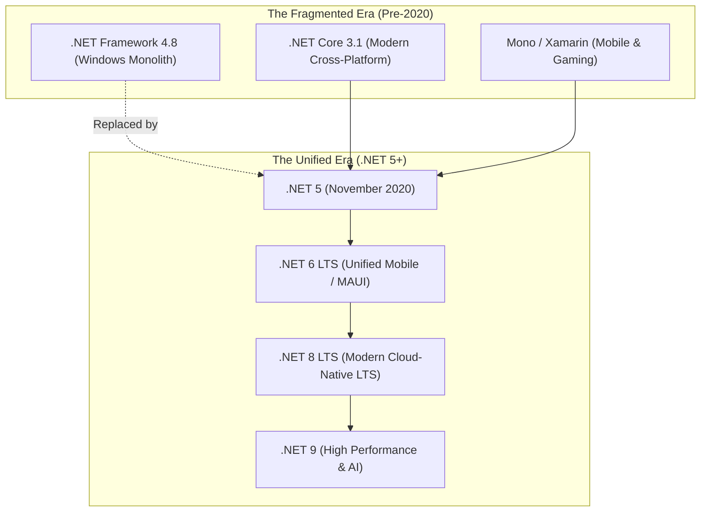
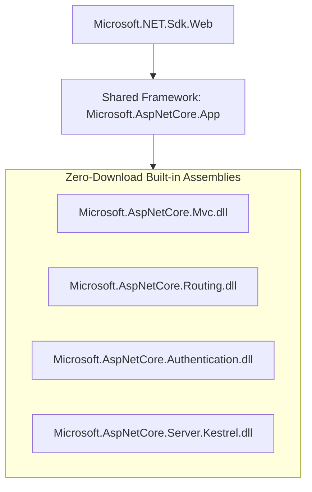

# Section 21: .NET Core - Basics & Architecture

---

### Navigation
- **Previous Section**: [Section 20: Web API More & Advanced](./20_web_api_advanced.md)
- **Next Section**: [Section 22: .NET Core Dependency Injection](./22_dotnet_core_dependency_injection.md)
- **Curriculum Master Index**: [README.md](./README.md)

---

## Q204. What is .NET Core?

### 1. Executive Summary & Core Concept
**.NET Core** (succeeded by modern unified .NET 5/6/7/8/9) is Microsoft’s modern, open-source, high-performance, cross-platform successor to the legacy Windows-only .NET Framework. Engineered from the ground up for containerization, cloud-native deployments, microservices, and high-throughput web architectures, it runs natively on Linux (RHEL, Debian, Alpine), macOS, and Windows.



### 2. Deep-Dive Architecture & Runtime Internals
- **CoreCLR**: The execution engine containing the type system, RyuJIT (Next-Gen Just-In-Time Compiler with tiered compilation, Profile-Guided Optimization [PGO], dynamic vectorization), and the garbage collector.
- **CoreFX (Modern BCL)**: Completely rewritten base class library optimized for zero-copy allocations (`Span<T>`, `ReadOnlySpan<T>`, `Memory<T>`, `ArrayPool<T>`, `System.IO.Pipelines`).
- **Side-by-Side Installation**: Unlike legacy .NET Framework (which was an OS-level component where updating the framework on a machine affected all applications), .NET Core supports true side-by-side installations. Applications can even be compiled as **Self-Contained Deployments (SCD)** or native Ahead-Of-Time (**Native AOT**) binaries bundled with their own minimal runtime.

### 3. Production-Ready Code Implementation
```csharp
// Verifying Runtime Environment & Cross-Platform Hardware Architecture
using System.Runtime.InteropServices;

public static class PlatformDiagnostics
{
    public static void PrintEnvironmentDiagnostics()
    {
        Console.WriteLine($"=== .NET Core / Modern .NET Platform Diagnostics ===");
        Console.WriteLine($".NET Runtime Version  : {Environment.Version}");
        Console.WriteLine($"Runtime Framework Desc: {RuntimeInformation.FrameworkDescription}");
        Console.WriteLine($"OS Description        : {RuntimeInformation.OSDescription}");
        Console.WriteLine($"OS Architecture       : {RuntimeInformation.OSArchitecture}");
        Console.WriteLine($"Process Architecture  : {RuntimeInformation.ProcessArchitecture}");
        Console.WriteLine($"Is 64-bit Process     : {Environment.Is64BitProcess}");
        Console.WriteLine($"Processor Count (Cores): {Environment.ProcessorCount}");
        Console.WriteLine($"Server GC Enabled     : {System.Runtime.GCSettings.IsServerGC}");
        Console.WriteLine($"Tiered Compilation    : {System.Runtime.CompilerServices.RuntimeFeature.IsDynamicCodeCompiled}");
    }
}
```

### 4. Line-by-Line Code Walkthrough
- `RuntimeInformation.FrameworkDescription`: Dynamically reads whether the app is executing on .NET Core (e.g., `.NET 8.0.4`) or legacy .NET Framework.
- `RuntimeInformation.OSArchitecture`: Identifies the physical CPU architecture (e.g., `Arm64` on Apple Silicon or AWS Graviton, `X64` on Intel/AMD).
- `GCSettings.IsServerGC`: Detects whether Server GC (multi-threaded, dedicated heap per CPU core) is active for high-throughput cloud workloads.

### 5. Real-World Enterprise Use Case & Application
Enterprises migrate microservices from Windows Server VMs running .NET Framework 4.8 to .NET Core/8 running on Linux Docker containers (Alpine or Ubuntu Chiseled) inside Kubernetes (AKS/EKS). This cuts cloud infrastructure compute costs by 50–70% due to reduced memory footprints, smaller container images (down from 10 GB Windows images to ~80 MB Linux containers), and higher CPU density.

### 6. Common Pitfalls, Memory Traps & Anti-Patterns
- **Assuming Windows-Specific APIs Exist**: Calling Windows Registry (`Microsoft.Win32.Registry`) or Windows P/Invoke APIs without wrapping them in `OperatingSystem.IsWindows()` runtime platform guards, resulting in `PlatformNotSupportedException` on Linux containers.
- **Path Separator Hardcoding**: Writing file paths with backslashes (`@"C:\temp\file.txt"`) instead of `Path.Combine()` or forward slashes (`/`), crashing on Linux file systems.

### 7. Senior / Architect Interview Follow-ups
- **Interviewer**: *What is Native AOT in .NET 8/9, and how does it fundamentally differ from standard .NET Core CoreCLR execution?*
- **Candidate Answer**: Standard .NET Core compiles C# into Intermediate Language (IL), which CoreCLR's RyuJIT compiles to machine code at runtime. Native AOT uses an IL-to-machine-code ahead-of-time compiler to generate self-contained, native OS executables with no JIT and no IL. This results in sub-millisecond cold starts, zero JIT warm-up latency, and tiny memory footprints (~15MB), making it ideal for AWS Lambda, serverless edge functions, and containerized scale-to-zero microservices.

---

## Q205. What is .NET Standard?

### 1. Executive Summary & Core Concept
**.NET Standard** is a formal specification of .NET APIs that all .NET implementations (such as .NET Framework, .NET Core, Xamarin, and Mono) intended to implement. It is not an execution runtime, but a **specification contract**. A library compiled against `.NET Standard 2.0` can be consumed simultaneously by legacy .NET Framework 4.6.1+ applications and modern .NET Core / .NET 8 applications.



### 2. Deep-Dive Architecture & Runtime Internals
- **Contract vs. Implementation**: Similar to how C# interfaces define method signatures without implementations, .NET Standard defines the assembly signatures of the Base Class Library.
- **Why .NET Standard is now Legacy (Deprecated for new projects)**:
  - Starting with **.NET 5**, Microsoft unified the fragmented runtime landscape (Xamarin, Mono, Core, Framework) into a single modern .NET platform.
  - New class libraries should target `net8.0` or `net9.0`.
  - **When to still use .NET Standard 2.0**: Only when authoring a shared NuGet library that must be consumed by BOTH legacy .NET Framework 4.8 systems and modern .NET Core / .NET 8 applications.

### 3. Production-Ready Code Implementation
```xml
<!-- Example .csproj: Multi-Targeting or Targeting .NET Standard for Dual Compatibility -->
<Project Sdk="Microsoft.NET.Sdk">

  <PropertyGroup>
    <!-- Multi-targeting modern .NET 8 and backwards compatibility for .NET Standard 2.0 -->
    <TargetFrameworks>netstandard2.0;net8.0</TargetFrameworks>
    <Nullable>enable</Nullable>
    <LangVersion>latest</LangVersion>
  </PropertyGroup>

  <!-- Conditional references or compilation directives -->
  <ItemGroup Condition="'$(TargetFramework)' == 'netstandard2.0'">
    <PackageReference Include="IndexRange" Version="1.0.3" />
  </ItemGroup>

</Project>
```

```csharp
// Cross-target compatible code
public class CrossPlatformCalculator
{
    public static string GetPlatformGreeting()
    {
#if NET8_0_OR_GREATER
        return "Executing on High-Performance Unified .NET 8+";
#elif NETSTANDARD2_0
        return "Executing on .NET Standard 2.0 Compatible Runtime";
#endif
    }
}
```

### 4. Line-by-Line Code Walkthrough
- `<TargetFrameworks>netstandard2.0;net8.0</TargetFrameworks>`: Instructs `dotnet build` to compile two distinct assembly binaries within a single NuGet package.
- `#if NET8_0_OR_GREATER`: Conditional compilation preprocessor directive enabling modern C# 12 / .NET 8 language features when available, while preserving fallback logic for .NET Standard 2.0 consumers.

### 5. Real-World Enterprise Use Case & Application
During enterprise phased migrations (the "Strangler Fig" pattern), internal shared domain libraries (e.g., validation rules, domain entities, cryptography utilities) are compiled as `.NET Standard 2.0`. This allows the existing legacy ASP.NET MVC 5 monolith and the new ASP.NET Core microservices to share the exact same NuGet binary without duplicate codebases.

### 6. Common Pitfalls, Memory Traps & Anti-Patterns
- **Targeting .NET Standard 2.1 with .NET Framework 4.8**: `.NET Framework 4.8` will NEVER support `.NET Standard 2.1`. If a team compiles a library targeting `netstandard2.1`, it cannot be consumed by .NET Framework applications.
- **Targeting .NET Standard for New Microservices**: Creating new microservice libraries targeting `netstandard2.0` when no .NET Framework dependencies exist, unnecessarily locking the team out of modern high-performance APIs like `TimeProvider`, `DateOnly`, and advanced `Span<T>` optimizations.

### 7. Senior / Architect Interview Follow-ups
- **Interviewer**: *Why did Microsoft stop evolving .NET Standard after version 2.1?*
- **Candidate Answer**: .NET Standard was created to solve runtime fragmentation between .NET Framework, .NET Core, and Xamarin/Mono. With .NET 5+, Microsoft unified all platforms into a single codebase and BCL. Target Framework Monikers (TFMs) like `net8.0`, `net8.0-windows`, `net8.0-ios`, and `net8.0-android` replaced .NET Standard entirely.

---

## Q206. What are the advantages of .NET Core over .NET framework?

### 1. Executive Summary & Core Concept
.NET Core was engineered to dismantle the legacy monolithic architecture of .NET Framework. Its key advantages span six dimensions: **Cross-Platform Execution**, **Architectural Performance & Throughput**, **Modular Microservice/Container Footprint**, **Cloud-Native Diagnostics**, **Modern C# Innovation**, and **Zero System-Wide Registry Coupling**.

| Dimension | Legacy .NET Framework (4.x) | Modern .NET Core / .NET 8 / 9 |
| :--- | :--- | :--- |
| **OS Compatibility** | Windows Only (Tightly coupled to IIS & Windows OS) | Cross-Platform (Linux, macOS, Windows, ARM64) |
| **Open Source** | Proprietary (Reference source only) | 100% Fully Open Source (GitHub, MIT/Apache) |
| **Performance** | Moderate; heavy object allocations | World-class (TechEmpower benchmarks leader; zero-allocation pipelines) |
| **Hosting Engine** | Monolithic `System.Web` & IIS worker process (`w3wp.exe`) | Lightweight, high-throughput Kestrel server; embeddable anywhere |
| **Deployment Model**| Machine-wide installation in GAC | Self-contained, framework-dependent, Docker, or Native AOT |
| **Dependency Injection**| External 3rd party container required (Autofac, Unity) | First-class, built-in, high-performance DI container |

### 2. Deep-Dive Architecture & Runtime Internals
1. **Ditching `System.Web.dll`**: Legacy ASP.NET was bound to `System.Web.dll`, which contained the monolithic `HttpContext` object that carried ~30 KB of memory overhead per request regardless of whether the request was an HTML page or a 10-byte JSON API call. .NET Core replaced this with a lightweight `HttpContext` and an asynchronous middleware pipeline.
2. **Hardware Vectorization & Dynamic PGO**: RyuJIT in modern .NET Core utilizes AVX-512 and ARM Neon vector instructions, dynamically compiling hot code paths based on live production runtime profiling data.
3. **Memory Allocations**: CoreFX was redesigned around `Span<T>`, slicing byte buffers and string memory without generating Garbage Collector heap allocations.

### 3. Production-Ready Code Implementation
```csharp
// High-Throughput Memory Slicing Demonstrating Zero Allocation in .NET Core
using System.Buffers;

public class HighPerformanceParser
{
    // Legacy .NET Framework Approach: Generates 3 heap-allocated strings per call
    public static (string Area, string Prefix, string Line) ParsePhoneLegacy(string rawPhone)
    {
        // Allocation 1, 2, 3: Substring creates new System.String objects on the Managed Heap
        string area = rawPhone.Substring(0, 3);
        string prefix = rawPhone.Substring(3, 3);
        string line = rawPhone.Substring(6, 4);
        return (area, prefix, line);
    }

    // Modern .NET Core / .NET 8 Approach: Zero Heap Allocation via ReadOnlySpan<char>
    public static void ParsePhoneZeroAlloc(ReadOnlySpan<char> rawPhone, Span<char> areaBuffer, Span<char> prefixBuffer, Span<char> lineBuffer)
    {
        // Slice operates as a stack-only view over existing memory - 0 bytes allocated
        rawPhone.Slice(0, 3).CopyTo(areaBuffer);
        rawPhone.Slice(3, 3).CopyTo(prefixBuffer);
        rawPhone.Slice(6, 4).CopyTo(lineBuffer);
    }
}
```

### 4. Line-by-Line Code Walkthrough
- `rawPhone.Substring(...)`: Legacy .NET Framework method that allocates distinct `System.String` reference types on the Gen 0 managed heap for every parsed segment.
- `ReadOnlySpan<char>`: Modern .NET Core `ref struct` that points directly to contiguous memory (stack, heap, or unmanaged native memory) without allocating heap objects.
- `rawPhone.Slice(...)`: Performs constant-time $O(1)$ memory slicing using pointer arithmetic within the bounds of the existing string memory buffer.

### 5. Real-World Enterprise Use Case & Application
Bing, Microsoft Teams, and Azure Cosmos DB services migrated from .NET Framework to .NET Core / .NET 8. In documented Microsoft engineering benchmarks, Bing reduced server CPU utilization by over 30% and Cosmos DB reduced latency by 45% while handling petabyte-scale throughput.

### 6. Common Pitfalls, Memory Traps & Anti-Patterns
- **Porting Legacy Code Without Refactoring**: Migrating legacy .NET Framework code to .NET Core while retaining synchronous `.Result` or `.Wait()` calls, triggering thread pool starvation under high Kestrel concurrent loads.
- **Ignoring GC Flavors**: Running a containerized microservice with Workstation GC in production instead of Server GC, or failing to constrain GC memory limits in Docker (`DOTNET_GCHeapHardLimit`), leading to Linux OOM (Out Of Memory) container kills.

### 7. Senior / Architect Interview Follow-ups
- **Interviewer**: *How does the hosting model difference between IIS Application Pools and Kestrel impact high-concurrency microservices?*
- **Candidate Answer**: In IIS on .NET Framework, incoming requests were tied to OS threads in the Windows HTTP.sys queue, incurring context-switch overhead and thread pool exhaustion under spikes. Kestrel in .NET Core is an asynchronous I/O engine built on `System.IO.Pipelines` and libuv/managed sockets. It separates socket reading from application request processing, using minimal thread transitions and non-blocking asynchronous event loops to process millions of concurrent HTTP requests.

---

## Q207. What is the role of Program.cs file in ASP.NET Core?

### 1. Executive Summary & Core Concept
In ASP.NET Core, an application is essentially a standard **C# Console Application** that spins up a web host. `Program.cs` is the application's root entry point containing the `static void Main(string[] args)` method (or modern C# top-level statements). It is responsible for orchestrating the entire application bootstrap sequence: configuring the host, bootstrapping dependency injection, binding configuration providers, registering middleware pipelines, and launching Kestrel.



### 2. Deep-Dive Architecture & Runtime Internals
- **Evolution across .NET versions**:
  - In .NET Core 1.x - 3.1 & .NET 5: Initialization was split across two files: `Program.cs` (configured `IHostBuilder` and invoked `UseStartup<Startup>()`) and `Startup.cs` (`ConfigureServices` and `Configure`).
  - In modern .NET 6/7/8/9: Microsoft introduced the **Minimal Hosting Model** using C# top-level statements. `Program.cs` consolidates host building, service registration, and middleware configuration into a unified, linear execution flow using `WebApplicationBuilder` and `WebApplication`.
- **`WebApplicationBuilder` vs `WebApplication`**:
  - `builder.Services` is an `IServiceCollection` representing the DI container during configuration. Once `builder.Build()` is called, the DI container is built and frozen (`IServiceProvider`). No further services can be registered at runtime.

### 3. Production-Ready Code Implementation
```csharp
// Modern .NET 8 Program.cs with Enterprise Production Hardening
using System.Text.Json;
using Microsoft.AspNetCore.Diagnostics.HealthChecks;
using Microsoft.Extensions.Diagnostics.HealthChecks;

var builder = WebApplication.CreateBuilder(args);

// 1. Configure Host Options & Kestrel Limits
builder.WebHost.ConfigureKestrel(options =>
{
    options.AddServerHeader = false; // Security: Prevent server OS fingerprinting
    options.Limits.MaxRequestBodySize = 10 * 1024 * 1024; // 10 MB Limit
});

// 2. Configure DI Services
builder.Services.AddControllers();
builder.Services.AddEndpointsApiExplorer();
builder.Services.AddSwaggerGen();
builder.Services.AddHealthChecks()
    .AddCheck("self", () => HealthCheckResult.Healthy(), tags: ["live"]);

// 3. Build WebApplication Instance (Freezes DI Container)
var app = builder.Build();

// 4. Configure HTTP Request Middleware Pipeline (ORDER MATTERS STRICTLY)
if (app.Environment.IsDevelopment())
{
    app.UseSwagger();
    app.UseSwaggerUI();
}
else
{
    app.UseExceptionHandler("/error");
    app.UseHsts();
}

app.UseHttpsRedirection();
app.UseRouting();

app.UseAuthentication();
app.UseAuthorization();

// 5. Map Endpoints
app.MapHealthChecks("/health/live", new HealthCheckOptions
{
    Predicate = check => check.Tags.Contains("live")
});
app.MapControllers();

// 6. Run Application
app.Run();

// Required to expose Program to WebApplicationFactory in integration tests
public partial class Program { }
```

### 4. Line-by-Line Code Walkthrough
- `var builder = WebApplication.CreateBuilder(args)`: Initializes default configuration (loads `appsettings.json`, `appsettings.{Environment}.json`, environment variables, and command-line arguments) and configures logging.
- `options.AddServerHeader = false`: Strips the `Server: Kestrel` header from HTTP responses, preventing attacker reconnaissance.
- `var app = builder.Build()`: Instantiates the immutable `WebApplication` host.
- `public partial class Program { }`: Makes the internal top-level statement `Program` class accessible to integration test assemblies utilizing `WebApplicationFactory<Program>`.

### 5. Real-World Enterprise Use Case & Application
Enterprise cloud applications use `Program.cs` to enforce 12-factor app configuration: pulling secrets securely from Azure Key Vault or AWS Secrets Manager into the `ConfigurationManager` before building the DI container, and configuring OpenTelemetry distributed tracing and metrics exporters (Jaeger, Datadog).

### 6. Common Pitfalls, Memory Traps & Anti-Patterns
- **Service Resolution from `builder.Services` before `Build()`**: Calling `builder.Services.BuildServiceProvider().GetService<T>()` creates an ephemeral root service provider, resulting in duplicate singleton instances and memory leaks.
- **Middleware Ordering Errors**: Placing `app.UseAuthorization()` before `app.UseAuthentication()`, causing authorization checks to evaluate against an unauthenticated anonymous principal.

### 7. Senior / Architect Interview Follow-ups
- **Interviewer**: *Why did Microsoft consolidate `Startup.cs` into `Program.cs`, and how can large enterprise applications keep `Program.cs` clean and maintainable?*
- **Candidate Answer**: Microsoft consolidated them to reduce boilerplate and align with modern minimal web patterns. To keep `Program.cs` clean in large enterprise systems, we use extension methods on `IServiceCollection` (e.g., `builder.Services.AddInfrastructure(builder.Configuration)`, `builder.Services.AddDomainServices()`) and `IApplicationBuilder` (e.g., `app.UseCustomPipelines()`), encapsulating distinct architectural layers cleanly.

---

## Q208. What is the role of ConfigureServices method?

### 1. Executive Summary & Core Concept
In the classic ASP.NET Core hosting model (`Startup.cs`), the `ConfigureServices(IServiceCollection services)` method was the dedicated lifecycle phase where application dependencies, framework services, and third-party components were registered into the built-in **Inversion of Control (IoC) / Dependency Injection (DI) container**. In modern .NET 6/7/8/9, this is directly handled via `builder.Services` in `Program.cs`.



### 2. Deep-Dive Architecture & Runtime Internals
- **Contract Definition**:
  `IServiceCollection` is simply a list of `ServiceDescriptor` objects:
  ```csharp
  public class ServiceDescriptor
  {
      public Type ServiceType { get; }
      public Type? ImplementationType { get; }
      public object? ImplementationInstance { get; }
      public Func<IServiceProvider, object>? ImplementationFactory { get; }
      public ServiceLifetime Lifetime { get; }
  }
  ```
- **Lifecycle Guarantees**:
  `ConfigureServices` runs strictly **before** `Configure`. The runtime guarantees that all services, database contexts, options pattern bindings, and filters are registered before any middleware pipeline is constructed or requests are received.

### 3. Production-Ready Code Implementation
```csharp
// Enterprise Modular Service Registration Pattern
using Microsoft.Extensions.Configuration;
using Microsoft.Extensions.DependencyInjection;

public static class ServiceCollectionExtensions
{
    public static IServiceCollection AddEnterpriseInfrastructure(
        this IServiceCollection services, 
        IConfiguration configuration)
    {
        // 1. Strongly Typed Options Pattern
        services.Configure<DatabaseSettings>(configuration.GetSection("DatabaseSettings"));

        // 2. Database & Data Access Layer
        services.AddScoped<IOrderRepository, SqlOrderRepository>();

        // 3. Domain Services with Decorator Pattern
        services.AddScoped<IOrderService, OrderService>();
        services.Decorate<IOrderService, CachedOrderServiceDecorator>();

        // 4. External HTTP Clients with Resilient Retries (Polly)
        services.AddHttpClient<IPaymentProvider, StripePaymentProvider>(client =>
        {
            client.BaseAddress = new Uri("https://api.stripe.com/v1/");
            client.Timeout = TimeSpan.FromSeconds(10);
        });

        return services;
    }
}

public class DatabaseSettings
{
    public string ConnectionString { get; set; } = string.Empty;
}

public interface IOrderRepository { }
public class SqlOrderRepository : IOrderRepository { }
public interface IOrderService { }
public class OrderService : IOrderService { }
public class CachedOrderServiceDecorator : IOrderService 
{ 
    public CachedOrderServiceDecorator(IOrderService inner) { } 
}
public interface IPaymentProvider { }
public class StripePaymentProvider : IPaymentProvider 
{ 
    public StripePaymentProvider(HttpClient client) { } 
}
```

### 4. Line-by-Line Code Walkthrough
- `public static IServiceCollection AddEnterpriseInfrastructure(...)`: Creates a reusable extension method encapsulating architectural boundary registrations.
- `services.Configure<DatabaseSettings>(...)`: Binds configuration sections directly to strongly typed POCO objects (`IOptions<T>`, `IOptionsSnapshot<T>`).
- `services.AddHttpClient<IPaymentProvider, ...>`: Utilizes the `IHttpClientFactory` typed client pattern to manage socket lifetimes and prevent DNS staleness.

### 5. Real-World Enterprise Use Case & Application
Large enterprise solutions with 20+ microservices share common infrastructure libraries (e.g., `AddEnterpriseTelemetry()`, `AddEnterpriseSecurity()`, `AddServiceBusMessaging()`). `ConfigureServices` modular extension methods allow every microservice to bootstrap uniform corporate logging, authentication, and database policies with a single line of code.

### 6. Common Pitfalls, Memory Traps & Anti-Patterns
- **Captive Dependencies**: Registering a `Scoped` service (e.g., EF Core `DbContext`) as a constructor parameter inside a `Singleton` service. The `DbContext` becomes permanently trapped in memory and is never disposed, causing memory leaks and multi-threaded concurrency crashes.
- **Calling `BuildServiceProvider()` repeatedly**: Re-building the service provider inside `ConfigureServices` creates orphaned DI containers, causing multiple singleton instances to exist concurrently.

### 7. Senior / Architect Interview Follow-ups
- **Interviewer**: *What validation mechanism does ASP.NET Core provide to detect Captive Dependencies during development?*
- **Candidate Answer**: When running in the `Development` environment, `WebApplicationBuilder` automatically enables `ValidateScopes` and `ValidateOnBuild` in `ServiceProviderOptions`. If a scoped service is resolved from a singleton or directly from the root provider, the framework throws an `InvalidOperationException` immediately on startup, failing fast before deployment.

---

## Q209. What is the role of Configure method?

### 1. Executive Summary & Core Concept
In the classic ASP.NET Core `Startup.cs` architecture, the `Configure(IApplicationBuilder app, IWebHostEnvironment env)` method defines how the application responds to individual incoming HTTP requests by constructing the **HTTP Request Processing Middleware Pipeline**. In modern .NET 6+, these calls are invoked directly on the `app` (`WebApplication`) object in `Program.cs`.



### 2. Deep-Dive Architecture & Runtime Internals
- The `Configure` method chains middleware components into a bidirectional Russian-doll execution pipeline.
- Every middleware has two execution phases:
  1. **Inbound**: Executes before calling `await next(context)`.
  2. **Outbound**: Executes after `await next(context)` returns, on the response path back to the client.
- **Order is Paramount**: Unlike `ConfigureServices` (where registration order rarely matters), the order of middleware invocation inside `Configure` strictly dictates the behavior, performance, and security of the entire application.

### 3. Production-Ready Code Implementation
```csharp
// Classic Startup.cs Configure Method Layout
using Microsoft.AspNetCore.Builder;
using Microsoft.AspNetCore.Hosting;
using Microsoft.Extensions.Hosting;

public class StartupConfigureWorkflow
{
    public void Configure(IApplicationBuilder app, IWebHostEnvironment env)
    {
        // 1. Exception Handling & Diagnostics (Outermost layer catches everything)
        if (env.IsDevelopment())
        {
            app.UseDeveloperExceptionPage();
        }
        else
        {
            app.UseExceptionHandler("/api/v1/error");
            app.UseHsts();
        }

        // 2. Protocol Security
        app.UseHttpsRedirection();

        // 3. Static Files (Early short-circuit for .js, .css, images)
        app.UseStaticFiles();

        // 4. Routing Engine (Parses URL and selects Endpoint)
        app.UseRouting();

        // 5. Cross-Origin Resource Sharing (CORS must sit between UseRouting and UseAuth)
        app.UseCors("EnterprisePolicy");

        // 6. Security Boundaries
        app.UseAuthentication();
        app.UseAuthorization();

        // 7. Endpoint Execution (Executes the selected Controller / Action)
        app.UseEndpoints(endpoints =>
        {
            endpoints.MapControllers();
            endpoints.MapRazorPages();
        });
    }
}
```

### 4. Line-by-Line Code Walkthrough
- `app.UseExceptionHandler(...)`: Positioned at the very top of the pipeline so it wraps all downstream middleware in an implicit `try/catch` block.
- `app.UseRouting()`: Matches the incoming request URI to a known endpoint and places the `Endpoint` metadata in `HttpContext.Features`.
- `app.UseCors(...)`: Evaluates CORS headers against the selected endpoint metadata.
- `app.UseAuthentication()` / `app.UseAuthorization()`: Hydrates `HttpContext.User` using identity tokens/cookies and enforces `[Authorize]` attributes.
- `app.UseEndpoints(...)`: The terminal execution phase where the selected controller action or minimal API runs.

### 5. Real-World Enterprise Use Case & Application
In zero-trust architectures, custom middleware is injected into the pipeline right after `UseRouting()` to enforce multi-tenant database routing, inspect tenant identity from subdomains (`tenant1.api.enterprise.com`), and inject the tenant ID into ambient execution contexts.

### 6. Common Pitfalls, Memory Traps & Anti-Patterns
- **Placing `UseCors()` After `UseResponseCaching()`**: Can cause browsers to cache responses without CORS headers, resulting in intermittent CORS failures for client applications.
- **Short-Circuiting Without Writing Response**: A middleware failing to call `next(context)` and also failing to write to `context.Response.Body`, resulting in blank HTTP 200 OK responses.

### 7. Senior / Architect Interview Follow-ups
- **Interviewer**: *What happens under the hood when `UseRouting()` and `UseEndpoints()` execute in ASP.NET Core?*
- **Candidate Answer**: In Endpoint Routing (introduced in ASP.NET Core 3.0), `UseRouting()` performs endpoint selection—it parses route templates and attaches the matching `Endpoint` to `HttpContext.SetEndpoint(...)`. However, it does not execute the action. This allows subsequent middleware (like `UseCors()` or `UseAuthorization()`) to inspect the endpoint's metadata attributes (such as `[Authorize]` or `[EnableCors]`) *before* `UseEndpoints()` executes the terminal pipeline.

---

## Q210. Describe the complete Request Processing Pipeline for ASP.NET Core MVC?

### 1. Executive Summary & Core Concept
The complete ASP.NET Core MVC request processing pipeline is the end-to-end journey an HTTP request undergoes from the physical network socket to the controller action and back. It consists of three major architectural stages:
1. **The Web Server Layer (Kestrel / HTTP.sys)**: Handles TLS termination, socket reading, and `HttpContext` creation.
2. **The Middleware Pipeline**: Sequential HTTP pipeline handling authentication, routing, caching, and custom policies.
3. **The MVC Filter & Action Invocation Pipeline**: Specialized MVC pipeline handling routing filters, model binding, action filters, result execution, and serialization.



### 2. Deep-Dive Architecture & Runtime Internals
When a request enters the MVC Filter pipeline, filters execute in a strictly defined structural hierarchy:
1. **Authorization Filters**: Implements `IAuthorizationFilter`. Evaluates whether the user satisfies endpoint requirements. Runs first; short-circuits immediately with 401 or 403 on failure.
2. **Resource Filters**: Implements `IResourceFilter`. Wraps the entire remaining pipeline. Often used for output caching, skipping model binding completely on cache hits.
3. **Model Binding & Validation**: The runtime parses query strings, route data, form values, and JSON request bodies, instantiating C# parameter objects and validating `DataAnnotations` (`ModelState.IsValid`).
4. **Action Filters**: Implements `IActionFilter`. Wraps action execution (`OnActionExecuting` / `OnActionExecuted`), allowing pre/post inspection of action arguments.
5. **Action Invocation**: The controller action method executes via reflection or compiled expression delegates.
6. **Exception Filters**: Implements `IExceptionFilter`. Handles unhandled exceptions thrown during action execution (note: modern apps typically prefer the global `UseExceptionHandler` middleware instead).
7. **Result Filters**: Implements `IResultFilter`. Wraps the execution of the returned `IActionResult`.
8. **Result Execution**: The `IActionResult` serializes data to the response stream (e.g., `JsonResult`, `ViewResult`).

### 3. Production-Ready Code Implementation
```csharp
// Custom Action Filter Demonstrating Pipeline Lifecycle Interception
using System.Diagnostics;
using Microsoft.AspNetCore.Mvc.Filters;
using Microsoft.Extensions.Logging;

public class PerformanceMetricActionFilter : IAsyncActionFilter
{
    private readonly ILogger<PerformanceMetricActionFilter> _logger;

    public PerformanceMetricActionFilter(ILogger<PerformanceMetricActionFilter> logger)
    {
        _logger = logger;
    }

    public async Task OnActionExecutionAsync(ActionExecutingContext context, ActionExecutionDelegate next)
    {
        // 1. Pre-Action Execution Logic
        var stopwatch = Stopwatch.StartNew();
        var actionName = context.ActionDescriptor.DisplayName;

        _logger.LogInformation("Pipeline Stage: Entering Action {ActionName}", actionName);

        // 2. Invoke Next Stage in the Pipeline (The Controller Action)
        var executedContext = await next();

        // 3. Post-Action Execution Logic
        stopwatch.Stop();
        if (executedContext.Exception != null)
        {
            _logger.LogError(executedContext.Exception, "Action {ActionName} failed after {ElapsedMs}ms", 
                actionName, stopwatch.ElapsedMilliseconds);
        }
        else
        {
            _logger.LogInformation("Pipeline Stage: Exiting Action {ActionName} - Duration {ElapsedMs}ms", 
                actionName, stopwatch.ElapsedMilliseconds);
        }
    }
}
```

### 4. Line-by-Line Code Walkthrough
- `public class PerformanceMetricActionFilter : IAsyncActionFilter`: Implements the modern asynchronous action filter contract.
- `ActionExecutingContext context`: Exposes HTTP context, route data, and action method arguments for inspection or modification.
- `var executedContext = await next()`: Yields control downstream to the controller action method and awaits its completion.
- `if (executedContext.Exception != null)`: Inspects whether downstream components threw an unhandled exception, allowing logging or exception suppression (`executedContext.ExceptionHandled = true`).

### 5. Real-World Enterprise Use Case & Application
Enterprise banking applications implement custom `IAsyncResourceFilter` classes for idempotency checking: the filter inspects an `Idempotency-Key` HTTP header. If the key exists in Redis, the filter immediately short-circuits the pipeline, returning the cached response without ever executing model binding or controller database queries.

### 6. Common Pitfalls, Memory Traps & Anti-Patterns
- **Using Exception Filters for Global Exception Handling**: MVC Exception Filters only catch exceptions thrown inside controllers/actions; they do **not** catch exceptions thrown in upstream middleware (e.g., authentication failures or routing errors). Always use global exception handling middleware (`app.UseExceptionHandler()`).
- **Accessing `context.HttpContext.Request.Body` without Buffering**: Reading the request body stream inside a filter consumes the stream. If `EnableBuffering()` is not invoked, downstream model binders find an empty stream and fail to bind parameters.

### 7. Senior / Architect Interview Follow-ups
- **Interviewer**: *What is the architectural difference between an ASP.NET Core Middleware and an MVC Action Filter? When would you choose one over the other?*
- **Candidate Answer**: Middleware operates on the low-level `HttpContext` and knows nothing about MVC routing, action methods, parameters, or `ModelState`. Action Filters execute inside the MVC pipeline and have full access to `ActionDescriptor`, model binding states, and action arguments. We use **Middleware** for cross-cutting HTTP concerns (logging, authentication, CORS, compression) and **Action Filters** when we need access to MVC-specific context (validating model state, modifying action arguments, custom authorization attributes).

---

## Q211. What is the difference between .NET Core and .NET 5?

### 1. Executive Summary & Core Concept
**.NET 5** (released in November 2020) was the foundational milestone release where Microsoft **unified** the fragmented .NET ecosystem into a single platform. It represents the direct architectural continuation and rebranding of **.NET Core 3.1**. Microsoft deliberately skipped ".NET 4.x" to avoid brand confusion with the legacy Windows-only ".NET Framework 4.8".



### 2. Deep-Dive Architecture & Runtime Internals
1. **Dropping "Core" from the Name**: The name was simplified from ".NET Core" to simply ".NET" to signify that this unified platform is now the primary, sole implementation of .NET going forward.
2. **Unified BCL (Base Class Library)**: Prior to .NET 5, Mono/Xamarin and .NET Core used different implementations of common APIs. .NET 5 consolidated these into a single shared BCL.
3. **C# Language Advances**: .NET 5 introduced **C# 9** with record types, init-only properties, top-level statements, and pattern matching enhancements.
4. **Target Framework Moniker (TFM)**: Transitioned from `netcoreapp3.1` to `net5.0` (and subsequently `net8.0`, `net9.0`).

### 3. Production-Ready Code Implementation
```xml
<!-- Modern Project File Targeting Unified .NET 8 LTS -->
<Project Sdk="Microsoft.NET.Sdk.Web">

  <PropertyGroup>
    <!-- Modern unified TFM replaces legacy netcoreapp3.1 -->
    <TargetFramework>net8.0</TargetFramework>
    <Nullable>enable</Nullable>
    <ImplicitUsings>enable</ImplicitUsings>
    
    <!-- Modern AOT and Performance Switches -->
    <PublishAot>false</PublishAot>
    <OptimizationPreference>Speed</OptimizationPreference>
  </PropertyGroup>

</Project>
```

### 4. Line-by-Line Code Walkthrough
- `<TargetFramework>net8.0</TargetFramework>`: Specifies the modern unified Target Framework Moniker.
- `<ImplicitUsings>enable</ImplicitUsings>`: Feature introduced in .NET 6 that automatically imports ubiquitous namespaces (e.g., `System`, `System.Collections.Generic`, `System.Threading.Tasks`) across all project files.

### 5. Real-World Enterprise Use Case & Application
Enterprise architecture roadmaps mandate upgrading legacy .NET Core 2.1/3.1 systems to Long-Term Support (LTS) versions of modern unified .NET (.NET 8 LTS), ensuring multi-year enterprise security patching, FIPS compliance, and support for modern cloud architectures.

### 6. Common Pitfalls, Memory Traps & Anti-Patterns
- **Assuming .NET Framework 4.8 is in .NET 5+**: Expecting legacy .NET Framework features like ASP.NET Web Forms (`.aspx`), WCF Server (`System.ServiceModel`), or AppDomains to be available in .NET 5+. They are not supported; teams must adopt Blazor/MVC, CoreWCF/gRPC, and `AssemblyLoadContext` instead.

### 7. Senior / Architect Interview Follow-ups
- **Interviewer**: *What is Microsoft's support cadence for .NET versions following the .NET 5 release?*
- **Candidate Answer**: Microsoft follows an annual release cadence every November. Even-numbered versions (.NET 6, .NET 8, .NET 10) are **Long-Term Support (LTS)** releases supported for 36 months with enterprise-grade stability patches. Odd-numbered versions (.NET 5, .NET 7, .NET 9) are **Standard Term Support (STS)** releases supported for 18 months, intended for teams wanting early access to cutting-edge runtime features.

---

## Q212. What is Metapackage? What is the name of Metapackage in ASP.NET Core?

### 1. Executive Summary & Core Concept
A **Metapackage** is a specialized NuGet package that contains no compiled assembly binaries of its own; instead, it defines a curated collection of dependencies on other packages. In early versions of ASP.NET Core (2.x), the primary metapackage was **`Microsoft.AspNetCore.App`** (and `Microsoft.AspNetCore.All`). 

In modern .NET (.NET Core 3.0 through .NET 8/9), this concept evolved into the **Shared Framework**. You no longer reference a NuGet metapackage for the web stack; instead, your project file specifies the Web SDK (`<Project Sdk="Microsoft.NET.Sdk.Web">`), which automatically references the shared runtime framework `Microsoft.AspNetCore.App`.



### 2. Deep-Dive Architecture & Runtime Internals
- **The Problem with NuGet Metapackages in 2.x**:
  In ASP.NET Core 2.x, referencing `Microsoft.AspNetCore.All` downloaded hundreds of individual NuGet DLLs into project folders, creating large deployment packages, slow build times, and security auditing overhead.
- **The Shared Framework Solution (3.x - 9.x)**:
  Starting with .NET Core 3.0, Microsoft removed `Microsoft.AspNetCore.App` from the public NuGet gallery as an installable package. It is now installed at the machine/OS level as a **Targeting Pack & Shared Runtime** in `/dotnet/shared/Microsoft.AspNetCore.App/{version}/`.
- **Compile-Time Trimming**: When deploying, the .NET SDK knows these assemblies already exist on the target hosting runtime, producing slim deployments.

### 3. Production-Ready Code Implementation
```xml
<!-- Modern ASP.NET Core Project referencing the Shared Framework automatically -->
<Project Sdk="Microsoft.NET.Sdk.Web">

  <PropertyGroup>
    <TargetFramework>net8.0</TargetFramework>
  </PropertyGroup>

  <!-- 
    NO NuGet PackageReference for Microsoft.AspNetCore.App is required!
    The Sdk="Microsoft.NET.Sdk.Web" implicitly includes:
    <FrameworkReference Include="Microsoft.AspNetCore.App" />
  -->

</Project>
```

```xml
<!-- Class Library Project needing access to ASP.NET Core abstractions -->
<Project Sdk="Microsoft.NET.Sdk">

  <PropertyGroup>
    <TargetFramework>net8.0</TargetFramework>
  </PropertyGroup>

  <ItemGroup>
    <!-- Explicitly reference the ASP.NET Core Shared Framework in a class library -->
    <FrameworkReference Include="Microsoft.AspNetCore.App" />
  </ItemGroup>

</Project>
```

### 4. Line-by-Line Code Walkthrough
- `<Project Sdk="Microsoft.NET.Sdk.Web">`: The Web SDK automatically configures compilation targeting the ASP.NET Core Shared Framework.
- `<FrameworkReference Include="Microsoft.AspNetCore.App" />`: Used in class libraries when domain or infrastructure projects require access to `HttpContext`, `IActionFilter`, or `IServiceCollection` without pulling down obsolete third-party NuGet wrappers.

### 5. Real-World Enterprise Use Case & Application
In enterprise Docker container builds, using the ASP.NET Core Shared Framework ensures container base images (`mcr.microsoft.com/dotnet/aspnet:8.0`) share read-only, cryptographically verified system assemblies across all running containers on the host, dramatically lowering memory footprint and disk I/O.

### 6. Common Pitfalls, Memory Traps & Anti-Patterns
- **Manually Searching NuGet for `Microsoft.AspNetCore.App`**: Developers new to .NET often search NuGet for `Microsoft.AspNetCore.App` and install an obsolete 2.x version from 2018 into a modern .NET 8 project, causing build conflicts.
- **Over-referencing Web SDK in Pure Domain Layers**: Using `Microsoft.NET.Sdk.Web` in core domain logic projects, inadvertently polluting pure domain models with web infrastructure dependencies.

### 7. Senior / Architect Interview Follow-ups
- **Interviewer**: *What is the difference between a `PackageReference` and a `FrameworkReference` in .NET?*
- **Candidate Answer**: A `PackageReference` points to an external, versioned package hosted on a NuGet feed that is downloaded into the local package cache and copied to the build output directory. A `FrameworkReference` points to a curated platform runtime library (such as `Microsoft.NETCore.App` or `Microsoft.AspNetCore.App`) that is pre-installed globally on the host operating system or base Docker image, resulting in zero download overhead, smaller build artifacts, and optimized shared memory footprints.
