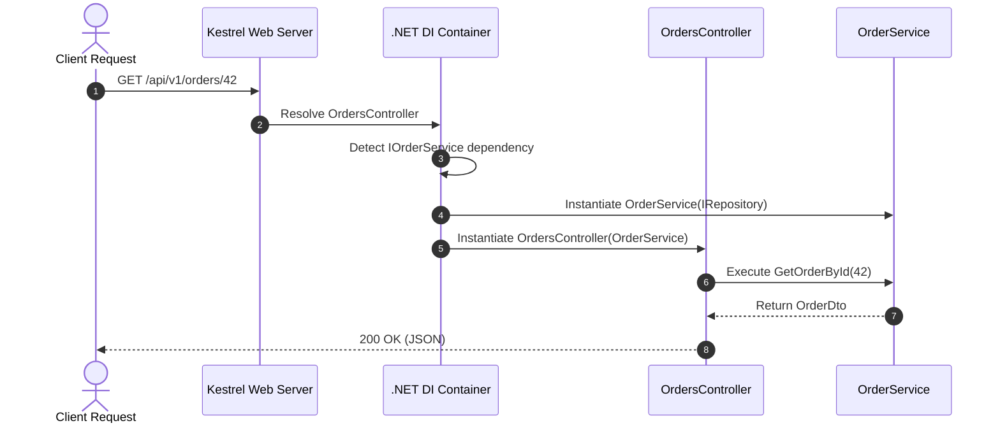
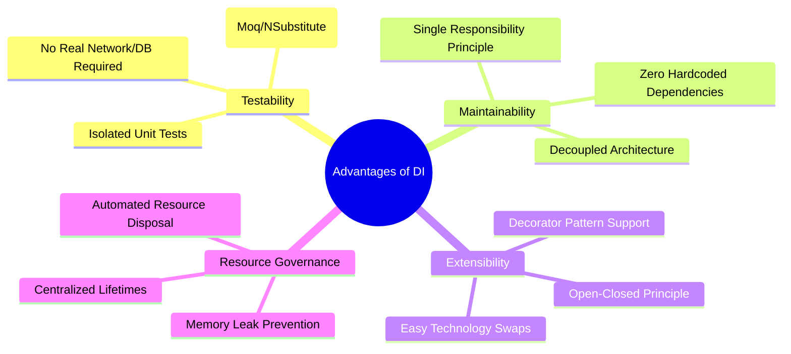
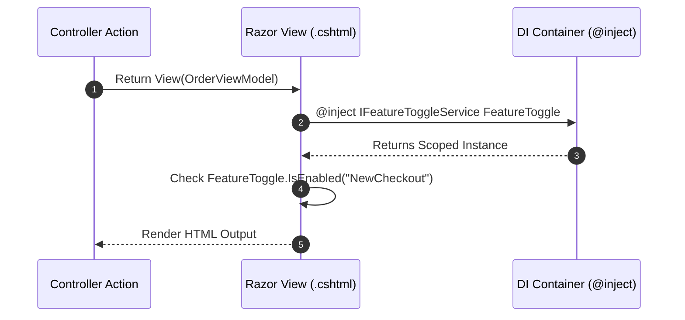

# Section 22: .NET Core - Dependency Injection

> **Curriculum Navigation:**  
> ⏪ [Previous: Section 21 – .NET Core Architecture & Hosting Pipeline](./21_dotnet_core_basics.md) | 🏠 [Master Index](./README.md) | ⏩ [Next: Section 23 – Service Lifetimes, Middleware & Hosting](./23_dotnet_core_service_lifetimes_middleware_hosting.md)

---

## Q213. What is Dependency Injection?

### 1. Executive Summary & Core Concept
**Dependency Injection (DI)** is a software design pattern that implements **Inversion of Control (IoC)** for resolving dependencies. Instead of an object instantiating its own collaborators directly via the `new` keyword (tight coupling), dependencies are supplied ("injected") to the object from the outside—typically via constructor parameters—by an **IoC Container** (or Composition Root).

```mermaid
flowchart LR
    subgraph TightCoupling["Anti-Pattern: Tight Coupling"]
        OrderService1["OrderService"] -->|new SqlDatabase()| SqlDB["Concrete SqlDatabase"]
    end
    subgraph LooseCoupling["Pattern: Dependency Injection"]
        Container["IoC Container\n(Service Provider)"]
        OrderService2["OrderService"]
        IDB["<<interface>>\nIDatabase"]
        SqlDB2["Concrete SqlDatabase"]
        
        Container -.->|Injects instance of| OrderService2
        OrderService2 -->|Depends on abstraction| IDB
        SqlDB2 -.->|Implements| IDB
        Container -.->|Resolves| SqlDB2
    end
```

### 2. Deep-Dive Architecture & Runtime Internals
- **The Dependency Inversion Principle (DIP)**:
  - High-level modules should not depend on low-level modules; both should depend on abstractions.
  - Abstractions should not depend on details; details should depend on abstractions.
- **The Three Injection Styles**:
  1. **Constructor Injection (Standard)**: Dependencies are declared explicitly in the public constructor. Guarantees the object cannot exist in an invalid, uninitialized state.
  2. **Method / Parameter Injection (`[FromServices]`)**: Injected directly into a specific controller action method rather than the entire class constructor.
  3. **Property Injection**: Injected via public setters (not supported natively by `Microsoft.Extensions.DependencyInjection` due to temporal coupling risks, but supported by Autofac).
- **The Composition Root**: The centralized location in the application where modules and abstractions are wired to concrete implementations (in .NET Core, `Program.cs` / `builder.Services`).

### 3. Production-Ready Code Implementation
```csharp
// Anti-Pattern: Tight Coupling (Brittle, untestable, violates DIP)
public class TightlyCoupledOrderProcessor
{
    private readonly SqlServerOrderRepository _repository;
    private readonly SmtpEmailSender _emailSender;

    public TightlyCoupledOrderProcessor()
    {
        // VIOLATION: Cannot mock repository or email sender in unit tests!
        _repository = new SqlServerOrderRepository("Server=prod-db;...");
        _emailSender = new SmtpEmailSender("smtp.office365.com");
    }
}

// Enterprise Best Practice: Constructor Injection via Abstractions
public interface IOrderRepository
{
    Task SaveOrderAsync(Order order, CancellationToken ct);
}

public interface INotificationService
{
    Task SendConfirmationAsync(Order order, CancellationToken ct);
}

public class Order
{
    public Guid Id { get; init; } = Guid.NewGuid();
    public decimal TotalAmount { get; init; }
    public string CustomerEmail { get; init; } = string.Empty;
}

public class LooselyCoupledOrderProcessor
{
    private readonly IOrderRepository _repository;
    private readonly INotificationService _notificationService;

    // Injected by the .NET Core IoC Container
    public LooselyCoupledOrderProcessor(
        IOrderRepository repository,
        INotificationService notificationService)
    {
        _repository = repository ?? throw new ArgumentNullException(nameof(repository));
        _notificationService = notificationService ?? throw new ArgumentNullException(nameof(notificationService));
    }

    public async Task ProcessAsync(Order order, CancellationToken ct = default)
    {
        ArgumentNullException.ThrowIfNull(order);

        await _repository.SaveOrderAsync(order, ct);
        await _notificationService.SendConfirmationAsync(order, ct);
    }
}
```

### 4. Line-by-Line Code Walkthrough
- `public LooselyCoupledOrderProcessor(IOrderRepository repository, ...)`: Declares explicit dependencies through constructor injection.
- `_repository = repository ?? throw new ArgumentNullException(...)`: Defensive guard clause ensuring the instance is never created in an invalid state.
- `await _repository.SaveOrderAsync(order, ct)`: Interacts purely with interface contracts; the class has zero knowledge of whether data is saved to SQL Server, PostgreSQL, or an in-memory test stub.

### 5. Real-World Enterprise Use Case & Application
In enterprise microservices, DI allows swapping the data persistence layer from SQL Server (`SqlServerOrderRepository`) to MongoDB or Cosmos DB (`CosmosOrderRepository`) simply by changing a single registration line in `Program.cs`, without touching a single line of domain business logic.

### 6. Common Pitfalls, Memory Traps & Anti-Patterns
- **The Service Locator Anti-Pattern**: Passing `IServiceProvider` directly to a class and calling `serviceProvider.GetService<IOrderRepository>()`. This hides the class's real dependencies, breaks compile-time safety, and makes unit testing difficult.
- **Constructor Over-Injection**: A constructor with 10+ injected dependencies. This is a code smell indicating a violation of the **Single Responsibility Principle (SRP)**. Refactor into smaller, focused domain services or use the MediatR / CQRS pattern.

### 7. Senior / Architect Interview Follow-ups
- **Interviewer**: *Why doesn't Microsoft's built-in DI container (`Microsoft.Extensions.DependencyInjection`) support Property Injection or Circular Dependencies?*
- **Candidate Answer**: Microsoft designed `Microsoft.Extensions.DependencyInjection` as an opinionated, minimalist, high-performance container. Property injection encourages temporal coupling (objects created in half-baked states before properties are assigned). Circular dependencies indicate flawed domain architecture (A depends on B, which depends on A). By omitting these, the runtime prevents architectural anti-patterns and avoids performance penalties.

---

## Q214. How to implement Dependency Injection in .NET Core?

### 1. Executive Summary & Core Concept
Dependency Injection is a **first-class citizen** built directly into ASP.NET Core via the `Microsoft.Extensions.DependencyInjection` package. Implementation requires three systematic steps:
1. **Define Abstractions**: Declare interfaces representing services and data repositories.
2. **Register Services**: Map interfaces to their concrete implementations with a chosen lifetime (`Transient`, `Scoped`, or `Singleton`) inside `builder.Services` in `Program.cs`.
3. **Consume via Constructor Injection**: Request the interface in controller, service, or middleware constructors; the runtime automatically resolves and injects the dependency graph.



### 2. Deep-Dive Architecture & Runtime Internals
- **Dynamic Dependency Tree Resolution**: When an endpoint is invoked, the container examines the target controller constructor via reflection or compiled runtime expression delegates. If the controller requires `IServiceA`, and `ServiceA` requires `IRepositoryB`, the container recursively resolves the entire dependency tree.
- **`ServiceDescriptor`**: Every registration creates a `ServiceDescriptor` entry in the `IServiceCollection`.
- **Keyed Services (.NET 8+)**: Modern .NET 8 introduces native support for **Keyed Services** (`AddKeyedScoped`, `AddKeyedSingleton`), allowing multiple implementations of the same interface to be registered and resolved using a unique key without requiring third-party containers like Autofac.

### 3. Production-Ready Code Implementation
```csharp
// File: Program.cs - Service Registration & Keyed Services in .NET 8
var builder = WebApplication.CreateBuilder(args);

// Standard DI Registrations
builder.Services.AddScoped<IOrderRepository, SqlOrderRepository>();
builder.Services.AddScoped<IOrderService, OrderService>();

// .NET 8 Native Keyed Service Registration
builder.Services.AddKeyedScoped<IPaymentGateway, StripePaymentGateway>("stripe");
builder.Services.AddKeyedScoped<IPaymentGateway, PayPalPaymentGateway>("paypal");

builder.Services.AddControllers();

var app = builder.Build();
app.MapControllers();
app.Run();

// File: OrderService.cs - Constructor Consumption
public class OrderService : IOrderService
{
    private readonly IOrderRepository _repository;

    public OrderService(IOrderRepository repository)
    {
        _repository = repository;
    }

    public async Task<OrderDto> GetOrderAsync(int id) => await _repository.GetByIdAsync(id);
}

// File: CheckoutController.cs - Consuming Keyed & Standard Services
[ApiController]
[Route("api/v1/checkout")]
public class CheckoutController : ControllerBase
{
    private readonly IOrderService _orderService;
    private readonly IPaymentGateway _stripeGateway;
    private readonly IPaymentGateway _payPalGateway;

    public CheckoutController(
        IOrderService orderService,
        [FromKeyedServices("stripe")] IPaymentGateway stripeGateway,
        [FromKeyedServices("paypal")] IPaymentGateway payPalGateway)
    {
        _orderService = orderService;
        _stripeGateway = stripeGateway;
        _payPalGateway = payPalGateway;
    }

    [HttpPost("stripe")]
    public async Task<IActionResult> PayWithStripe(int orderId)
    {
        await _stripeGateway.ChargeAsync(orderId);
        return Ok();
    }
}

public interface IOrderService { Task<OrderDto> GetOrderAsync(int id); }
public interface IOrderRepository { Task<OrderDto> GetByIdAsync(int id); }
public class SqlOrderRepository : IOrderRepository { public Task<OrderDto> GetByIdAsync(int id) => Task.FromResult(new OrderDto(id)); }
public interface IPaymentGateway { Task ChargeAsync(int orderId); }
public class StripePaymentGateway : IPaymentGateway { public Task ChargeAsync(int id) => Task.CompletedTask; }
public class PayPalPaymentGateway : IPaymentGateway { public Task ChargeAsync(int id) => Task.CompletedTask; }
public record OrderDto(int Id);
```

### 4. Line-by-Line Code Walkthrough
- `builder.Services.AddKeyedScoped<IPaymentGateway, StripePaymentGateway>("stripe")`: Registers a specific implementation tagged with the key `"stripe"`.
- `[FromKeyedServices("stripe")] IPaymentGateway stripeGateway`: Tells the DI resolver to inject the specific implementation matching the `"stripe"` key into the constructor.
- `builder.Services.AddScoped<IOrderService, OrderService>()`: Standard registration mapping `IOrderService` to `OrderService` with a request-scoped lifetime.

### 5. Real-World Enterprise Use Case & Application
Enterprise payment orchestration engines consume multiple external merchant providers (Stripe, Adyen, PayPal). Using modern Keyed Services in .NET 8, the checkout API dynamically routes payments through the customer's selected provider while keeping both gateway implementations completely decoupled and testable.

### 6. Common Pitfalls, Memory Traps & Anti-Patterns
- **Registering Concrete Types Directly**: Registering `services.AddScoped<OrderService>()` without an interface contract prevents mocking the service in unit tests. Always register against an interface abstraction (`AddScoped<IOrderService, OrderService>()`).
- **Resolving Scoped Services in Singleton Background Workers**: Calling `_serviceProvider.GetRequiredService<IOrderRepository>()` inside a `BackgroundService` without creating an explicit `IServiceScope`, causing runtime scope-validation exceptions.

### 7. Senior / Architect Interview Follow-ups
- **Interviewer**: *How does the runtime resolve dependencies for an Action Method that uses `[FromServices]`?*
- **Candidate Answer**: When an action parameter is decorated with `[FromServices]`, the MVC model binding infrastructure detects the attribute and bypasses standard request body/route parsing. It queries `HttpContext.RequestServices.GetRequiredService(parameterType)` to resolve that specific dependency directly from the current request's scoped container.

---

## Q215. What are the advantages of Dependency Injection in .NET Core?

### 1. Executive Summary & Core Concept
Dependency Injection transforms software from rigid, monolithic, tightly coupled code into a flexible, maintainable, testable architecture. Its primary benefits include **Seamless Unit Testability (Mocking)**, **Loose Architectural Coupling**, **Maintainability & Extensibility (OCP)**, **Centralized Object Lifetime Governance**, and **Standardized Framework Extensibility**.



### 2. Deep-Dive Architecture & Runtime Internals
1. **Automated Resource Disposal (`IDisposable` & `IAsyncDisposable`)**:
   - When a service implements `IDisposable` or `IAsyncDisposable`, developers do not need to manually call `.Dispose()`.
   - The .NET Core DI container tracks all disposable instances created within a scope. When the scope terminates (e.g., at the end of an HTTP request), the container automatically calls `Dispose()` or `DisposeAsync()` on every registered instance in reverse creation order.
2. **Elimination of Global Mutable State**:
   - Replaces risky global static singletons with controlled, thread-safe, container-managed Singletons, eliminating hidden race conditions.

### 3. Production-Ready Code Implementation
```csharp
// Demonstrating Seamless Unit Testability Enabled by DI
using Moq;
using Xunit;

public class OrderServiceTests
{
    [Fact]
    public async Task ProcessOrder_ValidOrder_CallsPaymentAndRepository()
    {
        // Arrange: Create lightweight mock dependencies in isolation
        var mockRepo = new Mock<IOrderRepository>();
        var mockPayment = new Mock<IPaymentGateway>();

        mockPayment.Setup(p => p.ChargeAsync(It.IsAny<int>()))
                   .Returns(Task.CompletedTask);

        // Inject mocks directly into the constructor (Zero DB or network required)
        var service = new OrderProcessingService(mockRepo.Object, mockPayment.Object);

        // Act
        await service.ExecuteOrderAsync(101);

        // Assert: Verify interactions strictly without touching physical infrastructure
        mockPayment.Verify(p => p.ChargeAsync(101), Times.Once);
        mockRepo.Verify(r => r.MarkAsPaidAsync(101), Times.Once);
    }
}

public interface IOrderRepository { Task MarkAsPaidAsync(int orderId); }
public interface IPaymentGateway { Task ChargeAsync(int orderId); }

public class OrderProcessingService
{
    private readonly IOrderRepository _repo;
    private readonly IPaymentGateway _payment;

    public OrderProcessingService(IOrderRepository repo, IPaymentGateway payment)
    {
        _repo = repo;
        _payment = payment;
    }

    public async Task ExecuteOrderAsync(int orderId)
    {
        await _payment.ChargeAsync(orderId);
        await _repo.MarkAsPaidAsync(orderId);
    }
}
```

### 4. Line-by-Line Code Walkthrough
- `var mockRepo = new Mock<IOrderRepository>()`: Generates a dynamic test double (mock) implementing `IOrderRepository`.
- `new OrderProcessingService(mockRepo.Object, mockPayment.Object)`: Injects mocked collaborators directly into the class constructor.
- `mockPayment.Verify(...)`: Confirms that the business logic executed expected collaborator methods without requiring live databases, network calls, or third-party APIs.

### 5. Real-World Enterprise Use Case & Application
Enterprise CI/CD build agents execute 5,000+ unit tests in under 20 seconds because DI decouples business logic from physical databases and external APIs. This enables rapid validation on every Pull Request before deploying to production.

### 6. Common Pitfalls, Memory Traps & Anti-Patterns
- **Manual Disposal of Container-Managed Services**: Calling `service.Dispose()` manually inside business code. The container also attempts to dispose the service when the scope ends, leading to `ObjectDisposedException` or double-free errors.
- **Deep Inheritance Hierarchies with DI**: Creating base classes with multiple injected dependencies. Every derived class must duplicate those constructor parameters to satisfy the base constructor (`base(...)`), leading to fragile constructors. Use composition instead of inheritance.

### 7. Senior / Architect Interview Follow-ups
- **Interviewer**: *When would you consider replacing the built-in `Microsoft.Extensions.DependencyInjection` container with a third-party container like Autofac?*
- **Candidate Answer**: The built-in container meets 95% of enterprise needs. However, we consider Autofac when advanced capabilities are required: dynamic runtime interception/AOP (e.g., Castle DynamicProxy for automatic caching and logging), property injection, property/method name convention-based assembly scanning, or child lifetime scope hierarchies with custom tagged scopes.

---

## Q216. How to use Dependency Injection in Views in ASP.NET Core?

### 1. Executive Summary & Core Concept
ASP.NET Core MVC and Razor Pages support direct dependency injection into `.cshtml` views using the **`@inject` directive**. This enables views to access UI-specific services—such as localization providers, feature flag evaluators, authorization services, and user profile formatting services—directly within the markup, without polluting controller actions and ViewModel data contracts with UI presentation concerns.



### 2. Deep-Dive Architecture & Runtime Internals
- **Razor View Compilation**: When Razor views compile, the `@inject` directive generates a public property on the generated view class (`RazorPage<TModel>`), decorated with `[RazorInject]`:
  ```csharp
  [Microsoft.AspNetCore.Mvc.Razor.Internal.RazorInjectAttribute]
  public IFeatureToggleService FeatureService { get; private set; }
  ```
- **Contextual Resolution**: When the view renders, the Razor view engine resolves the property directly from `ViewContext.HttpContext.RequestServices`.

### 3. Production-Ready Code Implementation
```razor
@* File: Views/Orders/Details.cshtml *@
@using Microsoft.AspNetCore.Authorization
@model OrderDetailsViewModel

@* 1. Inject Authorization & Feature Flag Services directly into the View *@
@inject IAuthorizationService AuthorizationService
@inject IFeatureToggleService FeatureToggleService

<div class="order-container">
    <h2>Order #@Model.OrderId</h2>
    <p>Total Amount: @Model.TotalFormatted</p>

    @* 2. Direct conditional rendering based on user claims / policies *@
    @if ((await AuthorizationService.AuthorizeAsync(User, "RequireAdminRole")).Succeeded)
    {
        <div class="admin-panel alert alert-warning">
            <h4>Administrator Actions</h4>
            <button class="btn btn-danger" onclick="cancelOrder('@Model.OrderId')">
                Force Cancel Order
            </button>
        </div>
    }

    @* 3. Feature Flag Controlled UI Elements *@
    @if (await FeatureToggleService.IsEnabledAsync("EnhancedOrderTimeline"))
    {
        <partial name="_OrderTimelinePartial" model="@Model.Timeline" />
    }
</div>
```

```csharp
// File: IFeatureToggleService.cs
public interface IFeatureToggleService
{
    Task<bool> IsEnabledAsync(string featureName);
}

public class LaunchDarklyFeatureToggleService : IFeatureToggleService
{
    public Task<bool> IsEnabledAsync(string featureName)
    {
        // Real implementation queries LaunchDarkly or Azure App Configuration
        return Task.FromResult(true);
    }
}
```

### 4. Line-by-Line Code Walkthrough
- `@inject IAuthorizationService AuthorizationService`: Declares a typed dependency to be resolved from `HttpContext.RequestServices` during view rendering.
- `await AuthorizationService.AuthorizeAsync(User, "RequireAdminRole")`: Evaluates security policies against the current `ClaimsPrincipal` (`User`) directly in the view, avoiding hardcoded role strings in controllers.
- `if (await FeatureToggleService.IsEnabledAsync(...))`: Conditionally renders markup blocks based on dynamic runtime feature flags.

### 5. Real-World Enterprise Use Case & Application
In globalized e-commerce platforms, `@inject IStringLocalizer<SharedResource> Loc` is declared globally in `_ViewImports.cshtml`. All Razor views across the application can immediately access `@Loc["WelcomeBanner"]` and `@Loc["CheckoutButton"]`, supporting multiple languages without requiring localized strings to be mapped through every controller ViewModel.

### 6. Common Pitfalls, Memory Traps & Anti-Patterns
- **Injecting Data Repositories or DbContext into Views**: Using `@inject ApplicationDbContext Db` to run database queries inside `.cshtml` views. This is an architectural anti-pattern that violates MVC separation of concerns, causes N+1 query problems, and triggers concurrency exceptions if multiple partial views query the same DbContext simultaneously.
- **Heavy Business Logic in Views**: Placing complex business calculations inside views using injected services. Views should remain focused on presentation; all business logic belongs in the application/domain layer.

### 7. Senior / Architect Interview Follow-ups
- **Interviewer**: *What is the difference between passing data via a ViewModel vs. injecting a service into a Razor view via `@inject`?*
- **Candidate Answer**: ViewModels should contain **state and domain data** specific to that view (e.g., customer name, order lines, invoice total). `@inject` should be reserved exclusively for **cross-cutting presentation infrastructure** (e.g., localization lookups, permission checks, feature flags, analytics tracking IDs). Querying repositories or performing domain calculations via `@inject` violates Separation of Concerns.
