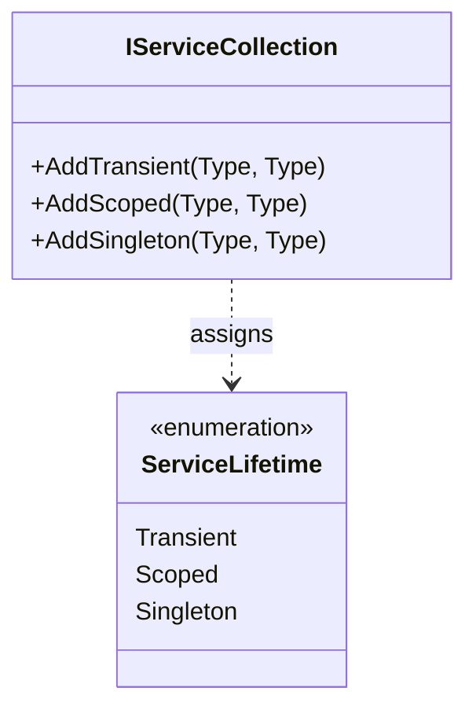
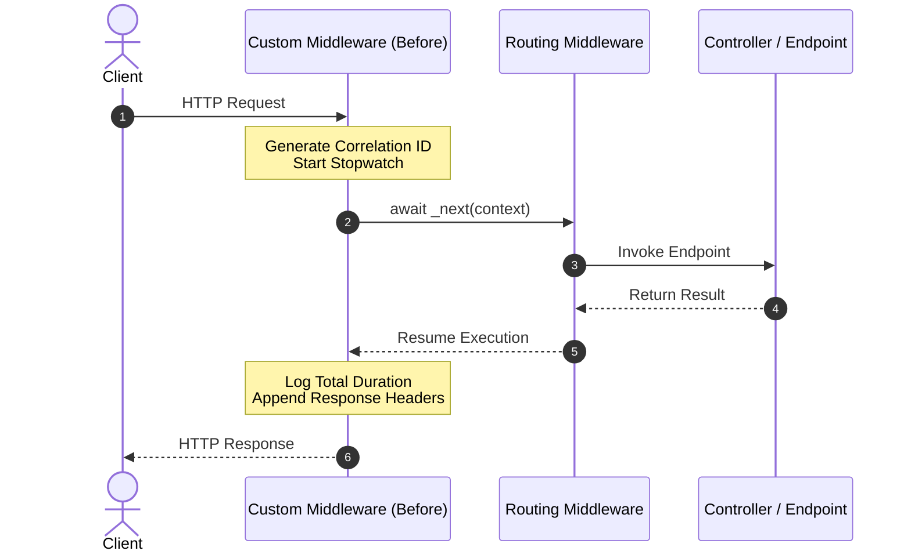
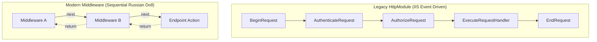
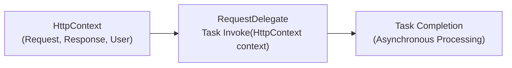
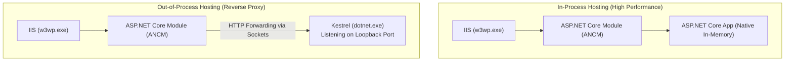
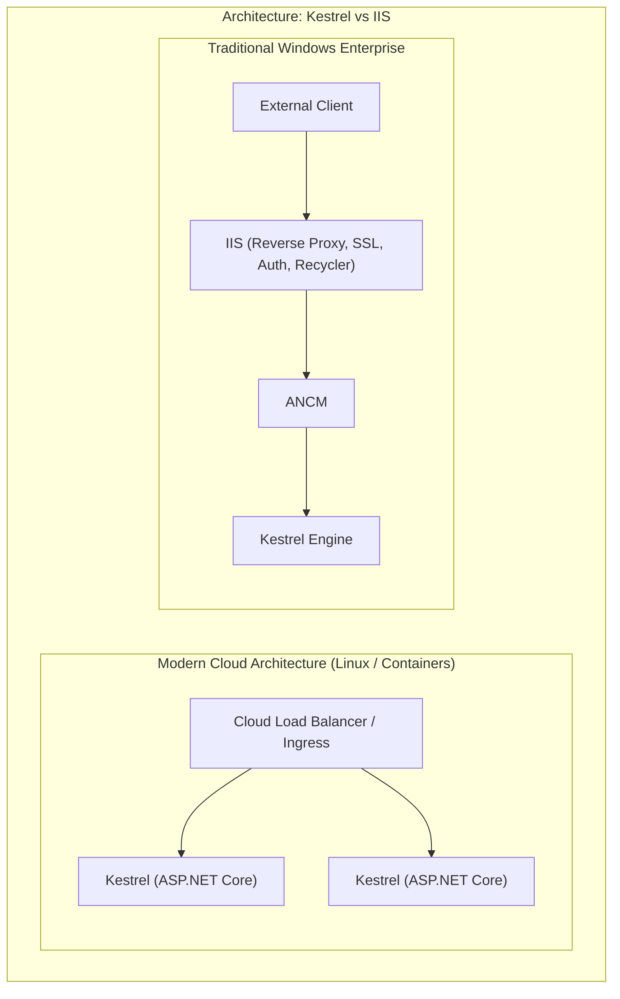

# Section 23: .NET Core - Service Lifetimes, Middleware & Hosting

> **Curriculum Navigation:**  
> ⏪ [Previous: Section 22 – .NET Core Dependency Injection](./22_dotnet_core_dependency_injection.md) | 🏠 [Master Index](./README.md) | ⏩ [Next: Section 24 – Routing, Configuration, CORS & Caching](./24_dotnet_core_routing_files_cors_and_more.md)

---

## Q217. What are the types of Service Lifetimes of an object/instance in ASP.NET Core?

### 1. Executive Summary & Core Concept
In ASP.NET Core, the **Service Lifetime** determines how long an instance created by the Dependency Injection (DI) container lives, when it is reused, and when it is disposed. The framework provides three distinct lifetimes:
1. **Transient**: Created each time they are requested from the container.
2. **Scoped**: Created once per client request (or per active `IServiceScope`).
3. **Singleton**: Created the first time they are requested (or during startup) and reused for every subsequent request across the entire application lifetime.

```mermaid
gantt
    title Service Instance Lifecycles Across Two HTTP Requests
    dateFormat X
    axisFormat %s

    section HTTP Request 1
    Request 1 Active       :active, req1, 0, 10
    Transient Instance A   :crit, tra1, 2, 4
    Transient Instance B   :crit, tra2, 6, 8
    Scoped Instance 1      :done, sc1, 1, 9

    section HTTP Request 2
    Request 2 Active       :active, req2, 12, 22
    Transient Instance C   :crit, tra3, 14, 16
    Scoped Instance 2      :done, sc2, 13, 21

    section Application Lifetime
    Singleton Instance     :milestone, sing, 0, 24
```



### 2. Deep-Dive Architecture & Runtime Internals
- **The Container Hierarchy**:
  - **Root Provider (`IServiceProvider`)**: Created when `builder.Build()` finishes. Singletons live here.
  - **Scoped Provider**: Created per HTTP request by the framework (`HttpContext.RequestServices`). Scoped instances are rooted here.
- **Resource Disposal**:
  - The container maintains an internal tracking list of all instances implementing `IDisposable` or `IAsyncDisposable`.
  - When an HTTP request ends, `HttpContext.RequestServices.Dispose()` is called, which automatically disposes all Scoped and Transient objects instantiated within that scope.
  - Singletons are disposed only when the application shuts down.

### 3. Production-Ready Code Implementation
```csharp
// Diagnostic Demonstration of DI Lifetimes
public interface IOperationTransient { Guid Id { get; } }
public interface IOperationScoped { Guid Id { get; } }
public interface IOperationSingleton { Guid Id { get; } }

public class Operation : IOperationTransient, IOperationScoped, IOperationSingleton
{
    public Guid Id { get; } = Guid.NewGuid();
}

// Controller demonstrating lifetime behavior
[ApiController]
[Route("api/v1/lifetimes")]
public class LifetimeDiagnosticsController : ControllerBase
{
    private readonly IOperationTransient _transient1;
    private readonly IOperationTransient _transient2;
    private readonly IOperationScoped _scoped1;
    private readonly IOperationScoped _scoped2;
    private readonly IOperationSingleton _singleton;

    public LifetimeDiagnosticsController(
        IOperationTransient transient1,
        IOperationTransient transient2,
        IOperationScoped scoped1,
        IOperationScoped scoped2,
        IOperationSingleton singleton)
    {
        _transient1 = transient1;
        _transient2 = transient2;
        _scoped1 = scoped1;
        _scoped2 = scoped2;
        _singleton = singleton;
    }

    [HttpGet]
    public IActionResult GetLifetimes()
    {
        return Ok(new
        {
            Transient1 = _transient1.Id,
            Transient2 = _transient2.Id,
            TransientsAreEqual = _transient1.Id == _transient2.Id, // False

            Scoped1 = _scoped1.Id,
            Scoped2 = _scoped2.Id,
            ScopedAreEqual = _scoped1.Id == _scoped2.Id,           // True (within same HTTP request)

            Singleton = _singleton.Id                             // Stays identical across all requests
        });
    }
}
```

### 4. Line-by-Line Code Walkthrough
- `_transient1.Id == _transient2.Id` evaluates to `false`: Each injection of `IOperationTransient` receives a newly created object with a unique GUID.
- `_scoped1.Id == _scoped2.Id` evaluates to `true`: Both injections of `IOperationScoped` within the same HTTP request share the identical instance.
- `_singleton.Id`: Retains the exact same GUID across millions of HTTP requests from different clients until the process restarts.

### 5. Real-World Enterprise Use Case & Application
- **Transient**: Stateless lightweight calculators, algorithmic rule validators.
- **Scoped**: Entity Framework `DbContext`, Unit of Work, Current User Context (`IUserContext`), Tenant Context.
- **Singleton**: In-Memory Caches (`IMemoryCache`), HttpClient instances, RabbitMQ persistent connection channels, telemetry/metrics aggregators.

### 6. Common Pitfalls, Memory Traps & Anti-Patterns
- **Memory Leak via Transient `IDisposable`**: If a Transient service implements `IDisposable` and is resolved directly from the Root Service Provider (or inside a Singleton), the root container holds a reference to it indefinitely for disposal at app shutdown, causing a memory leak.
- **Multi-threaded Race Conditions in Singletons**: Writing mutable state inside a Singleton service without concurrency guards (`ConcurrentDictionary`, `ReaderWriterLockSlim`), causing data corruption under concurrent load.

### 7. Senior / Architect Interview Follow-ups
- **Interviewer**: *What is a "Captive Dependency" and why is it dangerous?*
- **Candidate Answer**: A Captive Dependency occurs when a service with a shorter lifetime is injected into a service with a longer lifetime (e.g., injecting a `Scoped` DbContext into a `Singleton` cache service). The singleton "captures" the scoped dependency, keeping it alive for the lifetime of the application. This causes two problems: (1) The DbContext is never disposed, leading to memory leaks, and (2) Multiple concurrent HTTP request threads share the same DbContext instance, causing `InvalidOperationException: A second operation was started on this context instance before a previous operation completed`.

---

## Q218. What is AddSingleton, AddScoped and AddTransient method?

### 1. Executive Summary & Core Concept
`AddTransient`, `AddScoped`, and `AddSingleton` are fluent extension methods on `IServiceCollection` used to register services into the ASP.NET Core Inversion of Control (IoC) container with their respective service lifetimes.



### 2. Deep-Dive Architecture & Runtime Internals
Each method registers a `ServiceDescriptor` under the hood:
- `services.AddTransient<IOrderValidator, OrderValidator>()`:
  ```csharp
  services.Add(new ServiceDescriptor(typeof(IOrderValidator), typeof(OrderValidator), ServiceLifetime.Transient));
  ```
- `services.AddScoped<IOrderRepository, SqlOrderRepository>()`:
  ```csharp
  services.Add(new ServiceDescriptor(typeof(IOrderRepository), typeof(SqlOrderRepository), ServiceLifetime.Scoped));
  ```
- `services.AddSingleton<ICacheService, MemoryCacheService>()`:
  ```csharp
  services.Add(new ServiceDescriptor(typeof(ICacheService), typeof(MemoryCacheService), ServiceLifetime.Singleton));
  ```

Overloads supported:
1. **Type Mapping**: `AddScoped<TService, TImplementation>()` (container instantiates via reflection/compiled expressions).
2. **Factory Method**: `AddScoped<TService>(sp => new Implementation(sp.GetRequiredService<IOther>()))` (custom instantiation logic).
3. **Instance Mapping** (Singleton only): `AddSingleton<TService>(new ConcreteInstance())`.

### 3. Production-Ready Code Implementation
```csharp
// Program.cs - Service Lifetimes Setup
var builder = WebApplication.CreateBuilder(args);

// 1. Transient: Lightweight, stateless, short-lived
builder.Services.AddTransient<IEmailFormattingService, EmailFormattingService>();

// 2. Scoped: Created once per HTTP request; shares state within request boundary
builder.Services.AddScoped<IOrderDbContext, OrderDbContext>();
builder.Services.AddScoped<IUnitOfWork, UnitOfWork>();

// 3. Singleton: Created once on first resolution; shared application-wide
builder.Services.AddSingleton<IMetricsCollector, PrometheusMetricsCollector>();

// Factory Registration for Complex Setup
builder.Services.AddSingleton<IRabbitMqConnection>(sp =>
{
    var config = sp.GetRequiredService<IConfiguration>();
    var connString = config.GetConnectionString("RabbitMQ") 
        ?? throw new InvalidOperationException("RabbitMQ connection string missing");
    return new RabbitMqConnection(connString);
});

var app = builder.Build();
```

### 4. Line-by-Line Code Walkthrough
- `builder.Services.AddTransient<IEmailFormattingService, ...>`: Registers a fresh instance for every consuming class.
- `builder.Services.AddScoped<IOrderDbContext, ...>`: Ensures all repositories participating in an HTTP request share the same EF Core context and transactional state.
- `builder.Services.AddSingleton<IRabbitMqConnection>(sp => ...)`: Uses a factory delegate to resolve configuration and build an expensive connection once, sharing the socket connection pool across the application.

### 5. Real-World Enterprise Use Case & Application
Enterprise domain architectures use `AddScoped` for the **Unit of Work** pattern: a Web API controller, domain event handlers, and data repositories all receive the identical `IUnitOfWork` instance during a single HTTP request, ensuring `SaveChangesAsync()` commits all entity changes inside a single database transaction.

### 6. Common Pitfalls, Memory Traps & Anti-Patterns
- **Using `AddSingleton` with Concrete Instances Created Upfront**:
  `services.AddSingleton(new HeavyService())`: This instantiates the object during startup rather than deferring to first use, slowing down application cold starts and making it impossible to inject other dependencies into `HeavyService`.
- **Mixing Multiple Lifetime Registrations**: Registering the same interface multiple times with different lifetimes; the last registered descriptor wins for single-instance resolution, but all will be injected if requesting `IEnumerable<T>`.

### 7. Senior / Architect Interview Follow-ups
- **Interviewer**: *What is the difference between `AddSingleton<IService>(new Service())` and `AddSingleton<IService, Service>()` regarding `IDisposable`?*
- **Candidate Answer**: If you pass a pre-instantiated instance (`new Service()`) to `AddSingleton`, the container does **not** take ownership of its disposal; the application is responsible for disposing it. If you register the type (`AddSingleton<IService, Service>()`) or use a factory delegate, the container owns the instance and will automatically invoke `Dispose()` on it when the application shuts down.

---

## Q219. What is Middleware in ASP.NET Core? What is custom middleware?

### 1. Executive Summary & Core Concept
**Middleware** is software assembled into the ASP.NET Core application pipeline to handle incoming HTTP requests and outgoing HTTP responses. Each component can:
1. Pass the request to the next component in the pipeline via the `RequestDelegate`.
2. Perform work both **before** and **after** the next component in the pipeline.
3. **Short-circuit** the pipeline (e.g., returning an error response or serving a cached file without invoking downstream components).

**Custom Middleware** is a developer-created component that encapsulates cross-cutting concerns like correlation ID tracking, rate limiting, request timing, security headers, or centralized error handling.



### 2. Deep-Dive Architecture & Runtime Internals
- **Conventions for Class-Based Middleware**:
  1. A public constructor accepting a `RequestDelegate next`.
  2. A public method named `Invoke` or `InvokeAsync` that takes `HttpContext` as its first parameter and returns `Task`.
  3. Additional scoped dependencies (like `DbContext`) **must** be injected into `InvokeAsync(...)`, NOT into the middleware constructor. Because middleware classes are constructed once during application startup (acting as singletons), injecting a scoped dependency into the constructor causes a **Captive Dependency**.
- **Factory-Based Middleware (`IMiddleware`)**:
  - Implements the `IMiddleware` interface.
  - Activated per-request via `UseMiddleware<T>()` and resolved from DI, allowing scoped dependencies to be injected directly into the constructor.

### 3. Production-Ready Code Implementation
```csharp
// Enterprise Custom Correlation ID Middleware
using Microsoft.AspNetCore.Http;
using Microsoft.Extensions.Logging;

public class CorrelationIdMiddleware
{
    private const string CorrelationHeaderName = "X-Correlation-ID";
    private readonly RequestDelegate _next;
    private readonly ILogger<CorrelationIdMiddleware> _logger;

    public CorrelationIdMiddleware(RequestDelegate next, ILogger<CorrelationIdMiddleware> logger)
    {
        _next = next;
        _logger = logger;
    }

    public async Task InvokeAsync(HttpContext context)
    {
        // 1. Extract existing correlation ID or generate a new one
        var correlationId = context.Request.Headers[CorrelationHeaderName].FirstOrDefault();
        if (string.IsNullOrWhiteSpace(correlationId))
        {
            correlationId = Guid.NewGuid().ToString("N");
        }

        // 2. Expose in response headers so clients can trace requests
        context.Response.OnStarting(() =>
        {
            context.Response.Headers.TryAdd(CorrelationHeaderName, correlationId);
            return Task.CompletedTask;
        });

        // 3. Establish a structured logging scope for downstream logs
        using (_logger.BeginScope(new Dictionary<string, object>
        {
            ["CorrelationId"] = correlationId
        }))
        {
            _logger.LogInformation("Processing HTTP {Method} {Path}", 
                context.Request.Method, context.Request.Path);

            // 4. Pass execution to the next middleware in the chain
            await _next(context);
        }
    }
}

// Fluent Extension Method for Clean Program.cs Registration
public static class CorrelationIdMiddlewareExtensions
{
    public static IApplicationBuilder UseCorrelationId(this IApplicationBuilder app)
    {
        return app.UseMiddleware<CorrelationIdMiddleware>();
    }
}
```

### 4. Line-by-Line Code Walkthrough
- `public CorrelationIdMiddleware(RequestDelegate next, ...)`: Middleware constructor receiving the pointer to the next delegate in the pipeline.
- `context.Response.OnStarting(...)`: Safely registers a callback to append the correlation header right before response headers are written to the network socket.
- `using (_logger.BeginScope(...))`: Injects the correlation ID into the ambient logging scope; every subsequent log message emitted by controllers, repositories, or services automatically includes this ID.
- `await _next(context)`: Asynchronously invokes the next middleware component in the pipeline.

### 5. Real-World Enterprise Use Case & Application
In distributed microservice architectures, the `CorrelationIdMiddleware` ensures that every HTTP call passing through the API Gateway propagates the same correlation ID to downstream gRPC and message queue (Kafka/RabbitMQ) calls. This enables end-to-end distributed tracing across Grafana Tempo, Datadog, or Seq.

### 6. Common Pitfalls, Memory Traps & Anti-Patterns
- **Modifying Response Headers After `_next(context)` Has Written to the Body**: Attempting to set `context.Response.Headers.Add(...)` after calling `await _next(context)` throws `InvalidOperationException: Headers are read-only, response has already started`. Always use `context.Response.OnStarting()`.
- **Injecting Scoped Services into Middleware Constructors**: Injects a scoped service as a captive dependency inside a singleton middleware. Always pass scoped services as parameters to `InvokeAsync(HttpContext context, IScopedService scopedService)`.

### 7. Senior / Architect Interview Follow-ups
- **Interviewer**: *What is the difference between conventional middleware and `IMiddleware` (factory-based middleware)?*
- **Candidate Answer**: Conventional middleware is registered via reflection, constructed once at startup as a singleton, and does not require registration in `IServiceCollection`. `IMiddleware` is strongly typed, must be registered in the DI container (`services.AddTransient<MyMiddleware>()`), and is activated per-request via `IMiddlewareFactory`. This allows `IMiddleware` to safely receive scoped dependencies in its constructor, but introduces a minor allocation per request.

---

## Q220. How is ASP.NET Core Middleware different from HttpModule?

### 1. Executive Summary & Core Concept
**HttpModules** and **ASP.NET Core Middleware** both provide mechanisms to intercept and process HTTP requests, but they belong to fundamentally different architectural eras:
- **`HttpModule`**: Legacy .NET Framework component tightly coupled to the Windows **IIS lifecycle** (`w3wp.exe`) and `System.Web.dll`.
- **ASP.NET Core Middleware**: Modern, lightweight, cross-platform, asynchronous pipeline component with no dependency on IIS or Windows.

| Feature | Legacy `HttpModule` (.NET Framework) | Modern ASP.NET Core Middleware |
| :--- | :--- | :--- |
| **Hosting Coupling** | Tightly bound to IIS and `System.Web` | Host-agnostic (runs on Kestrel, Linux, Docker, IIS) |
| **Execution Model** | Event-driven (e.g., `BeginRequest`, `AuthenticateRequest`) | Linear, sequential bidirectional pipeline (`next()`) |
| **Execution Order** | Non-deterministic (dictated by IIS event lifecycle) | Strictly deterministic (order defined in `Program.cs`) |
| **Performance** | Heavy; carries ~30KB monolithic `HttpContext` | Ultra-fast; zero-allocation pipelines |
| **Configuration** | Configured in `web.config` XML | Configured fluently in C# (`Program.cs`) |



### 2. Deep-Dive Architecture & Runtime Internals
- In `HttpModule`, developers hooked into predefined lifecycle events on `HttpApplication` (`context.BeginRequest += OnBeginRequest`). You could not change the order in which IIS raised these events.
- In ASP.NET Core Middleware, execution is a pure recursive function composition (`Func<RequestDelegate, RequestDelegate>`). There are no rigid lifecycle events; developers have 100% control over the exact execution sequence.

### 3. Production-Ready Code Implementation
```csharp
// Legacy .NET Framework HttpModule (Reference)
#if NET48
public class LegacyLoggingModule : IHttpModule
{
    public void Init(HttpApplication context)
    {
        // Bound to rigid IIS event lifecycle
        context.BeginRequest += (sender, e) => { /* log start */ };
        context.EndRequest += (sender, e) => { /* log end */ };
    }
    public void Dispose() { }
}
#endif

// Modern ASP.NET Core Equivalent Middleware
public class ModernLoggingMiddleware
{
    private readonly RequestDelegate _next;

    public ModernLoggingMiddleware(RequestDelegate next) => _next = next;

    public async Task InvokeAsync(HttpContext context)
    {
        // 1. Equivalent to BeginRequest
        var start = DateTime.UtcNow;

        await _next(context); // Yield to pipeline

        // 2. Equivalent to EndRequest (Executes symmetrically on response path)
        var duration = DateTime.UtcNow - start;
    }
}
```

### 4. Line-by-Line Code Walkthrough
- `Init(HttpApplication context)`: Legacy event wire-up relying on COM-interop and IIS native event queues.
- `await _next(context)`: Modern non-blocking asynchronous dispatch passing execution directly to downstream memory delegates.

### 5. Real-World Enterprise Use Case & Application
When migrating legacy enterprise portals from .NET Framework to .NET 8, custom security modules (`IHttpModule`) that validated custom corporate headers are rewritten as custom ASP.NET Core Middleware, freeing the application from Windows Server IIS licensing and allowing deployment to Linux containers on Kubernetes.

### 6. Common Pitfalls, Memory Traps & Anti-Patterns
- **Assuming Event Ordering in Middleware**: Expecting middleware to automatically run in a specific order without manually arranging the `app.Use...` calls correctly in `Program.cs`.

### 7. Senior / Architect Interview Follow-ups
- **Interviewer**: *What happened to `HttpHandler` (`IHttpHandler`) in ASP.NET Core?*
- **Candidate Answer**: In legacy ASP.NET, `HttpModule` was used for cross-cutting request inspection, while `HttpHandler` was the terminal processor that produced the response (e.g., `.ashx`, `.aspx`, or Web API controllers). In ASP.NET Core, the terminal role of `HttpHandler` is handled by **Endpoints** (Routing endpoints, Controllers, Minimal APIs, or terminal middleware via `app.Run()`).

---

## Q221. What is a Request Delegate?

### 1. Executive Summary & Core Concept
In ASP.NET Core, a **`RequestDelegate`** is a function delegate that processes an HTTP request. It is formally defined in the `Microsoft.AspNetCore.Http` namespace as:
```csharp
public delegate Task RequestDelegate(HttpContext context);
```
Every middleware component in ASP.NET Core is built around `RequestDelegate`. The entire ASP.NET Core HTTP pipeline is essentially a chain of composed `RequestDelegate` functions linked together.



### 2. Deep-Dive Architecture & Runtime Internals
- **Functional Composition**: Under the hood, `IApplicationBuilder` maintains a list of middleware factory delegates:
  ```csharp
  IList<Func<RequestDelegate, RequestDelegate>> _components;
  ```
- When `app.Build()` (or `builder.Build()`) is called, `IApplicationBuilder` iterates through this list in reverse order, passing each middleware delegate a pointer to the next one, compiling them into a single, high-performance, unified root `RequestDelegate`.
- When Kestrel receives an incoming HTTP socket connection, it creates the `HttpContext` and invokes this single compiled root `RequestDelegate`.

### 3. Production-Ready Code Implementation
```csharp
// Low-Level RequestDelegate Demonstration
using Microsoft.AspNetCore.Http;

var builder = WebApplication.CreateBuilder(args);
var app = builder.Build();

// 1. Defining an inline RequestDelegate
RequestDelegate customDelegate = async (HttpContext context) =>
{
    context.Response.ContentType = "text/plain";
    await context.Response.WriteAsync("Hello from raw RequestDelegate!");
};

// 2. Mapping a RequestDelegate directly to an endpoint route
app.MapGet("/raw-delegate", customDelegate);

// 3. Composing RequestDelegates manually
app.Use(next =>
{
    // Return a RequestDelegate
    return async (HttpContext context) =>
    {
        Console.WriteLine($"[Delegate Pipeline Start] {context.Request.Path}");
        await next(context); // Invoke next RequestDelegate
        Console.WriteLine($"[Delegate Pipeline End] {context.Response.StatusCode}");
    };
});

app.MapGet("/ping", () => "pong");

app.Run();
```

### 4. Line-by-Line Code Walkthrough
- `RequestDelegate customDelegate = async (HttpContext context) => ...`: Direct implementation of the delegate signature taking `HttpContext` and returning `Task`.
- `app.Use(next => ...)`: Demonstrates how `IApplicationBuilder.Use` accepts a `Func<RequestDelegate, RequestDelegate>`, receiving the downstream delegate (`next`) and returning a new composite delegate.

### 5. Real-World Enterprise Use Case & Application
High-performance proxy gateways (like Microsoft's **YARP** - Yet Another Reverse Proxy) utilize raw `RequestDelegate` pipelines rather than heavy MVC controllers to route millions of incoming requests to backend destination clusters with near-zero memory allocations.

### 6. Common Pitfalls, Memory Traps & Anti-Patterns
- **Blocking inside a `RequestDelegate`**: Calling `.Result` or `.Wait()` inside a delegate:
  `var data = GetDataAsync().Result;` // DEADLOCK & THREAD POOL STARVATION HAZARD. Always use `await`.

### 7. Senior / Architect Interview Follow-ups
- **Interviewer**: *How does ASP.NET Core achieve high performance by compiling the pipeline into a single `RequestDelegate`?*
- **Candidate Answer**: During startup, `ApplicationBuilder.Build()` reverses the middleware chain and nests each delegate inside the preceding one, resulting in a single compiled delegate reference. At runtime, dispatching an incoming request involves simple, non-virtual delegate calls in memory with zero dictionary lookups or dynamic reflection overhead per request.

---

## Q222. What is Run(), Use() and Map() method?

### 1. Executive Summary & Core Concept
`Run()`, `Use()`, and `Map()` are the three core extension methods on `IApplicationBuilder` used to configure the HTTP request pipeline:
1. **`Use()`**: Adds a middleware component to the pipeline that can either pass the request to the next component or short-circuit.
2. **`Run()`**: Adds a **terminal** middleware component to the pipeline. It does not receive a `next` delegate and always terminates/short-circuits the pipeline.
3. **`Map()` / `MapWhen()`**: **Branches** the request pipeline based on request path matching (or arbitrary boolean conditions).

```mermaid
flowchart TD
    Req["Incoming Request"] --> Use1["app.Use() (Middleware 1)"]
    Use1 --> BranchCheck{"Path matches /branch?"}
    BranchCheck -->|Yes: app.Map()| MapBranch["Branched Pipeline\n(Terminal app.Run)"]
    BranchCheck -->|No| Use2["app.Use() (Middleware 2)"]
    Use2 --> RunTerminal["app.Run() (Terminal Middleware)"]
```

### 2. Deep-Dive Architecture & Runtime Internals
- **`app.Use(Func<HttpContext, RequestDelegate, Task>)`**: The standard way to register inline middleware. If `next()` is called, processing continues downstream; if omitted, the pipeline short-circuits.
- **`app.Run(RequestDelegate)`**: Convenience shorthand for a terminal delegate. Anything placed in `Program.cs` *after* `app.Run()` will never execute for requests reaching that point.
- **`app.Map(PathString, Action<IApplicationBuilder>)`**: When the request path starts with the given prefix, the framework splits execution into a completely separate, isolated `IApplicationBuilder` branch. Requests that enter a `Map` branch do not re-join the main pipeline unless explicitly coded.
- **`app.MapWhen(Predicate, Action<IApplicationBuilder>)`**: Branches based on an arbitrary boolean condition evaluating `HttpContext` (e.g., checking headers, query params, or HTTP methods).

### 3. Production-Ready Code Implementation
```csharp
var builder = WebApplication.CreateBuilder(args);
var app = builder.Build();

// 1. app.Use(): Can inspect, modify, pass-through, or short-circuit
app.Use(async (context, next) =>
{
    context.Response.Headers.Append("X-Server-Engine", "Kestrel-Core");
    await next(context); // Passes control downstream
});

// 2. app.Map(): Branching based on URL path prefix
app.Map("/webhooks", webhookApp =>
{
    // Dedicated isolated branch for webhooks (e.g., bypassing standard authentication)
    webhookApp.Use(async (context, next) =>
    {
        Console.WriteLine("Webhook branch executed");
        await next(context);
    });

    webhookApp.Run(async context =>
    {
        await context.Response.WriteAsync("Webhook payload accepted");
    });
});

// 3. app.MapWhen(): Branching based on arbitrary conditions
app.MapWhen(context => context.Request.Headers.ContainsKey("X-Debug-Mode"), debugApp =>
{
    debugApp.Run(async context =>
    {
        await context.Response.WriteAsync("Diagnostics Branch Active");
    });
});

// 4. app.Run(): Terminal component for the main pipeline
app.Run(async context =>
{
    await context.Response.WriteAsync("Fallback default response from terminal app.Run()");
});
```

### 4. Line-by-Line Code Walkthrough
- `app.Use(async (context, next) => ...)`: Executes on every request, adds a custom header, and calls `await next(context)` to continue processing.
- `app.Map("/webhooks", webhookApp => ...)`: Diverts all requests starting with `/webhooks` into a dedicated pipeline branch.
- `app.MapWhen(context => context.Request.Headers.ContainsKey(...))`: Evaluates whether the request contains a specific debug header, routing it to a separate diagnostics branch.
- `app.Run(async context => ...)`: The terminal handler; never calls a `next` delegate.

### 5. Real-World Enterprise Use Case & Application
Enterprise systems host administrative management endpoints or Prometheus metrics endpoints (`/metrics`) on different internal network ports or path branches using `app.Map("/metrics", ...)` to apply different authentication policies than public customer-facing APIs.

### 6. Common Pitfalls, Memory Traps & Anti-Patterns
- **Adding Middleware After `app.Run()`**: Placing middleware calls after `app.Run()` in `Program.cs`. Any code placed after a terminal `Run()` handler will never be reached.
- **Forgetting `await next(context)` in `app.Use()`**: Accidental short-circuiting where the developer forgets to call `next()`, causing downstream controllers and endpoints to never execute.

### 7. Senior / Architect Interview Follow-ups
- **Interviewer**: *What happens to the URL path inside an `app.Map()` branch?*
- **Candidate Answer**: When `app.Map("/api", branchApp)` matches, the matched path (`/api`) is stripped from `HttpRequest.Path` and moved to `HttpRequest.PathBase`. Inside the branch, downstream middleware sees `Path` relative to the branch prefix. When the request exits the branch, `Path` and `PathBase` are restored.

---

## Q223. What are the types of Hosting in ASP.NET Core? What is In-process and Out-of-process?

### 1. Executive Summary & Core Concept
When deploying ASP.NET Core applications to **Internet Information Services (IIS)** on Windows Server, there are two primary hosting models:
1. **In-Process Hosting**: The ASP.NET Core application executes inside the same OS process as the IIS worker process (`w3wp.exe`).
2. **Out-of-Process Hosting**: The ASP.NET Core application runs in an independent standalone process executing Kestrel (`dotnet.exe`), while IIS acts purely as a reverse proxy forwarding requests to Kestrel via the **ASP.NET Core Module (ANCM)**.



### 2. Deep-Dive Architecture & Runtime Internals
- **In-Process Hosting (Default since .NET Core 2.2)**:
  - ANCM loads the CoreCLR runtime directly into `w3wp.exe`.
  - Bypasses network socket loopbacks; HTTP requests travel from native IIS C++ pipelines directly into managed ASP.NET Core memory buffers.
  - Significantly higher request throughput and lower latency than out-of-process hosting.
  - **Constraint**: Only one ASP.NET Core application can run per IIS Application Pool.
- **Out-of-Process Hosting**:
  - `w3wp.exe` handles the initial request, then forwards it over an internal loopback TCP port (e.g., `http://127.0.0.1:54321`) to `dotnet.exe` running Kestrel.
  - Incurs network stack serialization overhead and process boundary context switching.
  - **Advantage**: Process isolation; if the application crashes, the IIS worker process remains healthy.

### 3. Production-Ready Code Implementation
```xml
<!-- Configuring Hosting Model in .csproj -->
<Project Sdk="Microsoft.NET.Sdk.Web">

  <PropertyGroup>
    <TargetFramework>net8.0</TargetFramework>
    <Nullable>enable</Nullable>
    
    <!-- Option A: In-Process (Recommended for IIS deployments) -->
    <AspNetCoreHostingModel>InProcess</AspNetCoreHostingModel>

    <!-- Option B: Out-Of-Process (Uncomment if running separate dotnet.exe process) -->
    <!-- <AspNetCoreHostingModel>OutOfProcess</AspNetCoreHostingModel> -->
  </PropertyGroup>

</Project>
```

```xml
<!-- Generated web.config output upon publish -->
<?xml version="1.0" encoding="utf-8"?>
<configuration>
  <location path="." inheritInChildApplications="false">
    <system.webServer>
      <handlers>
        <add name="aspNetCore" path="*" verb="*" modules="AspNetCoreModuleV2" resourceType="Unspecified" />
      </handlers>
      <aspNetCore processPath="dotnet" 
                  arguments=".\EnterpriseApi.dll" 
                  stdoutLogEnabled="false" 
                  stdoutLogFile=".\logs\stdout" 
                  hostingModel="inprocess" />
    </system.webServer>
  </location>
</configuration>
```

### 4. Line-by-Line Code Walkthrough
- `<AspNetCoreHostingModel>InProcess</AspNetCoreHostingModel>`: Instructs the .NET publishing SDK to generate a `web.config` with `hostingModel="inprocess"`.
- `modules="AspNetCoreModuleV2"`: Configures the native IIS module that bootstraps CoreCLR directly into `w3wp.exe`.

### 5. Real-World Enterprise Use Case & Application
Enterprise organizations maintaining Windows Server IIS infrastructure deploy APIs using **In-Process hosting** to maximize performance while retaining IIS enterprise features (such as Windows Authentication, SSL Certificate management via Windows Certificate Store, and automated Application Pool recycling).

### 6. Common Pitfalls, Memory Traps & Anti-Patterns
- **Multiple Apps in One AppPool with In-Process**: Attempting to run two In-Process ASP.NET Core apps inside the same IIS Application Pool fails with `HTTP 500.35 - Multiple In-Process Applications not allowed`. Every In-Process app requires its own dedicated Application Pool.
- **Process Architecture Mismatch**: Configuring an AppPool as 32-bit (`Enable 32-Bit Applications = True`) while hosting a 64-bit .NET runtime, causing `HTTP 500.31 - Failed to load ASP.NET Core runtime`.

### 7. Senior / Architect Interview Follow-ups
- **Interviewer**: *Why is In-Process hosting faster than Out-of-Process hosting?*
- **Candidate Answer**: In Out-of-Process hosting, requests undergo double-handling: IIS accepts the request, proxies it over loopback TCP sockets to Kestrel, Kestrel parses the HTTP bytes, processes the response, and sends it back over TCP to IIS, incurring serialization and context-switching overhead. In-Process hosting eliminates the network hop entirely: the native C++ IIS module invokes CoreCLR managed code directly in process memory.

---

## Q224. What is Kestrel? What is the difference between Kestrel and IIS?

### 1. Executive Summary & Core Concept
**Kestrel** is the cross-platform, open-source, event-driven, high-performance web server built into ASP.NET Core. Designed for extreme throughput, it is included by default in all ASP.NET Core templates. 

**IIS (Internet Information Services)** is a full-featured, Windows-only enterprise web management platform that provides advanced server capabilities (virtual directories, process recycling, Windows Authentication, centralized GUI management) that go beyond raw HTTP socket handling.



### 2. Deep-Dive Architecture & Runtime Internals
- **Kestrel's Performance Engine**:
  - Built on top of `System.IO.Pipelines`, asynchronous managed sockets, and memory pools (`ArrayPool<byte>`).
  - Regularly ranks near the top of the **TechEmpower Web Framework Benchmarks**, handling millions of requests per second.
  - Native support for **HTTP/1.1, HTTP/2, and HTTP/3 (QUIC)**.
- **Kestrel vs. IIS Feature Comparison**:

| Feature | Kestrel | IIS (Internet Information Services) |
| :--- | :--- | :--- |
| **OS Compatibility** | Cross-platform (Linux, Windows, macOS) | Windows Server Only |
| **Primary Focus** | Raw HTTP throughput, low memory footprint | Web server management, hosting administration |
| **Process Model** | Standalone process per application | Multi-tenant worker processes (`w3wp.exe`) with AppPools |
| **Management GUI** | None (Code & JSON configuration) | IIS Manager GUI, PowerShell (`WebAdministration`) |
| **Port Sharing** | No native port sharing on single IP without reverse proxy | Advanced port sharing via `HTTP.sys` |
| **Dynamic Site Activation** | App must be running to accept traffic | Starts processes on-demand upon first incoming request |

### 3. Production-Ready Code Implementation
```csharp
// Program.cs - Enterprise Kestrel Hardening
var builder = WebApplication.CreateBuilder(args);

// Direct Kestrel Configuration
builder.WebHost.ConfigureKestrel(serverOptions =>
{
    // 1. Connection & Concurrency Limits
    serverOptions.Limits.MaxConcurrentConnections = 10_000;
    serverOptions.Limits.MaxConcurrentUpgradedConnections = 2_000; // WebSockets

    // 2. Request Body Sizing & Timeout Protections (Slowloris Mitigation)
    serverOptions.Limits.MaxRequestBodySize = 20 * 1024 * 1024; // 20 MB
    serverOptions.Limits.MinRequestBodyDataRate = new Microsoft.AspNetCore.Server.Kestrel.Core.MinDataRate(
        bytesPerSecond: 240, 
        gracePeriod: TimeSpan.FromSeconds(5));

    // 3. Protocol Configuration: Enable HTTP/1, HTTP/2, and HTTP/3 (QUIC)
    serverOptions.ListenAnyIP(5001, listenOptions =>
    {
        listenOptions.Protocols = Microsoft.AspNetCore.Server.Kestrel.Core.HttpProtocols.Http1AndHttp2AndHttp3;
        listenOptions.UseHttps();
    });
});

var app = builder.Build();
app.MapGet("/", () => "Protected High-Throughput Kestrel Server");
app.Run();
```

### 4. Line-by-Line Code Walkthrough
- `serverOptions.Limits.MaxConcurrentConnections = 10_000`: Protects against connection exhaustion denial-of-service attacks.
- `serverOptions.Limits.MinRequestBodyDataRate`: Enforces a minimum upload speed to defend against **Slowloris DoS attacks** (where an attacker opens connections and sends bytes extremely slowly to hold threads open).
- `listenOptions.Protocols = HttpProtocols.Http1AndHttp2AndHttp3`: Configures modern multi-protocol negotiation, including UDP-based HTTP/3.

### 5. Real-World Enterprise Use Case & Application
Modern cloud-native deployments run Kestrel directly as an edge server inside Linux Docker containers behind an ingress controller (NGINX, Envoy, Traefik) or cloud load balancer (AWS ALB, Azure Application Gateway). This eliminates Windows Server license costs while providing sub-millisecond API response times.

### 6. Common Pitfalls, Memory Traps & Anti-Patterns
- **Exposing Unhardened Kestrel Directly to the Public Internet**: Running default Kestrel without configuring connection limits, request size limits, or rate limiting, leaving the server vulnerable to denial-of-service attacks.
- **Forgetting Forwarded Headers Behind Reverse Proxies**: When Kestrel runs behind IIS, NGINX, or Cloudflare, `HttpContext.Connection.RemoteIpAddress` resolves to the proxy's IP (`127.0.0.1`) instead of the real client IP unless `app.UseForwardedHeaders()` is configured.

### 7. Senior / Architect Interview Follow-ups
- **Interviewer**: *Can Kestrel be used as a public-facing edge server without a reverse proxy like IIS or NGINX?*
- **Candidate Answer**: Yes. In early versions of .NET Core, Microsoft advised against exposing Kestrel directly to the internet. However, since ASP.NET Core 2.1+, Kestrel has been hardened with configurable request rate limits, connection caps, Slowloris defenses, and TLS termination. It is fully supported as an edge server, though reverse proxies (like NGINX, Cloudflare, or AWS ALB) are still commonly used for centralized SSL offloading, Web Application Firewall (WAF) filtering, and static file caching.

---

## 🏛️ Architectural Appendix: Resilient Cloud Pipelines via Polly v8

### 1. Modern Resilience Pipelines in .NET 8 (`Microsoft.Extensions.Http.Resilience`)
In distributed microservices, network partitions, transient throttling, and downstream service restarts are unavoidable. In .NET 8, Microsoft integrated **Polly v8** directly into the BCL via `Microsoft.Extensions.Resilience`:

```csharp
// Program.cs - Enterprise Resilient HTTP Client Pipeline
var builder = WebApplication.CreateBuilder(args);

// Configures a standard resilience pipeline (Rate Limiter -> Total Timeout -> Retry -> Circuit Breaker -> Attempt Timeout)
builder.Services.AddHttpClient<IPaymentService, PaymentService>(client =>
{
    client.BaseAddress = new Uri("https://api.payments.enterprise.com");
})
.AddStandardResilienceHandler(options =>
{
    // 1. Retry Strategy: Jittered exponential backoff
    options.Retry.MaxRetryAttempts = 3;
    options.Retry.BackoffType = Polly.DelayBackoffType.Exponential;
    options.Retry.UseJitter = true; // Prevents thundering herd on downstream API

    // 2. Circuit Breaker Strategy: Trips open if 50% of requests fail within 10s
    options.CircuitBreaker.FailureRatio = 0.5;
    options.CircuitBreaker.SamplingDuration = TimeSpan.FromSeconds(10);
    options.CircuitBreaker.MinimumThroughput = 8;
    options.CircuitBreaker.BreakDuration = TimeSpan.FromSeconds(30);

    // 3. Attempt Timeout
    options.AttemptTimeout.Timeout = TimeSpan.FromSeconds(2);
});
```

```mermaid
graph LR
    Req["Outgoing HTTP Request"] --> RateLimit["1. Rate Limiter (Token Bucket)"]
    RateLimit --> TotalTimeout["2. Total Pipeline Timeout"]
    TotalTimeout --> RetryLoop["3. Jittered Exponential Retry"]
    RetryLoop --> CircuitBreaker{"4. Circuit Breaker State"}
    CircuitBreaker -->|Closed (Normal)| Attempt["5. Request Attempt (2s Timeout)"]
    CircuitBreaker -->|Open (Faulted)| FastFail["Fast-Fail: Reject immediately (Save resources)"]
    CircuitBreaker -->|Half-Open (Trial)| Trial["Send trial canary probe"]
    Attempt --> DownstreamService["External Downstream Microservice"]
```

---

### 2. Hedging Strategy for Tail-Latency Reduction
For ultra-low latency SLAs (e.g., high-frequency trading, P99 latency guarantees), **Hedging** sends duplicate requests in parallel if the initial request fails to respond within a given threshold (e.g., 200ms), accepting whichever response returns first:

```csharp
builder.Services.AddHttpClient("FastCatalogClient")
    .AddResilienceHandler("CustomHedgingPipeline", builder =>
    {
        builder.AddHedging(new Polly.Hedging.HttpHedgingStrategyOptions
        {
            MaxHedgedAttempts = 2,
            Delay = TimeSpan.FromMilliseconds(250) // If attempt 1 takes > 250ms, spawn attempt 2 in parallel!
        });
    });
```

