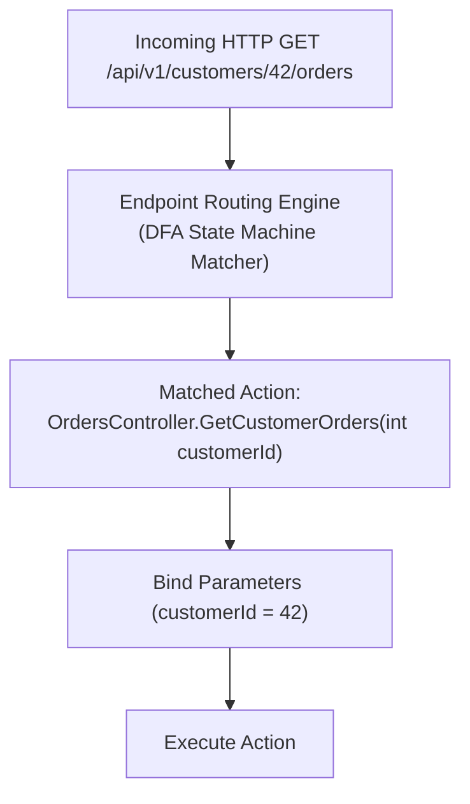
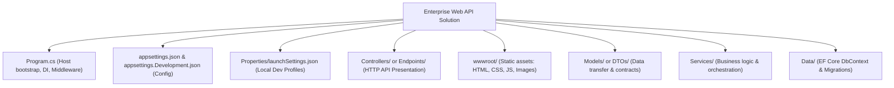
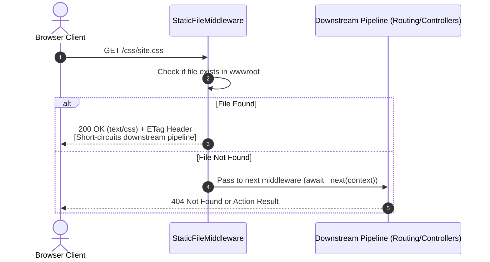
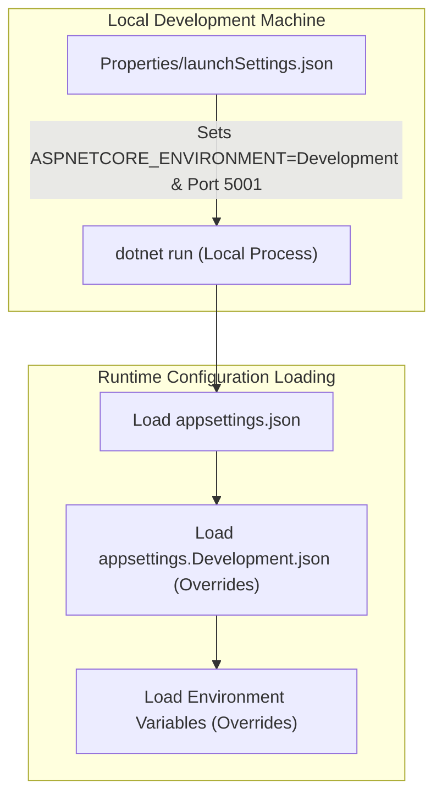
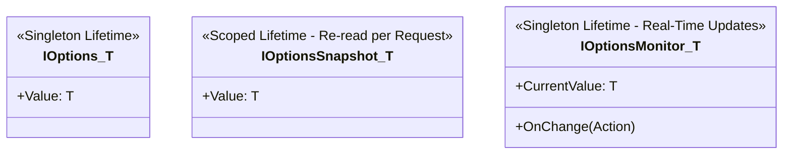
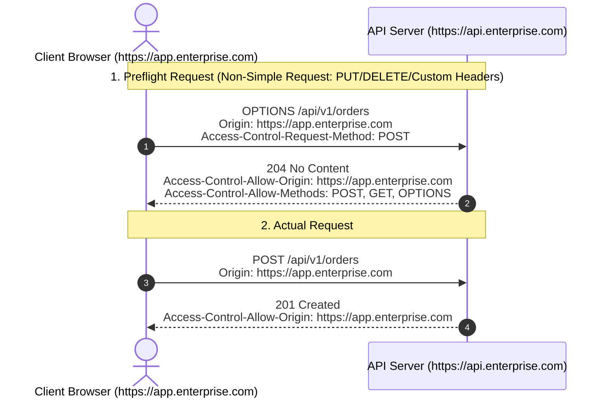
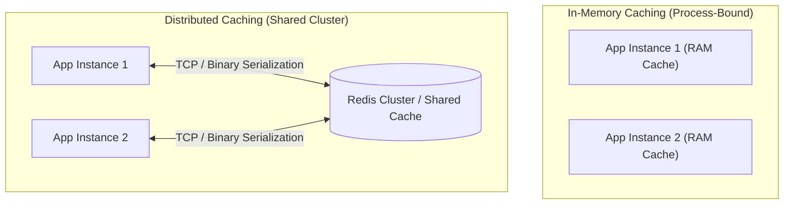
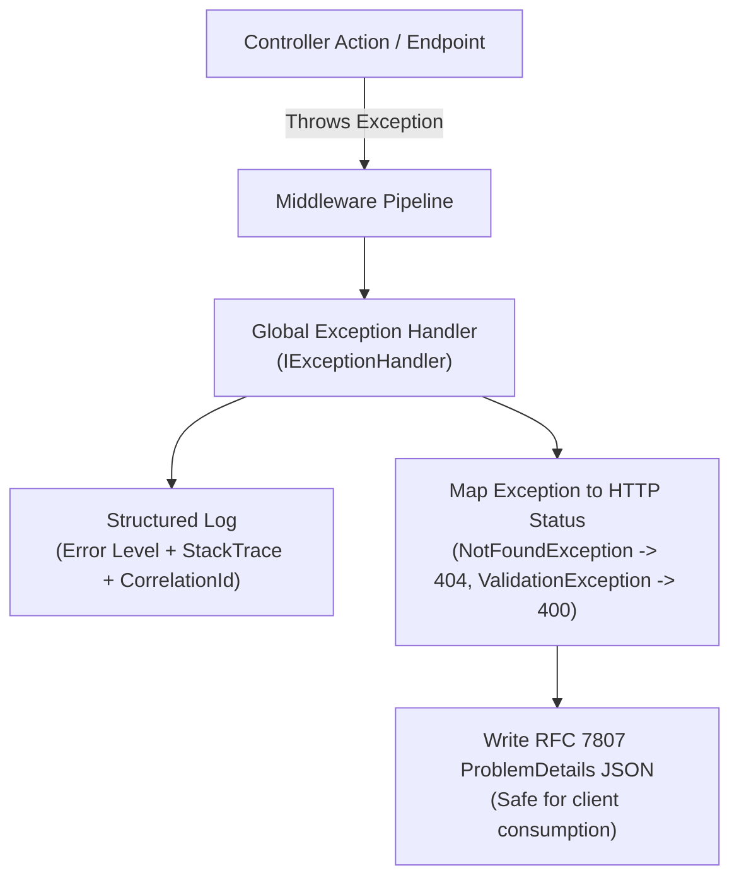
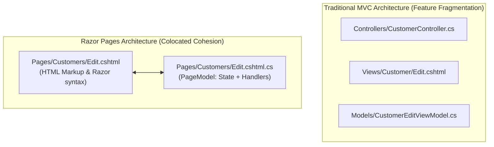

# Section 24: .NET Core - Routing, Files, CORS & Configuration

---

### Navigation
- **Previous Section**: [Section 23: .NET Core Service Lifetimes, Middleware & Hosting](./23_dotnet_core_service_lifetimes_middleware_hosting.md)
- **Next Section**: [Section 25: SOLID Principles](./25_solid_principles.md)
- **Curriculum Master Index**: [README.md](./README.md)

---

## Q225. What is Routing? Explain attribute routing in ASP.NET Core?

### 1. Executive Summary & Core Concept
**Routing** is the mechanism by which ASP.NET Core maps incoming HTTP request URLs and verbs to specific executable executable endpoints (such as Controller Actions or Minimal API handlers). 
ASP.NET Core supports two primary routing mechanisms:
1. **Conventional Routing**: A centralized route template defined globally (typical in traditional MVC apps, e.g., `{controller=Home}/{action=Index}/{id?}`).
2. **Attribute Routing**: Route templates defined directly on controllers and action methods using C# attributes (the enterprise standard for RESTful Web APIs, e.g., `[Route("api/v1/[controller]")]`).



### 2. Deep-Dive Architecture & Runtime Internals
- **Endpoint Routing Engine**: Introduced in ASP.NET Core 3.0, routing uses a **Deterministic Finite Automaton (DFA)** tree structure. During application startup, all registered route templates are compiled into an optimized DFA graph, allowing URL matching in $O(1)$ to $O(K)$ time (where $K$ is the number of path segments), regardless of whether the application has 10 or 10,000 routes.
- **Route Constraints**: Constraints validate URL segment syntax before action selection occurs (e.g., `{id:guid}`, `{id:int:min(1)}`, `{status:regex(^(active|pending)$)}`). If constraints fail, the route does not match and returns HTTP 404 (or checks subsequent candidate routes).

### 3. Production-Ready Code Implementation
```csharp
// Enterprise Attribute Routing with Route Constraints & Versioning
using Microsoft.AspNetCore.Mvc;

[ApiController]
[Route("api/v1/[controller]")] // Token replacement: [controller] becomes 'tenants'
public class TenantsController : ControllerBase
{
    // GET /api/v1/tenants/550e8400-e29b-41d4-a716-446655440000
    [HttpGet("{id:guid}")]
    public IActionResult GetTenantById(Guid id)
    {
        return Ok(new { TenantId = id, Name = "Acme Corp" });
    }

    // GET /api/v1/tenants/550e8400-e29b-41d4-a716-446655440000/users?page=1&pageSize=50
    // Demonstrating route constraints: int, range, and default values
    [HttpGet("{tenantId:guid}/users")]
    public IActionResult GetTenantUsers(
        Guid tenantId,
        [FromQuery] int page = 1,
        [FromQuery] int pageSize = 50)
    {
        return Ok(new { TenantId = tenantId, Page = page, PageSize = pageSize });
    }

    // Custom Route Constraint Example: Regex-based status match
    // GET /api/v1/tenants/status/active
    [HttpGet("status/{status:regex(^(active|suspended|pending)$)}")]
    public IActionResult GetByStatus(string status)
    {
        return Ok(new { Filter = status });
    }
}
```

### 4. Line-by-Line Code Walkthrough
- `[Route("api/v1/[controller]")]`: Sets the controller-level route prefix; `[controller]` is replaced by the class name without the `Controller` suffix (`Tenants`).
- `[HttpGet("{id:guid}")`: Enforces that the `id` route segment must parse as a valid System.Guid; non-GUID strings immediately return HTTP 404.
- `{status:regex(...)}`: Applies an inline regular expression constraint directly in the route template.

### 5. Real-World Enterprise Use Case & Application
In enterprise REST APIs, attribute routing enables clear URL hierarchies for nested resources (e.g., `/api/v1/organizations/{orgId}/departments/{deptId}/employees/{empId}`). This structure clearly conveys resource ownership and relationships.

### 6. Common Pitfalls, Memory Traps & Anti-Patterns
- **Ambiguous Match Exceptions**: Creating two actions with identical route signatures (e.g., `[HttpGet("{id}")]` and `[HttpGet("{name}")]`), causing `AmbiguousMatchException` at runtime when a request arrives. Always apply route constraints (`{id:int}`) to disambiguate.
- **Using Leading Slashes in Action Templates**: `[HttpGet("/api/override")]` on an action overrides and ignores the controller-level `[Route]` prefix entirely. Use `[HttpGet("override")]` to append to the controller route.

### 7. Senior / Architect Interview Follow-ups
- **Interviewer**: *What is the difference between Route Constraints and Model Validation?*
- **Candidate Answer**: Route Constraints determine **candidate endpoint selection**. If a constraint fails (e.g., `/orders/abc` where `{id:int}` is expected), the routing engine treats the endpoint as unmatched and returns HTTP 404 (or falls back to other routes). Model Validation executes **after** an endpoint is already selected; if binding fails, the controller action is invoked with `ModelState.IsValid == false` (or returns HTTP 400 Bad Request via `[ApiController]`).

---

## Q226. Explain default project structure in ASP.NET Core application?

### 1. Executive Summary & Core Concept
An ASP.NET Core application project structure follows a standardized, modular convention designed for clarity, testability, and clean separation of concerns. In modern .NET 8/9, standard templates (Web API, MVC, Razor Pages) provide a clean foundation that enterprises expand into layered architectures (Clean Architecture / Onion Architecture).



### 2. Deep-Dive Architecture & Runtime Internals
Key standard structural components include:
1. **`Program.cs`**: The unified application entry point (host creation, DI registration, middleware pipeline, endpoint mapping).
2. **`appsettings.json`**: Hierarchical application configuration loaded via `Microsoft.Extensions.Configuration`.
3. **`Properties/launchSettings.json`**: Development-time execution profiles (IIS Express, Kestrel, Docker, environment variables, ports). Not deployed to production.
4. **`wwwroot/`**: The web root directory where static assets reside (only served if `app.UseStaticFiles()` is enabled).
5. **`.csproj`**: The MSBuild project file defining the SDK, Target Framework Moniker (TFM), NuGet dependencies, and compiler settings.

### 3. Production-Ready Code Implementation
```
MyEnterpriseSolution/
│
├── src/
│   ├── Presentation.Api/
│   │   ├── Controllers/
│   │   │   └── OrdersController.cs
│   │   ├── Middleware/
│   │   │   └── ExceptionHandlingMiddleware.cs
│   │   ├── Properties/
│   │   │   └── launchSettings.json
│   │   ├── appsettings.json
│   │   ├── appsettings.Development.json
│   │   ├── appsettings.Production.json
│   │   ├── Program.cs
│   │   └── Presentation.Api.csproj
│   │
│   ├── Core.Domain/
│   │   ├── Entities/
│   │   │   └── Order.cs
│   │   └── Interfaces/
│   │       └── IOrderRepository.cs
│   │
│   └── Infrastructure.Data/
│       ├── Context/
│       │   └── ApplicationDbContext.cs
│       └── Repositories/
│           └── SqlOrderRepository.cs
│
└── tests/
    ├── UnitTests/
    └── IntegrationTests/
```

### 4. Line-by-Line Code Walkthrough
- `src/Presentation.Api`: The web entry-point hosting controllers, middleware, and configuration files.
- `src/Core.Domain`: Pure C# business entities and domain interfaces with zero external framework dependencies (no ASP.NET Core or EF Core dependencies).
- `src/Infrastructure.Data`: Implementation layer handling database access, external third-party SDKs, and file systems.
- `tests/`: Isolated testing projects keeping production artifacts lean.

### 5. Real-World Enterprise Use Case & Application
Enterprise organizations structure their codebases using **Clean Architecture** or **Vertical Slice Architecture** to enforce unidirectional dependency flow: dependencies point inward toward Core Domain logic, ensuring high testability and shielding domain logic from database or framework changes.

### 6. Common Pitfalls, Memory Traps & Anti-Patterns
- **Committing Production Secrets to `appsettings.json`**: Storing real database passwords or API keys in `appsettings.json` inside Git repositories. Use Azure Key Vault, AWS Secrets Manager, or .NET User Secrets for local development.
- **Fat Controllers**: Placing database queries, validation rules, and business workflows directly inside controller classes instead of delegating to domain services or mediator command handlers.

### 7. Senior / Architect Interview Follow-ups
- **Interviewer**: *What is the difference between the Content Root and the Web Root (`wwwroot`) in ASP.NET Core?*
- **Candidate Answer**: The **Content Root** is the base path for the entire application, containing all code, configuration files (`appsettings.json`), and assemblies (`IHostEnvironment.ContentRootPath`). The **Web Root** is the specific subfolder (defaulting to `wwwroot`) that contains public static assets (`.css`, `.js`, images) served directly to browsers (`IHostEnvironment.WebRootPath`).

---

## Q227. How does ASP.NET Core serve static files?

### 1. Executive Summary & Core Concept
ASP.NET Core does not serve static files (HTML, CSS, JavaScript, images) by default for security and performance reasons. Static file serving must be explicitly enabled by registering the **Static File Middleware** via `app.UseStaticFiles()`. Files are served from the web root folder (default: `wwwroot`).



### 2. Deep-Dive Architecture & Runtime Internals
- **Zero-Allocation File Streaming**: `StaticFileMiddleware` uses low-level OS file handles and high-performance asynchronous file streams (`SendFileFallback`), offloading network transmission to the OS kernel where possible.
- **HTTP Caching & Preconditions**:
  - Automatically calculates and appends `ETag` and `Last-Modified` response headers.
  - Honors client conditional request headers (`If-None-Match`, `If-Modified-Since`), automatically returning **HTTP 304 Not Modified** to save server bandwidth.
- **MIME Type Mapping**: Maps file extensions to content types using `FileExtensionContentTypeProvider`. Unrecognized extensions are blocked by default for security.

### 3. Production-Ready Code Implementation
```csharp
// Program.cs - Enterprise Static File Configuration with Custom Cache Headers
using Microsoft.AspNetCore.StaticFiles;
using Microsoft.Net.Http.Headers;

var builder = WebApplication.CreateBuilder(args);
var app = builder.Build();

// 1. Custom MIME Type Provider
var contentTypeProvider = new FileExtensionContentTypeProvider();
contentTypeProvider.Mappings[".apk"] = "application/vnd.android.package-archive";
contentTypeProvider.Mappings[".webp"] = "image/webp";

// 2. Configure Static Files with Cache-Control Headers
app.UseStaticFiles(new StaticFileOptions
{
    ContentTypeProvider = contentTypeProvider,
    OnPrepareResponse = ctx =>
    {
        // Cache static assets aggressively in browser/CDN for 365 days
        const int durationInSeconds = 60 * 60 * 24 * 365;
        ctx.Context.Response.Headers[HeaderNames.CacheControl] = 
            $"public,max-age={durationInSeconds},immutable";
    }
});

// 3. Serving static files from an additional external directory
app.UseStaticFiles(new StaticFileOptions
{
    FileProvider = new Microsoft.Extensions.FileProviders.PhysicalFileProvider(
        Path.Combine(builder.Environment.ContentRootPath, "TenantUploads")),
    RequestPath = "/files"
});

app.MapGet("/", () => "Static file server ready.");
app.Run();
```

### 4. Line-by-Line Code Walkthrough
- `app.UseStaticFiles(...)`: Injects the static file middleware into the request processing pipeline.
- `contentTypeProvider.Mappings[".webp"]`: Explicitly registers MIME types for modern file formats not mapped by default.
- `OnPrepareResponse = ctx => ...`: Appends `Cache-Control: public,max-age=31536000,immutable` to response headers, instructing CDNs and browsers to cache immutable assets.
- `FileProvider = new PhysicalFileProvider(...)`: Securely exposes an external folder outside `wwwroot` under the public virtual path `/files`.

### 5. Real-World Enterprise Use Case & Application
Enterprise single-page applications (Angular, React, Vue) use `UseStaticFiles()` combined with `UseSpaStaticFiles()` and `MapFallbackToFile("index.html")` to serve production JavaScript bundles while delegating deep link routing to the client-side router.

### 6. Common Pitfalls, Memory Traps & Anti-Patterns
- **Directory Browsing Enabled Unintentionally**: Enabling `app.UseDirectoryBrowser()` in production, allowing attackers to list all files on the server file system.
- **Serving Executables or Sensitive Configs**: Misconfiguring static file providers to serve the content root directory, inadvertently exposing `appsettings.json` or `.pdb` debugging symbols to public HTTP requests.

### 7. Senior / Architect Interview Follow-ups
- **Interviewer**: *Where should `app.UseStaticFiles()` be placed in the middleware pipeline relative to `UseRouting()` and `UseAuthentication()`?*
- **Candidate Answer**: `app.UseStaticFiles()` should be placed **before** `UseRouting()`, `UseAuthentication()`, and `UseAuthorization()`. Because static assets (images, CSS, JS) are public and unchanging, serving them early short-circuits the pipeline and skips routing lookups and database-backed authentication checks entirely, maximizing throughput.

---

## Q228. What are the roles of Appsettings.json and Launchsettings.json files?

### 1. Executive Summary & Core Concept
`appsettings.json` and `launchSettings.json` are two core configuration files in ASP.NET Core that serve fundamentally different purposes and lifecycles:
- **`appsettings.json`**: **Application Runtime Configuration**. Defines production and environment-specific application settings (connection strings, logging levels, third-party API keys). Deployed with the application.
- **`launchSettings.json`**: **Local Development Environment Configuration**. Defines how Visual Studio, VS Code, or the `dotnet run` CLI launches the application locally (ports, SSL, environment variables). **Never deployed to production**.

| Attribute | `appsettings.json` | `Properties/launchSettings.json` |
| :--- | :--- | :--- |
| **Purpose** | Application business configuration | Local machine development launch profiles |
| **Consumed By** | ASP.NET Core `IConfiguration` framework | IDE tooling (VS Code, Visual Studio, `dotnet run`) |
| **Deployed to Production?** | **YES** (included in published build) | **NO** (excluded by the publish pipeline) |
| **Environment Specificity** | `appsettings.{Environment}.json` | Multiple named launch profiles in one file |
| **Supports Hot Reload?** | Yes (`reloadOnChange: true`) | No (requires process restart) |



### 2. Deep-Dive Architecture & Runtime Internals
- **`launchSettings.json` Execution**: When you press F5 in Visual Studio or run `dotnet run --launch-profile "https"`, the IDE reads `launchSettings.json` and sets environment variables in the spawned OS process *before* the .NET runtime bootstraps.
- **Hierarchical Configuration Provider Chain**:
  `WebApplication.CreateBuilder` configures `IConfiguration` to load configuration sources in a strict priority order where later sources override earlier ones:
  1. `appsettings.json`
  2. `appsettings.{Environment}.json` (e.g., `appsettings.Production.json`)
  3. User Secrets (in Development environment only)
  4. Environment Variables
  5. Command-line Arguments

### 3. Production-Ready Code Implementation
```json
// Properties/launchSettings.json (Development tooling only)
{
  "$schema": "https://json.schemastore.org/launchsettings.json",
  "profiles": {
    "LocalDevelopment": {
      "commandName": "Project",
      "dotnetRunMessages": true,
      "launchBrowser": true,
      "launchUrl": "swagger",
      "applicationUrl": "https://localhost:7001;http://localhost:5000",
      "environmentVariables": {
        "ASPNETCORE_ENVIRONMENT": "Development",
        "FEATURE_NEW_CHECKOUT": "true"
      }
    }
  }
}
```

```json
// appsettings.json (Base runtime configuration)
{
  "Logging": {
    "LogLevel": {
      "Default": "Information",
      "Microsoft.AspNetCore": "Warning"
    }
  },
  "PaymentService": {
    "BaseUrl": "https://api.payments.enterprise.com",
    "TimeoutSeconds": 30
  }
}
```

### 4. Line-by-Line Code Walkthrough
- `"applicationUrl": "https://localhost:7001;..."`: Configures local Kestrel TCP socket bindings for developer debugging.
- `"ASPNETCORE_ENVIRONMENT": "Development"`: Instructs the runtime to load `appsettings.Development.json` and enable developer exception diagnostics.
- `"PaymentService": { "TimeoutSeconds": 30 }`: Hierarchical configuration accessible via `IConfiguration["PaymentService:TimeoutSeconds"]` or strongly typed options.

### 5. Real-World Enterprise Use Case & Application
In Kubernetes CI/CD pipelines, production pods do not contain connection strings in `appsettings.json`. Instead, base fallback settings reside in `appsettings.json`, and the Kubernetes deployment manifest injects real database credentials as Linux Environment Variables, which override `appsettings.json` values automatically at runtime.

### 6. Common Pitfalls, Memory Traps & Anti-Patterns
- **Relying on `launchSettings.json` in Production**: Expecting environment variables defined in `launchSettings.json` to exist in production Docker containers. They will not, because `launchSettings.json` is not published.
- **Case-Sensitivity Mismatches on Linux**: Configuration keys in `appsettings.json` are case-insensitive on Windows, but environment variable overrides on Linux containers can be sensitive depending on platform parsing rules.

### 7. Senior / Architect Interview Follow-ups
- **Interviewer**: *How does the runtime determine which `appsettings.{Environment}.json` file to load?*
- **Candidate Answer**: The host reads the `ASPNETCORE_ENVIRONMENT` (or `DOTNET_ENVIRONMENT`) environment variable early during bootstrapping. If the variable is set to `"Staging"`, the host automatically registers and loads `appsettings.Staging.json` directly on top of `appsettings.json`, allowing environment-specific values to override default settings.

---

## Q229. What are the techniques to save configuration settings in .NET Core?

### 1. Executive Summary & Core Concept
ASP.NET Core provides an extensible, unified **Configuration Subsystem** (`Microsoft.Extensions.Configuration`) supporting multiple configuration providers. To consume settings safely in application code, Microsoft provides three primary patterns:
1. **Direct `IConfiguration` Access**: Querying strings by hierarchical key (e.g., `_config["Jwt:Key"]`).
2. **The Strongly Typed Options Pattern (Recommended)**: Binding configuration sections to POCO classes using `IOptions<T>`, `IOptionsSnapshot<T>`, and `IOptionsMonitor<T>`.
3. **Secure External Secret Stores**: Azure Key Vault, AWS Secrets Manager, HashiCorp Vault, and Kubernetes ConfigMaps/Secrets.



### 2. Deep-Dive Architecture & Runtime Internals
The Options Pattern provides three distinct interfaces depending on lifetime and reload requirements:
- **`IOptions<T>`**: Registered as a **Singleton**. Reads configuration once at application startup. Does not support reloading if configuration changes on disk. Lowest overhead.
- **`IOptionsSnapshot<T>`**: Registered as **Scoped**. Re-reads configuration values once per HTTP request. Supports real-time reloads with zero thread-synchronization issues. (Cannot be injected into Singleton services).
- **`IOptionsMonitor<T>`**: Registered as a **Singleton**. Subscribes to change notifications from configuration providers, updating its `CurrentValue` in real time with event notifications (`OnChange`). Can be safely injected into Singletons.

### 3. Production-Ready Code Implementation
```csharp
// Enterprise Options Pattern with Validation & Hot Reload
using Microsoft.Extensions.Options;
using System.ComponentModel.DataAnnotations;

// 1. Strongly Typed POCO with Data Annotations
public class SmtpSettings
{
    public const string SectionName = "Smtp";

    [Required]
    public string Host { get; set; } = string.Empty;

    [Range(1, 65535)]
    public int Port { get; set; } = 587;

    [EmailAddress]
    public string SenderEmail { get; set; } = string.Empty;
}

// 2. Program.cs Registration with Eager Validation
var builder = WebApplication.CreateBuilder(args);

builder.Services.AddOptions<SmtpSettings>()
    .Bind(builder.Configuration.GetSection(SmtpSettings.SectionName))
    .ValidateDataAnnotations()
    .ValidateOnStart(); // Fail-fast on application startup if config is invalid

builder.Services.AddScoped<IEmailSender, SmtpEmailSender>();

// 3. Consuming via IOptionsSnapshot for Per-Request Freshness
public interface IEmailSender { void SendEmail(); }

public class SmtpEmailSender : IEmailSender
{
    private readonly SmtpSettings _settings;

    public SmtpEmailSender(IOptionsSnapshot<SmtpSettings> options)
    {
        _settings = options.Value; // Always reflects latest config per HTTP request
    }

    public void SendEmail()
    {
        Console.WriteLine($"Sending email via {_settings.Host}:{_settings.Port}");
    }
}
```

### 4. Line-by-Line Code Walkthrough
- `public class SmtpSettings`: Strongly typed POCO mapping to the `Smtp` section in `appsettings.json`.
- `.ValidateDataAnnotations()` / `.ValidateOnStart()`: Enforces validation rules (e.g., port range 1–65535). If settings are missing or invalid, the application throws an exception immediately on startup rather than failing silently later.
- `IOptionsSnapshot<SmtpSettings>`: Injected into the scoped email service, ensuring any dynamic updates to `appsettings.json` take effect on the next HTTP request without restarting the server.

### 5. Real-World Enterprise Use Case & Application
Enterprise systems integrate **Azure App Configuration** with `IOptionsMonitor<T>`. When an operator changes a feature flag or rate-limit threshold in the cloud portal, Azure App Configuration pushes a refresh notification to all running microservice instances, updating their in-memory settings in real time without downtime.

### 6. Common Pitfalls, Memory Traps & Anti-Patterns
- **Injecting `IOptionsSnapshot<T>` into a Singleton**: Causes a runtime exception because a Scoped service cannot be resolved from a Singleton. Use `IOptionsMonitor<T>` inside Singletons instead.
- **Reading Configuration Manually via `Configuration["Key"]` Everywhere**: Spreads magic string keys across the codebase, eliminating type safety and making refactoring error-prone. Always bind to strongly typed classes.

### 7. Senior / Architect Interview Follow-ups
- **Interviewer**: *What is the difference between `IOptionsSnapshot<T>` and `IOptionsMonitor<T>`?*
- **Candidate Answer**: `IOptionsSnapshot<T>` is a Scoped service recomputed once per HTTP request, guaranteeing that the configuration remains consistent throughout that request's execution. `IOptionsMonitor<T>` is a Singleton service that updates its `CurrentValue` instantly via push notifications, making it suitable for long-running Singletons, background workers, and real-time config listeners.

---

## Q230. What is CORS? Why is CORS restriction required? How to fix CORS errors?

### 1. Executive Summary & Core Concept
**Cross-Origin Resource Sharing (CORS)** is a W3C/IETF browser security standard that allows a web server to explicitly declare which foreign origins (domain, scheme, or port) are permitted to read its responses. 

The browser's **Same-Origin Policy (SOP)** blocks client-side scripts (JavaScript `fetch` or `XMLHttpRequest`) from reading responses from a different origin unless the server sends appropriate HTTP response headers (such as `Access-Control-Allow-Origin`).



### 2. Deep-Dive Architecture & Runtime Internals
- **Origin Definition**: Two URLs have the same origin only if their **Scheme**, **Host**, and **Port** are strictly identical:
  - `https://domain.com:443` vs `http://domain.com:80` $\rightarrow$ Different (Scheme/Port).
  - `https://app.domain.com` vs `https://api.domain.com` $\rightarrow$ Different (Subdomain).
- **Simple vs. Preflighted Requests**:
  - **Simple Requests**: `GET`, `HEAD`, `POST` with standard content types (`text/plain`, `multipart/form-data`, `application/x-www-form-urlencoded`). The browser sends the request immediately and inspects headers before exposing the response to JavaScript.
  - **Preflighted Requests**: Requests with `PUT`, `DELETE`, `PATCH`, `application/json`, or custom authorization headers. The browser sends an HTTP `OPTIONS` request first. If the server approves via `Access-Control-Allow-*` headers, the browser dispatches the real request.

### 3. Production-Ready Code Implementation
```csharp
// Enterprise Secure CORS Policy Configuration in Program.cs
var builder = WebApplication.CreateBuilder(args);

const string EnterpriseSpaPolicy = "EnterpriseSpaPolicy";

builder.Services.AddCors(options =>
{
    options.AddPolicy(name: EnterpriseSpaPolicy, policy =>
    {
        policy.WithOrigins(
                "https://portal.enterprise.com",
                "https://admin.enterprise.com")
              .WithMethods("GET", "POST", "PUT", "DELETE")
              .WithHeaders("Content-Type", "Authorization", "X-Correlation-ID")
              .AllowCredentials() // Allow Cookies / Auth Headers
              .SetPreflightMaxAge(TimeSpan.FromHours(1)); // Cache Preflight OPTIONS response
    });
});

builder.Services.AddControllers();

var app = builder.Build();

app.UseRouting();

// CRITICAL: UseCors MUST be placed between UseRouting and UseAuthorization
app.UseCors(EnterpriseSpaPolicy);

app.UseAuthentication();
app.UseAuthorization();

app.MapControllers();
app.Run();
```

### 4. Line-by-Line Code Walkthrough
- `policy.WithOrigins(...)`: Explicitly whitelists trusted client origins. Never use `AllowAnyOrigin()` together with `AllowCredentials()`.
- `.AllowCredentials()`: Permits the browser to send cookies, client-side certificates, or Kerberos tokens across origins.
- `.SetPreflightMaxAge(TimeSpan.FromHours(1))`: Instructs browsers to cache the preflight `OPTIONS` response for an hour, eliminating preflight latency on subsequent API calls.
- `app.UseCors(EnterpriseSpaPolicy)`: Injects CORS headers into responses matching the policy.

### 5. Real-World Enterprise Use Case & Application
In enterprise single-page applications where the frontend is hosted on a CDN (`https://portal.company.com`) and calls a separate API gateway (`https://api.company.com`), CORS policies allow the frontend to access API endpoints while preventing unauthorized third-party websites from making cross-origin requests on behalf of authenticated users.

### 6. Common Pitfalls, Memory Traps & Anti-Patterns
- **Using `AllowAnyOrigin()` with `AllowCredentials()`**: This combination is rejected by modern browsers and the ASP.NET Core framework will throw an exception on startup.
- **Middleware Ordering Error**: Placing `app.UseCors()` *before* `app.UseRouting()`, preventing the CORS middleware from accessing endpoint-specific metadata.

### 7. Senior / Architect Interview Follow-ups
- **Interviewer**: *Does CORS protect your server from malicious attacks or curl requests?*
- **Candidate Answer**: No. CORS is strictly a **browser-enforced** security mechanism. Server-to-server HTTP clients (curl, Postman, Python scripts, malicious bots) do not enforce CORS and can make requests regardless of CORS headers. CORS only prevents malicious scripts running inside a legitimate user's browser from reading cross-origin data. Backend APIs must always enforce server-side authentication and authorization.

---

## Q231. What is In-Memory caching & Distributed Caching? When to use what?

### 1. Executive Summary & Core Concept
Caching stores frequently accessed data in high-speed storage to reduce database load and improve response latency. In .NET Core:
- **In-Memory Caching (`IMemoryCache`)**: Data is stored directly in the **RAM of the web server process** hosting the application.
- **Distributed Caching (`IDistributedCache`)**: Data is stored in an **external, centralized cache cluster** (such as Redis or NCache) shared across all web server instances.



| Dimension | In-Memory Caching (`IMemoryCache`) | Distributed Caching (`IDistributedCache`) |
| :--- | :--- | :--- |
| **Location** | Local Server RAM (In-Process) | External Dedicated Service (Redis, NCache) |
| **Speed / Latency** | Sub-microsecond (Direct pointer lookup) | Low millisecond (Network hop + serialization) |
| **Multi-Node Consistency**| Inconsistent (Each node holds different data) | 100% Consistent across all server nodes |
| **Survival Across Restarts**| Lost on app restart or container recycle | Survives application deployments and restarts |
| **Infrastructure Cost** | Zero additional infrastructure cost | Requires hosting Redis/Valkey cluster |

### 2. Deep-Dive Architecture & Runtime Internals
- **`IMemoryCache`**:
  - Stores references directly in the CLR Managed Heap; zero serialization overhead.
  - Supports cache compaction, priority eviction (`CacheItemPriority`), size limits (`SizeLimit`), and sliding/absolute expiration tokens.
- **`IDistributedCache`**:
  - Stores raw `byte[]` arrays. Objects must be serialized to JSON, MessagePack, or Protobuf.
  - Standard interface methods: `GetAsync(key)`, `SetAsync(key, value, options)`, `RefreshAsync(key)`, `RemoveAsync(key)`.

### 3. Production-Ready Code Implementation
```csharp
// Enterprise Hybrid Caching Implementation using Redis
using Microsoft.Extensions.Caching.Distributed;
using System.Text.Json;

public interface ICacheProvider
{
    Task<T?> GetOrSetAsync<T>(string key, Func<Task<T>> factory, TimeSpan? expiration = null);
}

public class DistributedCacheProvider : ICacheProvider
{
    private readonly IDistributedCache _cache;

    public DistributedCacheProvider(IDistributedCache cache)
    {
        _cache = cache;
    }

    public async Task<T?> GetOrSetAsync<T>(string key, Func<Task<T>> factory, TimeSpan? expiration = null)
    {
        // 1. Attempt to read from distributed cache
        var cachedBytes = await _cache.GetAsync(key);
        if (cachedBytes != null)
        {
            return JsonSerializer.Deserialize<T>(cachedBytes);
        }

        // 2. Cache Miss: Execute database factory delegate
        var data = await factory();
        if (data is null) return default;

        // 3. Serialize and write back to cache
        var options = new DistributedCacheEntryOptions
        {
            AbsoluteExpirationRelativeToNow = expiration ?? TimeSpan.FromMinutes(10),
            SlidingExpiration = TimeSpan.FromMinutes(2)
        };

        var serialized = JsonSerializer.SerializeToUtf8Bytes(data);
        await _cache.SetAsync(key, serialized, options);

        return data;
    }
}
```

### 4. Line-by-Line Code Walkthrough
- `await _cache.GetAsync(key)`: Queries the distributed Redis store asynchronously for the byte array matching the key.
- `if (cachedBytes != null) return Deserialize<T>(...)`: On a cache hit, deserializes bytes directly into the domain object.
- `SlidingExpiration = TimeSpan.FromMinutes(2)`: Extends the cache entry lifetime if it is read within the sliding window, while `AbsoluteExpirationRelativeToNow` guarantees the entry expires eventually to prevent stale data.

### 5. Real-World Enterprise Use Case & Application
Enterprise systems use **In-Memory Caching** for static lookup data (country codes, postal zones, localized UI labels) where values rarely change. They use **Distributed Caching (Redis)** for user sessions, shopping carts, and frequently read product catalogs in horizontally scaled, multi-pod Kubernetes clusters.

### 6. Common Pitfalls, Memory Traps & Anti-Patterns
- **Unbounded In-Memory Cache**: Adding items to `IMemoryCache` without setting a `SizeLimit` or expiration policy. Over time, memory consumption grows until the OS terminates the process with an Out-of-Memory exception.
- **Cache Stampede (Thundering Herd)**: When a popular cache key expires, thousands of concurrent requests all miss the cache simultaneously and query the database at the same time. Mitigate with distributed locking or .NET 9's new `HybridCache`.

### 7. Senior / Architect Interview Follow-ups
- **Interviewer**: *What is `HybridCache` introduced in .NET 9, and what problem does it solve?*
- **Candidate Answer**: `HybridCache` is a two-tier caching abstraction introduced in .NET 9. It combines in-memory (L1) and distributed (L2) caching into a single unified API. It resolves cache stampedes automatically using built-in stampede protection (coalescing multiple concurrent requests for the same key into a single factory execution), serializes only for the L2 tier, and keeps hot items in L1 memory for sub-microsecond access.

---

## Q232. How to handle errors in ASP.NET Core?

### 1. Executive Summary & Core Concept
Modern ASP.NET Core applications handle errors centrally through the **Global Exception Handling Middleware Pipeline**, returning standardized **RFC 7807 / RFC 9457 `ProblemDetails`** responses. Starting in .NET 8, the recommended approach is implementing the **`IExceptionHandler`** interface, which cleanly separates exception-to-response mapping from controller logic.



### 2. Deep-Dive Architecture & Runtime Internals
- **The Modern .NET 8 `IExceptionHandler` Abstraction**:
  - Registered via `services.AddExceptionHandler<T>()`.
  - The built-in `app.UseExceptionHandler()` middleware catches all unhandled exceptions from downstream components and delegates them to registered `IExceptionHandler` implementations.
  - Handlers return `ValueTask<bool>`: returning `true` indicates the exception was handled and the response was written; returning `false` passes the exception to the next handler in the chain.
- **RFC 7807 `ProblemDetails` Specification**:
  Standardized JSON schema for API errors containing `type`, `title`, `status`, `detail`, and `instance` fields.

### 3. Production-Ready Code Implementation
```csharp
// File: GlobalExceptionHandler.cs (.NET 8 Enterprise Standard)
using System.Net;
using Microsoft.AspNetCore.Diagnostics;
using Microsoft.AspNetCore.Http;
using Microsoft.AspNetCore.Mvc;
using Microsoft.Extensions.Logging;

public class GlobalExceptionHandler : IExceptionHandler
{
    private readonly ILogger<GlobalExceptionHandler> _logger;

    public GlobalExceptionHandler(ILogger<GlobalExceptionHandler> logger)
    {
        _logger = logger;
    }

    public async ValueTask<bool> TryHandleAsync(
        HttpContext httpContext,
        Exception exception,
        CancellationToken cancellationToken)
    {
        _logger.LogError(exception, "Unhandled exception occurred: {Message}", exception.Message);

        var (statusCode, title) = exception switch
        {
            KeyNotFoundException => (StatusCodes.Status404NotFound, "Resource Not Found"),
            ArgumentException or InvalidOperationException => (StatusCodes.Status400BadRequest, "Invalid Request"),
            UnauthorizedAccessException => (StatusCodes.Status401Unauthorized, "Unauthorized"),
            _ => (StatusCodes.Status500InternalServerError, "Internal Server Error")
        };

        var problemDetails = new ProblemDetails
        {
            Status = statusCode,
            Title = title,
            Detail = httpContext.RequestServices.GetRequiredService<IHostEnvironment>().IsDevelopment()
                ? exception.ToString() // Detailed stack trace in development
                : "An unexpected error occurred. Please contact support.", // Sanitized for production
            Instance = httpContext.Request.Path
        };

        problemDetails.Extensions["traceId"] = httpContext.TraceIdentifier;

        httpContext.Response.StatusCode = statusCode;
        httpContext.Response.ContentType = "application/problem+json";

        await httpContext.Response.WriteAsJsonAsync(problemDetails, cancellationToken);

        return true; // Exception has been fully handled
    }
}
```

```csharp
// Program.cs - Enabling Modern Exception Handling
var builder = WebApplication.CreateBuilder(args);

builder.Services.AddExceptionHandler<GlobalExceptionHandler>();
builder.Services.AddProblemDetails(); // Adds standard ProblemDetails services

var app = builder.Build();

app.UseExceptionHandler(); // Uses the registered IExceptionHandler
app.MapControllers();
app.Run();
```

### 4. Line-by-Line Code Walkthrough
- `public class GlobalExceptionHandler : IExceptionHandler`: Implements the .NET 8 error handling contract.
- `exception switch { ... }`: Pattern matches domain exceptions to appropriate HTTP status codes (e.g., `KeyNotFoundException` $\rightarrow$ 404).
- `problemDetails.Detail = ...IsDevelopment() ? ...`: Protects against **Information Disclosure Vulnerabilities** by sanitizing stack traces in production while preserving full debug details in development.
- `return true`: Signals to the runtime that the response has been fully written, preventing further exception propagation.

### 5. Real-World Enterprise Use Case & Application
Enterprise APIs integrate `GlobalExceptionHandler` with distributed tracing systems. When an unhandled error occurs, the handler logs the full stack trace to OpenTelemetry / Datadog tagged with `TraceId` and returns a sanitized `ProblemDetails` response containing that same `TraceId`. Support teams can look up the exact error in logs using the trace ID provided by the user.

### 6. Common Pitfalls, Memory Traps & Anti-Patterns
- **Catching and Swallowing Exceptions Silently**: Using `try { ... } catch { }` blocks that swallow errors, hiding production failures from logging and monitoring systems.
- **Leaking Database Connection Strings or Stack Traces to Clients**: Returning raw `exception.Message` or `exception.StackTrace` in production HTTP responses, exposing internal infrastructure details to attackers.

### 7. Senior / Architect Interview Follow-ups
- **Interviewer**: *Why is `IExceptionHandler` preferred over custom `try/catch` middleware in .NET 8?*
- **Candidate Answer**: While custom `try/catch` middleware works, `IExceptionHandler` is the standardized, first-class abstraction introduced in .NET 8. It integrates seamlessly with the framework's `ProblemDetails` pipeline, supports chain-of-responsibility composition (multiple specialized handlers), and avoids common middleware pitfalls like attempting to modify response headers after writing has already begun.

---

## Q233. What are Razor pages in .NET Core?

### 1. Executive Summary & Core Concept
**Razor Pages** is a page-based programming model introduced in ASP.NET Core designed for building server-rendered, UI-centric web applications. Unlike traditional **MVC (Model-View-Controller)**—which separates controllers, actions, and views across separate folders—Razor Pages encapsulates the HTML markup (`.cshtml`) and its associated C# page logic (`.cshtml.cs` PageModel) into a single, cohesive **Page-focused** unit.



### 2. Deep-Dive Architecture & Runtime Internals
- **PageModel Lifecycle**: The code-behind class inherits from `Microsoft.AspNetCore.Mvc.RazorPages.PageModel`.
- **Handler Methods**: Instead of arbitrary action method names, Razor Pages maps HTTP requests directly to handler methods matching the convention `On{Verb}` or `On{Verb}{Handler}`:
  - `OnGet()`, `OnGetAsync()`
  - `OnPost()`, `OnPostAsync()`
  - `OnPostSaveDraftAsync()` (invoked via `<button asp-page-handler="SaveDraft">`)
- **Built-in Model Binding**: Properties decorated with `[BindProperty]` automatically bind to incoming form POST data, eliminating the need to pass explicit ViewModel parameters to handler methods.

### 3. Production-Ready Code Implementation
```cshtml
@* File: Pages/Customers/Create.cshtml *@
@page
@model CreateCustomerModel
@{
    ViewData["Title"] = "Register Customer";
}

<h2>Register Customer</h2>

<form method="post">
    <div asp-validation-summary="All" class="text-danger"></div>

    <div class="form-group mb-3">
        <label asp-for="Input.FullName" class="form-label"></label>
        <input asp-for="Input.FullName" class="form-control" />
        <span asp-validation-for="Input.FullName" class="text-danger"></span>
    </div>

    <div class="form-group mb-3">
        <label asp-for="Input.Email" class="form-label"></label>
        <input asp-for="Input.Email" class="form-control" />
        <span asp-validation-for="Input.Email" class="text-danger"></span>
    </div>

    <button type="submit" class="btn btn-primary">Create Customer</button>
</form>
```

```csharp
// File: Pages/Customers/Create.cshtml.cs
using System.ComponentModel.DataAnnotations;
using Microsoft.AspNetCore.Mvc;
using Microsoft.AspNetCore.Mvc.RazorPages;

public class CreateCustomerModel : PageModel
{
    private readonly ICustomerService _customerService;

    public CreateCustomerModel(ICustomerService customerService)
    {
        _customerService = customerService;
    }

    [BindProperty]
    public CustomerInputModel Input { get; set; } = new();

    public void OnGet()
    {
        // Executed on initial page render (GET)
    }

    public async Task<IActionResult> OnPostAsync()
    {
        if (!ModelState.IsValid)
        {
            return Page(); // Re-render view with validation errors
        }

        await _customerService.CreateAsync(Input);

        // Follow Post-Redirect-Get (PRG) pattern
        return RedirectToPage("/Customers/Index");
    }

    public class CustomerInputModel
    {
        [Required, MinLength(2)]
        public string FullName { get; set; } = string.Empty;

        [Required, EmailAddress]
        public string Email { get; set; } = string.Empty;
    }
}

public interface ICustomerService { Task CreateAsync(CreateCustomerModel.CustomerInputModel input); }
```

### 4. Line-by-Line Code Walkthrough
- `@page`: Declares the file as a Razor Page routing endpoint.
- `@model CreateCustomerModel`: Binds the Razor view to its strongly typed `PageModel` code-behind.
- `[BindProperty]`: Automatically binds incoming HTTP POST form values to the `Input` property.
- `return RedirectToPage(...)`: Implements the standard **Post-Redirect-Get (PRG)** pattern to prevent duplicate form submissions if the user refreshes the browser.

### 5. Real-World Enterprise Use Case & Application
Internal administrative back-offices, portals, and data entry systems utilize Razor Pages for rapid development. Because pages are self-contained, adding or modifying a feature requires updating only the specific `.cshtml` and `.cshtml.cs` files, without navigating across scattered `Controllers/`, `Views/`, and `ViewModels/` directories.

### 6. Common Pitfalls, Memory Traps & Anti-Patterns
- **Missing `@page` Directive**: Forgetting `@page` on the first line of the `.cshtml` file; the Razor engine treats it as a standard MVC view and routing fails with a 404 error.
- **Using Razor Pages for REST Web APIs**: Trying to build public JSON APIs with Razor Pages instead of ASP.NET Core Web API controllers or Minimal APIs.

### 7. Senior / Architect Interview Follow-ups
- **Interviewer**: *When would you architect a solution using Razor Pages versus traditional MVC?*
- **Candidate Answer**: Microsoft explicitly recommends **Razor Pages** as the default model for server-rendered HTML applications because it organizes code around feature cohesion (colocating HTML and C# handler logic) rather than technical type (separating controllers and views). **MVC** is retained for backward compatibility or when a single controller action serves multiple views across complex workflows. For single-page apps (SPAs) and mobile backends, **Web API / Minimal APIs** are used instead.
