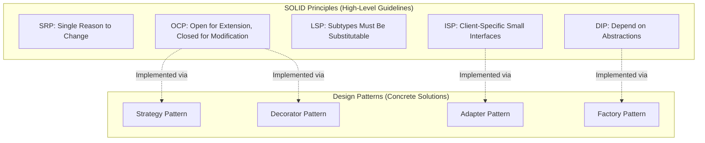
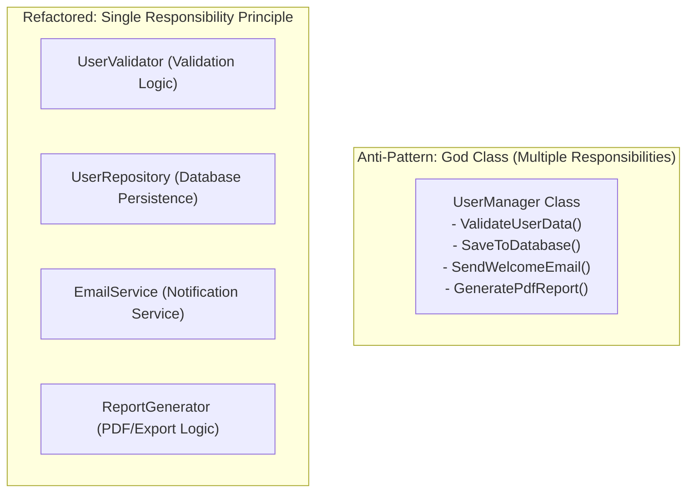
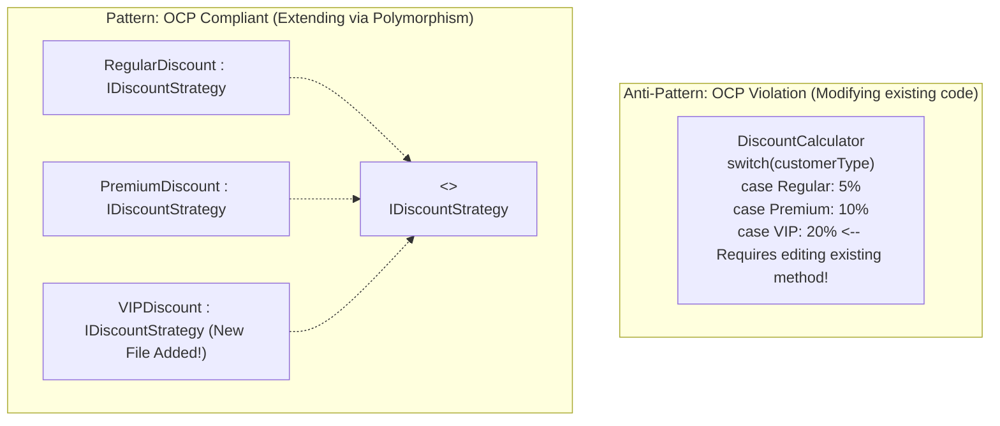
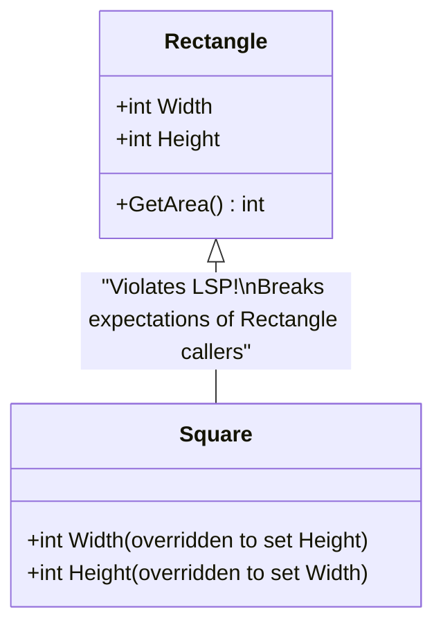
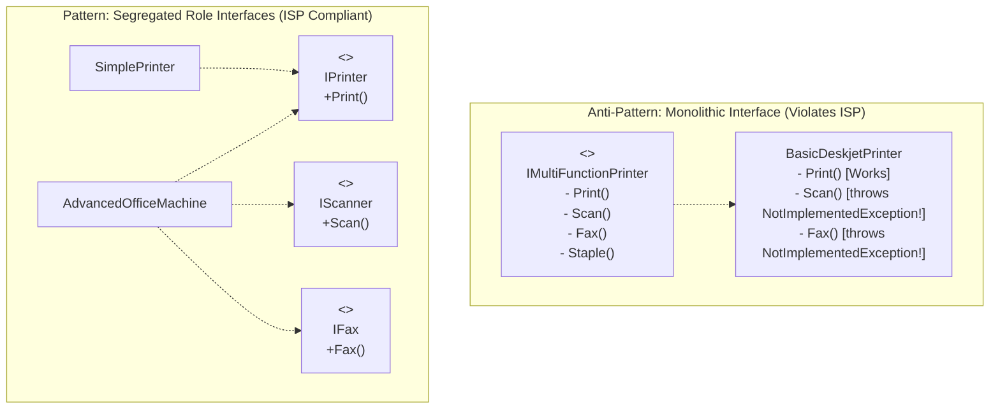
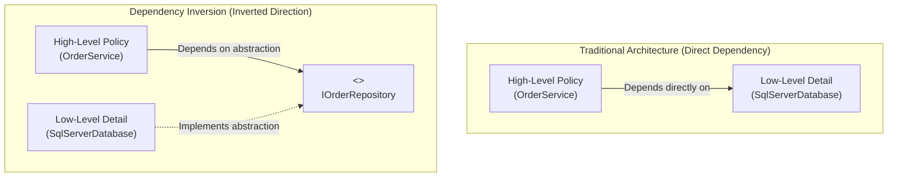
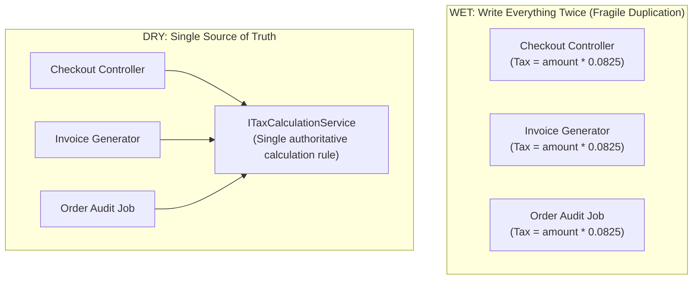

# Section 25: SOLID Principles & Clean Architecture

---

### Navigation
- **Previous Section**: [Section 24: .NET Core Routing, Files, CORS & Configuration](./24_dotnet_core_routing_files_cors_and_more.md)
- **Next Section**: [Section 26: Design Patterns](./26_design_patterns.md)
- **Curriculum Master Index**: [README.md](./README.md)

---

## Q234. What are SOLID Principles? How are they different from Design Patterns?

### 1. Executive Summary & Core Concept
**SOLID** is a mnemonic acronym for five fundamental object-oriented design principles popularized by Robert C. Martin ("Uncle Bob"):
- **S**: Single Responsibility Principle (SRP)
- **O**: Open-Closed Principle (OCP)
- **L**: Liskov Substitution Principle (LSP)
- **I**: Interface Segregation Principle (ISP)
- **D**: Dependency Inversion Principle (DIP)

**SOLID Principles vs. Design Patterns**:
- **SOLID Principles**: High-level **philosophical guidelines** and best practices for structuring object-oriented systems to ensure maintainability, flexibility, and testability. They describe *what* makes good software architecture.
- **Design Patterns** (e.g., Gang of Four patterns like Factory, Singleton, Strategy): Concrete, repeatable, code-level **tactical templates** that solve specific, recurring architectural problems. Design patterns often serve as concrete implementations of SOLID principles.



### 2. Deep-Dive Architecture & Runtime Internals
- Architectural decay in software occurs due to four symptoms:
  1. **Rigidity**: Hard to change because a single change forces cascading edits across dependent modules.
  2. **Fragility**: Breaking unrelated functionality when making changes.
  3. **Immobility**: Inability to reuse modules because they are tightly coupled to the current application.
  4. **Viscosity**: Doing things the right way is harder than using quick-and-dirty hacks.
- Applying SOLID decouples modules through polymorphism, runtime dynamic dispatch (vtable lookups), and dependency injection, containing changes within isolated architectural boundaries.

### 3. Production-Ready Code Implementation
```csharp
// Architectural Comparison: Principle vs Pattern
// SOLID (DIP & OCP) Guideline: Depend on Abstractions, open to extension
public interface IPaymentGateway
{
    Task<PaymentResult> ProcessPaymentAsync(decimal amount, string currency);
}

// Concrete GoF Pattern: Strategy Pattern implementing the SOLID principles
public class StripePaymentStrategy : IPaymentGateway
{
    public Task<PaymentResult> ProcessPaymentAsync(decimal amount, string currency)
    {
        // Stripe API integration
        return Task.FromResult(new PaymentResult(true, "STRIPE_TXN_OK"));
    }
}

public class PayPalPaymentStrategy : IPaymentGateway
{
    public Task<PaymentResult> ProcessPaymentAsync(decimal amount, string currency)
    {
        // PayPal API integration
        return Task.FromResult(new PaymentResult(true, "PAYPAL_TXN_OK"));
    }
}

public record PaymentResult(bool Success, string TransactionId);
```

### 4. Line-by-Line Code Walkthrough
- `public interface IPaymentGateway`: The abstraction that satisfies **DIP** (high-level code depends on interface) and **OCP** (new payment gateways can be added without modifying existing code).
- `StripePaymentStrategy` / `PayPalPaymentStrategy`: Concrete **Strategy Pattern** implementations providing swappable runtime behaviors.

### 5. Real-World Enterprise Use Case & Application
Enterprise architecture review boards evaluate system designs against SOLID principles during Architecture Decision Records (ADR) sign-offs. Code adhering to SOLID allows enterprise teams to safely deploy continuous microservice updates multiple times per day with minimal regression risk.

### 6. Common Pitfalls, Memory Traps & Anti-Patterns
- **Dogmatic Over-Engineering**: Creating thousands of single-method interfaces and micro-classes for a simple CRUD application. Apply SOLID pragmatically where volatility and business change actually occur.
- **Confusing Patterns with Principles**: Forcing a complex design pattern (like Abstract Factory) where a simple interface and standard dependency injection would suffice.

### 7. Senior / Architect Interview Follow-ups
- **Interviewer**: *Can an application implement Design Patterns while still violating SOLID principles?*
- **Candidate Answer**: Yes. For example, a developer might implement the **Singleton Pattern** with a static `Instance` property containing hardcoded database queries. While it correctly implements the Singleton pattern, it directly violates the **Single Responsibility Principle** (mixing lifetime management with database access) and the **Dependency Inversion Principle** (high-level callers now depend directly on a concrete implementation with no abstraction), making the code impossible to unit test.

---

## Q235. What is the Single Responsibility Principle (SRP)?

### 1. Executive Summary & Core Concept
The **Single Responsibility Principle (SRP)** states: *"A class should have one, and only one, reason to change."* 

Robert C. Martin clarifies this by defining "reason to change" in terms of people: **a class should be responsible to only one actor or stakeholder** (e.g., the CFO, the COO, or the Database Administrator). If a class handles business logic, persistence, and formatting, it has multiple actors requesting changes, making it fragile.



### 2. Deep-Dive Architecture & Runtime Internals
- **Cohesion vs. Coupling**:
  - High Cohesion: The methods and properties of a class are closely related to a single, focused purpose.
  - Low Coupling: Minimal direct dependencies between distinct classes.
- When SRP is violated, changes requested by one stakeholder (e.g., Marketing requesting email template updates) risk introducing regressions into unrelated systems (e.g., Database transactions).

### 3. Production-Ready Code Implementation
```csharp
// Anti-Pattern: Violates SRP (God Object handles validation, persistence, and email)
public class BadUserService
{
    public void RegisterUser(string email, string password)
    {
        // 1. Validation Logic
        if (!email.Contains("@")) throw new ArgumentException("Invalid email");

        // 2. Database Persistence Logic
        using var conn = new SqlConnection("Server=...;");
        conn.Open();
        var cmd = new SqlCommand("INSERT INTO Users...", conn);
        cmd.ExecuteNonQuery();

        // 3. Email Notification Logic
        using var client = new SmtpClient("smtp.mail.com");
        client.Send(new MailMessage("admin@site.com", email, "Welcome", "Body"));
    }
}

// Enterprise Best Practice: Refactored adhering strictly to SRP
public record UserRegistrationCommand(string Email, string RawPassword);

// Responsibility 1: Pure Domain Model Validation
public class UserRegistrationValidator
{
    public void Validate(UserRegistrationCommand command)
    {
        if (string.IsNullOrWhiteSpace(command.Email) || !command.Email.Contains("@"))
            throw new ValidationException("Invalid email address format.");
        if (string.IsNullOrWhiteSpace(command.RawPassword) || command.RawPassword.Length < 8)
            throw new ValidationException("Password must be at least 8 characters.");
    }
}

// Responsibility 2: Data Persistence
public interface IUserRepository
{
    Task InsertAsync(string email, string passwordHash, CancellationToken ct);
}

// Responsibility 3: Notification Delivery
public interface INotificationService
{
    Task SendWelcomeEmailAsync(string email, CancellationToken ct);
}

// Responsibility 4: Orchestrator (Coordinates single business workflow)
public class UserRegistrationUseCase
{
    private readonly UserRegistrationValidator _validator;
    private readonly IUserRepository _repository;
    private readonly INotificationService _notifier;

    public UserRegistrationUseCase(
        UserRegistrationValidator validator,
        IUserRepository repository,
        INotificationService notifier)
    {
        _validator = validator;
        _repository = repository;
        _notifier = notifier;
    }

    public async Task ExecuteAsync(UserRegistrationCommand command, CancellationToken ct = default)
    {
        _validator.Validate(command);
        var passwordHash = BCrypt.Net.BCrypt.HashPassword(command.RawPassword);
        await _repository.InsertAsync(command.Email, passwordHash, ct);
        await _notifier.SendWelcomeEmailAsync(command.Email, ct);
    }
}

public class ValidationException : Exception { public ValidationException(string msg) : base(msg) { } }
```

### 4. Line-by-Line Code Walkthrough
- `UserRegistrationValidator`: Has one reason to change: business validation rules change.
- `IUserRepository`: Has one reason to change: persistence schema or database technology changes.
- `INotificationService`: Has one reason to change: notification provider or messaging templates change.
- `UserRegistrationUseCase`: Has one reason to change: the registration workflow itself changes.

### 5. Real-World Enterprise Use Case & Application
Enterprise systems adopting **CQRS (Command Query Responsibility Segregation)** with MediatR apply SRP at the workflow level: each Command Handler (e.g., `CreateInvoiceCommandHandler`) handles one single business action, with zero coupling to other commands or queries.

### 6. Common Pitfalls, Memory Traps & Anti-Patterns
- **Nano-Classes (SRP Taken to Absurdity)**: Splitting a class into a separate class for every single property or trivial helper method. A responsibility is a cohesive unit of functionality, not necessarily a single line of code.
- **Leaking Infrastructure into Domain Logic**: Mixing EF Core LINQ queries directly inside domain entity models.

### 7. Senior / Architect Interview Follow-ups
- **Interviewer**: *How does SRP impact unit testing in large-scale applications?*
- **Candidate Answer**: Violating SRP produces classes with dozens of dependencies, requiring complex test setup with dozens of mocks. Adhering to SRP keeps classes small and focused, so unit tests only need to mock one or two collaborator interfaces, resulting in clean, fast, maintainable test suites.

---

## Q236. What is the Open-Closed Principle (OCP)?

### 1. Executive Summary & Core Concept
The **Open-Closed Principle (OCP)** states: *"Software entities (classes, modules, functions) should be open for extension, but closed for modification."*

- **Open for Extension**: The behavior of the module can be extended to support new business requirements.
- **Closed for Modification**: Extending the module's behavior does not require altering its existing, tested, and deployed source code.



### 2. Deep-Dive Architecture & Runtime Internals
- OCP is achieved primarily through **polymorphism, abstraction, and the Strategy or Decorator design patterns**.
- When an action needs to support new behaviors, instead of adding `if-else` or `switch` branches to existing methods, developers create a new class implementing an established interface or abstract base class.
- The runtime uses dynamic method dispatch (vtable lookups) to execute the new behavior without touching existing code.

### 3. Production-Ready Code Implementation
```csharp
// Anti-Pattern: Violating OCP (Every new discount requires modifying CalculateDiscount)
public class BadDiscountCalculator
{
    public decimal CalculateDiscount(string customerType, decimal amount)
    {
        if (customerType == "Regular") return amount * 0.05m;
        if (customerType == "Premium") return amount * 0.10m;
        if (customerType == "VIP")     return amount * 0.20m; // Added today, modifying tested class!
        return 0;
    }
}

// Enterprise Best Practice: OCP Compliant via Strategy Pattern
public interface IDiscountStrategy
{
    bool IsMatch(Customer customer);
    decimal ApplyDiscount(decimal originalAmount);
}

public class RegularCustomerDiscount : IDiscountStrategy
{
    public bool IsMatch(Customer c) => c.Tier == CustomerTier.Regular;
    public decimal ApplyDiscount(decimal originalAmount) => originalAmount * 0.95m;
}

public class PremiumCustomerDiscount : IDiscountStrategy
{
    public bool IsMatch(Customer c) => c.Tier == CustomerTier.Premium;
    public decimal ApplyDiscount(decimal originalAmount) => originalAmount * 0.90m;
}

// Adding a new discount requires creating a NEW class - ZERO changes to existing classes!
public class VipCustomerDiscount : IDiscountStrategy
{
    public bool IsMatch(Customer c) => c.Tier == CustomerTier.Vip;
    public decimal ApplyDiscount(decimal originalAmount) => originalAmount * 0.80m;
}

// The OrderProcessor is CLOSED for modification, but OPEN to new strategies
public class OrderPricingEngine
{
    private readonly IEnumerable<IDiscountStrategy> _strategies;

    public OrderPricingEngine(IEnumerable<IDiscountStrategy> strategies)
    {
        _strategies = strategies;
    }

    public decimal ComputeFinalPrice(Customer customer, decimal basePrice)
    {
        var strategy = _strategies.FirstOrDefault(s => s.IsMatch(customer));
        return strategy != null ? strategy.ApplyDiscount(basePrice) : basePrice;
    }
}

public enum CustomerTier { Regular, Premium, Vip }
public record Customer(Guid Id, CustomerTier Tier);
```

### 4. Line-by-Line Code Walkthrough
- `public interface IDiscountStrategy`: The stable abstraction that stays closed for modification.
- `VipCustomerDiscount`: A newly added class implementing `IDiscountStrategy`.
- `OrderPricingEngine`: Receives all registered `IDiscountStrategy` implementations via DI (`IEnumerable<IDiscountStrategy>`). It evaluates discounts dynamically without requiring code modifications when a new tier is introduced.

### 5. Real-World Enterprise Use Case & Application
Plugin architectures and ASP.NET Core Middleware pipelines are classic real-world examples of OCP: developers add new middleware components, authentication schemes, or health checks to an application without modifying ASP.NET Core's internal source code.

### 6. Common Pitfalls, Memory Traps & Anti-Patterns
- **Premature Abstraction**: Introducing interfaces and strategy patterns for features that will never change or expand, adding unnecessary complexity.
- **Hidden Modifications in Calling Code**: Implementing a new strategy class but still having to modify hardcoded `switch` statements elsewhere to instantiate it. Use DI auto-discovery or keyed services instead.

### 7. Senior / Architect Interview Follow-ups
- **Interviewer**: *Is it possible for a system to be 100% closed against all possible modifications?*
- **Candidate Answer**: No. Complete closure against all possible changes is impossible because no architect can predict every future business requirement. Instead, architects design for **strategic closure**: identifying the components most likely to change based on domain knowledge (e.g., payment gateways, tax calculation rules, discount schemes) and abstracting those specific extension points.

---

## Q237. What is the Liskov Substitution Principle (LSP)?

### 1. Executive Summary & Core Concept
The **Liskov Substitution Principle (LSP)**, formulated by Barbara Liskov in 1987, states: *"Subtypes must be substitutable for their base types without altering the correctness of the program."*

If class `B` is a subtype of class `A`, then any instance of `A` should be replaceable with an instance of `B` without breaking application invariants, throwing unexpected exceptions, or producing incorrect behavior.



### 2. Deep-Dive Architecture & Runtime Internals
LSP defines strict behavioural rules for subtyping (Design by Contract):
1. **Preconditions cannot be strengthened in a subtype**: A derived method cannot demand more restrictive input constraints than its base class method.
2. **Postconditions cannot be weakened in a subtype**: A derived method cannot guarantee less output precision or looser guarantees than the base class.
3. **Invariants must be preserved**: Any condition that is always true for the base type must remain true for all derived types.
4. **No Unexpected Exceptions**: A subtype must not throw exceptions that callers of the base type would not expect (e.g., throwing `NotImplementedException` or `NotSupportedException` on inherited methods).

### 3. Production-Ready Code Implementation
```csharp
// Classic Anti-Pattern: Square inheriting from Rectangle (Violates LSP)
public class BadRectangle
{
    public virtual int Width { get; set; }
    public virtual int Height { get; set; }
    public int Area => Width * Height;
}

public class BadSquare : BadRectangle
{
    public override int Width
    {
        set { base.Width = value; base.Height = value; } // Mutating Height unexpectedly!
    }
    public override int Height
    {
        set { base.Width = value; base.Height = value; } // Mutating Width unexpectedly!
    }
}

public class LspViolationDemo
{
    public static void VerifyArea(BadRectangle rect)
    {
        rect.Width = 5;
        rect.Height = 10;
        // Caller expects: 5 * 10 = 50.
        // If passed BadSquare, Width becomes 10, Area = 10 * 10 = 100! (LSP BROKEN)
        if (rect.Area != 50)
        {
            throw new Exception($"LSP Violation: Expected 50, but got {rect.Area}");
        }
    }
}

// Enterprise Best Practice: Separate abstractions honoring LSP
public interface IShape
{
    int CalculateArea();
}

public class Rectangle : IShape
{
    public int Width { get; }
    public int Height { get; }

    public Rectangle(int width, int height)
    {
        Width = width;
        Height = height;
    }

    public int CalculateArea() => Width * Height;
}

public class Square : IShape
{
    public int SideLength { get; }

    public Square(int sideLength)
    {
        SideLength = sideLength;
    }

    public int CalculateArea() => SideLength * SideLength;
}
```

### 4. Line-by-Line Code Walkthrough
- `BadSquare : BadRectangle`: A square is mathematically a rectangle, but in object-oriented programming, overriding properties to enforce square dimensions breaks the behavioral contract of `Rectangle`.
- `public interface IShape`: Models common behavior (`CalculateArea()`) without forcing inappropriate property relationships.
- `Rectangle` and `Square` both implement `IShape`, allowing either to be passed to any method expecting `IShape` with predictable behavior.

### 5. Real-World Enterprise Use Case & Application
In payment processing pipelines, an abstract base class `PaymentAccount` might define a `Withdraw(decimal amount)` method. If a `CertificateOfDepositAccount` (which does not allow withdrawals before maturity) inherits from it and throws `NotSupportedException` inside `Withdraw()`, it violates LSP. Refactoring into `IDepositOnlyAccount` and `ITransactionalAccount` resolves the violation.

### 6. Common Pitfalls, Memory Traps & Anti-Patterns
- **Throwing `NotImplementedException` on Inherited Interface Methods**: Implementing an interface just to satisfy a dependency, but throwing `NotImplementedException` for methods that don't apply to this subtype. This is a red flag for an LSP (and ISP) violation.
- **Runtime Type Checking via `is` or `as`**: Writing code that checks `if (shape is Square)` to apply special-case logic. If client code needs to check concrete subtypes, the abstraction violates LSP.

### 7. Senior / Architect Interview Follow-ups
- **Interviewer**: *What is the relationship between the Liskov Substitution Principle and the Interface Segregation Principle?*
- **Candidate Answer**: They are closely related. When an interface is too broad (violating ISP), implementing classes are often forced to throw `NotSupportedException` or provide empty implementations for methods they don't support. This in turn violates LSP, because callers expecting the full interface contract encounter runtime exceptions when using that subtype. Applying ISP by splitting large interfaces into focused ones directly prevents LSP violations.

---

## Q238. What is the Interface Segregation Principle (ISP)?

### 1. Executive Summary & Core Concept
The **Interface Segregation Principle (ISP)** states: *"Clients should not be forced to depend upon interfaces that they do not use."*

Instead of creating large, monolithic, "fat" interfaces containing dozens of methods, architects should design small, cohesive, role-specific interfaces. Classes should only implement methods relevant to their specific domain responsibility.



### 2. Deep-Dive Architecture & Runtime Internals
- Fat interfaces introduce **accidental coupling**: if an interface changes a method signature that a client does not even use, that client must still be recompiled and re-tested.
- Small interfaces enable the **Role Interface** pattern: classes declare specific roles they can perform by implementing multiple small interfaces (`class User : IEntity, IAuditable, ISoftDeletable`).

### 3. Production-Ready Code Implementation
```csharp
// Anti-Pattern: Fat Repository Interface violating ISP
public interface IBadUniversalRepository<T>
{
    Task<T> GetByIdAsync(Guid id);
    Task<IEnumerable<T>> GetAllAsync();
    Task AddAsync(T entity);
    Task UpdateAsync(T entity);
    Task DeleteAsync(Guid id);
    Task<byte[]> ExportToExcelAsync(); // What if an entity cannot be exported?
    Task SendNotificationEmailAsync(T entity); // Infrastructure concern leaked!
}

// Enterprise Best Practice: Segregated Interfaces adhering to ISP
public interface IReadOnlyRepository<T>
{
    Task<T?> GetByIdAsync(Guid id, CancellationToken ct = default);
    Task<IReadOnlyList<T>> ListAsync(CancellationToken ct = default);
}

public interface IWriteRepository<T>
{
    Task AddAsync(T entity, CancellationToken ct = default);
    Task UpdateAsync(T entity, CancellationToken ct = default);
    Task DeleteAsync(Guid id, CancellationToken ct = default);
}

// Read-only reporting service depends ONLY on what it needs
public class AuditReportGenerator
{
    private readonly IReadOnlyRepository<AuditLog> _readRepo;

    // Caller cannot accidentally call Add/Update/Delete!
    public AuditReportGenerator(IReadOnlyRepository<AuditLog> readRepo)
    {
        _readRepo = readRepo;
    }

    public async Task<int> CountLogsAsync()
    {
        var logs = await _readRepo.ListAsync();
        return logs.Count;
    }
}

public record AuditLog(Guid Id, string Message);
```

### 4. Line-by-Line Code Walkthrough
- `IReadOnlyRepository<T>`: Segregated interface containing only query operations.
- `IWriteRepository<T>`: Segregated interface containing only mutation operations.
- `AuditReportGenerator(IReadOnlyRepository<AuditLog> readRepo)`: By depending only on `IReadOnlyRepository`, the reporting service is physically prevented from mutating data, guaranteeing immutability at compile time.

### 5. Real-World Enterprise Use Case & Application
The .NET Base Class Library is a textbook example of ISP:
- Collections implement small, segregated interfaces: `IEnumerable<T>` (iteration), `ICollection<T>` (count/membership), `IList<T>` (index access), and `IReadOnlyList<T>` (immutable index access). A method needing only to iterate over items accepts `IEnumerable<T>`, rather than forcing callers to supply a concrete `List<T>`.

### 6. Common Pitfalls, Memory Traps & Anti-Patterns
- **Creating an Interface with Zero Cohesion**: Grouping unrelated utility methods into an `ICommonService` or `IGeneralHelper` interface.
- **Interface Proliferation**: Creating an interface for every single method when no distinct client roles exist. Balance interface size with pragmatic cohesion.

### 7. Senior / Architect Interview Follow-ups
- **Interviewer**: *How does the Interface Segregation Principle facilitate Command Query Responsibility Segregation (CQRS)?*
- **Candidate Answer**: CQRS separates read operations from write operations. ISP is the foundational principle that enables this separation: rather than having a single massive repository interface with both reads and writes, we split the interface into separate Query handlers (`IQueryHandler<TQuery, TResult>`) and Command handlers (`ICommandHandler<TCommand>`). Clients that only read data never depend on mutation contracts.

---

## Q239. What is the Dependency Inversion Principle (DIP)?

### 1. Executive Summary & Core Concept
The **Dependency Inversion Principle (DIP)** states:
1. *"High-level modules should not depend on low-level modules. Both should depend on abstractions."*
2. *"Abstractions should not depend on details. Details (concrete implementations) should depend on abstractions."*

In traditional software design, high-level business policies directly instantiate and depend on low-level implementation details (databases, network sockets, file systems). DIP **inverts** this dependency direction using interfaces.



### 2. Deep-Dive Architecture & Runtime Internals
- **Inversion of Ownership**: In DIP, the abstraction is conceptually **owned by the high-level module**, not the low-level detail. The interface lives in the same assembly or architectural layer as the business domain logic (`Core.Domain`), while the concrete implementation lives in an outer infrastructure layer (`Infrastructure.Data`).
- **Runtime Dispatch**: High-level modules execute against interface method slots in memory via vtable lookups, with the IoC container injecting the concrete implementation at runtime.

### 3. Production-Ready Code Implementation
```csharp
// Assembly: Core.Domain (High-Level Policy Layer - No External Dependencies!)
namespace Core.Domain
{
    public record Order(Guid Id, decimal TotalAmount);

    // The high-level layer OWNS the interface contract
    public interface IOrderNotificationChannel
    {
        Task DispatchAsync(Order order, string message, CancellationToken ct);
    }

    public class OrderCheckoutService
    {
        private readonly IOrderNotificationChannel _notificationChannel;

        // High-level policy depends strictly on the abstraction
        public OrderCheckoutService(IOrderNotificationChannel notificationChannel)
        {
            _notificationChannel = notificationChannel;
        }

        public async Task CompleteCheckoutAsync(Order order, CancellationToken ct = default)
        {
            // Business logic executes here
            await _notificationChannel.DispatchAsync(order, "Order successfully processed.", ct);
        }
    }
}

// Assembly: Infrastructure.Messaging (Low-Level Detail - Depends on Core.Domain)
namespace Infrastructure.Messaging
{
    using Core.Domain;

    // Concrete detail implements the high-level abstraction
    public class AwsSnsNotificationChannel : IOrderNotificationChannel
    {
        public async Task DispatchAsync(Order order, string message, CancellationToken ct)
        {
            // Real AWS Simple Notification Service (SNS) SDK calls
            await Task.Delay(10, ct);
            Console.WriteLine($"[AWS SNS Dispatched] Order {order.Id}: {message}");
        }
    }
}
```

### 4. Line-by-Line Code Walkthrough
- `namespace Core.Domain`: Contains high-level business policies and domain logic. It references zero database or cloud provider SDKs.
- `public interface IOrderNotificationChannel`: The abstraction declared within the domain layer.
- `public class AwsSnsNotificationChannel : IOrderNotificationChannel`: The low-level infrastructure detail located in an outer assembly, pointing inward toward the domain layer abstraction.

### 5. Real-World Enterprise Use Case & Application
**Clean Architecture** and **Hexagonal Architecture (Ports and Adapters)** are direct implementations of DIP: the core domain contains all business logic and defines "ports" (interfaces). Database adapters (EF Core, Dapper), messaging adapters (RabbitMQ, Kafka), and UI presentation layers (ASP.NET Core Web API) serve as peripheral "adapters" implementing those ports.

### 6. Common Pitfalls, Memory Traps & Anti-Patterns
- **Confusing DIP, DI, and IoC**:
  - **IoC (Inversion of Control)**: The broad architectural concept of inverting control flow.
  - **DIP (Dependency Inversion Principle)**: The design principle mandating dependencies on abstractions.
  - **DI (Dependency Injection)**: The specific design pattern used to supply those abstractions at runtime.
- **Header Interfaces (False Abstractions)**: Creating a 1:1 interface that simply duplicates every method of a concrete class (`OrderService` $\rightarrow$ `IOrderService`) without considering whether the abstraction is truly driven by domain needs.

### 7. Senior / Architect Interview Follow-ups
- **Interviewer**: *How does DIP invert the compile-time versus runtime dependency direction?*
- **Candidate Answer**: In traditional design, compile-time and runtime dependencies flow in the same direction: High-Level $\rightarrow$ Low-Level. With DIP, **runtime dependency still flows from High-Level to Low-Level** (execution flows from business service into database), but the **compile-time dependency is inverted**: both High-Level and Low-Level source code depend on the abstraction, which is owned by the high-level domain layer.

---

## Q240. What is the DRY principle?

### 1. Executive Summary & Core Concept
**DRY** stands for **"Don't Repeat Yourself"**, formulated by Andy Hunt and Dave Thomas in *The Pragmatic Programmer*. It states: *"Every piece of knowledge must have a single, unambiguous, authoritative representation within a system."*

DRY is often misunderstood as simply avoiding duplicate lines of code. More importantly, DRY is about **avoiding the duplication of business knowledge and domain rules**. When business knowledge is duplicated across multiple places, changing a business rule requires hunting down and updating every copy, inevitably leading to bugs when one is missed.



### 2. Deep-Dive Architecture & Runtime Internals
- **Accidental Duplication vs. Essential Duplication**:
  - **Essential Duplication (True DRY violation)**: The same business rule or domain policy is duplicated in multiple places. If the rule changes, all copies must change together.
  - **Accidental Duplication**: Two blocks of code look syntactically similar today, but represent fundamentally different concepts and change for different reasons (e.g., a `CustomerRegistrationDto` and a `CustomerEntity` sharing similar fields). Merging them into a single class introduces unwanted coupling.
- **WET Code**: "Write Everything Twice" or "We Enjoy Typing"—the opposite of DRY.

### 3. Production-Ready Code Implementation
```csharp
// Anti-Pattern: WET Code duplicating tax calculation logic across classes
public class OrderService
{
    public decimal CalculateTotal(decimal subtotal, string stateCode)
    {
        // DUPLICATED RULE
        decimal taxRate = stateCode == "TX" ? 0.0825m : 0.05m;
        return subtotal + (subtotal * taxRate);
    }
}

public class InvoiceGenerator
{
    public decimal GenerateInvoice(decimal subtotal, string stateCode)
    {
        // DUPLICATED RULE: If Texas tax rate changes to 8.5%, this copy might be forgotten!
        decimal taxRate = stateCode == "TX" ? 0.0825m : 0.05m;
        return subtotal + (subtotal * taxRate);
    }
}

// Enterprise Best Practice: Single Authoritative Domain Service
public interface ITaxPolicy
{
    decimal GetTaxRateForState(string stateCode);
    decimal CalculateTax(decimal subtotal, string stateCode);
}

public class StateJurisdictionTaxPolicy : ITaxPolicy
{
    private static readonly Dictionary<string, decimal> StateRates = new(StringComparer.OrdinalIgnoreCase)
    {
        ["TX"] = 0.0825m,
        ["CA"] = 0.0725m,
        ["NY"] = 0.0400m
    };

    public decimal GetTaxRateForState(string stateCode)
    {
        return StateRates.TryGetValue(stateCode, out var rate) ? rate : 0.05m;
    }

    public decimal CalculateTax(decimal subtotal, string stateCode)
    {
        return Math.Round(subtotal * GetTaxRateForState(stateCode), 2, MidpointRounding.AwayFromZero);
    }
}
```

### 4. Line-by-Line Code Walkthrough
- `public class StateJurisdictionTaxPolicy : ITaxPolicy`: Establishes the single authoritative source of truth for tax rules.
- `StateRates`: Centralized tax rate dictionary. If Texas updates its tax rate, it is changed in this single location and takes effect across orders, invoices, and auditing reports simultaneously.

### 5. Real-World Enterprise Use Case & Application
In microservice architectures, enterprise validation rules (such as validating tax identification numbers, international IBANs, or credit card Luhn algorithms) are packaged into shared domain libraries (or sidecars) so that web clients, mobile APIs, and back-office batch processors enforce the exact same business invariants.

### 6. Common Pitfalls, Memory Traps & Anti-Patterns
- **The "Over-DRYing" Trap**: Coupling unrelated components to avoid repeating a few lines of code. Combining your database entity with your API response DTO to avoid "repeating properties" couples your database schema directly to your public API contract.
- **Rule of Three**: Avoid premature abstraction. A common rule of thumb is: write it once, duplicate it once if needed, but abstract it on the third occurrence when the pattern and reasons for change are clear.

### 7. Senior / Architect Interview Follow-ups
- **Interviewer**: *When is code duplication actually preferable to code reuse?*
- **Candidate Answer**: Duplication is preferable over the **wrong abstraction**. When two pieces of code look identical today but belong to different subdomains or stakeholders, they will evolve independently. Sharing code between them creates artificial coupling. For example, microservices should duplicate data transfer schemas rather than sharing a monolithic domain model assembly across network boundaries, preserving service autonomy.
