# Section 26: Design Patterns (Gang of Four & Enterprise Patterns)

---

### Navigation
- **Previous Section**: [Section 25: SOLID Principles](./25_solid_principles.md)
- **Next Section**: [Section 27: Array Coding Problems](./27_array_coding_problems.md)
- **Curriculum Master Index**: [README.md](./README.md)

---

## Q241. What are Design Patterns and what problem do they solve?

### 1. Executive Summary & Core Concept
**Design Patterns** are battle-tested, reusable, conceptual solutions to commonly occurring software design problems within a given context in object-oriented architecture. Formalized in 1994 by the "Gang of Four" (Erich Gamma, Richard Helm, Ralph Johnson, and John Vlissides), design patterns are not finished code or libraries that can be pasted directly into an application; rather, they are **architectural templates and blueprints** for organizing classes and objects to achieve loose coupling, maintainability, and extensibility.

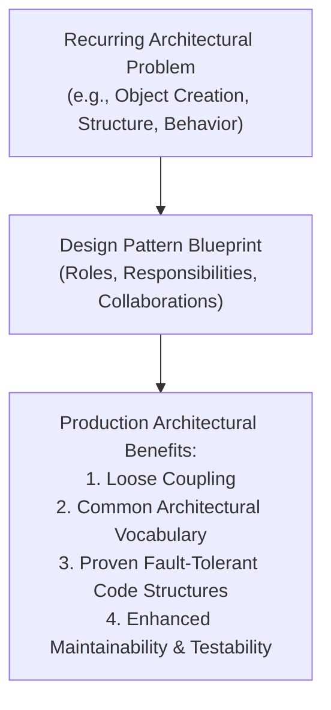

### 2. Deep-Dive Architecture & Runtime Internals
Design patterns solve fundamental architectural challenges:
1. **Coupling to Specific Implementations**: Abstracting object creation allows code to operate on interfaces rather than concrete types.
2. **Algorithmic Inflexibility**: Allowing algorithms to change at runtime (e.g., Strategy, State) without modifying client code.
3. **Complex Object Graphs**: Managing intricate hierarchies and subsystem interactions cleanly (e.g., Facade, Composite).
4. **Common Architectural Vocabulary**: Allowing engineers to discuss complex architectures efficiently (e.g., "Let's put an Adapter between those services" conveys an entire architectural design in a single sentence).

### 3. Production-Ready Code Implementation
```csharp
// The Problem: Client tightly coupled to multiple heterogeneous notification implementations
// The Solution: Adapter Design Pattern provides a unified interface
public interface IEnterpriseNotifier
{
    Task NotifyAsync(string recipient, string title, string message);
}

// Incompatible Third-Party Legacy SMS Service
public class LegacyTwilioSmsClient
{
    public void SendSmsPayload(long phoneNumber, string text)
    {
        Console.WriteLine($"[Twilio SMS] Sending to {phoneNumber}: {text}");
    }
}

// Incompatible Modern Cloud Email Service
public class SendGridEmailClient
{
    public Task DispatchEmailAsync(string toAddress, string subject, string htmlContent)
    {
        Console.WriteLine($"[SendGrid Email] Sending to {toAddress} - Subject: {subject}");
        return Task.CompletedTask;
    }
}

// Adapter 1: Adapting Legacy SMS Client to Enterprise Interface
public class TwilioSmsAdapter : IEnterpriseNotifier
{
    private readonly LegacyTwilioSmsClient _twilioClient;

    public TwilioSmsAdapter(LegacyTwilioSmsClient twilioClient)
    {
        _twilioClient = twilioClient;
    }

    public Task NotifyAsync(string recipient, string title, string message)
    {
        long phone = long.Parse(recipient.Replace("+", "").Replace("-", ""));
        _twilioClient.SendSmsPayload(phone, $"{title}: {message}");
        return Task.CompletedTask;
    }
}

// Adapter 2: Adapting SendGrid Client to Enterprise Interface
public class SendGridEmailAdapter : IEnterpriseNotifier
{
    private readonly SendGridEmailClient _sendGridClient;

    public SendGridEmailAdapter(SendGridEmailClient sendGridClient)
    {
        _sendGridClient = sendGridClient;
    }

    public async Task NotifyAsync(string recipient, string title, string message)
    {
        await _sendGridClient.DispatchEmailAsync(recipient, title, $"<p>{message}</p>");
    }
}
```

### 4. Line-by-Line Code Walkthrough
- `public interface IEnterpriseNotifier`: The target interface expected by high-level business code.
- `LegacyTwilioSmsClient` and `SendGridEmailClient`: Adaptees with incompatible method names, signatures, and data types.
- `TwilioSmsAdapter` / `SendGridEmailAdapter`: Adapter classes that wrap the incompatible clients and implement `IEnterpriseNotifier`, allowing client code to treat them interchangeably.

### 5. Real-World Enterprise Use Case & Application
Enterprise systems integrating multiple third-party payment gateways (Stripe, PayPal, Adyen) or cloud providers (AWS S3, Azure Blob, Google Cloud Storage) use the **Adapter Pattern** to expose a unified internal interface (`IBlobStorageService`), preventing vendor lock-in across the codebase.

### 6. Common Pitfalls, Memory Traps & Anti-Patterns
- **Patternitis (Golden Hammer)**: Forcing design patterns into every corner of an application where simple, direct code would suffice. Patterns introduce indirection and cognitive overhead; use them only when addressing actual architectural complexity.

### 7. Senior / Architect Interview Follow-ups
- **Interviewer**: *What is the difference between an Architectural Pattern, a Design Pattern, and an Idiom?*
- **Candidate Answer**: They operate at different levels of architectural granularity. **Architectural Patterns** (e.g., Microservices, Event-Driven, Hexagonal, CQRS) govern the overall structure and subsystems of an entire distributed application. **Design Patterns** (e.g., Factory, Strategy, Observer) govern the relationships, composition, and interactions among classes and components within a process. **Idioms** (e.g., `using` statements, `IDisposable`, `IAsyncEnumerable` in C#) are language-specific implementation techniques.

---

## Q242. What are the types of Design Patterns?

### 1. Executive Summary & Core Concept
The 23 classic Gang of Four (GoF) design patterns are classified into three primary categories based on their design intent:
1. **Creational Patterns (5 patterns)**: Focus on object instantiation mechanisms, decoupling the client from the concrete creation logic.
2. **Structural Patterns (7 patterns)**: Focus on how classes and objects are composed to form larger, flexible structures.
3. **Behavioral Patterns (11 patterns)**: Focus on communication, responsibilities, and algorithm flow between collaborating objects.

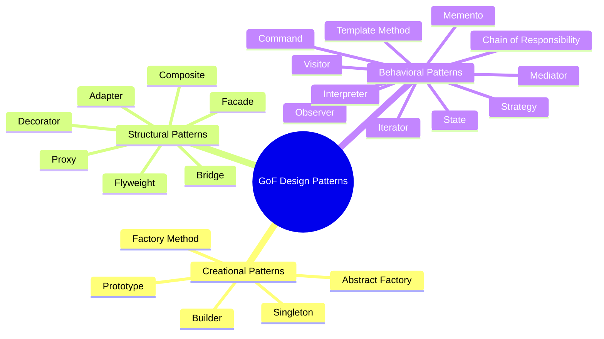

### 2. Deep-Dive Architecture & Runtime Internals
- **Creational**: Shifts object creation from hardcoded `new` invocations to polymorphic abstractions. Controls instance counts (Singleton) or handles complex multi-step construction (Builder).
- **Structural**: Uses inheritance and composition to combine interfaces and classes into flexible subsystem graphs while maintaining loose coupling.
- **Behavioral**: Separates algorithms and workflows from the underlying data structures, enabling dynamic runtime changes to object collaboration.

### 3. Production-Ready Code Implementation
```csharp
// Cross-Category Interaction Example in Modern C#
// 1. Creational: Factory Method creates the strategy
public static class CompressionFactory
{
    public static ICompressionStrategy Create(string fileExtension) => fileExtension.ToLowerInvariant() switch
    {
        ".zip" => new ZipCompressionStrategy(),
        ".gzip" => new GzipCompressionStrategy(),
        _ => throw new NotSupportedException($"Format {fileExtension} is not supported.")
    };
}

// 2. Behavioral: Strategy Pattern handles the compression algorithm
public interface ICompressionStrategy
{
    byte[] Compress(byte[] input);
}

public class ZipCompressionStrategy : ICompressionStrategy
{
    public byte[] Compress(byte[] input) => input; // ZIP algorithm implementation
}

public class GzipCompressionStrategy : ICompressionStrategy
{
    public byte[] Compress(byte[] input) => input; // GZIP algorithm implementation
}

// 3. Structural: Decorator Pattern adds logging/auditing to any compression strategy
public class AuditedCompressionDecorator : ICompressionStrategy
{
    private readonly ICompressionStrategy _inner;

    public AuditedCompressionDecorator(ICompressionStrategy inner)
    {
        _inner = inner;
    }

    public byte[] Compress(byte[] input)
    {
        Console.WriteLine($"[Audit] Compressing {input.Length} bytes via {_inner.GetType().Name}");
        var result = _inner.Compress(input);
        Console.WriteLine($"[Audit] Resulting size: {result.Length} bytes");
        return result;
    }
}
```

### 4. Line-by-Line Code Walkthrough
- `CompressionFactory.Create(...)`: **Creational Pattern** that encapsulates object instantiation logic.
- `ICompressionStrategy` / `ZipCompressionStrategy`: **Behavioral Pattern (Strategy)** that encapsulates swappable algorithms.
- `AuditedCompressionDecorator`: **Structural Pattern (Decorator)** that wraps an existing object to add cross-cutting behavior without modifying its source code.

### 5. Real-World Enterprise Use Case & Application
ASP.NET Core combines all three categories:
- **Creational**: `IHttpClientFactory`, `WebApplication.CreateBuilder()`.
- **Structural**: Middleware pipeline (Decorator/Chain of Responsibility), `IApplicationBuilder`.
- **Behavioral**: `IAsyncActionFilter`, Options pattern change listeners (`IOptionsMonitor`).

### 6. Common Pitfalls, Memory Traps & Anti-Patterns
- **Ignoring Modern Language Features**: Implementing verbose Gang of Four patterns where modern C# features make them obsolete (e.g., using verbose Command patterns where simple C# `Action` or `Func` delegates suffice).

### 7. Senior / Architect Interview Follow-ups
- **Interviewer**: *How does the modern functional programming paradigm impact classic object-oriented design patterns?*
- **Candidate Answer**: Modern C# has adopted functional programming features (pattern matching, records, lambda expressions, higher-order functions) that simplify or replace several classic GoF patterns. For example, the **Strategy Pattern** can often be expressed as a simple `Func<T, TResult>` parameter; the **Command Pattern** can be represented by closures; and the **Visitor Pattern** is largely superseded by C# pattern matching with switch expressions over closed type hierarchies.

---

## Q243. What are Creational Design Patterns?

### 1. Executive Summary & Core Concept
**Creational Design Patterns** abstract the object instantiation process. They make a system independent of how its objects are created, composed, and represented. Instead of hardcoding concrete class instantiations across an application via the `new` operator, creational patterns encapsulate object construction logic behind abstractions.

The five classic GoF creational patterns are:
1. **Singleton**: Ensures a class has only one instance and provides a global access point.
2. **Factory Method**: Defines an interface for creating an object, but lets subclasses decide which class to instantiate.
3. **Abstract Factory**: Creates families of related or dependent objects without specifying their concrete classes.
4. **Builder**: Separates the construction of a complex object from its representation, allowing the same construction process to create different representations.
5. **Prototype**: Creates new objects by cloning an existing instance (shallow or deep copy).

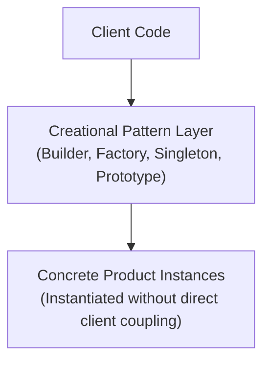

### 2. Deep-Dive Architecture & Runtime Internals
- **Decoupling Creation from Usage**: When a class calls `new ConcreteService()`, it creates a hard compile-time dependency on that concrete implementation, preventing polymorphism and mock testing.
- **Creational encapsulation** allows:
  - Deferring instantiation until runtime based on configuration.
  - Transparently pooling or recycling instances (e.g., object pools, database connection pooling).
  - Enforcing invariants across complex multi-property object graphs (e.g., via the Builder pattern).

### 3. Production-Ready Code Implementation
```csharp
// Example: The Builder Pattern for Complex Immutable Domain Objects
public class CloudServerConfiguration
{
    public string Hostname { get; init; } = string.Empty;
    public int CpuCores { get; init; }
    public int MemoryGb { get; init; }
    public bool EnableTls { get; init; }
    public IReadOnlyList<int> AllowedPorts { get; init; } = [];

    // Internal constructor enforces usage of the Builder
    internal CloudServerConfiguration() { }
}

public class CloudServerBuilder
{
    private string _hostname = "localhost";
    private int _cpuCores = 2;
    private int _memoryGb = 4;
    private bool _enableTls = true;
    private readonly List<int> _ports = [80, 443];

    public CloudServerBuilder WithHostname(string hostname)
    {
        _hostname = hostname ?? throw new ArgumentNullException(nameof(hostname));
        return this;
    }

    public CloudServerBuilder WithHardware(int cpuCores, int memoryGb)
    {
        if (cpuCores <= 0 || memoryGb <= 0) throw new ArgumentOutOfRangeException("Hardware specs must be positive");
        _cpuCores = cpuCores;
        _memoryGb = memoryGb;
        return this;
    }

    public CloudServerBuilder WithoutTls()
    {
        _enableTls = false;
        return this;
    }

    public CloudServerBuilder OpenPort(int port)
    {
        if (!_ports.Contains(port)) _ports.Add(port);
        return this;
    }

    public CloudServerConfiguration Build()
    {
        // Enforce invariants before returning the completed instance
        return new CloudServerConfiguration
        {
            Hostname = _hostname,
            CpuCores = _cpuCores,
            MemoryGb = _memoryGb,
            EnableTls = _enableTls,
            AllowedPorts = _ports.AsReadOnly()
        };
    }
}
```

### 4. Line-by-Line Code Walkthrough
- `public class CloudServerConfiguration`: Immutable configuration class with init-only properties.
- `public class CloudServerBuilder`: Fluent builder encapsulating default values and validation rules.
- `public CloudServerConfiguration Build()`: Validates invariants and returns the completed, immutable configuration instance.

### 5. Real-World Enterprise Use Case & Application
The **Builder Pattern** is used extensively throughout modern .NET: `WebApplication.CreateBuilder(args)`, `IHostBuilder`, `DbContextOptionsBuilder`, and `ConfigurationBuilder` all employ fluent builders to assemble complex runtime subsystems before finalizing them.

### 6. Common Pitfalls, Memory Traps & Anti-Patterns
- **Creating Builders for Simple Objects**: Implementing a verbose builder for a simple 3-property DTO that could be represented with a C# record. Use builders when construction involves complex defaults, multi-step assembly, or invariant validation.

### 7. Senior / Architect Interview Follow-ups
- **Interviewer**: *When would you choose the Prototype Pattern over the Factory Pattern?*
- **Candidate Answer**: We choose the **Prototype Pattern** when instantiating a new object directly is computationally expensive (e.g., loading complex data from a database or parsing large configuration files), but creating a clone of an existing, pre-warmed instance via shallow/deep copy is fast and lightweight.

---

## Q244. What are Structural Design Patterns?

### 1. Executive Summary & Core Concept
**Structural Design Patterns** focus on how classes and objects are composed to form larger, more capable structures while keeping those structures flexible and efficient. They use inheritance to compose interfaces and definitions, and composition to compose objects to achieve new functionality.

The seven classic GoF structural patterns are:
1. **Adapter**: Converts the interface of a class into another interface clients expect.
2. **Decorator**: Dynamically attaches additional responsibilities to an object without subclassing.
3. **Facade**: Provides a simplified, high-level interface to a complex subsystem.
4. **Composite**: Composes objects into tree structures to represent part-whole hierarchies.
5. **Proxy**: Provides a surrogate or placeholder for another object to control access to it (e.g., lazy loading, security, caching).
6. **Bridge**: Decouples an abstraction from its implementation so that the two can vary independently.
7. **Flyweight**: Minimizes memory usage by sharing common state among large numbers of fine-grained objects.

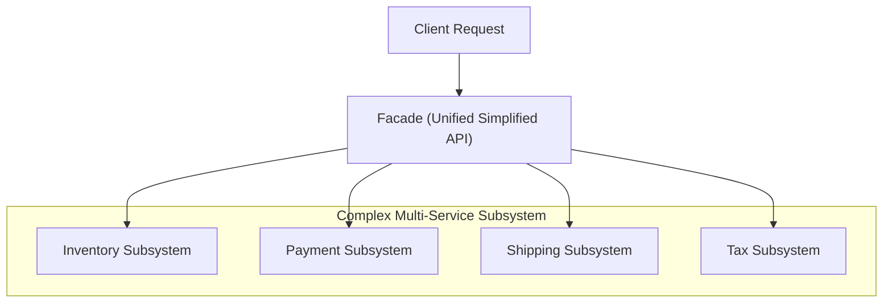

### 2. Deep-Dive Architecture & Runtime Internals
- **Favor Composition Over Inheritance**: Structural patterns emphasize composition (holding a reference to another object) over inheritance. Class inheritance creates compile-time coupling, whereas object composition allows behaviors to be assembled dynamically at runtime.
- **Memory Optimization via Flyweight**: Separates **intrinsic state** (context-independent, shared state stored once) from **extrinsic state** (context-dependent state passed in by callers), reducing memory consumption for large object collections.

### 3. Production-Ready Code Implementation
```csharp
// Structural Pattern Example: The Facade Pattern
public class OrderFulfillmentFacade
{
    private readonly IInventoryService _inventory;
    private readonly IPaymentService _payment;
    private readonly IShippingService _shipping;

    public OrderFulfillmentFacade(
        IInventoryService inventory,
        IPaymentService payment,
        IShippingService shipping)
    {
        _inventory = inventory;
        _payment = payment;
        _shipping = shipping;
    }

    // Simplified high-level API hiding complex subsystem coordination
    public async Task<bool> ProcessOrderAsync(Guid customerId, Guid productId, decimal amount)
    {
        if (!await _inventory.CheckStockAsync(productId))
            return false;

        var paymentSuccess = await _payment.ChargeCustomerAsync(customerId, amount);
        if (!paymentSuccess)
            return false;

        await _inventory.ReserveStockAsync(productId);
        await _shipping.CreateShipmentLabelAsync(customerId, productId);

        return true;
    }
}

public interface IInventoryService { Task<bool> CheckStockAsync(Guid id); Task ReserveStockAsync(Guid id); }
public interface IPaymentService { Task<bool> ChargeCustomerAsync(Guid id, decimal amt); }
public interface IShippingService { Task CreateShipmentLabelAsync(Guid cId, Guid pId); }
```

### 4. Line-by-Line Code Walkthrough
- `OrderFulfillmentFacade`: Provides a clean, single-method interface for clients, hiding the orchestration of multiple underlying services.
- `ProcessOrderAsync`: Coordinates inventory checks, payment processing, stock reservation, and shipping label generation in the correct sequence.

### 5. Real-World Enterprise Use Case & Application
Enterprise API Gateways (like Ocelot, Azure API Management, or AWS API Gateway) act as **Facades** for backend microservice meshes: a single mobile request to `/checkout` is orchestrated into multiple internal calls to customer, catalog, ordering, and payment microservices.

### 6. Common Pitfalls, Memory Traps & Anti-Patterns
- **The "God Facade"**: Allowing a facade to grow into a massive class with dozens of methods and dependencies, turning it into a monolithic anti-pattern. Keep facades focused on specific business workflows.

### 7. Senior / Architect Interview Follow-ups
- **Interviewer**: *What is the difference between the Decorator Pattern, the Proxy Pattern, and the Adapter Pattern?*
- **Candidate Answer**: While all three wrap an underlying object, their **design intent** differs:
  - **Adapter** changes the underlying interface to match what a client expects.
  - **Decorator** preserves the original interface but adds new behavior dynamically (e.g., caching or logging).
  - **Proxy** preserves the original interface but controls access to the underlying object (e.g., lazy loading, security checks, or distributed RPC calls).

---

## Q245. What are Behavioral Design Patterns?

### 1. Executive Summary & Core Concept
**Behavioral Design Patterns** are concerned with algorithms and the assignment of responsibilities between objects. They characterize complex control flow that is difficult to follow at runtime, shifting focus away from flow of control to the ways objects communicate and interact.

The eleven classic GoF behavioral patterns are:
1. **Strategy**: Encapsulates interchangeable algorithms within objects.
2. **Observer**: Notifies multiple dependent objects automatically when state changes (pub/sub).
3. **Command**: Encapsulates a request as an object, supporting parameterization, queuing, and undoable operations.
4. **Mediator**: Restricts direct communications between objects, forcing them to collaborate through a central mediator object.
5. **Chain of Responsibility**: Passes a request along a dynamic chain of potential handlers until one handles it.
6. **Template Method**: Defines the skeleton of an algorithm in a base class, letting subclasses override specific steps without changing the structure.
7. **State**: Allows an object to alter its behavior when its internal state changes.
8. **Iterator**: Provides a way to access elements of an aggregate object sequentially without exposing its underlying representation.
9. **Visitor**: Separates an algorithm from the object structure on which it operates.
10. **Memento**: Captures and externalizes an object's internal state so it can be restored later without violating encapsulation.
11. **Interpreter**: Implements a grammar representation and interpreter for a domain-specific language.

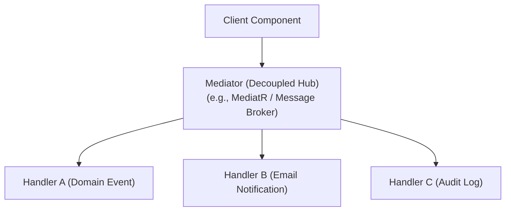

### 2. Deep-Dive Architecture & Runtime Internals
Behavioral patterns reduce coupling between senders and receivers:
- **Direct Coupling**: Object A directly invokes `ObjectB.Method()`, creating tight coupling between the two types.
- **Decoupled Behavioral Communication**: Object A dispatches an event, notification, or command object to a mediator or handler chain. Object A has zero compile-time or runtime knowledge of who processes the message.

### 3. Production-Ready Code Implementation
```csharp
// Example: The Chain of Responsibility Pattern for Validation & Processing
public abstract class RequestHandler
{
    private RequestHandler? _nextHandler;

    public RequestHandler SetNext(RequestHandler next)
    {
        _nextHandler = next;
        return next;
    }

    public virtual async Task HandleAsync(OrderRequestContext context)
    {
        if (_nextHandler != null)
        {
            await _nextHandler.HandleAsync(context);
        }
    }
}

public class AuthenticationHandler : RequestHandler
{
    public override async Task HandleAsync(OrderRequestContext context)
    {
        if (!context.IsAuthenticated)
            throw new UnauthorizedAccessException("Request must be authenticated.");

        Console.WriteLine("[Chain 1] Authentication verified.");
        await base.HandleAsync(context);
    }
}

public class RiskAssessmentHandler : RequestHandler
{
    public override async Task HandleAsync(OrderRequestContext context)
    {
        if (context.OrderAmount > 10_000 && !context.HasMfaVerified)
            throw new InvalidOperationException("High-value transactions require MFA.");

        Console.WriteLine("[Chain 2] Risk assessment cleared.");
        await base.HandleAsync(context);
    }
}

public class OrderRequestContext
{
    public bool IsAuthenticated { get; init; }
    public decimal OrderAmount { get; init; }
    public bool HasMfaVerified { get; init; }
}
```

### 4. Line-by-Line Code Walkthrough
- `public abstract class RequestHandler`: Base class holding the reference to the next handler in the chain (`_nextHandler`).
- `AuthenticationHandler`: First handler in the chain; verifies authentication and either short-circuits or calls `base.HandleAsync(context)`.
- `RiskAssessmentHandler`: Second handler; validates high-value transaction security rules.

### 5. Real-World Enterprise Use Case & Application
The ASP.NET Core Middleware pipeline is a direct implementation of the **Chain of Responsibility** pattern. The popular **MediatR** library is an enterprise implementation of the **Mediator** and **Command** patterns, decoupling CQRS commands from their execution handlers.

### 6. Common Pitfalls, Memory Traps & Anti-Patterns
- **Unbroken Chains with Circular References**: Accidentally linking the tail of a handler chain back to its head, causing infinite recursion and `StackOverflowException`.
- **Silent Dropping of Requests**: In Chain of Responsibility, if no handler processes the request and there is no terminal fallback, the request is silently ignored without errors.

### 7. Senior / Architect Interview Follow-ups
- **Interviewer**: *How does the Mediator pattern improve system maintainability compared to direct event subscriptions (Observer pattern)?*
- **Candidate Answer**: In a large system using direct Observer subscriptions, components subscribe to each other's events directly, creating an unmaintainable "many-to-many" mesh of dependencies where tracing event propagation is difficult. The **Mediator pattern** centralizes all communication into a single hub ("many-to-one"), making message flow predictable, traceable, and easily decorated with cross-cutting behaviors (logging, validation, transactions).

---

## Q246. What is the Singleton Design Pattern?

### 1. Executive Summary & Core Concept
The **Singleton Design Pattern** is a creational pattern that ensures a class has **only one instance** throughout the application's lifetime, while providing a **global point of access** to that instance.

Key characteristics of a proper Singleton:
1. **Private Constructor**: Prevents external code from instantiating the class using `new`.
2. **Private Static Instance Field**: Holds the single instance in memory.
3. **Public Static Accessor Property**: Provides global access to the instance (often creating it lazily on first access).
4. **Sealed Class**: Prevents subclassing, which could otherwise create additional instances.

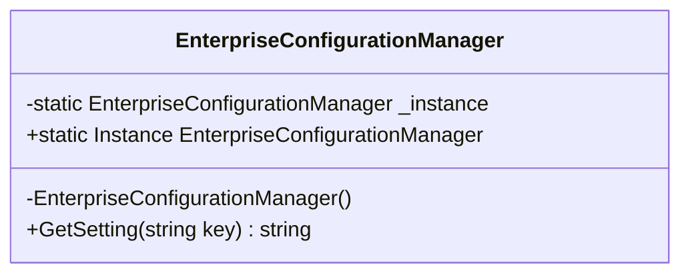

### 2. Deep-Dive Architecture & Runtime Internals
- **Memory Footprint**: A Singleton instance lives in Gen 2 of the Managed Heap for the lifetime of the process. It is never collected by the Garbage Collector until the application domain shuts down.
- **Eager vs. Lazy Loading**:
  - **Eager Initialization**: The instance is created when the class is first loaded by the runtime (e.g., via a static field initializer). Simple and inherently thread-safe, but consumes memory even if the instance is never used.
  - **Lazy Initialization**: The instance is instantiated only on first call to `Instance`. Saves memory, but requires synchronization to remain thread-safe.

### 3. Production-Ready Code Implementation
```csharp
// Modern, Idiomatic C# Singleton using System.Lazy<T> (Thread-Safe & Lazily Initialized)
public sealed class CacheRegistrySingleton
{
    // System.Lazy<T> handles thread safety and lazy initialization internally
    private static readonly Lazy<CacheRegistrySingleton> _lazyInstance =
        new Lazy<CacheRegistrySingleton>(
            valueFactory: () => new CacheRegistrySingleton(),
            mode: LazyThreadSafetyMode.ExecutionAndPublication);

    // Private constructor prevents external 'new' instantiations
    private CacheRegistrySingleton()
    {
        Console.WriteLine($"[Singleton Initialized] Created at {DateTime.UtcNow.Ticks}");
    }

    // Public static accessor property
    public static CacheRegistrySingleton Instance => _lazyInstance.Value;

    // Instance business method
    public void Store(string key, object value)
    {
        // Thread-safe dictionary operation
    }
}
```

### 4. Line-by-Line Code Walkthrough
- `public sealed class CacheRegistrySingleton`: The `sealed` modifier prevents inheritance from bypassing private constructor protections.
- `private static readonly Lazy<CacheRegistrySingleton> _lazyInstance`: Uses the runtime's `Lazy<T>` wrapper, ensuring the instance is created only when `.Value` is first accessed.
- `LazyThreadSafetyMode.ExecutionAndPublication`: Guarantees that only one thread can execute the factory method, and all threads receive the exact same instance.
- `private CacheRegistrySingleton()`: Private parameterless constructor.

### 5. Real-World Enterprise Use Case & Application
Singletons are appropriate for shared resources with significant initialization costs that maintain application-wide state:
- Hardware driver interfaces and device connections.
- Internal thread-safe cache managers.
- Telemetry/metrics aggregators (`System.Diagnostics.Metrics.Meter`).

### 6. Common Pitfalls, Memory Traps & Anti-Patterns
- **The Singleton Anti-Pattern**: Using Singletons as disguised global variables holding mutable state. This introduces hidden dependencies, creates race conditions, and makes isolated unit testing difficult.
- **Untracked Memory Leaks**: Attaching events to a Singleton from short-lived objects. The Singleton holds a reference to the event subscriber, preventing the subscriber from being garbage-collected (the "Lapsed Listener" leak).

### 7. Senior / Architect Interview Follow-ups
- **Interviewer**: *Why do modern enterprise architectures prefer DI-managed Singletons (`services.AddSingleton<T>()`) over the classic GoF static Singleton class?*
- **Candidate Answer**: Classic static Singletons introduce tight coupling to concrete types, make unit testing difficult (static classes cannot be easily mocked), and hide dependencies. With DI-managed Singletons, the class implements an interface (`ICacheRegistry`), dependencies are declared explicitly via constructor injection, and the DI container manages the single-instance lifetime. The class remains a standard, testable class without static state.

---

## Q247. How to make the singleton pattern thread-safe?

### 1. Executive Summary & Core Concept
Making a Singleton thread-safe ensures that when multiple concurrent threads attempt to access the `Instance` property simultaneously for the first time, **exactly one instance** is created, preventing race conditions, multiple allocations, or corrupted state.

In C#, there are three primary patterns for thread-safe Singletons:
1. **`System.Lazy<T>` (Recommended / Modern Standard)**: Idiomatic, performant, and fully managed by the .NET runtime.
2. **Double-Checked Locking**: The classic low-level pattern using a synchronization lock object.
3. **Static Constructor / Static Initializer**: Relies on the CLR type loader to initialize the static instance in a thread-safe manner upon first class reference.

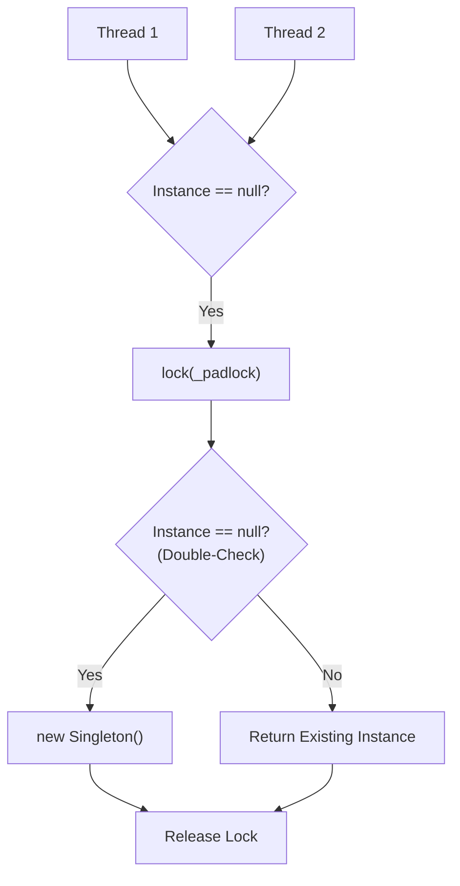

### 2. Deep-Dive Architecture & Runtime Internals
- **Double-Checked Locking Memory Model**:
  - The first `if (instance == null)` check avoids acquiring an expensive monitor lock on every access once the instance has been created.
  - The `lock (_padlock)` ensures mutual exclusion during initialization.
  - The second `if (instance == null)` check inside the lock ensures that if another thread acquired the lock while this thread was waiting, a duplicate instance is not created.
  - In modern .NET Core (ECMA-335 memory model), static initializers and `Lazy<T>` insert appropriate memory barriers (`volatile` semantics) to prevent CPU instruction reordering.

### 3. Production-Ready Code Implementation
```csharp
// Pattern 1: Classic Double-Checked Locking (Thread-Safe)
public sealed class DoubleCheckedSingleton
{
    private static DoubleCheckedSingleton? _instance;
    private static readonly object _padlock = new object();

    private DoubleCheckedSingleton() { }

    public static DoubleCheckedSingleton Instance
    {
        get
        {
            // 1st Check: Fast path without lock overhead
            if (_instance == null)
            {
                lock (_padlock)
                {
                    // 2nd Check: Ensures only one thread creates the instance
                    if (_instance == null)
                    {
                        _instance = new DoubleCheckedSingleton();
                    }
                }
            }
            return _instance;
        }
    }
}

// Pattern 2: CLR Static Initializer (Thread-Safe via Static Constructor)
public sealed class StaticInitSingleton
{
    // CLR guarantees static initializers are executed in a thread-safe manner
    private static readonly StaticInitSingleton _instance = new StaticInitSingleton();

    // Explicit static constructor tells C# compiler not to mark type as beforefieldinit
    static StaticInitSingleton() { }

    private StaticInitSingleton() { }

    public static StaticInitSingleton Instance => _instance;
}
```

### 4. Line-by-Line Code Walkthrough
- `private static readonly object _padlock = new object();`: Dedicated private synchronization lock object. Never lock on `typeof(Class)` or `this` to prevent external deadlocks.
- `if (_instance == null)`: The outer check avoids the performance penalty of `Monitor.Enter` once the singleton is initialized.
- `static StaticInitSingleton() { }`: An explicit static constructor prevents the C# compiler from emitting the `beforefieldinit` IL metadata flag, guaranteeing that initialization occurs strictly on first access to a member of the class.

### 5. Real-World Enterprise Use Case & Application
Under high-load startup scenarios (e.g., thousands of concurrent requests arriving immediately after a cold start), thread-safe Singletons prevent multiple database connection pools or socket listeners from initializing simultaneously.

### 6. Common Pitfalls, Memory Traps & Anti-Patterns
- **Missing the Inner Check in Double-Checked Locking**: Omitting the second `if (_instance == null)` inside the `lock` block. If two threads pass the first check simultaneously, both will acquire the lock sequentially and create two separate instances.
- **Locking on a Publicly Accessible Object**: Using `lock(this)` or `lock(typeof(MyClass))` allows external code to lock on the same object, leading to application-wide deadlocks.

### 7. Senior / Architect Interview Follow-ups
- **Interviewer**: *What does the `beforefieldinit` IL flag do, and why is an explicit static constructor significant for Singletons?*
- **Candidate Answer**: When a class has static field initializers but no explicit static constructor, the C# compiler marks the type with the `beforefieldinit` IL flag. This gives the JIT compiler permission to execute the field initializer aggressively at any time prior to the first field access (even before the class is directly touched). Adding an explicit static constructor (`static MyClass() { }`) removes this flag, guaranteeing **strict lazy initialization** upon first reference.

---

## Q248. What is the Factory pattern? Why use the factory pattern?

### 1. Executive Summary & Core Concept
The **Simple Factory** (or Factory idiom) is a creational pattern where a dedicated factory class encapsulates the creation logic for multiple related concrete classes behind a common interface.

**Why use the Factory pattern?**
1. **Encapsulates Complex Instantiation**: Hides constructor parameters, environment variables, and configuration lookups from client code.
2. **Promotes Loose Coupling**: Clients program against the abstract interface without direct dependencies on concrete implementations.
3. **Eliminates Code Duplication**: Centralizes creation rules that would otherwise be duplicated across multiple callers.
4. **Supports the Open-Closed Principle**: Adding a new product type requires updating the factory without modifying existing client callers.

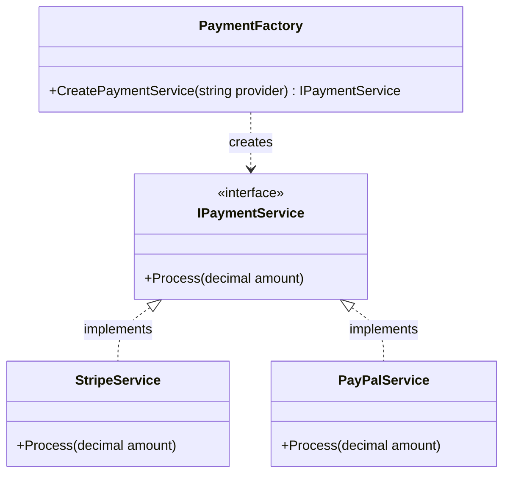

### 2. Deep-Dive Architecture & Runtime Internals
- Without a factory, client code uses hardcoded `new` operators and `switch` statements scattered across controllers and services.
- The Factory pattern consolidates this logic into a single location. In modern .NET, factories often collaborate with the DI container (`IServiceProvider`), resolving dependencies dynamically based on runtime parameters.

### 3. Production-Ready Code Implementation
```csharp
// Simple Factory Pattern with DI Integration
public interface IMessageChannel
{
    Task SendAsync(string recipient, string message);
}

public class EmailChannel : IMessageChannel
{
    public Task SendAsync(string recipient, string message)
    {
        Console.WriteLine($"[Email] Sent to {recipient}: {message}");
        return Task.CompletedTask;
    }
}

public class SmsChannel : IMessageChannel
{
    public Task SendAsync(string recipient, string message)
    {
        Console.WriteLine($"[SMS] Sent to {recipient}: {message}");
        return Task.CompletedTask;
    }
}

public enum ChannelType { Email, Sms }

public class MessageChannelFactory
{
    private readonly IServiceProvider _serviceProvider;

    public MessageChannelFactory(IServiceProvider serviceProvider)
    {
        _serviceProvider = serviceProvider;
    }

    public IMessageChannel Create(ChannelType type) => type switch
    {
        ChannelType.Email => _serviceProvider.GetRequiredService<EmailChannel>(),
        ChannelType.Sms => _serviceProvider.GetRequiredService<SmsChannel>(),
        _ => throw new ArgumentOutOfRangeException(nameof(type), $"Unsupported channel: {type}")
    };
}
```

### 4. Line-by-Line Code Walkthrough
- `public interface IMessageChannel`: The abstraction returned by the factory.
- `public class MessageChannelFactory`: The factory class encapsulating instantiation and DI resolution logic.
- `_serviceProvider.GetRequiredService<EmailChannel>()`: Resolves the concrete channel from the DI container, ensuring its own dependencies are injected properly.

### 5. Real-World Enterprise Use Case & Application
In document management systems, an `ExportDocumentFactory` dynamically creates appropriate exporter instances (`PdfExporter`, `ExcelExporter`, `CsvExporter`) based on the file format requested by the user.

### 6. Common Pitfalls, Memory Traps & Anti-Patterns
- **Turning the Factory into a God Object**: Creating a single monolithic factory that instantiates dozens of unrelated classes across multiple domains.
- **Violating OCP with Hardcoded Switch Statements**: Having to modify the factory's `switch` statement every time a new type is added. This can be improved using dynamic registration dictionaries or the **Factory Method** pattern.

### 7. Senior / Architect Interview Follow-ups
- **Interviewer**: *How does the `IHttpClientFactory` in .NET Core apply the Factory pattern, and what major problem does it solve?*
- **Candidate Answer**: `IHttpClientFactory` encapsulates the creation and lifecycle of `HttpClient` instances and their underlying `HttpMessageHandler` pipelines. It solves two major networking problems: (1) **Socket Exhaustion** caused by repeatedly instantiating and disposing `HttpClient` instances, and (2) **Stale DNS Resolution** caused by keeping long-lived Singleton `HttpClient` instances that fail to detect DNS changes. It does this by pooling and rotating the underlying `HttpMessageHandler` instances on a 2-minute cycle while providing transient `HttpClient` instances to callers.

---

## Q249. How to implement the Factory Method pattern?

### 1. Executive Summary & Core Concept
The **Factory Method Pattern** is a Gang of Four creational pattern that **defines an abstract interface/method for creating an object, but defers the actual instantiation to subclasses**. Instead of a single class containing `switch` logic, the base creator class declares the factory method, and each concrete creator subclass instantiates its corresponding product.

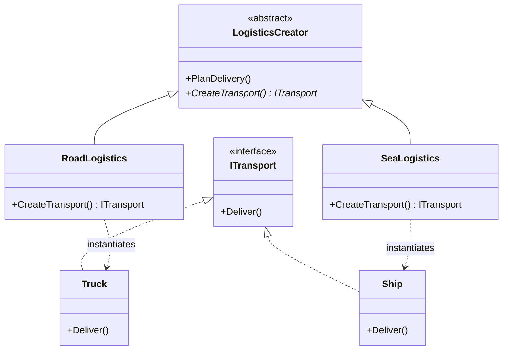

### 2. Deep-Dive Architecture & Runtime Internals
- **Inversion of Control in Creation**: The base class encapsulates business workflows (e.g., `PlanDelivery()`) that operate on the abstract product (`ITransport`), but delegates the creation step to polymorphic overrides (`CreateTransport()`).
- Unlike the Simple Factory (which uses a single class with conditional logic), the Factory Method pattern relies on **inheritance and polymorphism** to satisfy the Open-Closed Principle without `switch` statements.

### 3. Production-Ready Code Implementation
```csharp
// Product Interface
public interface ITransport
{
    string Deliver();
}

// Concrete Products
public class Truck : ITransport
{
    public string Deliver() => "Delivered overland in a refrigerated truck.";
}

public class Ship : ITransport
{
    public string Deliver() => "Delivered across the sea via cargo container ship.";
}

// Abstract Creator
public abstract class Logistics
{
    // The Factory Method
    public abstract ITransport CreateTransport();

    // Core business workflow operating on the abstract product
    public string PlanDelivery()
    {
        // Call the factory method to obtain a transport instance
        var transport = CreateTransport();
        return $"[Logistics Execution] Starting shipment: {transport.Deliver()}";
    }
}

// Concrete Creators override the Factory Method
public class RoadLogistics : Logistics
{
    public override ITransport CreateTransport() => new Truck();
}

public class SeaLogistics : Logistics
{
    public override ITransport CreateTransport() => new Ship();
}
```

### 4. Line-by-Line Code Walkthrough
- `public abstract ITransport CreateTransport()`: The core **Factory Method** signature on the abstract base class.
- `public string PlanDelivery()`: Template/workflow method in the base class that consumes the created product without knowing its concrete type.
- `RoadLogistics` / `SeaLogistics`: Subclasses that implement `CreateTransport()` to return their specific concrete product.

### 5. Real-World Enterprise Use Case & Application
UI component frameworks use the Factory Method pattern extensively: a cross-platform dialog framework defines an abstract `Dialog` base class with a `CreateButton()` factory method; `WindowsDialog` overrides it to return a `WindowsButton`, while `LinuxDialog` overrides it to return a `GtkButton`.

### 6. Common Pitfalls, Memory Traps & Anti-Patterns
- **Subclass Explosion**: Requiring a new creator subclass for every new product subclass. If you have 20 products, you end up with 20 creator classes. When this occurs, consider the **Strategy** or **Simple Factory** pattern instead.

### 7. Senior / Architect Interview Follow-ups
- **Interviewer**: *What is the fundamental difference between the Simple Factory idiom and the Factory Method pattern?*
- **Candidate Answer**: A **Simple Factory** is a standalone, concrete class with a method (often using `switch/case` or DI lookups) that instantiates various classes. The **Factory Method pattern** is an object-oriented pattern based on **inheritance**: an abstract base class declares the creation method and encapsulates business workflows around the abstract product, deferring the instantiation decision to derived subclasses.

---

## Q250. What is the Abstract Factory pattern?

### 1. Executive Summary & Core Concept
The **Abstract Factory Pattern** is a creational pattern that provides an interface for creating **families of related or dependent objects** without specifying their concrete classes.

While the Factory Method creates a single product, the Abstract Factory creates a **suite of products** designed to work together (e.g., Dark Theme UI: Button + Checkbox + Scrollbar vs. Light Theme UI: Button + Checkbox + Scrollbar). It ensures that client code never accidentally mixes incompatible products from different families.

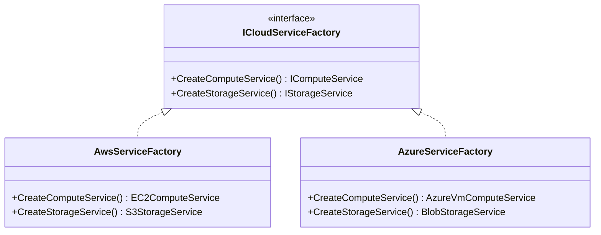

### 2. Deep-Dive Architecture & Runtime Internals
- **Family Consistency Enforcement**: The pattern guarantees that all objects instantiated by a factory instance belong to the same family. A client using an `AwsServiceFactory` is guaranteed to receive AWS compute and AWS storage, preventing accidental mixing of AWS compute with Azure storage.
- **Composition-Based**: Client code holds a reference to `ICloudServiceFactory` via dependency injection and consumes the abstract product families without any reference to concrete cloud providers.

### 3. Production-Ready Code Implementation
```csharp
// Abstract Products Family
public interface IComputeService { string ProvisionServer(); }
public interface IStorageService { string CreateBucket(); }

// Concrete Product Family 1: AWS
public class Ec2ComputeService : IComputeService 
{ 
    public string ProvisionServer() => "AWS EC2 c5.large VM provisioned"; 
}
public class S3StorageService : IStorageService 
{ 
    public string CreateBucket() => "AWS S3 Multi-Region Bucket created"; 
}

// Concrete Product Family 2: Azure
public class AzureVmComputeService : IComputeService 
{ 
    public string ProvisionServer() => "Azure D4s_v5 VM provisioned"; 
}
public class AzureBlobStorageService : IStorageService 
{ 
    public string CreateBucket() => "Azure Blob Storage Account created"; 
}

// The Abstract Factory Interface
public interface ICloudServiceFactory
{
    IComputeService CreateComputeService();
    IStorageService CreateStorageService();
}

// Concrete Factory 1: AWS
public class AwsServiceFactory : ICloudServiceFactory
{
    public IComputeService CreateComputeService() => new Ec2ComputeService();
    public IStorageService CreateStorageService() => new S3StorageService();
}

// Concrete Factory 2: Azure
public class AzureServiceFactory : ICloudServiceFactory
{
    public IComputeService CreateComputeService() => new AzureVmComputeService();
    public IStorageService CreateStorageService() => new AzureBlobStorageService();
}

// Client Workflow consuming the Abstract Factory
public class CloudInfrastructureProvisioner
{
    private readonly IComputeService _compute;
    private readonly IStorageService _storage;

    // Guaranteed to receive a compatible family of services
    public CloudInfrastructureProvisioner(ICloudServiceFactory factory)
    {
        _compute = factory.CreateComputeService();
        _storage = factory.CreateStorageService();
    }

    public void ProvisionEnvironment()
    {
        Console.WriteLine($"Provisioning: {_compute.ProvisionServer()}");
        Console.WriteLine($"Storage: {_storage.CreateBucket()}");
    }
}
```

### 4. Line-by-Line Code Walkthrough
- `IComputeService` / `IStorageService`: Abstract product interfaces representing the product family.
- `ICloudServiceFactory`: The Abstract Factory declaring creation methods for every product in the family.
- `AwsServiceFactory` / `AzureServiceFactory`: Concrete factories producing coordinated product families.
- `CloudInfrastructureProvisioner`: Client class that consumes the abstract factory, remaining completely decoupled from specific cloud SDKs.

### 5. Real-World Enterprise Use Case & Application
Multi-cloud management platforms (such as Terraform cloud providers or multi-tenant database abstraction layers) utilize Abstract Factories to instantiate consistent suites of cloud resources based on the tenant's selected infrastructure provider.

### 6. Common Pitfalls, Memory Traps & Anti-Patterns
- **Extending the Product Family**: Adding a new product type (e.g., `CreateDatabaseService()`) requires modifying the `ICloudServiceFactory` interface, which breaks and requires updates to every existing concrete factory class.
- **Overkill for Single Products**: Using an Abstract Factory when you only need to instantiate a single product type. Use the Factory Method or Simple Factory instead.

### 7. Senior / Architect Interview Follow-ups
- **Interviewer**: *Compare the Factory Method and Abstract Factory patterns. When should you transition from Factory Method to Abstract Factory?*
- **Candidate Answer**: The **Factory Method** uses inheritance to create a single product type (`Logistics.CreateTransport()`). The **Abstract Factory** uses composition to create entire **families of related or dependent products** (`ICloudServiceFactory.CreateCompute()`, `CreateStorage()`). You transition from Factory Method to Abstract Factory when your application expands from creating isolated individual objects to needing coordinated suites of related components that must be kept consistent.

---

## 🏛️ Architectural Appendix: Distributed Systems Patterns

### 1. The Transactional Outbox Pattern (Eliminating Dual-Write Bugs)
In microservice architectures, an API often needs to update a database (e.g., insert an Order) **AND** publish a message to a broker (e.g., Kafka / RabbitMQ). 

#### The Dual-Write Problem:
```csharp
// FATAL ANTI-PATTERN: Dual-Write Hazard!
await _dbContext.SaveChangesAsync(); // Step 1: Succeeds
await _messageBus.PublishAsync(new OrderCreatedEvent(order.Id)); // Step 2: Fails (Network blip)
// RESULT: Inconsistent State! Order exists in DB, but downstream services never notified!
```

#### The Outbox Solution:
Save the domain event directly to an `OutboxMessages` database table **within the exact same database transaction** as the business entity. A background worker periodically polls the outbox table, publishes messages to the message broker, and marks them as processed upon acknowledgment:

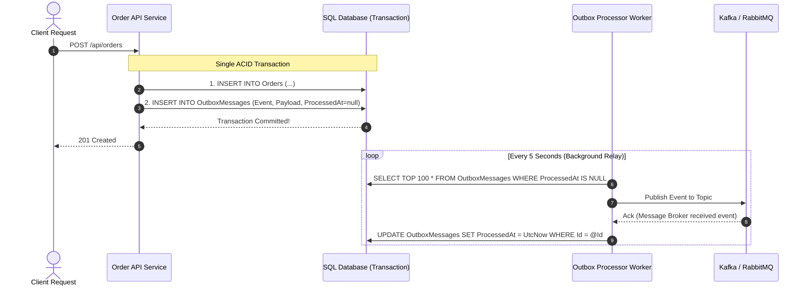

```csharp
public class OrderCheckoutService
{
    private readonly AppDbContext _context;

    public OrderCheckoutService(AppDbContext context) => _context = context;

    public async Task CheckoutAsync(Order order, CancellationToken ct)
    {
        // 1. Prepare domain entity
        _context.Orders.Add(order);

        // 2. Prepare outbox message in the same change-tracker batch!
        var outboxMessage = new OutboxMessage
        {
            Id = Guid.NewGuid(),
            OccurredOnUtc = DateTime.UtcNow,
            EventType = nameof(OrderCreatedEvent),
            Payload = JsonSerializer.Serialize(new OrderCreatedEvent(order.Id, order.TotalAmount))
        };
        _context.OutboxMessages.Add(outboxMessage);

        // 3. Single atomic database commit
        await _context.SaveChangesAsync(ct);
    }
}

public class OutboxMessage
{
    public Guid Id { get; set; }
    public DateTime OccurredOnUtc { get; set; }
    public string EventType { get; set; } = string.Empty;
    public string Payload { get; set; } = string.Empty;
    public DateTime? ProcessedOnUtc { get; set; }
}

public record OrderCreatedEvent(Guid OrderId, decimal Amount);
```

---

### 2. CQRS & The Mediator Pattern (MediatR Blueprint)
Separating read operations from write mutations creates clean, testable, and independently scalable domain logic:

```csharp
// 1. Command Definition (Write Model - Mutates State)
public record CreateProductCommand(string Name, decimal Price) : IRequest<Guid>;

// 2. Command Handler (Applies Business Rules & Persistence)
public class CreateProductCommandHandler : IRequestHandler<CreateProductCommand, Guid>
{
    private readonly IProductRepository _repository;

    public CreateProductCommandHandler(IProductRepository repository)
    {
        _repository = repository;
    }

    public async Task<Guid> Handle(CreateProductCommand request, CancellationToken ct)
    {
        var product = new Product(Guid.NewGuid(), request.Name, request.Price);
        await _repository.InsertAsync(product, ct);
        return product.Id;
    }
}

// 3. Query Definition (Read Model - Fast, Lightweight Projections)
public record GetProductByIdQuery(Guid ProductId) : IRequest<ProductDto?>;

// 4. Query Handler (Bypasses Domain Entities; Direct DTO Materialization via Dapper)
public class GetProductByIdQueryHandler : IRequestHandler<GetProductByIdQuery, ProductDto?>
{
    private readonly IDbConnection _db;
    public GetProductByIdQueryHandler(IDbConnection db) => _db = db;

    public async Task<ProductDto?> Handle(GetProductByIdQuery request, CancellationToken ct)
    {
        return await _db.QueryFirstOrDefaultAsync<ProductDto>(
            "SELECT Id, Name, Price FROM Products WHERE Id = @Id", 
            new { Id = request.ProductId });
    }
}

public record ProductDto(Guid Id, string Name, decimal Price);
```

