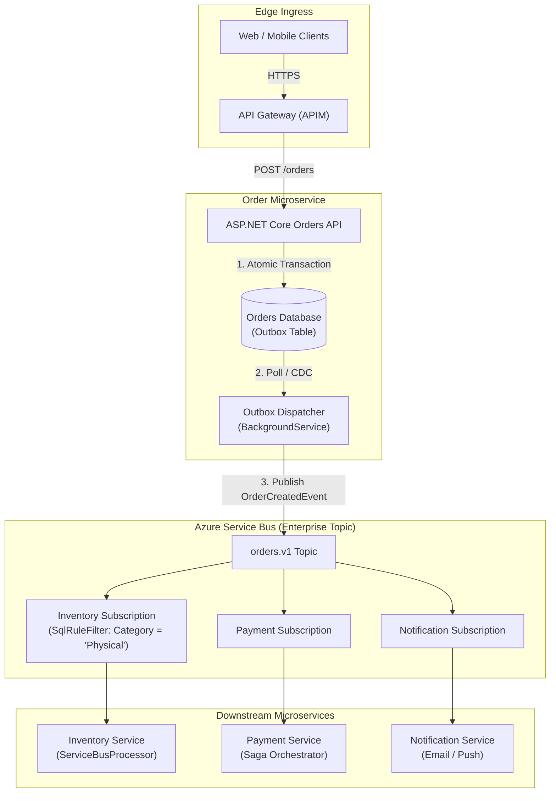
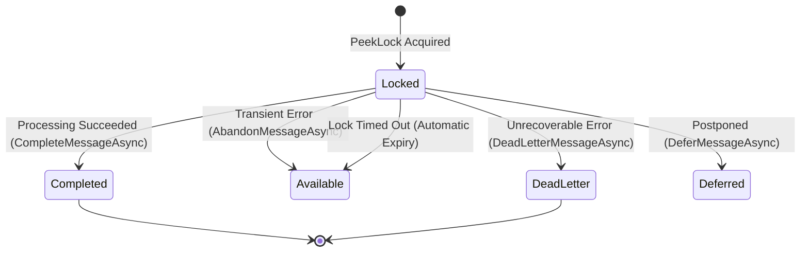
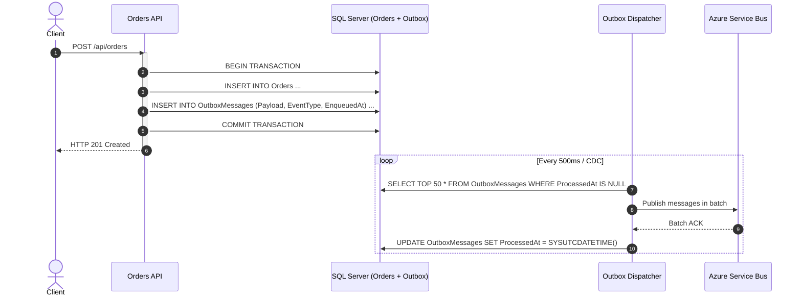

# Section 27: Microservices Architecture & Azure Service Bus


> **Curriculum Navigation:**  
> ⏪ [Previous: Section 26 – Design Patterns (GoF & Enterprise)](./260_design_patterns.md) | 🏠 [Master Index](./README.md) | ⏩ [Next: Section 28 – System Design: Fundamentals & Networking](./280_system_design_fundamentals_architecture_networking.md)

---


## 1. Executive Summary & Core Value Proposition

Modern distributed systems replace fragile point-to-point HTTP integrations with **asynchronous, message-driven microservice architectures**. While direct REST calls couple services in time, availability, and network latency, enterprise message brokers such as **Azure Service Bus** deliver guaranteed delivery, temporal decoupling, automatic load leveling, and transactional reliability.



---

## 2. Microservices Architecture Fundamentals

### 2.1 Monolith vs. Microservices Decision Framework

| Dimension | Monolithic Architecture | Modular Monolith | Microservices Architecture |
| :--- | :--- | :--- | :--- |
| **Deployment Model** | Single deployable unit (single `.dll` / binary) | Single deployable unit, strictly separated domain projects | Independent deployable micro-units per bounded context |
| **Data Storage** | Shared single database (Foreign keys across all tables) | Single DB with separate schemas per module (no cross-schema FKs) | **Database-per-Service** (Zero cross-database joins) |
| **Communication** | Direct in-memory method invocations | In-memory mediatR / domain event dispatchers | Asynchronous messaging (Service Bus, Kafka) & gRPC |
| **Failure Blast Radius** | Global (An OOM or infinite loop brings down entire system) | Moderate (Isolated in logic, but shares physical process memory) | **Isolated** (Degrades gracefully; payment outage doesn't stop product browsing) |
| **Team Topology** | Suitable for 1–15 engineers | Suitable for 10–50 engineers | Required for 50+ engineers across multiple autonomous squads |
| **When to Choose** | Early stage startups, greenfield MVPs, low domain complexity | **Default architectural recommendation for 90% of enterprise systems** | Multi-team scale, heterogeneous tech stacks, independent scaling needs |

---

### 2.2 Why Microservices Communicate Through Messages Instead of Synchronous HTTP

Relying on synchronous HTTP/REST for inter-service communication leads to the **Distributed Monolith Anti-Pattern**:
1. **Temporal Coupling**: Service A cannot complete unless Service B and Service C are online and responsive *at the exact same second*. If each service has 99% uptime, chaining 4 services yields $0.99^4 \approx 96\%$ composite uptime.
2. **Cascading Failure & Thread Pool Starvation**: If Service C experiences high latency, Service B’s HTTP calls block, exhausting Service B's ASP.NET Core thread pool. In turn, Service A exhausts its threads, taking down the entire system.
3. **Load Leveling (Buffering Peaks)**: During Black Friday, a message broker absorbs 50,000 orders/sec into a queue. Backend billing workers consume messages at a steady, sustainable 2,000 orders/sec without crashing database connection pools.

---

### 2.3 CQRS (Command Query Responsibility Segregation) in .NET

CQRS separates read and write models into distinct data structures and execution paths:
- **Command Stack**: Optimized for transaction integrity, business invariant validation, and auditability (`CreateOrderCommand`, `CancelOrderCommand`). Uses strict domain entities and relational DBs.
- **Query Stack**: Optimized for ultra-fast reads, denormalized projections, and zero joins (`GetOrderSummaryByIdQuery`). Queries read directly from Redis, Elasticsearch, or read-optimized SQL views.

---

## 3. Azure Service Bus Deep-Dive Internals

### 3.1 Entities: Namespaces, Queues, Topics & Subscriptions

- **Namespace**: The administrative scoping container and connection boundary.
- **Queue**: Point-to-point FIFO messaging. Each message is processed by **one competing consumer** from a pool of workers.
- **Topic**: Publish/Subscribe messaging. A single published message is copied into multiple **Subscriptions**.
- **Subscription Rules & Filters**:
  - `SqlRuleFilter`: Filters messages using SQL-92 expressions evaluated against message application properties (e.g., `user.Region = 'EU' AND sys.Label = 'Priority'`).
  - `CorrelationRuleFilter`: High-performance exact match on properties like `CorrelationId` or custom keys without SQL parsing overhead.

---

### 3.2 Peek-Lock Mode Mechanics: Complete, Abandon, Dead-Letter, Defer & Lock Renewal

Azure Service Bus operates in two receive modes:
1. **ReceiveAndDelete**: Fast, but messages are lost if consumer crashes during processing. Unacceptable in enterprise banking or retail.
2. **PeekLock (Production Standard)**:
   - Consumer peeks the message; Service Bus places a temporary lock (default 30 seconds, maximum 5 minutes).
   - If processing succeeds: Call `CompleteMessageAsync()` -> Message permanently deleted from queue.
   - If transient error occurs: Call `AbandonMessageAsync()` -> Lock released immediately; message returned to queue for other workers.
   - If poison message/fatal business error: Call `DeadLetterMessageAsync()` -> Message moved to Dead-Letter Queue (DLQ).
   - If processing cannot complete now: Call `DeferMessageAsync()` -> Message remains in queue but bypassed by regular sequence until explicitly fetched by `SequenceNumber`.
   - Long-running job: Call `RenewMessageLockAsync()` periodically before the lock expires to prevent duplicate delivery!



---

### 3.3 Message Ordering via Service Bus Sessions

Standard queues do not guarantee strict ordering across multiple concurrent consumers. **Service Bus Sessions** provide partitioned FIFO:
- Set `ServiceBusMessage.SessionId = orderId`.
- A consumer locks an entire **Session**. All messages sharing that `SessionId` are processed strictly in sequence by that single consumer thread.
- Multiple consumers process different `SessionId`s concurrently, achieving both **strict ordering per entity** and **massive overall horizontal scale**!

---

### 3.4 Duplicate Messages & Consumer Idempotency

Messages can be delivered more than once due to network timeouts during lock completion:
1. **Broker-Level Deduplication (`RequiresDuplicateDetection = true`)**:
   - Compares incoming `MessageId` within a configurable deduplication window (e.g., 10 minutes).
   - Duplicates with identical `MessageId` are silently dropped by the broker.
2. **Consumer-Level Idempotency**:
   - The consumer records processed `MessageId` or business idempotency key (e.g., `OrderId`) in a database table inside the transaction. If already present, skip processing.

---

### 3.5 The Transactional Outbox Pattern

When an API updates a database and publishes a message, doing both across two uncoordinated operations causes the **Dual-Write Hazard**:
- If DB succeeds but message broker publish fails $\to$ Inconsistent state!
- If message broker succeeds but DB commit rolls back $\to$ Phantom event published!



---

### 3.6 Sagas & Distributed Workflows over Service Bus

Distributed systems cannot use two-phase commit (2PC) at scale. Distributed processes spanning multiple services are coordinated via **Sagas**:
- **Choreography (Event-Driven)**: Each service publishes domain events (`OrderPlaced`, `InventoryReserved`, `PaymentFailed`). Other services listen and react. If payment fails, `PaymentFailed` triggers compensating events (`ReleaseInventoryCommand`). Best for simple flows (2–4 steps).
- **Orchestration (Centralized State Machine)**: A dedicated Saga Orchestrator (e.g., via MassTransit State Machine or Azure Durable Functions) directs the participants: sends commands, tracks responses, and issues explicit compensating rollback commands on failure. Best for complex enterprise workflows.

---

### 3.7 Messaging Framework Decision Matrix: SDK vs. MassTransit vs. NServiceBus

| Architectural Feature | Raw Azure Service Bus SDK (`Azure.Messaging.ServiceBus`) | MassTransit | NServiceBus |
| :--- | :--- | :--- | :--- |
| **License & Cost** | Open Source (MIT) / Free | Open Source (Apache 2.0) / Free | Commercial License (Particular Software) |
| **Outbox Implementation** | Manual custom code or EF Core interceptor | **Built-in Transactional Outbox** | Built-in Outbox |
| **Saga State Machine** | Manual coding | **Built-in Automatonymous State Machine** | Built-in Saga State Machine |
| **Broker Portability** | Locked to Azure Service Bus | Seamless swap between RabbitMQ, Azure Service Bus, Amazon SQS | Seamless swap across multiple brokers |
| **Control & Performance** | **Maximum control, lowest allocation, lowest latency** | High productivity, enterprise standard | Enterprise grade, dedicated 24/7 SLA |
| **Recommended Scenario** | Specialized microservices, custom performance gateways | **Standard enterprise microservice architectures** | Large banks and legacy enterprises requiring commercial vendor SLAs |

---

## 4. Production-Ready Code Implementation

The following production-grade implementation provides:
1. An idempotent, session-aware **Service Bus Worker** using `Azure.Messaging.ServiceBus` and Managed Identity.
2. Automatic **Lock Renewal** for long-running batch operations.
3. Poison message handling and routing to Dead-Letter Queue.

```csharp
using System;
using System.Text.Json;
using System.Threading;
using System.Threading.Tasks;
using Azure.Identity;
using Azure.Messaging.ServiceBus;
using Microsoft.Extensions.Hosting;
using Microsoft.Extensions.Logging;

namespace EnterpriseArchitecture.Microservices.Messaging;

public record OrderSubmittedEvent(Guid OrderId, string CustomerEmail, decimal TotalAmount, DateTimeOffset CreatedAt);

public sealed class OrderProcessingBackgroundService : BackgroundService
{
    private readonly ServiceBusClient _client;
    private readonly ServiceBusProcessor _processor;
    private readonly ILogger<OrderProcessingBackgroundService> _logger;

    public OrderProcessingBackgroundService(
        string serviceBusNamespace, 
        string queueName, 
        ILogger<OrderProcessingBackgroundService> _logger)
    {
        this._logger = _logger ?? throw new ArgumentNullException(nameof(_logger));

        // Authenticate via Managed Identity (Zero Connection Strings!)
        _client = new ServiceBusClient(serviceBusNamespace, new DefaultAzureCredential());

        var processorOptions = new ServiceBusProcessorOptions
        {
            AutoCompleteMessages = false, // Critical: Manual control over complete/abandon/dead-letter
            MaxConcurrentCalls = 10,       // Process up to 10 messages concurrently
            PrefetchCount = 20,           // Buffer messages in memory to maximize throughput
            ReceiveMode = ServiceBusReceiveMode.PeekLock
        };

        _processor = _client.CreateProcessor(queueName, processorOptions);
        _processor.ProcessMessageAsync += HandleMessageAsync;
        _processor.ProcessErrorAsync += HandleErrorAsync;
    }

    protected override async Task ExecuteAsync(CancellationToken stoppingToken)
    {
        _logger.LogInformation("Starting Service Bus Processor...");
        await _processor.StartProcessingAsync(stoppingToken);

        // Keep running until cancellation token fires
        await Task.Delay(Timeout.Infinite, stoppingToken);
    }

    private async Task HandleMessageAsync(ProcessMessageEventArgs args)
    {
        var message = args.Message;
        _logger.LogInformation("Processing message {MessageId}, DeliveryCount: {DeliveryCount}", 
            message.MessageId, message.DeliveryCount);

        try
        {
            // 1. Deserialization Guard
            var orderEvent = JsonSerializer.Deserialize<OrderSubmittedEvent>(message.Body.ToString());
            if (orderEvent == null)
            {
                // Poison message: cannot deserialize -> Dead-Letter immediately
                await args.DeadLetterMessageAsync(
                    message, 
                    deadLetterReason: "DeserializationFailure", 
                    deadLetterErrorDescription: "Message payload could not be deserialized into OrderSubmittedEvent.");
                return;
            }

            // 2. Business Logic Execution with Lock Renewal Guard
            using var cts = new CancellationTokenSource();
            Task renewalTask = PeriodicallyRenewLockAsync(args, cts.Token);

            try
            {
                await ProcessOrderBusinessLogicAsync(orderEvent, args.CancellationToken);
            }
            finally
            {
                cts.Cancel(); // Stop renewal loop once processing finishes
            }

            // 3. Mark message successfully completed
            await args.CompleteMessageAsync(message, args.CancellationToken);
            _logger.LogInformation("Successfully completed message {MessageId}", message.MessageId);
        }
        catch (InvalidOperationException ex) // Unrecoverable business rule failure
        {
            _logger.LogError(ex, "Unrecoverable business rule failure for message {MessageId}", message.MessageId);
            await args.DeadLetterMessageAsync(
                message, 
                deadLetterReason: "BusinessRuleViolation", 
                deadLetterErrorDescription: ex.Message);
        }
        catch (Exception ex) // Transient failure (network glitch, DB deadlock)
        {
            _logger.LogWarning(ex, "Transient error processing message {MessageId}. Abandoning message.", message.MessageId);
            // Abandon allows Service Bus to redeliver up to MaxDeliveryCount
            await args.AbandonMessageAsync(message, cancellationToken: args.CancellationToken);
        }
    }

    private async Task PeriodicallyRenewLockAsync(ProcessMessageEventArgs args, CancellationToken ct)
    {
        while (!ct.IsCancellationRequested)
        {
            try
            {
                await Task.Delay(TimeSpan.FromSeconds(20), ct);
                if (ct.IsCancellationRequested) break;

                await args.RenewMessageLockAsync(ct);
                _logger.LogDebug("Successfully renewed message lock for {MessageId}", args.Message.MessageId);
            }
            catch (OperationCanceledException)
            {
                break;
            }
            catch (Exception ex)
            {
                _logger.LogError(ex, "Failed to renew lock for message {MessageId}", args.Message.MessageId);
                break;
            }
        }
    }

    private static async Task ProcessOrderBusinessLogicAsync(OrderSubmittedEvent orderEvent, CancellationToken ct)
    {
        // Simulated business logic (Inventory reservation, database updates)
        await Task.Delay(150, ct);
    }

    private Task HandleErrorAsync(ProcessErrorEventArgs args)
    {
        _logger.LogError(args.Exception, "Service Bus error in source {ErrorSource}, Entity: {EntityPath}", 
            args.ErrorSource, args.EntityPath);
        return Task.CompletedTask;
    }

    public override async Task StopAsync(CancellationToken cancellationToken)
    {
        _logger.LogInformation("Stopping Service Bus Processor gracefully...");
        await _processor.StopProcessingAsync(cancellationToken);
        await _processor.DisposeAsync();
        await _client.DisposeAsync();
        await base.StopAsync(cancellationToken);
    }
}
```

---

## 5. Line-by-Line Code Walkthrough

| Line Range | Architectural Mechanism | Technical Consequence |
| :--- | :--- | :--- |
| **Line 33–37** | `AutoCompleteMessages = false` | Prevents the SDK from automatically acknowledging messages before processing finishes. If the node crashes midway, the message remains safely in the broker. |
| **Line 35** | `PrefetchCount = 20` | Pre-buffers messages across the underlying AMQP 1.0 connection link, avoiding network roundtrips and drastically boosting message throughput. |
| **Line 66–72** | `args.DeadLetterMessageAsync` | Moves corrupt or invalid payloads directly to the Dead-Letter Queue without wasting compute cycles on failed retry loops. |
| **Line 76–86** | `PeriodicallyRenewLockAsync` | Prevents lock expiration during lengthy operations. Runs an asynchronous background task that calls `args.RenewMessageLockAsync()` every 20 seconds. |
| **Line 101–104** | `args.AbandonMessageAsync` | On transient network or database errors, explicitly releases the lock so competing consumers or future attempts can re-process the message immediately. |

---

## 6. Real-World Enterprise Use Case: E-Commerce Distributed Checkout

Consider a checkout workflow involving 4 microservices:
1. **Order Service**: Saves `Order` in `Pending` state and writes an `OrderSubmittedEvent` into the SQL Server Outbox table within an ACID transaction.
2. **Outbox Dispatcher**: Publishes `OrderSubmittedEvent` to `orders.topic` with `SessionId = OrderId`.
3. **Payment Service**: Consumes message, charges credit card via Stripe. If successful, publishes `PaymentSucceededEvent`. If card is declined, publishes `PaymentFailedEvent`.
4. **Inventory Service**: Listens for `OrderSubmittedEvent` and temporarily reserves warehouse items.
5. **Compensating Action (The Saga Rollback)**: If `PaymentFailedEvent` arrives, the Inventory Service consumes it and releases the reserved stock back to inventory. The Order Service marks the order `Cancelled`.
6. Result: Distributed consistency across three autonomous databases with zero distributed two-phase commit locks!

---

## 7. Common Pitfalls, Anti-Patterns & Failure Modes

1. **The Poison Message Infinite Loop Trap**:
   - *Failure*: An unhandled exception occurs inside message processing, and the developer always calls `AbandonMessageAsync()` without monitoring `DeliveryCount`.
   - *Result*: The message retries indefinitely, saturating CPU and worker threads.
   - *Fix*: Configure `MaxDeliveryCount` (typically 5 to 10) on the Azure Service Bus entity so the broker automatically dead-letters poison messages once retries are exhausted.
2. **Lock Expiration Causing Duplicate Processing**:
   - *Failure*: A message takes 60 seconds to process, but the queue lock duration is 30 seconds.
   - *Result*: The lock expires; Azure Service Bus gives the identical message to another worker node. Both nodes process the payment concurrently!
   - *Fix*: Either ensure fast sub-second processing by dispatching long work, or use automated `RenewMessageLockAsync`.
3. **Connection String Leakage & Shared Access Signature Sprawl**:
   - *Failure*: Hardcoding Service Bus connection strings in app settings across 20 microservices.
   - *Fix*: Eliminate connection strings. Use Azure Managed Identities with **Azure Service Bus Data Sender** and **Azure Service Bus Data Receiver** RBAC roles.

---

## 8. Senior / Principal Architect Interview Follow-ups

### Q1: "How do you guarantee that messages for the same customer are processed in order when running 50 competing consumer pods?"
**Architect Response:**  
"Standard queues deliver messages out-of-order when multiple consumers execute in parallel. To guarantee strict ordering:
1. **Enable Message Sessions** on the Azure Service Bus queue/subscription (`RequiresSession = true`).
2. Assign the customer's unique identifier to the message's `SessionId` property (`message.SessionId = customerId`).
3. Have worker pods listen using `ServiceBusSessionProcessor`.
4. When a pod receives a message, it obtains an exclusive session lock on that `SessionId`. While that lock is held, all other messages for that same customer are locked to that specific pod and processed in strict sequential order.
5. Other pods concurrently process different customer sessions. This achieves **strict per-customer FIFO ordering** while scaling horizontally across 50 consumer pods."

### Q2: "What is the Dead-Letter Queue (DLQ), and how do you monitor and reprocess messages from it?"
**Architect Response:**  
"The Dead-Letter Queue is a secondary sub-queue attached to every queue and subscription. Messages enter the DLQ when:
- `DeliveryCount > MaxDeliveryCount` (exceeded retry attempts).
- `DeadLetterMessageAsync()` is invoked explicitly due to malformed payload or fatal business rules.
- `TimeToLive (TTL)` expires and `EnableDeadLetteringOnMessageExpiration` is set to true.

**Monitoring & Reprocessing Architecture**:
1. Configure an Azure Monitor alert rule triggering whenever `DeadletteredMessages > 0`.
2. To reprocess, deploy an Azure Function or CLI utility that opens a receiver on `$DeadLetterQueue`, inspects the `DeadLetterReason` and headers, applies corrective data transformations if needed, and republishes the payload to the primary topic for re-ingestion."
