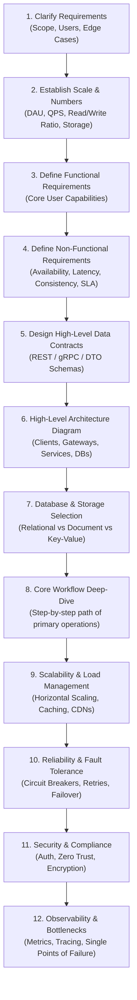
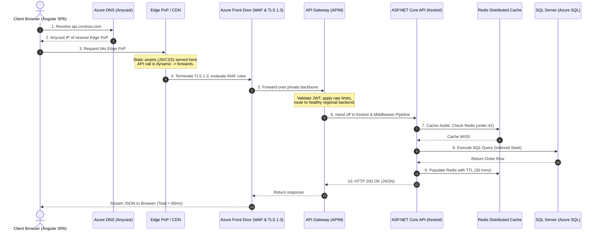
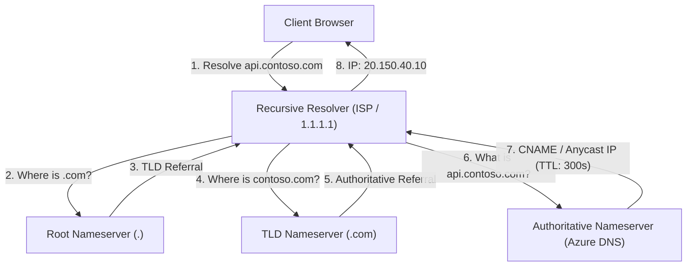
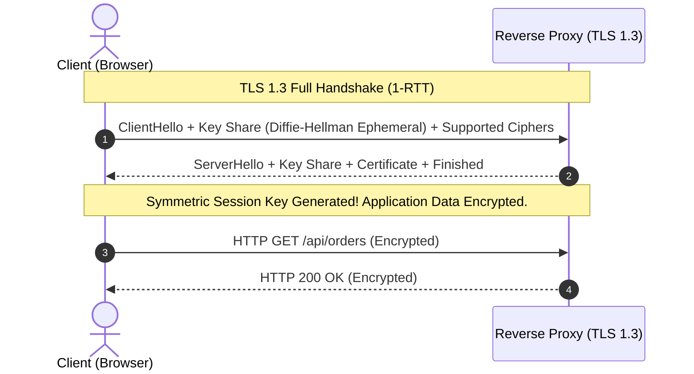
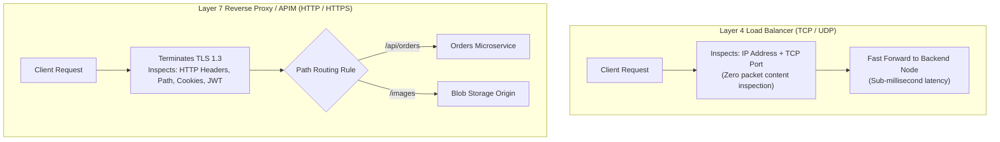

# Section 28: System Design: Fundamentals & Networking


> **Curriculum Navigation:**  
> ⏪ [Previous: Section 27 – Microservices Architecture & Azure Service Bus](./270_microservices_and_azure_service_bus.md) | 🏠 [Master Index](./README.md) | ⏩ [Next: Section 29 – System Design: Caching, Databases & Consensus](./290_system_design_caching_databases_messaging_distributed_systems.md)

---


## 1. Executive Summary & The Repeatable 12-Step Interview Framework

System Design evaluates an engineer's ability to architect distributed, scalable, fault-tolerant software systems under ambiguous business constraints. Senior and Staff engineer interviews are not knowledge quizzes; they are **collaborative architectural negotiations**.

### The Repeatable 12-Step System Design Blueprint



---

## 2. Life of a Request: From Browser to Database and Back

Understanding the physical path of an HTTP request through a modern enterprise cloud system is the foundational mental model for all system design:



---

## 3. System Design Core Fundamentals

### 3.1 Functional vs. Non-Functional Requirements

- **Functional Requirements**: *What* the system does from the user’s perspective (e.g., *"Users can shorten a URL"*, *"Users can search products"*).
- **Non-Functional Requirements (NFRs)**: *How well* the system performs under load:
  - **Availability**: System uptime (e.g., 99.99% $\approx$ 52.6 minutes downtime per year).
  - **Latency**: P95 $< 100$ms, P99 $< 250$ms.
  - **Throughput (QPS)**: Number of queries or transactions processed per second.
  - **Durability**: Zero data loss once acknowledged (RPO = 0).

---

### 3.2 Scalability: Scale-Up (Vertical) vs. Scale-Out (Horizontal)

| Dimension | Vertical Scaling (Scale-Up) | Horizontal Scaling (Scale-Out) |
| :--- | :--- | :--- |
| **Mechanics** | Adding CPU, RAM, NVMe SSD to a single server instance. | Adding more commodity nodes/servers behind a load balancer. |
| **Hardware Limit** | Strict physical ceiling (e.g., maximum 128 cores, 4 TB RAM). | Virtually unlimited linear scaling. |
| **High Availability** | Single Point of Failure (SPOF); server crash takes down app. | Resilient: failed nodes are removed from pool automatically. |
| **Complexity** | Zero architectural complexity; code runs unchanged. | High: requires stateless design, distributed caching, sharding. |

---

### 3.3 The CAP Theorem & PACELC Theorem Deep-Dive

In any asynchronous distributed data store across a network:
- **Consistency ($C$)**: Every read receives the most recent write or an error.
- **Availability ($A$)**: Every non-failing node returns a response (without guarantee of newest data).
- **Partition Tolerance ($P$)**: System continues to operate despite arbitrary dropped/delayed network messages between nodes.

> [!IMPORTANT]
> Network partitions ($P$) are a physical reality of distributed hardware (cables get cut, switches fail). Therefore, **you cannot choose "CA"**. You can only choose between **CP** (sacrifice availability for correctness) and **AP** (sacrifice consistency for availability).

#### The PACELC Theorem (Extending CAP for Normal Operations)
CAP only describes behavior *during a network partition*. **PACELC** adds normal latency trade-offs:
$$\text{If } \mathbf{P} \text{ (Partition)} \to \text{Choose } \mathbf{A} \text{ or } \mathbf{C}; \quad \text{ELSE } (\mathbf{E}) \to \text{Choose } \mathbf{L} \text{ (Latency) or } \mathbf{C} \text{ (Consistency)}$$
- **MongoDB / HBase**: PC/EC (Consistent during partitions, consistent under normal operation $\to$ higher write latency).
- **Cassandra / DynamoDB**: PA/EL (Available during partitions, low latency under normal operation $\to$ eventual consistency).

---

## 4. Architectural Styles & Structural Patterns

### 4.1 Architecture Comparison Matrix

| Pattern | Data Coupling | Deployment Boundary | Operational Overhead | Best Use Case |
| :--- | :--- | :--- | :--- | :--- |
| **Monolith** | Single Shared Database | Single deployable binary | Lowest | Greenfield MVPs, small teams (< 15 devs). |
| **Modular Monolith** | Separate schemas per module, zero cross-module SQL joins | Single deployable binary | Low | **Default enterprise standard**: High cohesion, fast testing. |
| **Microservices** | Database-per-service | Independent container per service | High (Kubernetes, distributed tracing) | Massive scale, 50+ engineers, distinct deployment cadences. |
| **Event-Driven (EDA)** | Fully decoupled via message topics | Producer and Consumer microservices | Moderate to High | Reactive order processing, IoT streams, notifications. |
| **Serverless** | Ephemeral compute, external managed DBs | Single function trigger | Low infra management, high cold-start risk | Intermittent jobs, spike workloads, scheduled automations. |

---

## 5. Distributed Networking & Protocols

### 5.1 Protocol Decision Matrix: REST vs. gRPC vs. WebSockets vs. GraphQL

| Protocol | Transport Layer | Serialization Format | Multiplexing | Streaming Support | Best Scenario |
| :--- | :--- | :--- | :--- | :--- | :--- |
| **REST** | HTTP/1.1 or HTTP/2 | JSON / XML (Text-based) | Partial | Server-Sent Events (SSE) only | Public APIs, web browser client integrations. |
| **gRPC** | HTTP/2 or HTTP/3 | Protocol Buffers (Binary) | ✅ **Full Multiplexing** | ✅ Bi-directional streaming | **Internal inter-service microservice communication**. |
| **WebSockets** | TCP (Upgraded from HTTP) | Raw Text / Binary frames | ❌ Single socket | ✅ Full-duplex persistent stream | Real-time chat, live financial tickers, collaborative editing. |
| **GraphQL** | HTTP/1.1 or HTTP/2 | JSON | Partial | Subscriptions | Mobile apps needing flexible queries without over-fetching. |

---

### 5.2 HTTP/1.1 vs. HTTP/2 vs. HTTP/3 (QUIC)

- **HTTP/1.1**: Suffers from **Head-of-Line (HoL) Blocking** at the application layer. Each TCP connection processes only one request-response at a time. Browsers open 6 parallel TCP connections per domain to work around this.
- **HTTP/2**: Introduces **Binary Framing** and **Multiplexing** over a single TCP connection. Multiple requests/responses interleave concurrently. However, TCP packet loss stalls *all* multiplexed streams (TCP-level HoL blocking).
- **HTTP/3**: Replaces TCP with **QUIC (built on UDP)**. Stream multiplexing is handled natively at the transport layer: a dropped packet on Stream 1 does *not* stall Stream 2! Near-zero handshake latency via TLS 1.3 zero-round-trip time (0-RTT).

---

### 5.3 DNS Resolution Architecture & Routing Strategies

Domain Name System (DNS) is the global hierarchical directory translating human-readable hostnames (`api.contoso.com`) into routable IP addresses.



1. **Resolution Hierarchy**:
   - **Local Cache**: Browser DNS cache $\to$ OS `hosts` / resolver cache.
   - **Recursive Resolver**: Queries upstream iterative authorities on behalf of the client.
   - **Root Nameservers**: 13 logical root server clusters worldwide (`a.root-servers.net` to `m.root-servers.net`).
   - **TLD Nameservers**: Manages top-level domain records (`.com`, `.net`, `.org`).
   - **Authoritative Nameservers**: Holds actual DNS records (`A`, `AAAA`, `CNAME`, `TXT`, `MX`) configured by domain owner.
2. **Routing Strategies**:
   - **Anycast DNS**: Routes client query to the geographically nearest DNS node using BGP routing. Eliminates latency and absorbs massive DDoS attacks (e.g., Cloudflare, Route 53, Azure DNS).
   - **GeoDNS / Latency-Based Routing**: Returns different IP addresses depending on the client’s geographic region or lowest network RTT.
   - **Weighted Round-Robin**: Splits incoming traffic across multiple regional IPs (e.g., 80% to Primary datacenter, 20% to Canary).
3. **DNS TTL Trade-Off**:
   - **Long TTL (e.g., 86400s / 24h)**: Reduces DNS queries and lookup latency; slows down disaster recovery failover if an IP must be rerouted.
   - **Short TTL (e.g., 60s / 300s)**: Enables rapid disaster failover; increases DNS query volume and dependency on recursive resolver uptime.

---

### 5.4 TCP Connection Mechanics & Congestion Control

Underneath HTTP/1.1 and HTTP/2 lies TCP (Transmission Control Protocol), providing ordered, reliable, connection-oriented byte streams:

1. **The TCP 3-Way Handshake**:
   - **Step 1 (`SYN`)**: Client sends Synchronize sequence number $X$. Latency: $0.5$ RTT.
   - **Step 2 (`SYN-ACK`)**: Server responds with Acknowledgement $X+1$ and its own sequence number $Y$. Latency: $1.0$ RTT.
   - **Step 3 (`ACK`)**: Client acknowledges $Y+1$ and can begin transmitting data payload. Latency: $1.5$ RTT.
2. **Flow Control vs. Congestion Control**:
   - **Flow Control (Receive Window - `rwnd`)**: Prevents sender from overwhelming receiver's buffer. Receiver advertises available window size in each TCP ACK.
   - **Congestion Control (Congestion Window - `cwnd`)**: Prevents sender from overwhelming intermediate network routers and switches.
3. **Congestion Algorithms (CUBIC vs. BBR)**:
   - **TCP Slow Start**: Starts with small `cwnd` (typically 10 MSS $\approx 14.6$ KB) and doubles every RTT until packet loss or threshold (`ssthresh`).
   - **CUBIC (Loss-Based)**: Default in Linux. Assumes packet drop indicates network congestion. Scales window cubically. In long-distance fiber connections with minor packet loss, CUBIC prematurely collapses throughput.
   - **BBR (Bottleneck Bandwidth and RTT - Model-Based)**: Developed by Google. Measures actual round-trip time and packet delivery rate rather than treating loss as congestion. Maximizes bandwidth utilization on lossy or high-latency transoceanic links.

---

### 5.5 Transport Layer Security (TLS 1.3) Handshake & Cryptography

TLS secures HTTP traffic via confidentiality, integrity, and server authentication. TLS 1.3 cuts handshake latency in half compared to TLS 1.2:



1. **1-RTT Handshake**:
   - In TLS 1.2, negotiating cipher suites and key exchange required 2 full round trips (2-RTT).
   - In TLS 1.3, the client sends its **Diffie-Hellman ephemeral key share** immediately inside the initial `ClientHello`, allowing encrypted communication after just **1-RTT**!
2. **Zero Round-Trip Resumption (0-RTT / Early Data)**:
   - Returning clients can send encrypted request data on the very first network packet using a pre-shared key (PSK) from the prior session.
   - **Security Caveat (Replay Attacks)**: 0-RTT data is vulnerable to packet replay by man-in-the-middle attackers. In ASP.NET Core, **never permit state-modifying POST/PUT/DELETE requests over 0-RTT early data**; allow only idempotent GET requests.
3. **Perfect Forward Secrecy (PFS)**:
   - Uses ephemeral keys ($ECDHE$). Even if an attacker steals the server's private certificate 5 years later, previously recorded encrypted traffic cannot be decrypted.
4. **ALPN (Application-Layer Protocol Negotiation)**:
   - Client and server negotiate application protocol (`h2`, `h3`, or `http/1.1`) inside the TLS handshake itself, avoiding an extra HTTP upgrade round-trip.

---

## 6. Traffic & Load Management

### 6.1 Layer 4 vs. Layer 7 Load Balancing



---

### 6.2 Rate Limiting Algorithms Deep-Dive

Rate limiting prevents Denial of Service (DoS) and noisy-neighbor resource exhaustion:

| Algorithm | How it Works | Pros | Cons | Best Scenario |
| :--- | :--- | :--- | :--- | :--- |
| **Token Bucket** | Tokens added to a bucket at fixed rate $r$ up to capacity $b$. Each request takes 1 token. | Allows controlled bursts while maintaining steady average. | Requires tracking state (tokens + timestamp). | **Standard API Gateway default (APIM, Stripe)**. |
| **Leaky Bucket** | Requests enter queue; leak out to backend at steady rate. | Smooths out traffic spikes completely. | Bursts are delayed or dropped; slower for spiky workloads. | Protecting legacy fragile databases. |
| **Fixed Window** | Counter increments per time block (e.g., max 100 per minute). | Minimal memory (single Redis counter). | **Traffic Burst at Boundary**: 100 requests at 0:59 + 100 at 1:01 = 200 requests in 2 seconds! | Basic low-traffic rate limits. |
| **Sliding Window Counter** | Weighted combination of previous window and current window counts. | Smooth, memory-efficient, eliminates boundary burst hazard. | Approximation (not 100% exact, but within 0.1% accuracy). | **ASP.NET Core RateLimiter middleware default**. |

---

### 6.3 Health Checks & High Availability Probes

Load balancers and container orchestrators (Kubernetes / Azure Container Apps) rely on HTTP health probes to maintain high availability:

1. **Liveness Probe (`/health/live`)**:
   - Verifies if the process is alive.
   - If it fails (returns non-200 or times out), the orchestrator restarts the container.
   - **Must be lightweight**: Should only check local memory/deadlocks; **never check external databases in a liveness probe** (a database outage will trigger a catastrophic restart loop across all API pods).
2. **Readiness Probe (`/health/ready`)**:
   - Verifies if the container is ready to accept incoming user traffic.
   - Checks essential dependencies: database connectivity, warm local caches, message broker connections.
   - If it fails, the load balancer temporarily removes the node from the active rotation without killing the process.
3. **Startup Probe (`/health/startup`)**:
   - Protects slow-starting legacy apps or heavy cache-warming routines.
   - Disables liveness and readiness checks until startup succeeds, preventing premature process termination.
4. **Flapping Mitigation**:
   - Configure **Failure Thresholds** (e.g., 3 consecutive failures before removing node) and **Success Thresholds** (e.g., 2 consecutive successes before re-adding node) to prevent flapping caused by minor network jitter.

---

## 7. Production-Ready Code Implementation

The following production code implements a high-throughput **Reverse Proxy & Rate-Limited Gateway Router** in ASP.NET Core using **YARP (Yet Another Reverse Proxy)** and sliding window rate limiting:

```csharp
using System;
using System.Threading.RateLimiting;
using Microsoft.AspNetCore.Builder;
using Microsoft.AspNetCore.Http;
using Microsoft.AspNetCore.RateLimiting;
using Microsoft.Extensions.DependencyInjection;
using Microsoft.Extensions.Hosting;
using Yarp.ReverseProxy.Configuration;

namespace EnterpriseArchitecture.SystemDesign.Gateway;

public static class GatewayProgram
{
    public static void Main(string[] args)
    {
        var builder = WebApplication.CreateBuilder(args);

        // 1. Sliding Window Rate Limiting Configuration
        builder.Services.AddRateLimiter(limiterOptions =>
        {
            limiterOptions.RejectionStatusCode = StatusCodes.Status429TooManyRequests;

            limiterOptions.AddPolicy("TenantRateLimit", httpContext =>
            {
                // Partition rate limit by Tenant ID header or Fallback to Client IP
                string partitionKey = httpContext.Request.Headers["X-Tenant-Id"].ToString();
                if (string.IsNullOrEmpty(partitionKey))
                {
                    partitionKey = httpContext.Connection.RemoteIpAddress?.ToString() ?? "anonymous";
                }

                return RateLimitPartition.GetSlidingWindowLimiter(
                    partitionKey: partitionKey,
                    factory: _ => new SlidingWindowRateLimiterOptions
                    {
                        PermitLimit = 1000,
                        Window = TimeSpan.FromMinutes(1),
                        SegmentsPerWindow = 6, // 10-second sliding segments
                        QueueLimit = 50
                    });
            });
        });

        // 2. Programmatic In-Memory YARP Reverse Proxy Configuration
        var routes = new[]
        {
            new RouteConfig
            {
                RouteId = "orders-route",
                ClusterId = "orders-cluster",
                Match = new RouteMatch { Path = "/api/orders/{**catch-all}" },
                RateLimiterPolicy = "TenantRateLimit"
            }
        };

        var clusters = new[]
        {
            new ClusterConfig
            {
                ClusterId = "orders-cluster",
                Destinations = new Dictionary<string, DestinationConfig>(StringComparer.OrdinalIgnoreCase)
                {
                    { "node1", new DestinationConfig { Address = "https://orders-node-1.internal:5001" } },
                    { "node2", new DestinationConfig { Address = "https://orders-node-2.internal:5001" } }
                },
                HttpRequest = new Yarp.ReverseProxy.Forwarder.ForwarderRequestConfig
                {
                    Timeout = TimeSpan.FromSeconds(15)
                }
            }
        };

        builder.Services.AddReverseProxy()
            .LoadFromMemory(routes, clusters);

        var app = builder.Build();

        app.UseRateLimiter();
        app.MapReverseProxy();

        app.Run();
    }
}
```

---

## 8. Line-by-Line Code Walkthrough

| Line Range | Architectural Mechanism | Technical Consequence |
| :--- | :--- | :--- |
| **Line 26–34** | Partitioning by `X-Tenant-Id` | Enforces multi-tenant isolation. A runaway tenant hitting 5,000 req/min is throttled with HTTP 429 without impacting other tenants. |
| **Line 37–42** | `SegmentsPerWindow = 6` | Splits the 60-second window into 10-second segments, preventing edge-burst vulnerabilities inherent in fixed-window algorithms. |
| **Line 50–57** | `RouteConfig` with `RateLimiterPolicy` | Declaratively applies the rate limiter directly to the YARP route before the request is forwarded across the network. |
| **Line 60–73** | `ClusterConfig` with multiple destinations | Implements Layer 7 reverse proxy load balancing between `orders-node-1` and `orders-node-2` with automatic health monitoring and failover. |

---

## 9. Senior / Principal Architect Interview Follow-ups

### Q1: "How do you calculate QPS and storage requirements during the first 5 minutes of a System Design interview?"
**Architect Response:**  
"Use the **Standard Back-of-the-Envelope Estimation Framework**:
1. **Time Math**: 1 day = 86,400 seconds $\approx$ **100,000 seconds** (for mental math).
2. **QPS Calculation**:
   - If a system has **10 million Daily Active Users (DAU)** and each user writes 2 items per day:
     $$\text{Daily Writes} = 20,000,000$$
     $$\text{Average Write QPS} = \frac{20,000,000}{100,000} = \mathbf{200 \text{ QPS}}$$
   - **Peak QPS**: Multiply average QPS by 2 to 5 ($\text{Peak} \approx 600 - 1,000 \text{ QPS}$).
   - **Read QPS**: If read/write ratio is 10:1, $\text{Read QPS} = 200 \times 10 = \mathbf{2,000 \text{ QPS}}$ (Peak $\approx 6,000 - 10,000 \text{ QPS}$).
3. **Storage Math**:
   - If each written record is 500 bytes:
     $$\text{Daily Storage} = 20,000,000 \times 500 \text{ bytes} = 10 \text{ GB / day}$$
     $$\text{5-Year Storage} = 10 \text{ GB} \times 365 \times 5 \approx \mathbf{18.25 \text{ TB}}$$
   - Adding 20% index overhead + 3x replication factor $\approx \mathbf{65 \text{ TB}}$ total physical storage."

### Q2: "What is Anycast Routing and how does Azure Front Door leverage it?"
**Architect Response:**  
"In traditional **Unicast**, an IP address maps 1:1 to a single physical machine in one datacenter. In **Anycast**:
1. The **same IP address** is advertised simultaneously by hundreds of Point of Presence (PoP) edge routers globally via Border Gateway Protocol (BGP).
2. When a user sends a packet to that IP, internet routing automatically delivers it to the **topologically closest PoP**.
3. **Azure Front Door Benefit**: Front Door terminates the TLS 1.3 handshake right at the edge PoP (reducing TCP handshake latency from 150ms to 10ms). The request is then forwarded to your backend App Service across Microsoft's ultra-fast, private global fiber backbone."
