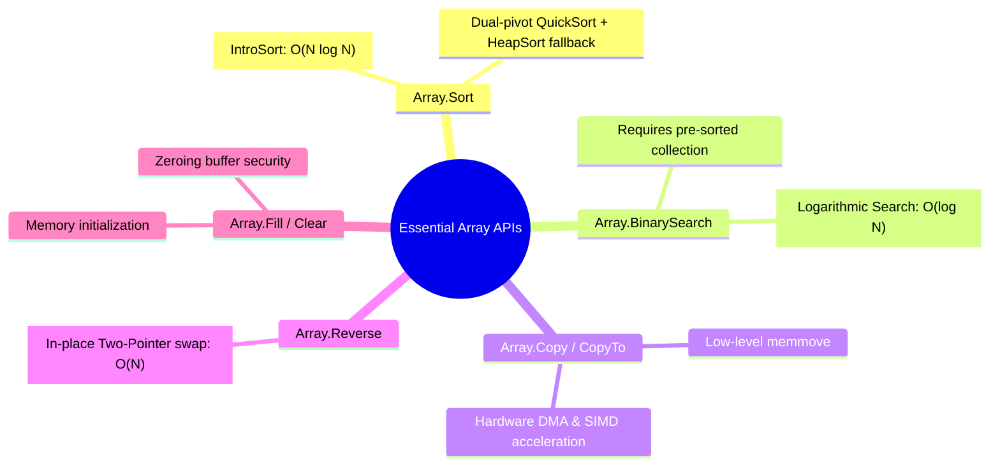
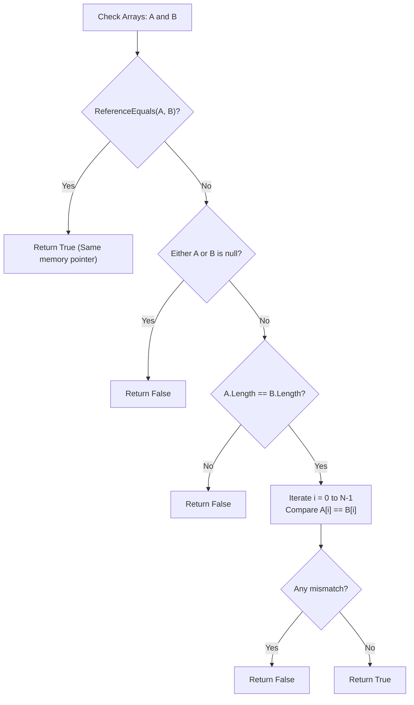
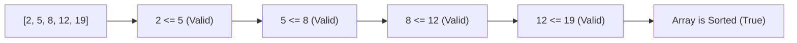
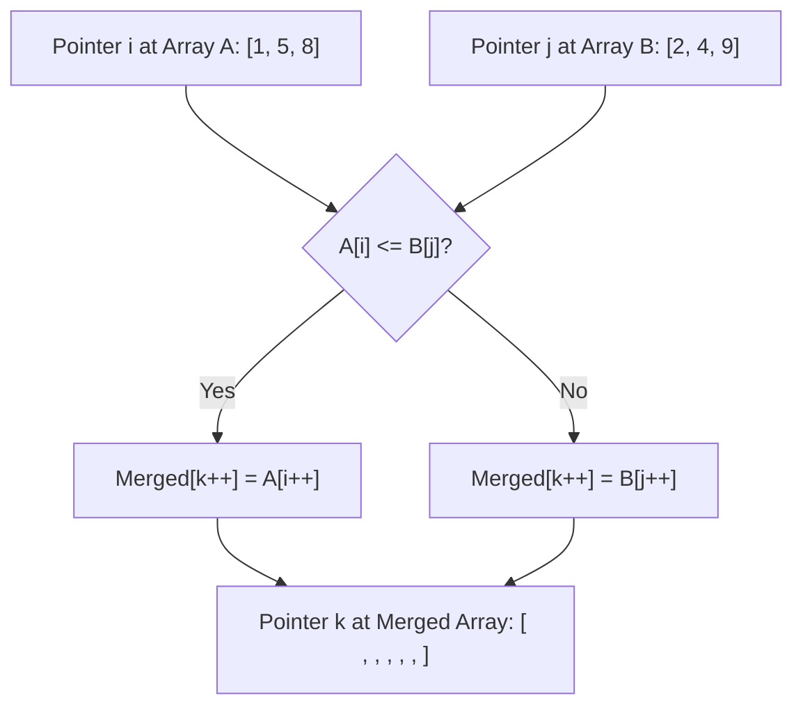
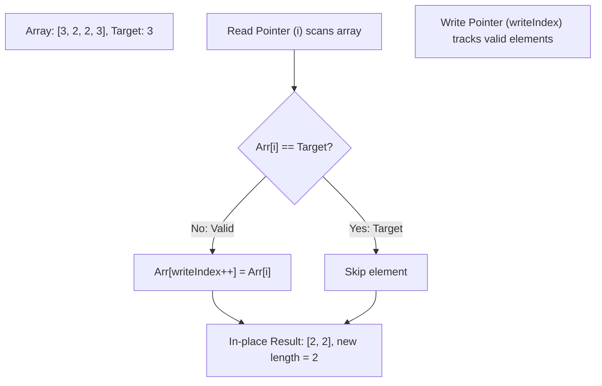

# Section 28: Array Coding Problems Using Functions & Standard Library

> **Curriculum Navigation:**  
> ⏪ [Previous: Section 27 – Array Algorithmic Challenges (Core Mechanics)](./27_array_coding_problems.md) | 🏠 [Master Index](./README.md) | ⏩ [Next: Section 29 – String Manipulation & Memory Allocation](./29_string_coding_problems.md)

---

## Q258. What are the top 5 important array functions used in coding problems?

### 1. Executive Summary & Core Concept
The C# `.NET` Base Class Library provides high-performance, hardware-optimized methods for array manipulation located primarily in `System.Array`, `System.MemoryExtensions`, and `System.Linq`. The top 5 essential functions are:
1. **`Array.Sort<T>()`**: In-place dual-pivot introspective sorting algorithm.
2. **`Array.BinarySearch<T>()`**: Logarithmic time lookup for sorted arrays.
3. **`Array.Copy()` / `Span<T>.CopyTo()`**: Memory block transfer (memmove).
4. **`Array.Reverse<T>()`**: In-place two-pointer element reversal.
5. **`Array.Fill<T>()` / `Array.Clear()`**: Memory initialization and fast zeroing.



### 2. Deep-Dive Architecture & Runtime Internals
- **Introsort Architecture in `Array.Sort`**:
  - Starts with **QuickSort** (fast average time).
  - If the recursion depth exceeds $2 \log_2(N)$, it switches to **HeapSort** to guarantee an $O(N \log N)$ worst-case time complexity, preventing the classic QuickSort $O(N^2)$ degradation.
  - For small partitions ($N < 16$), it switches to **InsertionSort** to take advantage of CPU cache locality.
- **`Array.Copy` vs. Manual Loops**:
  - `Array.Copy` maps to native C++ runtime routines (`memmove`), which use hardware SIMD vector instructions and unaligned memory move instructions, outperforming manual `for` loops by up to 10x on large arrays.

### 3. Production-Ready Code Implementation
```csharp
// Demonstrating the Top 5 Array APIs with Performance Considerations
public static class ArrayFunctionsShowcase
{
    public static void ExecuteTopArrayOperations()
    {
        int[] data = [45, 12, 85, 32, 89, 39, 69, 44, 42, 1, 99];

        // 1. Array.Sort(): O(N log N) In-place Introsort
        Array.Sort(data);
        Console.WriteLine($"Sorted: {string.Join(", ", data)}");

        // 2. Array.BinarySearch(): O(log N) search on sorted array
        int target = 42;
        int index = Array.BinarySearch(data, target);
        Console.WriteLine($"Element {target} found at sorted index: {index}");

        // 3. Array.Reverse(): In-place Two-Pointer reverse
        Array.Reverse(data);
        Console.WriteLine($"Reversed: {string.Join(", ", data)}");

        // 4. Array.Copy(): High-performance native memory block transfer
        int[] destination = new int[5];
        Array.Copy(data, 0, destination, 0, 5);
        Console.WriteLine($"Copied slice: {string.Join(", ", destination)}");

        // 5. Array.Fill(): Fast block initialization
        Array.Fill(destination, -1);
        Console.WriteLine($"Filled with -1: {string.Join(", ", destination)}");
    }
}
```

### 4. Line-by-Line Code Walkthrough
- `Array.Sort(data)`: Sorts the array in-place without allocating a new array.
- `Array.BinarySearch(data, target)`: Executes binary search; returns the 0-based index if found, or a negative number (bitwise complement of the next larger element's index) if not found.
- `Array.Copy(data, 0, destination, 0, 5)`: Copies a 5-element block directly in memory.
- `Array.Fill(destination, -1)`: Sets every element of the destination array to `-1`.

### 5. Real-World Enterprise Use Case & Application
Enterprise memory pools (`ArrayPool<T>.Shared`) use `Array.Clear()` when recycling buffers to zero out residual memory, preventing sensitive data (passwords, JWT tokens, credit card numbers) from leaking across requests.

### 6. Common Pitfalls, Memory Traps & Anti-Patterns
- **Calling `Array.BinarySearch` on an Unsorted Array**: Binary search relies on sorted ordering; running it on an unsorted array returns unpredictable, incorrect results.
- **Using LINQ `.OrderBy().ToArray()` Instead of `Array.Sort()`**: LINQ `.OrderBy()` allocates an `OrderedEnumerable`, multiple internal buffer arrays, and returns a new array, generating significant garbage collection overhead. Use `Array.Sort()` for in-place sorting.

### 7. Senior / Architect Interview Follow-ups
- **Interviewer**: *What is the difference between `Array.Copy()` and `Buffer.BlockCopy()`?*
- **Candidate Answer**: `Array.Copy()` is type-aware: it works on any array type (including reference types) and respects element indices. `Buffer.BlockCopy()` operates at the raw byte level: it treats the underlying array memory as a contiguous block of raw bytes, regardless of the element type. `Buffer.BlockCopy()` is slightly faster for primitive numeric types, but it cannot be used on reference types because copying reference pointers as raw bytes would bypass GC write barriers.

---

## Q259. Write a function to check whether two arrays are the same or not.

### 1. Executive Summary & Core Concept
Two arrays are considered "the same" (structurally equal) if:
1. They have the **exact same length**.
2. Corresponding elements at each index are **identical in value and order**.

- **Time Complexity**: $O(N)$ (linear comparison).
- **Space Complexity**: $O(1)$ (in-place constant auxiliary memory).



### 2. Deep-Dive Architecture & Runtime Internals
- **Modern .NET Optimization via `SequenceEqual`**:
  `MemoryExtensions.SequenceEqual` and `Span<T>.SequenceEqual` use hardware vectorization (SIMD). For primitive types (`byte`, `int`, `long`), the CLR compares 32 or 64 bytes at a time using AVX2 instructions (`VPCMPEQD`) rather than comparing element by element.

### 3. Production-Ready Code Implementation
```csharp
public static class ArrayEqualityChecker
{
    /// <summary>
    /// Checks structural equality between two integer arrays.
    /// Time Complexity: O(N)
    /// Space Complexity: O(1)
    /// </summary>
    public static bool AreArraysEqual(int[]? first, int[]? second)
    {
        // 1. Reference equality (handles case where both are the exact same instance or both are null)
        if (ReferenceEquals(first, second))
        {
            return true;
        }

        // 2. If one is null but not both
        if (first is null || second is null)
        {
            return false;
        }

        // 3. Length mismatch check
        if (first.Length != second.Length)
        {
            return false;
        }

        // 4. Element-by-element comparison
        for (int i = 0; i < first.Length; i++)
        {
            if (first[i] != second[i])
            {
                return false; // Early exit on first mismatch
            }
        }

        return true;
    }

    /// <summary>
    /// High-performance modern C# alternative using SIMD-vectorized Spans.
    /// </summary>
    public static bool AreArraysEqualSpan(ReadOnlySpan<int> first, ReadOnlySpan<int> second)
    {
        return first.SequenceEqual(second);
    }
}
```

### 4. Line-by-Line Code Walkthrough
- `if (ReferenceEquals(first, second)) return true`: $O(1)$ fast path check; if both variables point to the same memory address or both are `null`, they are identical.
- `if (first.Length != second.Length) return false`: Short-circuits immediately if lengths differ, avoiding element comparisons.
- `for (int i = 0; i < first.Length; i++)`: Iterates sequentially, returning `false` on the first mismatch.
- `first.SequenceEqual(second)`: .NET standard library implementation with hardware SIMD vectorization.

### 5. Real-World Enterprise Use Case & Application
Cryptographic security algorithms compare password hashes and HMAC authorization signatures using constant-time comparison methods (`CryptographicOperations.FixedTimeEquals`) to defend against **timing attacks**.

### 6. Common Pitfalls, Memory Traps & Anti-Patterns
- **Using `first == second`**: In C#, the `==` operator on arrays checks **reference equality** (whether they point to the same memory address), NOT structural equality. Two separate arrays with identical values will evaluate to `false`.

### 7. Senior / Architect Interview Follow-ups
- **Interviewer**: *Why is `StructuralComparisons.StructuralEqualityComparer` useful for multi-dimensional or nested arrays?*
- **Candidate Answer**: `System.Collections.StructuralComparisons.StructuralEqualityComparer.Default.Equals(a, b)` performs deep structural equality comparisons. If an array contains nested arrays or tuples, it recursively evaluates the contents of the nested structures rather than checking their references.

---

## Q260. Function to check if a given array is sorted in ascending order?

### 1. Executive Summary & Core Concept
An array is sorted in ascending order if every element is less than or equal to its subsequent element:
$$\forall i \in [0, N-2]: A[i] \le A[i+1]$$
- **Time Complexity**: $O(N)$ (early exit on first inversion).
- **Space Complexity**: $O(1)$ (in-place constant memory).



### 2. Deep-Dive Architecture & Runtime Internals
- **Early Exit Optimization**: The algorithm does not need to examine all $N$ elements if an inversion occurs early in the array. If $A[0] > A[1]$, it terminates in $O(1)$ time.
- **Handling Empty & Single-Element Arrays**: Arrays of length 0 or 1 are considered vacuously sorted by mathematical definition.

### 3. Production-Ready Code Implementation
```csharp
public static class ArraySortValidator
{
    /// <summary>
    /// Determines whether an array is sorted in ascending order.
    /// Handles duplicate elements (non-decreasing order).
    /// Time Complexity: O(N) worst case, O(1) best case.
    /// Space Complexity: O(1).
    /// </summary>
    public static bool IsSortedAscending(ReadOnlySpan<int> numbers)
    {
        // 1. 0 or 1 element is vacuously sorted
        if (numbers.Length <= 1)
        {
            return true;
        }

        // 2. Iterate up to Length - 1
        for (int i = 0; i < numbers.Length - 1; i++)
        {
            // If any element is strictly greater than its successor, it's not sorted
            if (numbers[i] > numbers[i + 1])
            {
                return false;
            }
        }

        return true;
    }
}
```

### 4. Line-by-Line Code Walkthrough
- `if (numbers.Length <= 1) return true`: Base case: empty or single-element arrays require no comparisons.
- `for (int i = 0; i < numbers.Length - 1; i++)`: Loops up to `Length - 1` to safely inspect `numbers[i + 1]` without throwing `IndexOutOfRangeException`.
- `if (numbers[i] > numbers[i + 1]) return false`: Detects an inversion and short-circuits immediately.

### 5. Real-World Enterprise Use Case & Application
Database query execution engines use sort-order validation to determine whether a query can use a fast **Merge Join** or **Stream Aggregate** instead of falling back to a hash join or sorting the dataset.

### 6. Common Pitfalls, Memory Traps & Anti-Patterns
- **Using Strict Inequality (`>=`)**: Using `>=` instead of `>` flags arrays with duplicate adjacent elements (e.g., `[1, 2, 2, 3]`) as unsorted. Standard ascending order is non-decreasing ($A[i] \le A[i+1]$).

### 7. Senior / Architect Interview Follow-ups
- **Interviewer**: *How can you optimize search operations on an array if you know ahead of time that it is sorted?*
- **Candidate Answer**: If an array is verified to be sorted, search complexity drops from linear scan $O(N)$ to **Binary Search $O(\log N)$**. For an array of 1,000,000 items, binary search finds an element in at most 20 comparisons, compared to up to 1,000,000 comparisons for a linear scan.

---

## Q261. Write a function to merge two arrays into a single sorted array.

### 1. Executive Summary & Core Concept
Merging two pre-sorted arrays into a single sorted array is the core operation of the **MergeSort** algorithm. Using the **Two-Pointer Technique**, elements from both arrays are compared sequentially and placed into the destination array in non-decreasing order.

- **Time Complexity**: $O(N + M)$ where $N$ and $M$ are the lengths of the two arrays.
- **Space Complexity**: $O(N + M)$ to hold the merged output array.



### 2. Deep-Dive Architecture & Runtime Internals
- **Two-Pointer Mechanics**:
  - Maintain pointer `i` for array A and pointer `j` for array B.
  - At each step, compare `A[i]` and `B[j]`. Append the smaller element to the result array and advance that pointer.
  - Once one array is exhausted, copy any remaining elements from the other array directly to the end of the merged array.

### 3. Production-Ready Code Implementation
```csharp
public static class ArrayMergeOperations
{
    /// <summary>
    /// Merges two pre-sorted arrays into a single sorted array.
    /// Time Complexity: O(N + M)
    /// Space Complexity: O(N + M)
    /// </summary>
    public static int[] MergeSortedArrays(int[]? arrayA, int[]? arrayB)
    {
        // 1. Guard against null inputs
        arrayA ??= [];
        arrayB ??= [];

        int lengthA = arrayA.Length;
        int lengthB = arrayB.Length;
        int[] merged = new int[lengthA + lengthB];

        int i = 0; // Pointer for arrayA
        int j = 0; // Pointer for arrayB
        int k = 0; // Pointer for merged

        // 2. Two-pointer comparison loop
        while (i < lengthA && j < lengthB)
        {
            if (arrayA[i] <= arrayB[j])
            {
                merged[k++] = arrayA[i++];
            }
            else
            {
                merged[k++] = arrayB[j++];
            }
        }

        // 3. Copy any remaining elements from arrayA
        while (i < lengthA)
        {
            merged[k++] = arrayA[i++];
        }

        // 4. Copy any remaining elements from arrayB
        while (j < lengthB)
        {
            merged[k++] = arrayB[j++];
        }

        return merged;
    }
}
```

### 4. Line-by-Line Code Walkthrough
- `int[] merged = new int[lengthA + lengthB]`: Pre-allocates the exact destination array size, avoiding dynamic reallocations.
- `while (i < lengthA && j < lengthB)`: Traverses both arrays in lockstep, picking the smaller element at each step.
- `while (i < lengthA)` / `while (j < lengthB)`: Drains whichever array still has remaining elements after the other has been exhausted.

### 5. Real-World Enterprise Use Case & Application
Distributed database engines (e.g., Elasticsearch, Apache Lucene, Google Bigtable) use sorted array merging during the **LSM-Tree (Log-Structured Merge-Tree) Compaction** phase, merging multiple sorted SSTables on disk into a single consolidated file with a sequential $O(N)$ streaming pass.

### 6. Common Pitfalls, Memory Traps & Anti-Patterns
- **Concatenating and Sorting**: Doing `arrayA.Concat(arrayB).OrderBy(x => x).ToArray();`. This discards the existing sorted order of the inputs, running in $O((N+M) \log(N+M))$ time instead of the optimal $O(N+M)$ two-pointer merge.

### 7. Senior / Architect Interview Follow-ups
- **Interviewer**: *How would you merge two sorted arrays in-place if Array A has enough trailing buffer space to hold Array B (LeetCode 88)?*
- **Candidate Answer**: We use a **reverse three-pointer approach**, starting from the end of the arrays. Pointer `i` points to the last valid element of A, `j` points to the last element of B, and `k` points to the end of A's allocated capacity (`A.Length - 1`). We compare elements in descending order and write them backward to the end of A. This avoids shifting elements forward and achieves $O(N+M)$ time with $O(1)$ extra space.

---

## Q262. Write a function to remove a specific element from an array.

### 1. Executive Summary & Core Concept
Because array sizes in C# are **fixed upon allocation**, removing an element requires one of two approaches:
1. **Returning a New Array**: Allocate a new array containing only the elements that do not match the target value ($O(N)$ time, $O(N)$ space).
2. **In-Place Compaction (Two-Pointer Read/Write)**: Shift non-matching elements toward the front of the existing array and return the new logical length ($O(N)$ time, $O(1)$ space).



### 2. Deep-Dive Architecture & Runtime Internals
- **The In-Place Two-Pointer Pattern**:
  - `read` pointer iterates sequentially from 0 to $N-1$.
  - `write` pointer advances only when a non-target element is encountered, overwriting matching elements in-place.
  - Avoids allocating a new array on the heap, keeping memory pressure low.

### 3. Production-Ready Code Implementation
```csharp
public static class ArrayRemovalOperations
{
    /// <summary>
    /// Approach 1: Returns a NEW array with all occurrences of target removed.
    /// Time Complexity: O(N)
    /// Space Complexity: O(N)
    /// </summary>
    public static int[] RemoveElementNewArray(int[]? numbers, int target)
    {
        if (numbers is null || numbers.Length == 0)
        {
            return [];
        }

        // 1. Count matching occurrences to allocate the exact array size needed
        int matchCount = 0;
        for (int i = 0; i < numbers.Length; i++)
        {
            if (numbers[i] == target) matchCount++;
        }

        if (matchCount == 0) return (int[])numbers.Clone();

        // 2. Populate new array
        int[] result = new int[numbers.Length - matchCount];
        int writeIndex = 0;
        for (int i = 0; i < numbers.Length; i++)
        {
            if (numbers[i] != target)
            {
                result[writeIndex++] = numbers[i];
            }
        }

        return result;
    }

    /// <summary>
    /// Approach 2: IN-PLACE mutation (LeetCode 27). Returns new logical length.
    /// Time Complexity: O(N)
    /// Space Complexity: O(1) Auxiliary Memory
    /// </summary>
    public static int RemoveElementInPlace(Span<int> numbers, int target)
    {
        int writeIndex = 0;

        for (int readIndex = 0; readIndex < numbers.Length; readIndex++)
        {
            if (numbers[readIndex] != target)
            {
                numbers[writeIndex++] = numbers[readIndex];
            }
        }

        return writeIndex; // New valid array length
    }
}
```

### 4. Line-by-Line Code Walkthrough
- `int matchCount = 0`: Counts target occurrences first to pre-allocate the exact destination array size, avoiding multiple allocations.
- `int writeIndex = 0`: Tracks the insertion position for non-target elements.
- `RemoveElementInPlace`: Modifies the existing array in-place, achieving $O(N)$ time with zero additional heap allocations ($O(1)$ space).

### 5. Real-World Enterprise Use Case & Application
High-throughput telemetry collectors filter out corrupt sensor readings (e.g., `-999` sentinel error values) from incoming streaming arrays in-place before passing the cleaned data to analytical models.

### 6. Common Pitfalls, Memory Traps & Anti-Patterns
- **Repeatedly Removing via `List<T>.Remove()` in a Loop**: Calling `list.Remove(val)` inside a loop causes $O(N)$ elements to shift on every removal, resulting in an $O(N^2)$ time complexity. Always use single-pass two-pointer compaction.

### 7. Senior / Architect Interview Follow-ups
- **Interviewer**: *When removing reference types (objects) in-place from an array, what additional step is required to prevent memory leaks?*
- **Candidate Answer**: When shifting reference types toward the front of an array in-place, the trailing elements beyond the new valid length must be explicitly set to `null` (`Array.Clear(array, newLength, oldLength - newLength)`). Otherwise, the array retains references to those objects in its unused slots, preventing the Garbage Collector from collecting them (a "loitering object" memory leak).
