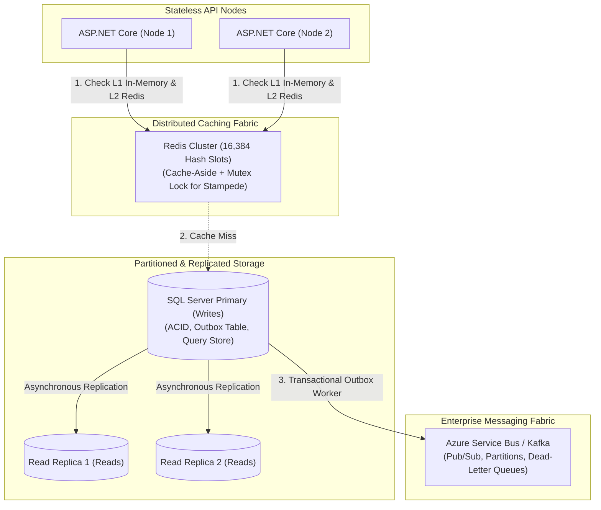
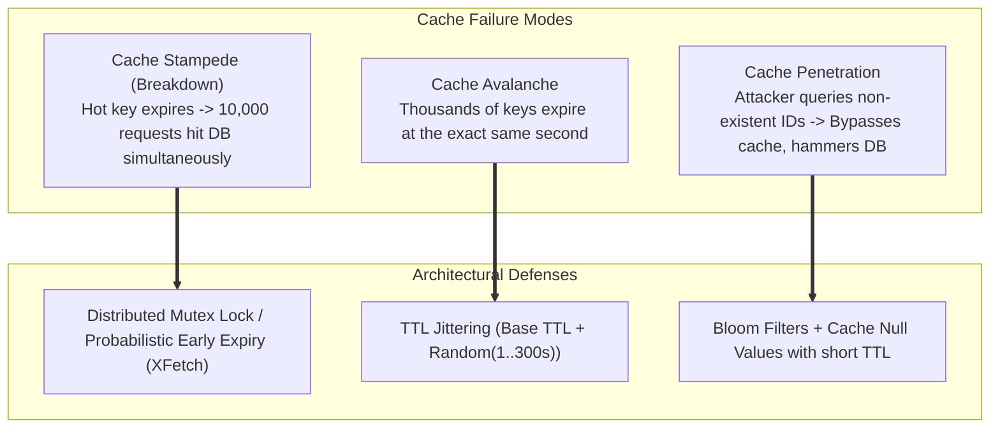
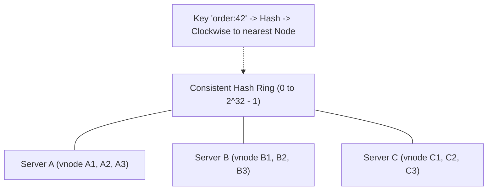
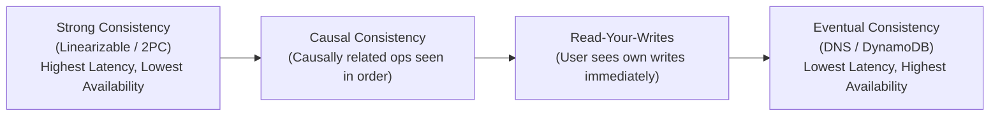

# Section 29: System Design: Caching, Databases & Consensus


> **Curriculum Navigation:**  
> ⏪ [Previous: Section 28 – System Design: Fundamentals & Networking](./280_system_design_fundamentals_architecture_networking.md) | 🏠 [Master Index](./README.md) | ⏩ [Next: Section 30 – System Design: Reliability, Security, Observability & Cases](./300_system_design_reliability_security_observability_case_studies.md)

---


## 1. Executive Summary & Core Concept

State management is the hardest problem in distributed systems. While compute (APIs and workers) can be scaled horizontally with near-zero state, **data storage, caching layers, message brokers, and distributed transactions** are bound by network latency, consistency models, and the physical constraints of disk I/O.



---

## 2. Distributed Caching Architecture

### 2.1 Caching Patterns & Access Strategies

| Strategy | How it Works | Read Latency | Write Latency | Consistency | Best Use Case |
| :--- | :--- | :--- | :--- | :--- | :--- |
| **Cache-Aside (Lazy Loading)** | Application reads cache; on miss, reads DB and populates cache. Writes go directly to DB, then cache is invalidated. | Sub-millisecond on hits | Normal | Eventual (risk of reading stale data if TTL long) | **Standard default for 95% of enterprise read-heavy APIs**. |
| **Write-Through** | Application writes to cache; cache synchronously writes to DB before acknowledging. | Fast | Slower (2 write hops) | **High (Cache and DB always in sync)** | Financial account balance tracking. |
| **Write-Behind (Write-Back)** | Application writes to cache; cache acknowledges immediately and writes to DB asynchronously. | Fastest | Fastest | **Weak (Data loss if cache node crashes before DB sync)** | Analytics counters, IoT telemetry ingestion, gaming scoreboards. |
| **Refresh-Ahead** | Cache automatically reloads frequently accessed keys before their TTL expires. | Ultra-low (eliminates cache miss spikes) | Normal | Good | Popular news articles, e-commerce hot homepages. |

---

### 2.2 Redis Internals & Clustering Mechanics

- **Single-Threaded Core Event Loop**: Redis executes all data commands sequentially using non-blocking I/O multiplexing (`epoll` / `kqueue`). This eliminates thread locks, race conditions, and context switching overhead.
- **Redis Cluster & Hash Slots**:
  - Redis Cluster partitions data across **16,384 Hash Slots**.
  - Slot calculation: $\text{Slot} = \text{CRC16}(\text{key}) \pmod{16384}$.
  - To ensure related keys hash to the *same* physical node for multi-key transactions, use **Hash Tags**: `{user:100}:profile` and `{user:100}:orders` hash identically based on `user:100`.
- **Persistence Modes**:
  - **RDB (Snapshotting)**: Point-in-time compact binary dump to disk every $N$ minutes.
  - **AOF (Append-Only File)**: Logs every write command sequentially. Guarantees near-zero data loss at slightly higher disk I/O cost.

---

### 2.3 Cache Failure Modes: Stampede, Avalanche & Penetration



---

### 2.4 Consistent Hashing & Virtual Nodes

In traditional mod hashing ($\text{Node} = \text{hash}(\text{key}) \pmod N$), adding or removing a single node invalidates nearly **100% of cached keys**, triggering a cataclysmic database stampede.



1. **The Hash Ring**:
   - Map both server identifiers and cache keys onto a continuous circular address space (e.g., $0$ to $2^{32} - 1$ using MurmurHash3 or SHA-256).
   - A key is routed to the **first server encountered moving clockwise** along the ring.
2. **Impact of Adding/Removing a Node**:
   - Only keys residing between the new node and its immediate predecessor are remapped ($\frac{K}{N}$ keys remapped on average). The remaining $(N-1)/N$ keys remain unaffected!
3. **The Non-Uniform Distribution Problem & Virtual Nodes (vnodes)**:
   - With few physical servers, keys distribute unevenly, creating devastating "hotspot" nodes.
   - **Solution**: Assign $V$ **Virtual Nodes** (e.g., 200 per physical server) scattered across the ring (e.g., `ServerA#1`, `ServerA#2`, ..., `ServerA#200`). This ensures mathematically uniform distribution and splits the load evenly across surviving nodes when a server fails.

---

## 3. Database Scaling, Storage & SQL Server Advanced

### 3.1 SQL vs. NoSQL Architecture Selection Matrix

| Category | Storage Engine | Schema Model | Scaling | Transaction Model | Best Scenario |
| :--- | :--- | :--- | :--- | :--- | :--- |
| **Relational (RDBMS)**<br/>*SQL Server, PostgreSQL* | B-Tree Indexes | Rigid, Normalized tables | Scale-Up (Primary), Scale-Out (Read Replicas) | **Strict ACID** | Banking, core ordering, ERP, billing systems. |
| **Document Store**<br/>*Cosmos DB, MongoDB* | JSON / BSON Trees | Flexible, Polymorphic | Horizontal Sharding via Partition Key | Scoped ACID per partition key | User profiles, product catalogs, content management. |
| **Key-Value Store**<br/>*Redis, DynamoDB* | In-Memory Hash Table / LSM | Key-Value blobs | Horizontal Partitioning | Single-key atomic | Session state, shopping carts, rate limiting counters. |
| **Wide-Column Store**<br/>*Cassandra, ScyllaDB* | Log-Structured Merge (LSM) | Sparse tables | Masterless P2P Sharding | Tunable consistency (Eventual) | High-volume IoT telemetry, time-series log ingestion. |

---

### 3.2 B-Trees vs. Log-Structured Merge (LSM) Trees

- **B-Tree (SQL Server / PostgreSQL)**:
  - Balances read performance and in-place updates.
  - Seeks require $O(\log N)$ random disk reads. Excellent for point queries and range scans.
  - Heavy write workloads suffer from **Write Amplification** and page splits.
- **LSM-Tree (Cassandra, RocksDB, LevelDB)**:
  - Appends all writes sequentially to an in-memory **MemTable** and writes to a write-ahead log (WAL).
  - Background compactions merge immutable **SSTables** on disk.
  - Blazing write speed ($O(1)$ sequential append), but reads require checking multiple SSTables (mitigated by Bloom filters).

---

### 3.3 Horizontal Table Partitioning in SQL Server

When a table grows past 100 million rows, query and maintenance performance degrades. **Partitioning** divides a single table physically while keeping it logically unified:

```sql
-- 1. Create Partition Function (Quarterly boundaries)
CREATE PARTITION FUNCTION OrderDateRangePF (DATETIME2)
AS RANGE RIGHT FOR VALUES (
    '2025-01-01', '2025-04-01', '2025-07-01', '2025-10-01', '2026-01-01'
);

-- 2. Create Partition Scheme (Mapping partitions to filegroups)
CREATE PARTITION SCHEME OrderPartitionScheme
AS PARTITION OrderDateRangePF
TO ([FG_Orders_Q1], [FG_Orders_Q2], [FG_Orders_Q3], [FG_Orders_Q4], [FG_Orders_2026], [PRIMARY]);

-- 3. Create Partitioned Table
CREATE TABLE dbo.Orders_Partitioned (
    OrderId BIGINT IDENTITY(1,1),
    OrderDate DATETIME2 NOT NULL,
    CustomerId INT NOT NULL,
    TotalAmount DECIMAL(18,2) NOT NULL,
    CONSTRAINT PK_OrdersPartitioned PRIMARY KEY CLUSTERED (OrderDate, OrderId)
) ON OrderPartitionScheme (OrderDate);

-- 4. Instant Metadata-Only Partition Switching (Zero-Downtime Data Archival)
-- Swaps out 10M historical rows in 5 milliseconds without physical disk IO!
ALTER TABLE dbo.Orders_Partitioned 
SWITCH PARTITION 1 TO dbo.Orders_Archive_Q1;
```

---

### 3.4 SQL Server Query Store in Practice

Query Store acts as the flight data recorder for SQL Server:
- Captures query execution plan history, runtime statistics (CPU, memory, duration), and wait statistics.
- **Troubleshooting Parameter Sniffing & Forcing Plans**:
```sql
-- Identify Plan Regression: Fast plan vs Regressed slow plan for the same query
SELECT 
    q.query_id,
    p.plan_id,
    rs.avg_duration / 1000.0 AS AvgDurationMs,
    rs.avg_cpu_time / 1000.0 AS AvgCpuMs,
    p.is_forced_plan
FROM sys.query_store_query q
JOIN sys.query_store_plan p ON q.query_id = p.query_id
JOIN sys.query_store_runtime_stats rs ON p.plan_id = rs.plan_id
WHERE q.query_id = 142
ORDER BY rs.last_execution_time DESC;

-- Force the high-performance execution plan (e.g., plan_id = 45)
EXEC sp_query_store_force_plan @query_id = 142, @plan_id = 45;
```

---

### 3.5 Handling Unique Constraints in High-Concurrency .NET + SQL

- **The Concurrency Race**: Two registration requests for `test@corp.com` arrive simultaneously. Both pass the application check `if (!await db.Users.AnyAsync(u => u.Email == email))`. Both proceed to insert.
- **The Production Solution**: Rely on database-enforced unique constraints and catch the violation:

```csharp
public async Task<IResult> RegisterUserAsync(RegisterUserDto dto, AppDbContext db)
{
    var user = new User { Id = Guid.NewGuid(), Email = dto.Email.ToLowerInvariant(), Name = dto.Name };

    try
    {
        db.Users.Add(user);
        await db.SaveChangesAsync();
        return Results.Created($"/users/{user.Id}", user);
    }
    catch (DbUpdateException ex) when (IsUniqueConstraintViolation(ex))
    {
        // Caught the race condition reliably at the database layer!
        return Results.Conflict(new ProblemDetails
        {
            Status = StatusCodes.Status409Conflict,
            Title = "Duplicate Resource",
            Detail = $"An account with email '{dto.Email}' already exists."
        });
    }
}

private static bool IsUniqueConstraintViolation(DbUpdateException ex)
{
    if (ex.InnerException is Microsoft.Data.SqlClient.SqlException sqlEx)
    {
        // 2601: Cannot insert duplicate key row in object with unique index
        // 2627: Violation of %ls constraint. Cannot insert duplicate key
        return sqlEx.Number is 2601 or 2627;
    }
    return false;
}
```

---

### 3.6 T-SQL MERGE Statement: Concurrency Hazards & Safer Alternatives

While T-SQL `MERGE` provides an all-in-one UPSERT (`WHEN MATCHED UPDATE... WHEN NOT MATCHED INSERT`), in high-concurrency production it suffers from documented race conditions, deadlocks, and constraint violations.
- **Safer Production Pattern**:
```sql
-- Explicit UPSERT with serializable locking hints
SET TRANSACTION ISOLATION LEVEL READ COMMITTED;

BEGIN TRANSACTION;
    UPDATE dbo.AccountBalances WITH (UPDLOCK, SERIALIZABLE)
    SET Balance = Balance + @CreditAmount, UpdatedAt = SYSUTCDATETIME()
    WHERE AccountId = @AccountId;

    IF @@ROWCOUNT = 0
    BEGIN
        INSERT INTO dbo.AccountBalances (AccountId, Balance, UpdatedAt)
        VALUES (@AccountId, @CreditAmount, SYSUTCDATETIME());
    END
COMMIT TRANSACTION;
```

---

## 4. Distributed Systems Consensus & Transactions

### 4.1 Consistency Models Spectrum



---

### 4.2 Distributed Transactions & Two-Phase Commit (2PC)

Two-Phase Commit (2PC) coordinates multiple independent database nodes:
1. **Prepare Phase**: The coordinator asks all nodes: *"Can you commit?"* Nodes acquire locks and reply *Yes* or *No*.
2. **Commit Phase**: If all say *Yes*, coordinator sends *Commit*. If any node says *No*, coordinator sends *Rollback*.
- **The Fatal Flaw**: 2PC is a **blocking protocol**. If the coordinator crashes while locks are held, participating database rows remain locked indefinitely, halting the entire enterprise. 2PC does not scale in modern cloud systems.

---

### 4.3 Sagas vs. Transactional Outbox

To replace 2PC:
- **Saga Pattern**: Chains local database transactions across microservices. If Step 3 fails, the saga triggers compensating local transactions in reverse order (e.g., refund payment, restock inventory).
- **Transactional Outbox**: Writes application entity state and outgoing integration events into the **same physical database transaction**. A reliable worker (or CDC / Debezium) publishes messages to Azure Service Bus or Kafka.

---

### 4.4 Distributed Locking: Redlock vs. SQL `sp_getapplock`

When only one worker across 50 nodes may process a task:
1. **Redis Redlock**: Acquires keys across $N/2 + 1$ independent Redis nodes with lease expirations. Requires **fencing tokens** (monotonically increasing integer) passed to downstream storage to reject stale writes from paused/delayed threads.
2. **SQL Server `sp_getapplock`**: Acquires an application lock tied to a live `SqlConnection` or `SqlTransaction`. Extremely reliable if your infrastructure already runs SQL Server.

---

## 5. Production-Ready Code Implementation

The following production code implements an enterprise-grade **Cache-Aside Pattern with Distributed Mutex Stampede Protection** in ASP.NET Core using **Redis** and **RedLock.net**:

```csharp
using System;
using System.Text.Json;
using System.Threading;
using System.Threading.Tasks;
using Microsoft.Extensions.Caching.Distributed;
using Microsoft.Extensions.Logging;
using StackExchange.Redis;

namespace EnterpriseArchitecture.SystemDesign.Caching;

public interface ICacheStampedeProtector
{
    Task<T> GetOrCreateWithStampedeProtectionAsync<T>(
        string cacheKey,
        Func<CancellationToken, Task<T>> factory,
        TimeSpan ttl,
        CancellationToken ct = default);
}

public sealed class CacheStampedeProtector : ICacheStampedeProtector
{
    private readonly IDistributedCache _cache;
    private readonly IConnectionMultiplexer _redis;
    private readonly ILogger<CacheStampedeProtector> _logger;

    public CacheStampedeProtector(
        IDistributedCache cache, 
        IConnectionMultiplexer redis, 
        ILogger<CacheStampedeProtector> logger)
    {
        _cache = cache ?? throw new ArgumentNullException(nameof(cache));
        _redis = redis ?? throw new ArgumentNullException(nameof(redis));
        _logger = logger ?? throw new ArgumentNullException(nameof(logger));
    }

    public async Task<T> GetOrCreateWithStampedeProtectionAsync<T>(
        string cacheKey,
        Func<CancellationToken, Task<T>> factory,
        TimeSpan ttl,
        CancellationToken ct = default)
    {
        // 1. First Attempt: Check Distributed Cache
        byte[]? cachedBytes = await _cache.GetAsync(cacheKey, ct);
        if (cachedBytes != null)
        {
            return JsonSerializer.Deserialize<T>(cachedBytes)!;
        }

        string lockKey = $"lock:{cacheKey}";
        string lockValue = Guid.NewGuid().ToString("N");
        IDatabase db = _redis.GetDatabase();

        // 2. Cache Miss: Attempt to acquire Distributed Mutex Lock (5-second lock lease)
        bool lockAcquired = await db.LockTakeAsync(lockKey, lockValue, TimeSpan.FromSeconds(5));

        if (lockAcquired)
        {
            try
            {
                // Double-Check Cache in case another thread populated it while we waited
                cachedBytes = await _cache.GetAsync(cacheKey, ct);
                if (cachedBytes != null)
                {
                    return JsonSerializer.Deserialize<T>(cachedBytes)!;
                }

                _logger.LogInformation("Cache miss for {CacheKey}. Executing database factory.", cacheKey);
                T data = await factory(ct);

                // Add Jitter to TTL to prevent Cache Avalanche (Base TTL +/- 10%)
                int jitterSeconds = Random.Shared.Next(-30, 30);
                TimeSpan jitteredTtl = ttl.Add(TimeSpan.FromSeconds(jitterSeconds));

                var cacheOptions = new DistributedCacheEntryOptions
                {
                    AbsoluteExpirationRelativeToNow = jitteredTtl
                };

                byte[] serializedBytes = JsonSerializer.SerializeToUtf8Bytes(data);
                await _cache.SetAsync(cacheKey, serializedBytes, cacheOptions, ct);

                return data;
            }
            finally
            {
                // Release Distributed Lock safely using lock token
                await db.LockReleaseAsync(lockKey, lockValue);
            }
        }
        else
        {
            // 3. Another thread is actively recalculating; wait briefly and retry from cache
            _logger.LogDebug("Lock held by another worker for {CacheKey}. Waiting to read.", cacheKey);
            await Task.Delay(TimeSpan.FromMilliseconds(150), ct);

            cachedBytes = await _cache.GetAsync(cacheKey, ct);
            if (cachedBytes != null)
            {
                return JsonSerializer.Deserialize<T>(cachedBytes)!;
            }

            // Fallback: direct factory execution if lock queue took too long
            return await factory(ct);
        }
    }
}
```

---

## 6. Line-by-Line Code Walkthrough

| Line Range | Architectural Mechanism | Technical Consequence |
| :--- | :--- | :--- |
| **Line 41–46** | Fast path `_cache.GetAsync` | Sub-millisecond return for 99.9% of requests. Avoids touching database or lock engines when data is warm in cache. |
| **Line 52–54** | `db.LockTakeAsync` | Uses Redis atomic `SET key value NX PX milliseconds` command. Exactly one thread wins the lock; the other 9,999 concurrent threads are blocked from hammering the database. |
| **Line 58–64** | **Double-Check Locking** | Once inside the lock, checks cache a second time. If another worker finished calculation a millisecond earlier, returns immediately without re-querying SQL Server. |
| **Line 70–73** | **TTL Jitter Injection** | Adds random variation ($\pm 30$ seconds) to the expiration time. Prevents the **Cache Avalanche** disaster where millions of keys expire simultaneously at midnight. |
| **Line 83–86** | `db.LockReleaseAsync` | Executes an atomic Lua script verifying that `lockValue` still matches before deleting the key. Prevents a thread from deleting a lock owned by another worker if execution was delayed. |

---

## 7. Senior / Principal Architect Interview Follow-ups

### Q1: "How do you avoid Split-Brain in a distributed consensus cluster (Raft or Paxos)?"
**Architect Response:**  
"Split-Brain occurs when a network partition divides a cluster into two disconnected halves, and both halves elect independent leaders that accept conflicting writes.

**Consensus Defense Mechanics**:
1. **Quorum Math**: To elect a leader or commit a log entry, Raft and Paxos require a **Strict Majority Quorum**:
   $$\text{Quorum} = \left\lfloor \frac{N}{2} \right\rfloor + 1$$
   *(Where $N$ is total cluster nodes).*
2. **Odd Number of Nodes**: Always deploy clusters with odd node counts ($N = 3, 5, 7$).
3. **Partition Behavior**: In a 5-node cluster split into $3$ and $2$ nodes:
   - The majority partition ($3$ nodes) meets quorum ($3 \ge 3$) and continues electing leaders and accepting writes.
   - The minority partition ($2$ nodes) cannot reach quorum ($2 < 3$) and immediately rejects writes, mathematically preventing split-brain data corruption."

### Q2: "What is a Fencing Token, and why is a distributed lease lock incomplete without it?"
**Architect Response:**  
"A distributed lock engine (like Redis or Zookeeper) grants a temporary lease (e.g., 10 seconds) to Client 1. If Client 1 experiences a long Garbage Collection (GC) pause or network freeze lasting 15 seconds:
1. The lock lease expires in Redis.
2. Redis grants the lock to Client 2.
3. Client 1 wakes up from its GC pause, unaware its lock expired, and writes data to storage concurrently with Client 2!

**The Fencing Token Solution**:
- Every time a distributed lock is acquired, the lock server increments and returns a monotonically increasing integer (**Fencing Token**, e.g., `101`, `102`).
- When Client 2 acquires the lock, it receives token `102`.
- When clients write to the database or storage layer, storage enforces: $\text{WriteToken} > \text{LastCommittedToken}$.
- If Client 1 attempts to write with stale token `101`, the storage engine rejects the write, eliminating race condition data corruption!"
