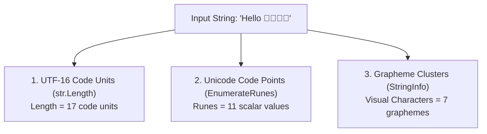
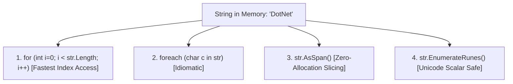
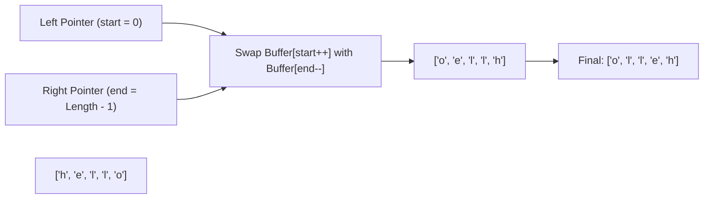
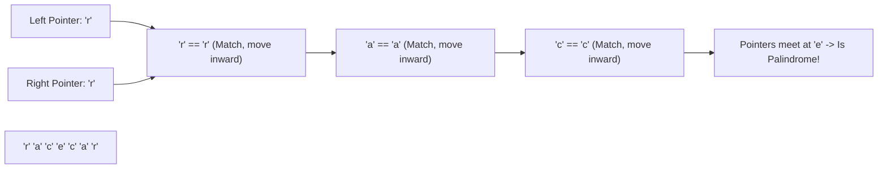

# Section 29: String Coding Problems & UTF Text Mechanics

> **Curriculum Navigation:**  
> ⏪ [Previous: Section 28 – Array Algorithmic Challenges (Modular Functions)](./28_array_coding_problems_using_functions.md) | 🏠 [Master Index](./README.md) | ⏩ [Next: Section 30 – String Algorithmic Challenges (Modular Functions)](./30_string_coding_problems_using_functions.md)

---

## Q263. Write a function that counts the number of characters in a string?

### 1. Executive Summary & Core Concept
Counting the characters in a string depends on whether you mean:
1. **UTF-16 Code Units**: Returned by the built-in `string.Length` property ($O(1)$ constant time lookup).
2. **Unicode Code Points / Scalar Values**: Characters that may span two UTF-16 code units (surrogate pairs).
3. **User-Perceived Characters (Grapheme Clusters)**: Visual glyphs that may combine multiple code points (e.g., emojis with skin tone modifiers or flags), counted via `StringInfo.ParseCombiningCharacters`.



### 2. Deep-Dive Architecture & Runtime Internals
- **In-Memory Representation**: In C#/.NET, `System.String` is an immutable sequence of **UTF-16 code units** (`char`), where each code unit is 2 bytes (16 bits).
- `string.Length` reads a 4-byte integer field stored directly in the string's object header on the heap, making it an $O(1)$ operation that requires no iteration.
- Emojis, historical scripts, and combining diacritics use **surrogate pairs** (two 16-bit `char`s representing a single Unicode character). For example, `👨‍👩‍👧‍👦` consists of 11 UTF-16 code units, but visually represents a single family emoji.

### 3. Production-Ready Code Implementation
```csharp
using System.Globalization;
using System.Text;

public static class StringLengthEvaluator
{
    /// <summary>
    /// Counts UTF-16 code units manually (demonstrates linear iteration).
    /// Time Complexity: O(N)
    /// Space Complexity: O(1)
    /// </summary>
    public static int CountCharactersManual(string? input)
    {
        if (string.IsNullOrEmpty(input))
        {
            return 0;
        }

        int count = 0;
        foreach (char _ in input)
        {
            count++;
        }

        return count;
    }

    /// <summary>
    /// Counts human-perceived characters (Grapheme Clusters), correctly handling emojis.
    /// Time Complexity: O(N)
    /// Space Complexity: O(N) internal boundary array
    /// </summary>
    public static int CountGraphemeClusters(string? input)
    {
        if (string.IsNullOrEmpty(input))
        {
            return 0;
        }

        var stringInfo = new StringInfo(input);
        return stringInfo.LengthInTextElements;
    }
}
```

### 4. Line-by-Line Code Walkthrough
- `CountCharactersManual`: Iterates over the string to demonstrate counting code units from first principles.
- `StringInfo.LengthInTextElements`: Uses the Unicode character database to group combining characters and surrogate pairs into visual grapheme clusters.

### 5. Real-World Enterprise Use Case & Application
Social media platforms (e.g., Twitter/X character limits) and SMS gateways (calculating 160-character GSM-7 segments vs 70-character UCS-2 segments for billing) use grapheme-aware counting to calculate accurate message lengths.

### 6. Common Pitfalls, Memory Traps & Anti-Patterns
- **Truncating Strings Without Considering Surrogate Pairs**: Splitting a string via `str.Substring(0, 10)` in the middle of a surrogate pair, producing an invalid orphan surrogate character (`\uD83D`) that corrupts downstream JSON serialization or database storage.

### 7. Senior / Architect Interview Follow-ups
- **Interviewer**: *What is `Rune` in .NET Core / .NET 8, and how does it relate to `char`?*
- **Candidate Answer**: Introduced in .NET Core 3.0, `System.Text.Rune` represents an actual **Unicode scalar value** (any Unicode code point except surrogate code points). While a `char` represents only a 16-bit UTF-16 code unit, a `Rune` can span 1 or 2 `char`s. Using `input.EnumerateRunes()` allows developers to iterate over full Unicode scalar values without manually managing surrogate pair math.

---

## Q264. How to iterate a string?

### 1. Executive Summary & Core Concept
C# provides multiple ways to iterate through a string:
1. **Index-Based `for` Loop**: High-performance access using `str[i]` ($O(N)$ time, $O(1)$ space).
2. **`foreach` Loop**: Idiomatic iteration through characters.
3. **`ReadOnlySpan<char>` Iteration**: Modern, zero-allocation memory slicing.
4. **`EnumerateRunes()`**: Unicode-aware iteration over scalar values.



### 2. Deep-Dive Architecture & Runtime Internals
- **String Indexer**: `string[int index]` is an indexed property returning a `char` (2-byte UTF-16 code unit). In modern .NET, the JIT optimizes sequential `for (int i = 0; i < str.Length; i++)` loops with **Bounds Check Elimination (BCE)**, converting index access into pointer increment operations at the machine code level.
- **Span Integration**: Calling `str.AsSpan()` produces a stack-only `ReadOnlySpan<char>` that points directly to the string's internal character buffer on the managed heap without allocating a new object.

### 3. Production-Ready Code Implementation
```csharp
public static class StringIterationShowcase
{
    // Pattern 1: Classic Index-Based Loop
    public static void IterateUsingForLoop(string text)
    {
        for (int i = 0; i < text.Length; i++)
        {
            char c = text[i];
            // Process character
        }
    }

    // Pattern 2: High-Performance Span Iteration
    public static void IterateUsingSpan(ReadOnlySpan<char> span)
    {
        for (int i = 0; i < span.Length; i++)
        {
            char c = span[i];
            // High-throughput processing with zero allocations
        }
    }

    // Pattern 3: Unicode-Aware Rune Iteration (Handles Emojis and Multi-byte Unicode)
    public static void IterateUsingRunes(string text)
    {
        foreach (var rune in text.EnumerateRunes())
        {
            // rune.Value contains the true 32-bit Unicode Code Point
        }
    }
}
```

### 4. Line-by-Line Code Walkthrough
- `for (int i = 0; i < text.Length; i++)`: Index-based loop; allows accessing characters by index and supports moving pointers backward or skipping elements.
- `ReadOnlySpan<char> span`: Operates directly on the string's memory buffer without heap allocations.
- `text.EnumerateRunes()`: Returns `Rune` structs, correctly decoding surrogate pairs into full Unicode code points.

### 5. Real-World Enterprise Use Case & Application
High-performance parsers (such as `System.Text.Json` or HTTP header parsers) iterate over incoming requests using `ReadOnlySpan<char>`, slicing segments like dates, numbers, and paths without allocating intermediate strings on the heap.

### 6. Common Pitfalls, Memory Traps & Anti-Patterns
- **Creating Substrings Inside an Iteration Loop**: Calling `text.Substring(i, 1)` inside a loop to inspect characters. `Substring()` allocates a new string object on the heap on every iteration, causing severe GC pressure. Always use `text[i]` or `AsSpan()`.

### 7. Senior / Architect Interview Follow-ups
- **Interviewer**: *Why does iterating over a `string` using `foreach` not cause heap allocations despite using `IEnumerable`?*
- **Candidate Answer**: In C#, `string` defines a custom public method `CharEnumerator GetEnumerator()`. The compiler binds to this strongly typed struct enumerator rather than falling back to `IEnumerable.GetEnumerator()`. Because `CharEnumerator` is a value type on the stack, the `foreach` loop incurs **zero boxing and zero heap allocations**.

---

## Q265. Write a function that returns the reverse of a string?

### 1. Executive Summary & Core Concept
Reversing a string involves swapping characters from opposite ends until the center is reached (the **Two-Pointer Technique**). Because strings in C# are **immutable**, reversal cannot be performed directly on the original string in-place; a temporary mutable buffer (`char[]` or `Span<char>`) must be used, followed by constructing the final reversed string.

- **Time Complexity**: $O(N)$
- **Space Complexity**: $O(N)$ (for the resulting string buffer).



### 2. Deep-Dive Architecture & Runtime Internals
- **String Immutability**: Strings are immutable in .NET to enable thread safety, string interning, and hash code caching. Reversing a string requires allocating a character buffer of length $N$, reversing the elements in that buffer, and emitting a new string.
- **Zero-Allocation Construction via `string.Create`**:
  In modern .NET Core, `string.Create(length, state, action)` allocates the exact destination string memory once on the heap and allows an `action` delegate to populate the characters in-place *before* the string becomes immutable, avoiding intermediate `char[]` allocations.

### 3. Production-Ready Code Implementation
```csharp
public static class StringReversalOperations
{
    /// <summary>
    /// Approach 1: Classic Two-Pointer Character Array Swap.
    /// Time Complexity: O(N)
    /// Space Complexity: O(N)
    /// </summary>
    public static string ReverseClassic(string? input)
    {
        if (string.IsNullOrEmpty(input) || input.Length == 1)
        {
            return input ?? string.Empty;
        }

        char[] charArray = input.ToCharArray();
        int left = 0;
        int right = charArray.Length - 1;

        while (left < right)
        {
            // Swap left and right characters
            (charArray[left], charArray[right]) = (charArray[right], charArray[left]);
            left++;
            right--;
        }

        return new string(charArray);
    }

    /// <summary>
    /// Approach 2: Modern High-Performance Reversal via string.Create (.NET Core+)
    /// Eliminates intermediate char[] heap allocation.
    /// </summary>
    public static string ReverseOptimized(string? input)
    {
        if (string.IsNullOrEmpty(input) || input.Length == 1)
        {
            return input ?? string.Empty;
        }

        return string.Create(input.Length, input, (span, source) =>
        {
            for (int i = 0; i < source.Length; i++)
            {
                span[i] = source[source.Length - 1 - i];
            }
        });
    }
}
```

### 4. Line-by-Line Code Walkthrough
- `(charArray[left], charArray[right]) = (charArray[right], charArray[left])`: Uses C# tuple syntax to swap characters cleanly without an explicit temporary variable.
- `left++; right--;`: Advances pointers toward the center until they cross.
- `string.Create(...)`: Allocates the target string directly and writes reversed characters into its memory buffer, eliminating intermediate `char[]` garbage collection allocations.

### 5. Real-World Enterprise Use Case & Application
Reversing strings is a core primitive in algorithmic problems like base conversions (e.g., converting an integer to hexadecimal/base64 strings where digits are computed in reverse order) and bioinformatics sequence analysis (reversing DNA/RNA strings).

### 6. Common Pitfalls, Memory Traps & Anti-Patterns
- **Using String Concatenation in a Loop**: Writing `string rev = ""; for(...) rev += str[i];`. Because strings are immutable, each `+=` creates a new string on the heap, producing an $O(N^2)$ time complexity and generating large amounts of garbage collection pressure.
- **Reversing Strings with Surrogate Pairs / Combining Diacritics**: Reversing `"café"` where `é` is represented as `e` + combining acute accent (`\u0301`) places the accent on the wrong character, corrupting the rendered text. For full Unicode safety, use `StringInfo.GetTextElementEnumerator`.

### 7. Senior / Architect Interview Follow-ups
- **Interviewer**: *Why is `string.Create()` faster than `new string(charArray)`?*
- **Candidate Answer**: `new string(charArray)` requires two allocations: first allocating the intermediate `char[]` buffer on the heap, and second allocating the final `System.String` and copying the bytes into it. `string.Create()` allocates the final string memory once on the heap and allows writing directly to its internal buffer via `Span<char>` before marking it immutable, cutting heap allocations in half.

---

## Q266. Write a function that checks whether a given string is a palindrome?

### 1. Executive Summary & Core Concept
A **palindrome** is a string that reads the same forwards and backwards (e.g., `"racecar"`, `"madam"`, `"A man, a plan, a canal: Panama"`).

The optimal approach uses the **Two-Pointer Technique**: place one pointer at the start and another at the end of the string, moving them inward toward the center. If characters at any position do not match, the string is not a palindrome.

- **Time Complexity**: $O(N)$ (requires at most $N/2$ comparisons).
- **Space Complexity**: $O(1)$ (in-place constant auxiliary memory).



### 2. Deep-Dive Architecture & Runtime Internals
- **Early Exit Optimization**: The algorithm terminates immediately on the first mismatched character pair, running in $O(1)$ time for non-palindromes with different first and last characters.
- **Case-Insensitive & Alphanumeric Normalization**: Enterprise implementations often ignore casing and skip non-alphanumeric punctuation without allocating a cleaned copy of the string.

### 3. Production-Ready Code Implementation
```csharp
public static class PalindromeChecker
{
    /// <summary>
    /// Determines whether a string is a palindrome (Exact Character Match).
    /// Time Complexity: O(N)
    /// Space Complexity: O(1)
    /// </summary>
    public static bool IsPalindrome(ReadOnlySpan<char> text)
    {
        if (text.Length <= 1)
        {
            return true;
        }

        int left = 0;
        int right = text.Length - 1;

        while (left < right)
        {
            if (text[left] != text[right])
            {
                return false; // Early exit on first mismatch
            }
            left++;
            right--;
        }

        return true;
    }

    /// <summary>
    /// Real-World Enterprise Palindrome: Ignores casing, whitespace, and punctuation (LeetCode 125).
    /// Zero heap allocations via ReadOnlySpan.
    /// </summary>
    public static bool IsValidPalindromeAlphanumeric(ReadOnlySpan<char> text)
    {
        int left = 0;
        int right = text.Length - 1;

        while (left < right)
        {
            // Skip non-alphanumeric characters from left
            while (left < right && !char.IsLetterOrDigit(text[left]))
            {
                left++;
            }

            // Skip non-alphanumeric characters from right
            while (left < right && !char.IsLetterOrDigit(text[right]))
            {
                right--;
            }

            // Case-insensitive comparison
            if (char.ToLowerInvariant(text[left]) != char.ToLowerInvariant(text[right]))
            {
                return false;
            }

            left++;
            right--;
        }

        return true;
    }
}
```

### 4. Line-by-Line Code Walkthrough
- `ReadOnlySpan<char> text`: Accepts any string or substring without allocating heap memory.
- `while (left < right && !char.IsLetterOrDigit(...))`: Skips punctuation and whitespace in-place, avoiding allocating a separate cleaned string.
- `char.ToLowerInvariant(...)`: Performs case-insensitive character comparison.

### 5. Real-World Enterprise Use Case & Application
DNA sequence analysis algorithms check for inverted palindromic repeats (restriction enzyme recognition sites) across genomic data streams.

### 6. Common Pitfalls, Memory Traps & Anti-Patterns
- **Reversing the String and Comparing**: Doing `return input == Reverse(input);`. This allocates a new string on the heap, reverses every character even if the first and last characters mismatch, and doubles memory consumption. The two-pointer approach is faster, exits early, and uses $O(1)$ memory.

### 7. Senior / Architect Interview Follow-ups
- **Interviewer**: *What is the longest palindromic substring problem, and what algorithm solves it in linear $O(N)$ time?*
- **Candidate Answer**: The longest palindromic substring problem asks to find the longest contiguous subsegment that is a palindrome. While expanding around centers takes $O(N^2)$ time, **Manacher's Algorithm** solves it in optimal **$O(N)$ time** by leveraging symmetry: it preserves previously computed palindrome radiuses to skip redundant character comparisons.
