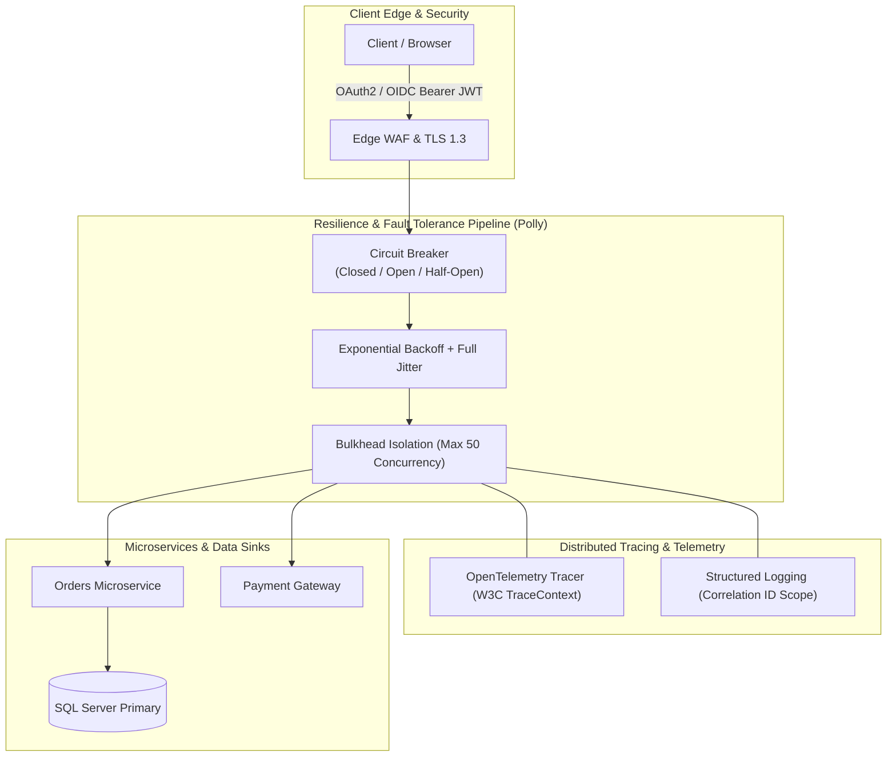
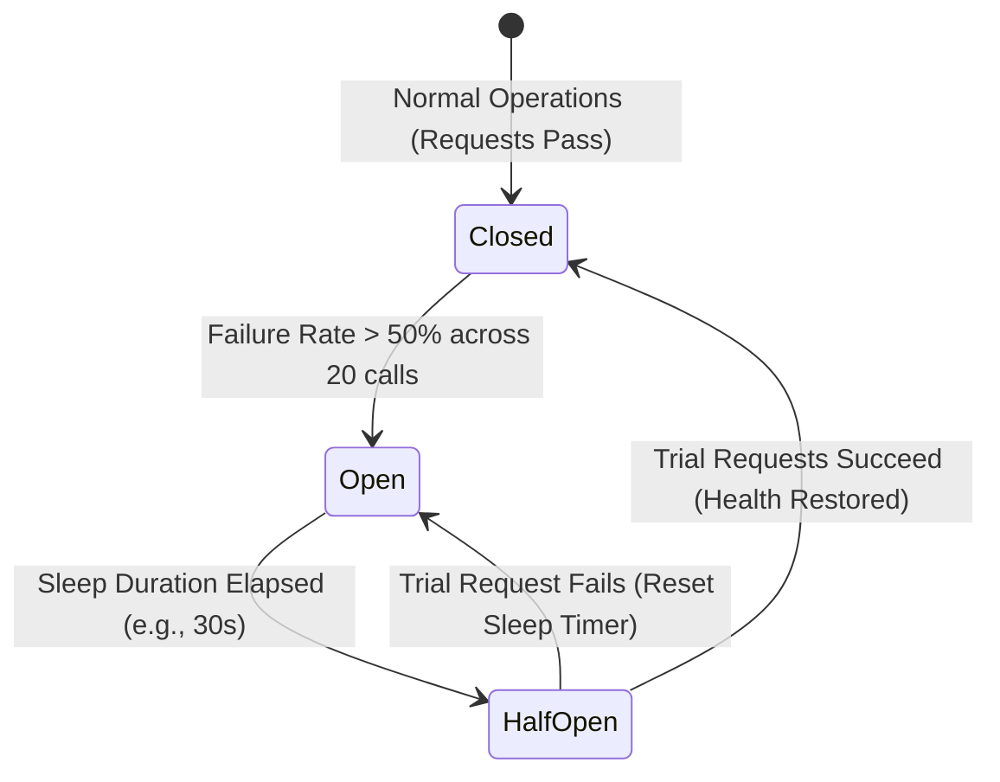
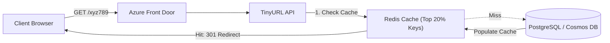
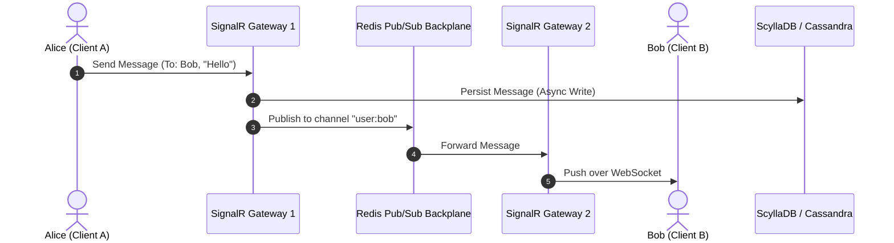

# Section 30: System Design: Reliability, Security, Observability & Cases


> **Curriculum Navigation:**  
> ⏪ [Previous: Section 29 – System Design: Caching, Databases & Consensus](./290_system_design_caching_databases_messaging_distributed_systems.md) | 🏠 [Master Index](./README.md) | ⏩ [Next: Section 31 – Microsoft Entra ID & Cloud Identity](./310_azure_entra_id_and_identity.md)

---


## 1. Executive Summary & Core Concept

A system design is incomplete until it addresses **production operability, fault tolerance, security, and real-time observability**. Distributed systems fail continuously: network links drop, cloud regions experience blackouts, and bad deployments introduce regressions. High-availability architectures design for failure as a natural, expected state through **Circuit Breakers, Exponential Backoff with Jitter, OpenTelemetry Distributed Tracing, and Zero Trust Security**.



---

## 2. System Reliability & Fault Tolerance

### 2.1 Retries with Exponential Backoff & Full Jitter

Blindly retrying failed calls causes the **Retry Storm / Thundering Herd Problem**, turning a minor transient hiccup into a total cascading outage:
- **Exponential Backoff**: Delay doubles on each retry attempt: $t = \text{base} \times 2^{\text{attempt}}$.
- **Full Jitter**: Injects randomness so thousands of retrying clients do not hammer the backend at identical intervals:

$$t_{\text{sleep}} = \text{Random}(0, \; \text{base} \times 2^{\text{attempt}})$$

---

### 2.2 The Circuit Breaker Pattern



1. **Closed**: Normal operations. Requests pass through to downstream services.
2. **Open**: Downstream service is failing. Requests fail fast immediately with a local fallback or error *without ever touching the network*, giving the downstream service time to recover.
3. **Half-Open**: After a cooldown period, a small sample of probe requests are allowed through. If successful, the circuit resets to Closed; if any fail, it trips back to Open.

---

### 2.3 Bulkhead Isolation & Timeouts

- **Timeout Pattern**: Every network call must have a rigid, deterministic timeout (e.g., 2.5 seconds). Without timeouts, hanging sockets consume thread pool workers until Kestrel runs out of threads.
- **Bulkhead Pattern**: Divides thread pools or connection limits into isolated compartments (named after ship bulkheads that prevent a single hull breach from sinking the ship). If the Recommendation API hangs, its dedicated 10-thread bulkhead exhausts, while the Checkout API continues operating unaffected.

---

### 2.4 Disaster Recovery (DR): RPO vs. RTO

- **Recovery Point Objective (RPO)**: The maximum acceptable data loss measured in time (e.g., *RPO = 5 minutes* means losing at most 5 minutes of data).
- **Recovery Time Objective (RTO)**: The maximum acceptable downtime before the service must be operational (e.g., *RTO = 15 minutes*).
- **Architectures**:
  - **Active-Passive (Warm Standby)**: Primary region serves 100% traffic; secondary region replicates DB. If Primary fails, DNS/Traffic Manager reroutes to Secondary (RTO $\approx 10-30$ mins).
  - **Active-Active (Multi-Region)**: Both regions serve live traffic concurrently. Requires distributed conflict resolution (CRDTs or active-active Cosmos DB / SQL Geo-Replication) (RTO $\approx 0$, RPO $< 1$ sec).

---

## 3. Enterprise Cloud Security & Zero Trust

### 3.1 OAuth 2.0 & OpenID Connect (OIDC) Protocols

- **OpenID Connect (OIDC)**: Handles **Authentication** ("*Who are you?*"). Issues an `id_token` (JWT containing user identity claims: email, name, sub).
- **OAuth 2.0**: Handles **Authorization** ("*What are you permitted to do?*"). Issues an `access_token` (used to authorize API requests).
- **Authorization Code Flow with PKCE (Proof Key for Code Exchange)**: The mandatory modern standard for SPAs (React, Angular) and mobile apps, eliminating the vulnerability of leaking client secrets.

---

### 3.2 JWT Security, Signature Verification & Revocation Strategies

JSON Web Tokens (JWT) are stateless. Revoking a token before its `exp` expires is a classic distributed systems challenge:
1. **Asymmetric Signing (RS256 / ES256)**: The identity provider signs with a private RSA key; APIs validate signatures using the public key fetched from the OpenID metadata endpoint (`/.well-known/jwks.json`).
2. **Token Revocation Architecture**:
   - Keep `access_token` lifetime short (e.g., **15 minutes**).
   - Use long-lived `refresh_token` stored in `HttpOnly, Secure` cookies.
   - For emergency immediate revocation (e.g., user password change or compromised session), record the revoked `jti` (JWT ID) or `userId` in a **Redis Revocation Blocklist** with a 15-minute TTL.

---

## 4. Distributed Observability & Production Troubleshooting Runbooks

### 4.1 Correlation IDs, OpenTelemetry & W3C TraceContext

In a modern microservice mesh (Browser $\to$ Edge $\to$ API Gateway $\to$ Order API $\to$ Payment API $\to$ SQL), tracing an asynchronous distributed transaction requires **W3C TraceContext**:

```
traceparent: 00-4bf92f3577b34da6a3ce929d0e0e4736-00f067aa0ba902b7-01
              │  └───────────────┬───────────────┘  └──────┬───────┘ └─┬┘
           Version          Trace ID (16 bytes)      Span ID (8 bytes) Trace Flags
            (00)         (Shared across all hops)  (Unique per service) (01 = Sampled)
```

1. **Header Propagation Mechanics**:
   - In ASP.NET Core (.NET 8/9), `System.Diagnostics.Activity` automatically extracts incoming `traceparent` and `tracestate` headers and assigns the current `Activity.TraceId`.
   - `HttpClient` automatically injects the active `traceparent` header into downstream outbound HTTP calls.
   - For message queues (Azure Service Bus / Kafka), the TraceContext is written to application message properties (`ApplicationProperties["traceparent"] = Activity.Current.Id`).
2. **Sampling Strategies**:
   - **Head-Based Sampling**: The API Gateway decides whether to sample (e.g., 5% of traffic) at the ingress boundary. Fast and low CPU overhead, but risks discarding rare 500 error traces.
   - **Tail-Based Sampling**: The OpenTelemetry Collector buffers traces in memory until completion; it samples 100% of traces that result in HTTP 5xx errors or latency $> 1000$ms, while discarding 99% of fast 200 OK traces.

---

### 4.2 Production Triage Runbook 1: "API Fast Locally, Slow in Production"

1. **Step 1: Network & Edge Overhead**: Check latency between client and Azure region. Is the user on another continent without an edge CDN / Azure Front Door?
2. **Step 2: Database Connection Pool Exhaustion**: Local developer tests use 1 concurrent connection; production uses 500. Check if `Max Pool Size` is saturated or connections are leaking due to un-disposed `SqlConnection`/`DbContext`.
3. **Step 3: Database Cold Cache & Parameter Sniffing**: Local tests run on a small database fitting entirely in RAM. Production queries touch cold disk pages on a 500 GB database, or hit a regressed execution plan.
4. **Step 4: Thread Pool Starvation**: Verify if synchronous blocking calls (`.Result`, `.Wait()`) are choking the ASP.NET Core thread pool under concurrency.

---

### 4.3 Production Triage Runbook 2: "SQL Server CPU Reaches 90%"

When SQL Server CPU spikes to 90% in production:
1. **Execute Diagnostic DMV Query**:
```sql
-- Identify Top 5 CPU-Consuming Queries in Cache
SELECT TOP 5
    qs.total_worker_time / qs.execution_count AS AvgCpuMicroseconds,
    qs.execution_count AS ExecutionCount,
    SUBSTRING(st.text, (qs.statement_start_offset/2)+1, 
        ((CASE qs.statement_end_offset WHEN -1 THEN DATALENGTH(st.text) 
          ELSE qs.statement_end_offset END - qs.statement_start_offset)/2) + 1) AS QueryText,
    qp.query_plan
FROM sys.dm_exec_query_stats qs
CROSS APPLY sys.dm_exec_sql_text(qs.sql_handle) st
CROSS APPLY sys.dm_exec_query_plan(qs.plan_handle) qp
ORDER BY qs.total_worker_time DESC;
```
2. **Analyze Root Causes**:
   - **Missing Index**: A missing index causes a Table Scan across 50 million rows on every search query.
   - **Parameter Sniffing**: Force a known good execution plan via Query Store.
   - **Excessive Recompilations**: High ad-hoc SQL without parameterization polluting the plan cache.

---

## 5. Enterprise System Design Case Studies

### Case Study 1: Design a Global Scalable URL Shortener (TinyURL)



- **Scale & Estimation**: 100M new URLs/month, 10:1 read/write ratio $\implies$ 1B reads/month ($\approx 400$ Read QPS, 40 Write QPS).
- **ID Generation & Base62 Algorithm**:
  - Avoid MD5/SHA256 truncation (causes hash collisions).
  - Use a distributed sequence generator (Twitter Snowflake or database 64-bit sequence):
```csharp
public static class Base62Encoder
{
    private const string Alphabet = "0123456789abcdefghijklmnopqrstuvwxyzABCDEFGHIJKLMNOPQRSTUVWXYZ";

    public static string Encode(long id)
    {
        if (id == 0) return "0";
        var chars = new Stack<char>();
        while (id > 0)
        {
            chars.Push(Alphabet[(int)(id % 62)]);
            id /= 62;
        }
        return new string(chars.ToArray());
    }
}
```
  - A 7-character Base62 string yields $62^7 \approx \mathbf{3.5 \text{ Trillion}}$ unique URLs.
- **Data Model & Caching**:
  - Table: `Urls(ShortCode PK VARCHAR(10), LongUrl VARCHAR(2048), UserId BIGINT, CreatedAt DATETIME2, ExpiresAt DATETIME2)`.
  - Redis cache stores `short_code -> long_url` with 30-day TTL. 80-20 Pareto principle satisfies 80% of traffic from Redis in $< 2$ms!

---

### Case Study 2: Design a High-Volume Distributed File Upload System

- **Scale**: Users upload video and document files from 10 MB to 5 GB. Direct upload through API servers causes memory exhaustion and gateway timeouts.
- **Direct-to-Cloud Upload Flow**:
  1. **Upload Initiation**: Browser calls `POST /api/files/initiate`.
  2. **Security Token**: API generates an **Azure Blob User Delegation SAS URL** valid for 1 hour with write-only permissions.
  3. **Parallel Chunking**: Browser splits the 1 GB file into 8 MB chunks and uploads directly to Azure Blob Storage using `PutBlock` with block IDs in parallel.
  4. **Commit**: Browser calls `PutBlockList` to commit all blocks into a single blob atomically.
  5. **Event-Driven Processing**: Azure Blob Storage fires a `BlobCreated` event to **Azure Event Grid** $\to$ triggers virus scanning and thumbnail generation in Azure Functions.

---

### Case Study 3: Design a Multi-Channel Notification Engine

- **Channels**: Email (SendGrid / SES), SMS (Twilio), Push Notifications (Apple APNs / Google FCM).
- **Core Architecture**:
  1. Microservices send `NotificationEvent` to Azure Service Bus Topic.
  2. **Topic Subscription Rules** route messages:
     - `high-priority-sub`: Transactional OTPs, fraud alerts, password resets (processed by dedicated auto-scaled worker pool).
     - `marketing-sub`: Promotional newsletters (throttled to respect third-party API rate limits).
  3. **User Preference & Rate-Limiter Filter**: Checks Redis key `notif_count:{userId}:{channel}` to prevent spamming users.
  4. **Idempotency & Deduplication**: Service Bus deduplication window (10 minutes) ensures duplicate order events don't trigger dual SMS charges.

---

### Case Study 4: Design a High-Throughput E-Commerce Flash Sale System

- **Scale**: 100,000 concurrent users competing for 1,000 limited-stock gaming consoles within 10 seconds.
- **Zero-Deadlock Architecture**:
  - Relational database row locks (`SELECT ... FOR UPDATE`) fail under 100k concurrency due to lock contention and connection pool exhaustion.
  - **In-Memory Atomic Decrement (Redis Lua Script)**:
    ```lua
    local stock = tonumber(redis.call('get', KEYS[1]))
    if stock and stock > 0 then
        redis.call('decr', KEYS[1])
        return 1
    else
        return 0
    end
    ```
  - **Reservation State Machine**:
    - If Lua script returns `1`, the user receives a cryptographically signed **Reservation Token** with a 15-minute expiration.
    - User proceeds to payment gateway.
    - If payment succeeds: Order API saves order to DB via Transactional Outbox.
    - If payment times out: Scheduled worker increments Redis stock back by 1 (`INCR key`).

---

### Case Study 5: Design a Real-Time Distributed Chat & Messaging System



- **Scale**: 50M DAU, 500,000 concurrent active WebSocket connections.
- **Core Architecture**:
  1. **Connection Gateways**: Horizontally scaled ASP.NET Core SignalR nodes maintain persistent TCP WebSocket connections.
  2. **Redis Backplane / Pub-Sub**: When Alice on Gateway 1 sends a message to Bob on Gateway 2, Gateway 1 publishes to Redis channel `user:bob`. Gateway 2 receives and pushes it to Bob's socket.
  3. **Storage Engine (Wide-Column Cassandra / ScyllaDB)**:
     - Schema: `CREATE TABLE messages (conversation_id UUID, bucket_month INT, message_id TIMEUUID, sender_id BIGINT, body TEXT, PRIMARY KEY ((conversation_id, bucket_month), message_id)) WITH CLUSTERING ORDER BY (message_id DESC);`
     - Allows sub-millisecond reverse chronological chat history scrolling without memory-heavy SQL joins.

---

## 6. Production-Ready Code Implementation

The following production code implements an enterprise-grade **Resilience Pipeline (Circuit Breaker + Exponential Backoff with Jitter) with OpenTelemetry Correlation Tracking** in ASP.NET Core:

```csharp
using System;
using System.Diagnostics;
using System.Net.Http;
using System.Threading;
using System.Threading.Tasks;
using Microsoft.AspNetCore.Builder;
using Microsoft.AspNetCore.Http;
using Microsoft.Extensions.DependencyInjection;
using Microsoft.Extensions.Logging;
using Polly;
using Polly.CircuitBreaker;
using Polly.Retry;

namespace EnterpriseArchitecture.SystemDesign.Resilience;

public static class ResilienceBootstrapper
{
    private static readonly ActivitySource ActivitySource = new("Enterprise.PaymentGateway");

    public static WebApplication BuildResilientApp(string[] args)
    {
        var builder = WebApplication.CreateBuilder(args);

        // 1. Build Enterprise Polly Resilience Pipeline (Circuit Breaker + Jittered Retry)
        builder.Services.AddResiliencePipeline("ExternalPaymentPipeline", pipelineBuilder =>
        {
            // A. Retry Strategy: Exponential Backoff with Full Jitter
            pipelineBuilder.AddRetry(new RetryStrategyOptions<HttpResponseMessage>
            {
                MaxRetryAttempts = 3,
                BackoffType = DelayBackoffType.Exponential,
                UseJitter = true,
                Delay = TimeSpan.FromMilliseconds(500),
                ShouldHandle = new PredicateBuilder<HttpResponseMessage>()
                    .Handle<HttpRequestException>()
                    .HandleResult(response => (int)response.StatusCode >= 500)
            });

            // B. Circuit Breaker Strategy
            pipelineBuilder.AddCircuitBreaker(new CircuitBreakerStrategyOptions<HttpResponseMessage>
            {
                FailureRatio = 0.5, // Trip if 50% of requests fail
                SamplingDuration = TimeSpan.FromSeconds(30),
                MinimumThroughput = 10,
                BreakDuration = TimeSpan.FromSeconds(20),
                ShouldHandle = new PredicateBuilder<HttpResponseMessage>()
                    .Handle<HttpRequestException>()
                    .HandleResult(response => (int)response.StatusCode >= 500)
            });
        });

        builder.Services.AddHttpClient("PaymentClient", client =>
        {
            client.BaseAddress = new Uri("https://api.paymentgateway.internal");
            client.Timeout = TimeSpan.FromSeconds(3); // Strict Timeout
        });

        var app = builder.Build();

        // 2. Correlation ID Middleware
        app.Use(async (context, next) =>
        {
            if (!context.Request.Headers.TryGetValue("X-Correlation-Id", out var correlationId))
            {
                correlationId = Guid.NewGuid().ToString("N");
            }

            context.Response.Headers["X-Correlation-Id"] = correlationId;

            var logger = context.RequestServices.GetRequiredService<ILogger<WebApplication>>();
            using (logger.BeginScope(new Dictionary<string, object> { ["CorrelationId"] = correlationId.ToString() }))
            {
                await next();
            }
        });

        return app;
    }
}
```

---

## 7. Line-by-Line Code Walkthrough

| Line Range | Architectural Mechanism | Technical Consequence |
| :--- | :--- | :--- |
| **Line 24–35** | `AddRetry` + `UseJitter = true` | Prevents retry storms by randomizing the retry intervals across parallel failing threads. Only retries transient 5xx server errors and network drops. |
| **Line 38–48** | `AddCircuitBreaker` | Protects downstream payment gateways from complete failure. If 50% of calls fail over 30 seconds, immediately breaks the circuit for 20 seconds. |
| **Line 53–55** | `client.Timeout = TimeSpan.FromSeconds(3)` | Eliminates socket starvation by cutting off hanging HTTP sockets after 3 seconds. |
| **Line 62–74** | **Correlation ID Middleware** | Extracts or generates `X-Correlation-Id`, passes it into `logger.BeginScope`, and echoes it in the response header for cross-service observability. |

---

## 8. Senior / Principal Architect Interview Follow-ups

### Q1: "How do you handle Token Revocation in a high-scale microservices architecture using stateless JWTs?"
**Architect Response:**  
"Because JWTs are stateless and self-contained, standard validation checks only the digital signature and expiration time without contacting the identity provider.

**Production Revocation Architecture**:
1. **Short Token Lifetimes**: Configure `access_token` expiration to **10–15 minutes**. When a user logs out, the maximum blast radius is 15 minutes.
2. **Redis Revocation Blocklist**: For immediate emergency revocations (e.g., security breach, admin lock), the Identity Service publishes the revoked `jti` (JWT ID) or `userId` to a distributed Redis cache with a 15-minute TTL.
3. **Gateway-Level Inspection**: The API Gateway (APIM) checks Redis for the token's `jti`. If present, it rejects the request with HTTP 401 Unauthorized, shielding backend microservices from checking Redis."

### Q2: "What is Chaos Engineering, and why should enterprise systems implement it?"
**Architect Response:**  
"Chaos Engineering is the discipline of experimenting on a distributed system in production to build confidence in its capability to withstand turbulent conditions.
- Rather than waiting for an unannounced regional network outage on Black Friday, tools like **Azure Chaos Studio** or **Chaos Mesh** systematically inject controlled faults:
  - Artificially introducing 500ms network latency to SQL Server.
  - Killing random Kubernetes pods in the Orders deployment.
  - Severing connection to Redis to verify cache-aside fallbacks.
- **The Value**: Proves empirically that Circuit Breakers, Bulkheads, and Graceful Degradation policies execute correctly before real disaster strikes."
