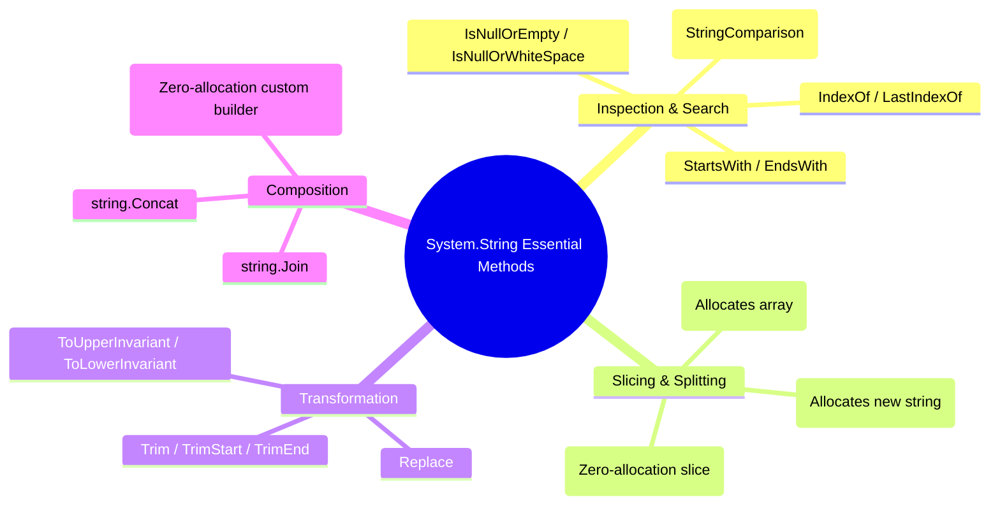
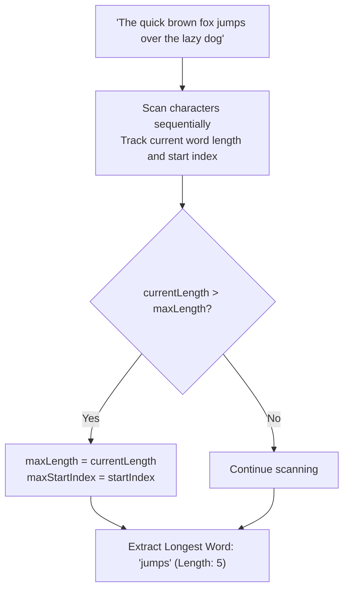
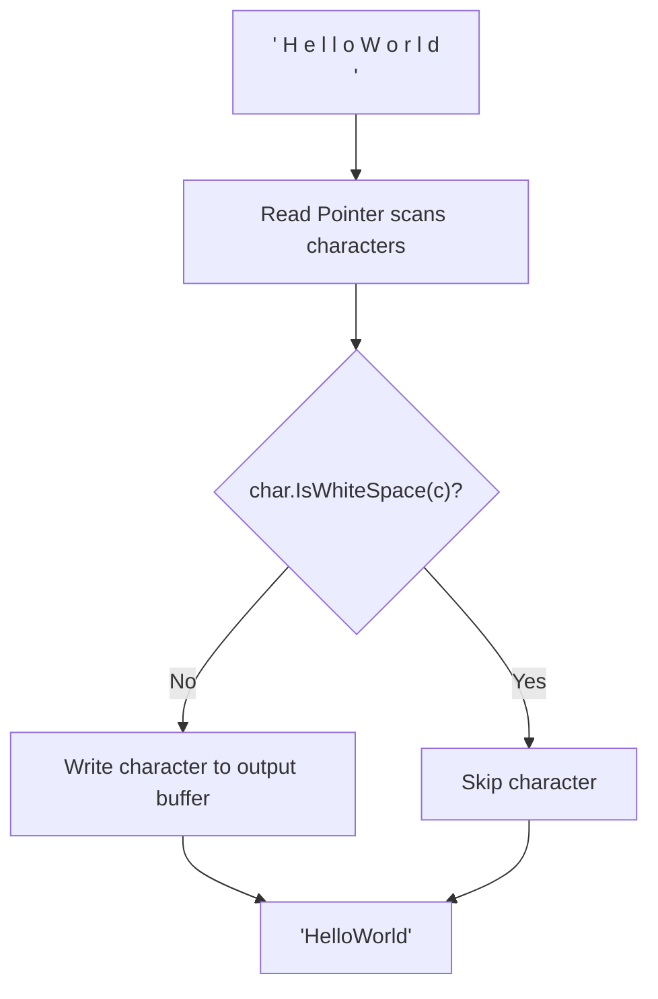
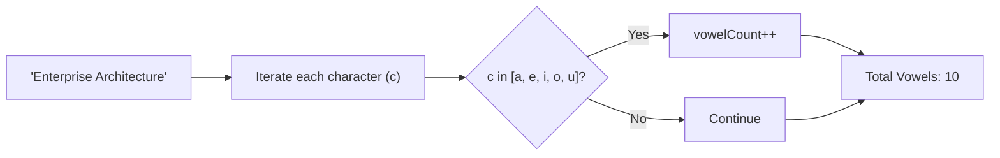
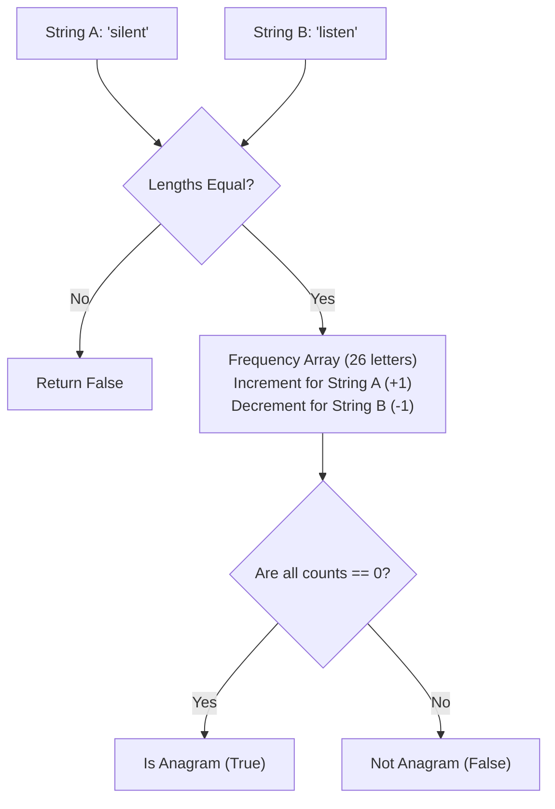

# Section 30: String Coding Problems Using Functions & Standard Library

---

### Navigation
- **Previous Section**: [Section 29: String Coding Problems](./29_string_coding_problems.md)
- **Next Section**: [Section 31: Number Coding Problems](./31_number_coding_problems.md)
- **Curriculum Master Index**: [README.md](./README.md)

---

## Q267. What are the important methods of the String class?

### 1. Executive Summary & Core Concept
In .NET, `System.String` provides an extensive suite of built-in methods for text manipulation. Because strings are immutable, any method that modifies text returns a **new string instance** on the heap, making appropriate method selection critical for high-performance applications.

The core methods are categorized into:
1. **Inspection & Search**: `Contains()`, `IndexOf()`, `StartsWith()`, `EndsWith()`, `IsNullOrEmpty()`, `IsNullOrWhiteSpace()`.
2. **Subdivision & Slicing**: `Substring()`, `Split()`, `AsSpan()`.
3. **Transformation & Normalization**: `Replace()`, `Trim()`, `ToUpperInvariant()`, `ToLowerInvariant()`, `PadLeft()`, `PadRight()`.
4. **Composition & Formatting**: `string.Join()`, `string.Concat()`, `string.Format()`, `string.Create()`.



### 2. Deep-Dive Architecture & Runtime Internals
- **`StringComparison` Flags**:
  Methods like `IndexOf()`, `Contains()`, and `StartsWith()` should always specify an explicit `StringComparison` enum rather than relying on framework defaults:
  - `StringComparison.Ordinal`: Compares raw binary bytes. Fastest option; ideal for internal identifiers, JSON keys, and URLs.
  - `StringComparison.OrdinalIgnoreCase`: Fast case-insensitive comparison ignoring linguistic culture rules.
  - `StringComparison.CurrentCulture` / `InvariantCulture`: Culturally-aware linguistic comparison (respects accented characters, German eszett `ß` $\rightarrow$ `ss`, Turkish dotted `i`).
- **Memory Impact of `Split()` vs. `MemoryExtensions.Split()`**: Calling `str.Split(',')` allocates both a new array and individual string objects for every split token. In .NET 8, `MemoryExtensions.Split` can parse tokens into a `Span<Range>` with zero heap allocations.

### 3. Production-Ready Code Implementation
```csharp
public static class StringApiDemonstration
{
    public static void ShowcaseKeyMethods()
    {
        string rawPath = "  /api/v1/customers/orders/archive.json  ";

        // 1. Trimming & Normalization
        string trimmed = rawPath.Trim(); // Removes leading/trailing whitespace

        // 2. High-Performance Substring Checking with Explicit Ordinal Rules
        bool isApiRoute = trimmed.StartsWith("/api/", StringComparison.OrdinalIgnoreCase);
        bool isJson = trimmed.EndsWith(".json", StringComparison.OrdinalIgnoreCase);

        // 3. Finding character positions
        int lastSlashIndex = trimmed.LastIndexOf('/');
        string fileName = (lastSlashIndex >= 0) ? trimmed.Substring(lastSlashIndex + 1) : trimmed;

        // 4. Zero-Allocation Token Splitting via ReadOnlySpan (.NET 8)
        ReadOnlySpan<char> span = trimmed.AsSpan();
        Span<Range> ranges = stackalloc Range[10];
        int count = span.Split(ranges, '/');

        Console.WriteLine($"Found {count} route segments without heap allocations.");
    }
}
```

### 4. Line-by-Line Code Walkthrough
- `trimmed.StartsWith("/api/", StringComparison.OrdinalIgnoreCase)`: Avoids locale-dependent collation table lookups by using fast ordinal comparison.
- `trimmed.LastIndexOf('/')`: Finds the index of the last occurrence of a character.
- `span.Split(ranges, '/')`: .NET 8 zero-allocation parsing using `Span<Range>` on the stack.

### 5. Real-World Enterprise Use Case & Application
Enterprise reverse proxies and API Gateways (YARP, Envoy) use ordinal string comparisons to evaluate routing path rules across millions of HTTP requests per second with minimal CPU overhead.

### 6. Common Pitfalls, Memory Traps & Anti-Patterns
- **Using `ToLower()` for Comparisons**: Writing `if (str1.ToLower() == str2.ToLower())`. This allocates two new strings on the heap just to discard them. Always use `string.Equals(str1, str2, StringComparison.OrdinalIgnoreCase)`.
- **Using `str.Replace()` Repeatedly in a Loop**: Calling `.Replace()` multiple times creates intermediate string allocations on each pass. Use a single `StringBuilder` or regex for multiple replacements.

### 7. Senior / Architect Interview Follow-ups
- **Interviewer**: *Why can `string.ToUpperInvariant()` be faster than `string.ToLowerInvariant()` in certain .NET runtime paths?*
- **Candidate Answer**: The Unicode standard has more complex case-folding rules when converting uppercase to lowercase than vice versa. Historically, the CLR team optimized the uppercase mapping tables first, making `ToUpperInvariant()` slightly more streamlined. In modern .NET Core, both are heavily vectorized using SIMD, but `ToUpperInvariant` remains the standard recommendation for case-insensitive normalization keys.

---

## Q268. Write a function that returns the longest word in the sentence.

### 1. Executive Summary & Core Concept
Finding the longest word in a sentence requires tokenizing the text by delimiters (whitespace, punctuation) and identifying the token with the maximum character count. 

- **Naive Approach**: `sentence.Split(' ').OrderByDescending(w => w.Length).First()` ($O(N \log N)$ time, allocates multiple strings).
- **Optimal Production Approach**: Linear scan tracking the start and end of word boundaries in a single pass ($O(N)$ time, $O(1)$ auxiliary memory).



### 2. Deep-Dive Architecture & Runtime Internals
- **Punctuation Awareness**: Real-world sentences contain punctuation (e.g., `"The quick, brown fox!"`). Naive splitting by space leaves commas and exclamation marks attached to words, skewing their lengths. Checking `char.IsLetterOrDigit()` ensures only valid word characters are counted.

### 3. Production-Ready Code Implementation
```csharp
public static class LongestWordFinder
{
    /// <summary>
    /// Finds the longest word in a sentence in a single O(N) pass.
    /// Handles punctuation and multiple consecutive spaces with zero intermediate array allocations.
    /// Time Complexity: O(N)
    /// Space Complexity: O(1) Auxiliary Memory (excluding final result string)
    /// </summary>
    public static string FindLongestWord(string? sentence)
    {
        if (string.IsNullOrWhiteSpace(sentence))
        {
            return string.Empty;
        }

        ReadOnlySpan<char> text = sentence.AsSpan();
        int maxWordStart = -1;
        int maxWordLength = 0;

        int currentWordStart = -1;
        int currentWordLength = 0;

        for (int i = 0; i < text.Length; i++)
        {
            if (char.IsLetterOrDigit(text[i]))
            {
                if (currentWordStart == -1)
                {
                    currentWordStart = i; // Mark start of a new word
                }
                currentWordLength++;
            }
            else
            {
                // Word boundary reached: Check if current word is the longest
                if (currentWordLength > maxWordLength)
                {
                    maxWordLength = currentWordLength;
                    maxWordStart = currentWordStart;
                }
                // Reset current word trackers
                currentWordStart = -1;
                currentWordLength = 0;
            }
        }

        // Handle trailing word at the end of the sentence
        if (currentWordLength > maxWordLength)
        {
            maxWordLength = currentWordLength;
            maxWordStart = currentWordStart;
        }

        return (maxWordStart >= 0) ? text.Slice(maxWordStart, maxWordLength).ToString() : string.Empty;
    }
}
```

### 4. Line-by-Line Code Walkthrough
- `ReadOnlySpan<char> text = sentence.AsSpan()`: Slices the input string without allocating memory.
- `if (char.IsLetterOrDigit(text[i]))`: Identifies valid word characters, properly ignoring punctuation (commas, periods, quotes).
- `text.Slice(maxWordStart, maxWordLength).ToString()`: Allocates only the single final return string, avoiding intermediate array or substring allocations.

### 5. Real-World Enterprise Use Case & Application
Natural Language Processing (NLP) search indexing pipelines use word boundary detection during the lexical tokenization phase to extract keywords for inverted index generation (e.g., in Lucene / Elasticsearch).

### 6. Common Pitfalls, Memory Traps & Anti-Patterns
- **Using `sentence.Split(' ')` with Multiple Consecutive Spaces**: If the input has multiple spaces (`"Hello   World"`), `Split(' ')` generates empty string tokens (`""`) that must be filtered out.
- **Forgetting the Trailing Word**: Failing to check the last word after the loop ends when the sentence does not terminate with a space or punctuation mark.

### 7. Senior / Architect Interview Follow-ups
- **Interviewer**: *How would you handle ties if multiple words share the maximum length?*
- **Candidate Answer**: That depends on the specification: returning the *first* longest word requires a strict inequality (`currentWordLength > maxWordLength`), while returning the *last* longest word uses a non-strict inequality (`>=`). If all longest words must be returned, we maintain a list of word slices, clearing the list when a strictly longer word is found and appending when a tie occurs.

---

## Q269. Write a function to remove all whitespace characters from a string.

### 1. Executive Summary & Core Concept
Removing all whitespace (spaces, tabs `\t`, newlines `\r`, `\n`) from a string requires filtering out any character where `char.IsWhiteSpace(c)` is true.

- **Naive Approach**: `input.Replace(" ", "").Replace("\t", "")` (multiple passes, misses other Unicode whitespace characters, multiple allocations).
- **Optimal Production Approach**: Single-pass **Two-Pointer Read/Write** filter using `string.Create()` or `Span<char>` ($O(N)$ time, $O(N)$ space for the result string).



### 2. Deep-Dive Architecture & Runtime Internals
- **Unicode Whitespace Characters**: `char.IsWhiteSpace` recognizes all 25+ Unicode space characters (including non-breaking space `\u00A0`, em space `\u2003`, and zero-width spaces), whereas `Replace(" ", "")` only removes the ASCII space (`0x20`).
- **In-Place Write via `string.Create`**: We count non-whitespace characters first to allocate the exact result string size, then copy valid characters directly into the buffer.

### 3. Production-Ready Code Implementation
```csharp
public static class WhitespaceRemover
{
    /// <summary>
    /// Removes all Unicode whitespace characters from a string in a single O(N) pass.
    /// Time Complexity: O(N)
    /// Space Complexity: O(N)
    /// </summary>
    public static string RemoveAllWhitespace(string? input)
    {
        if (string.IsNullOrEmpty(input))
        {
            return string.Empty;
        }

        // 1. First Pass: Count non-whitespace characters
        int nonWhitespaceCount = 0;
        for (int i = 0; i < input.Length; i++)
        {
            if (!char.IsWhiteSpace(input[i]))
            {
                nonWhitespaceCount++;
            }
        }

        // If no whitespace was present, return the original string directly
        if (nonWhitespaceCount == input.Length)
        {
            return input;
        }

        // 2. Second Pass: Populate the result string directly with zero intermediate allocations
        return string.Create(nonWhitespaceCount, input, (destinationSpan, sourceString) =>
        {
            int writeIndex = 0;
            for (int i = 0; i < sourceString.Length; i++)
            {
                if (!char.IsWhiteSpace(sourceString[i]))
                {
                    destinationSpan[writeIndex++] = sourceString[i];
                }
            }
        });
    }
}
```

### 4. Line-by-Line Code Walkthrough
- `if (nonWhitespaceCount == input.Length) return input`: Fast path: if the string contains no whitespace, returns the original instance directly without allocating a new object.
- `char.IsWhiteSpace(sourceString[i])`: Standard Unicode-aware whitespace check.
- `string.Create(...)`: Constructs the final string with a single allocation, avoiding intermediate `StringBuilder` or `char[]` heap objects.

### 5. Real-World Enterprise Use Case & Application
Payment processing gateways sanitize credit card numbers and IBANs by stripping all spaces, tabs, and formatting characters before executing Luhn validation algorithms.

### 6. Common Pitfalls, Memory Traps & Anti-Patterns
- **Using Regular Expressions for Simple Space Removal**: Calling `Regex.Replace(input, @"\s+", "")`. While functional, running a regex engine introduces significant parsing overhead compared to a direct character scan.

### 7. Senior / Architect Interview Follow-ups
- **Interviewer**: *When would you use `StringBuilder` versus `string.Create` for string transformations?*
- **Candidate Answer**: We use `string.Create()` when the **final string length is known in advance** (or can be calculated cheaply in a first pass), achieving a single heap allocation with zero overhead. We use `StringBuilder` when the final length is **dynamic and unpredictable** (e.g., complex multi-branch serialization, recursive tree traversals), letting the builder expand its internal buffer as needed.

---

## Q270. Write a function that counts the number of vowels in a string?

### 1. Executive Summary & Core Concept
Counting vowels requires iterating through the characters of a string and checking if each character belongs to the vowel set (`A, E, I, O, U`, both lowercase and uppercase).

- **Time Complexity**: $O(N)$
- **Space Complexity**: $O(1)$ (using a bitmask or constant-time hash set).



### 2. Deep-Dive Architecture & Runtime Internals
- **Bitmask / Lookup Table Optimization**:
  Checking `c == 'a' || c == 'e' || ...` introduces multiple conditional branches. For ASCII characters, this can be optimized into an $O(1)$ constant-time lookup using a 128-element boolean table or a 32-bit integer bitmask, eliminating conditional branch mispredictions at the CPU level.

### 3. Production-Ready Code Implementation
```csharp
public static class VowelCounter
{
    // SearchValues<char> (.NET 8+): Vectorized hardware acceleration (SIMD)
    private static readonly System.Buffers.SearchValues<char> VowelSearchValues =
        System.Buffers.SearchValues.Create("aeiouAEIOU");

    /// <summary>
    /// Modern .NET 8 SIMD-accelerated vowel counter.
    /// Time Complexity: O(N) vectorized
    /// Space Complexity: O(1)
    /// </summary>
    public static int CountVowelsOptimized(ReadOnlySpan<char> text)
    {
        int count = 0;
        ReadOnlySpan<char> remaining = text;

        while (!remaining.IsEmpty)
        {
            int index = remaining.IndexOfAny(VowelSearchValues);
            if (index == -1)
            {
                break;
            }
            count++;
            remaining = remaining.Slice(index + 1);
        }

        return count;
    }

    /// <summary>
    /// Classic Portable C# Implementation using a fast switch statement.
    /// </summary>
    public static int CountVowelsClassic(string? text)
    {
        if (string.IsNullOrEmpty(text)) return 0;

        int count = 0;
        for (int i = 0; i < text.Length; i++)
        {
            switch (char.ToLowerInvariant(text[i]))
            {
                case 'a':
                case 'e':
                case 'i':
                case 'o':
                case 'u':
                    count++;
                    break;
            }
        }
        return count;
    }
}
```

### 4. Line-by-Line Code Walkthrough
- `SearchValues.Create("aeiouAEIOU")`: .NET 8 high-performance pattern compiler that uses AVX2 / ARM Neon vector instructions to scan 16–32 characters per CPU clock cycle.
- `remaining.IndexOfAny(VowelSearchValues)`: Jumps directly to the next vowel index using SIMD instructions.
- `remaining = remaining.Slice(index + 1)`: Slices the span in-place with zero memory allocation.

### 5. Real-World Enterprise Use Case & Application
Readability scoring algorithms (such as the Flesch-Kincaid Grade Level and Coleman-Liau Index) use vowel counting to estimate syllable counts in text analysis and SEO content optimization engines.

### 6. Common Pitfalls, Memory Traps & Anti-Patterns
- **Using LINQ `.Count(c => "aeiouAEIOU".Contains(c))`**: Calling `.Contains()` inside a LINQ predicate creates delegate invocation overhead and iterates the `"aeiouAEIOU"` search string for every character in the text. A `switch` statement or `SearchValues` is significantly faster.

### 7. Senior / Architect Interview Follow-ups
- **Interviewer**: *What is `SearchValues<T>` in .NET 8, and why is it preferred over `HashSet<char>` for lookups?*
- **Candidate Answer**: `SearchValues<T>` compiles a pre-defined set of values into a specialized search strategy optimized for the target CPU architecture. For small ASCII sets, it creates a vectorized bitmask that scans text blocks using SIMD instructions, whereas `HashSet<char>` incurs hashing overhead, memory indirection, and cache misses for every character checked.

---

## Q271. Write a function that checks whether two strings are anagrams or not?

### 1. Executive Summary & Core Concept
Two strings are **anagrams** if they contain the exact same characters with the exact same frequencies, but arranged in a different order (e.g., `"listen"` and `"silent"`, `"triangle"` and `"integral"`).

- **Approach 1 (Sorting)**: Sort both strings and compare equality ($O(N \log N)$ time, $O(N)$ space).
- **Approach 2 (Frequency Count - Optimal)**: Use a frequency array of size 26 for ASCII lowercase or a hash map for full Unicode ($O(N)$ time, $O(1)$ space).



### 2. Deep-Dive Architecture & Runtime Internals
- **The Counting Array Pattern**:
  - An integer array of size 26 (or 256 for extended ASCII) serves as a constant-size frequency map.
  - S1 increments the count for its characters: `counts[c - 'a']++`.
  - S2 decrements the count for its characters: `counts[c - 'a']--`.
  - If all elements in the frequency array equal zero at the end, the strings are anagrams. If any count drops below zero during S2 processing, the strings cannot be anagrams (enabling early exit).

### 3. Production-Ready Code Implementation
```csharp
public static class AnagramChecker
{
    /// <summary>
    /// Checks whether two strings are anagrams using an O(1) space frequency array (ASCII lowercase).
    /// Time Complexity: O(N)
    /// Space Complexity: O(1) Auxiliary Memory (Fixed 26-int buffer on the stack)
    /// </summary>
    public static bool AreAnagramsAscii(ReadOnlySpan<char> s1, ReadOnlySpan<char> s2)
    {
        // 1. Anagrams must have the exact same length
        if (s1.Length != s2.Length)
        {
            return false;
        }

        // Fixed-size stack-allocated frequency map for 26 lowercase English letters
        Span<int> charCounts = stackalloc int[26];

        // Increment frequencies for s1
        for (int i = 0; i < s1.Length; i++)
        {
            charCounts[char.ToLowerInvariant(s1[i]) - 'a']++;
        }

        // Decrement frequencies for s2
        for (int i = 0; i < s2.Length; i++)
        {
            int index = char.ToLowerInvariant(s2[i]) - 'a';
            charCounts[index]--;

            // If count drops below zero, s2 has more of this character than s1
            if (charCounts[index] < 0)
            {
                return false;
            }
        }

        return true;
    }

    /// <summary>
    /// Full Unicode-compliant anagram checker using a Dictionary for arbitrary international text.
    /// Time Complexity: O(N)
    /// Space Complexity: O(U) where U is distinct characters
    /// </summary>
    public static bool AreAnagramsUnicode(string s1, string s2)
    {
        if (s1.Length != s2.Length) return false;

        var frequencies = new Dictionary<Rune, int>();

        foreach (var rune in s1.EnumerateRunes())
        {
            frequencies[rune] = frequencies.GetValueOrDefault(rune, 0) + 1;
        }

        foreach (var rune in s2.EnumerateRunes())
        {
            if (!frequencies.TryGetValue(rune, out int count) || count == 0)
            {
                return false; // Character missing or excess occurrence
            }
            frequencies[rune] = count - 1;
        }

        return true;
    }
}
```

### 4. Line-by-Line Code Walkthrough
- `if (s1.Length != s2.Length) return false`: Short-circuits immediately in $O(1)$ time if string lengths differ.
- `Span<int> charCounts = stackalloc int[26]`: Allocates a 26-element array directly on the CPU stack with zero heap allocation and zero GC overhead.
- `if (charCounts[index] < 0) return false`: Early exit optimization: if a character in `s2` has already been exhausted, the strings cannot be anagrams.

### 5. Real-World Enterprise Use Case & Application
Used in cryptographic frequency analysis, linguistics algorithms, and text obfuscation detection in security scanning systems.

### 6. Common Pitfalls, Memory Traps & Anti-Patterns
- **Sorting to Compare Anagrams**: Doing `s1.OrderBy(c => c).SequenceEqual(s2.OrderBy(c => c))`. This runs in $O(N \log N)$ time and allocates multiple LINQ objects on the heap. The frequency counting approach runs in linear $O(N)$ time with zero heap allocations.

### 7. Senior / Architect Interview Follow-ups
- **Interviewer**: *How would you solve the "Group Anagrams" problem (LeetCode 49) for an array of 100,000 strings efficiently?*
- **Candidate Answer**: We group strings into a `Dictionary<string, List<string>>`. For each string, we generate a canonical key. Rather than sorting each string to create the key ($O(K \log K)$), we build a frequency count key (e.g., `#1#0#2...` representing character frequencies) in $O(K)$ time using `string.Create`. All anagrams generate the identical frequency key and map to the same dictionary bucket, running in total $O(N \cdot K)$ time.
