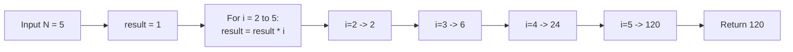
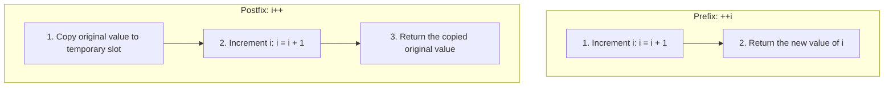
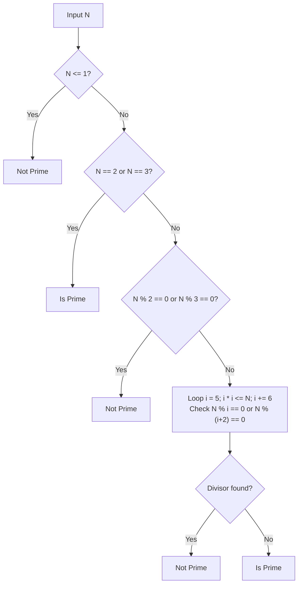
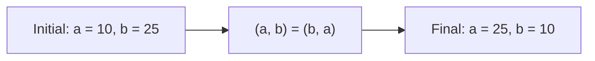
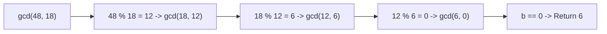
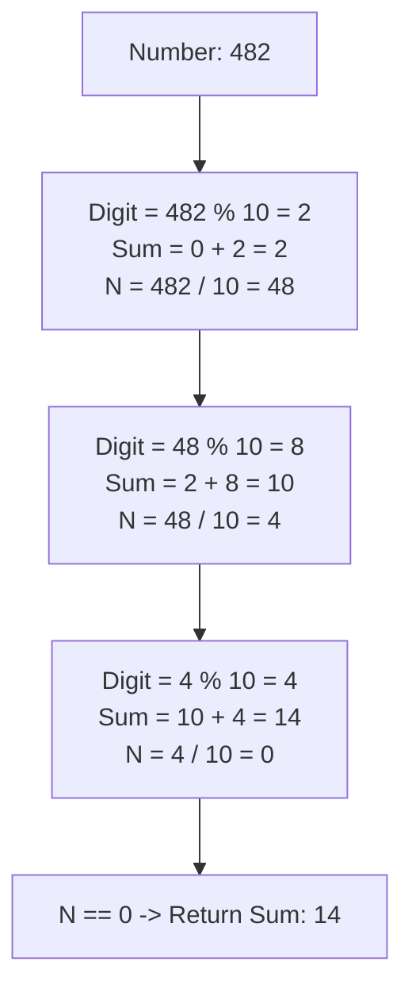
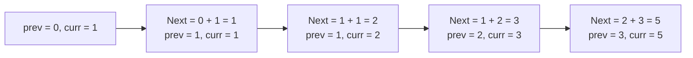

# Section 31: Number Coding Problems & Mathematical Algorithms

> **Curriculum Navigation:**  
> ⏪ [Previous: Section 30 – String Algorithmic Challenges (Modular Functions)](./30_string_coding_problems_using_functions.md) | 🏠 [Master Index](./README.md) | ⏩ [Next: Module 32 – Microsoft Entra ID & Cloud Identity Architecture](./32_azure_entra_id_and_identity.md)

---

## Q272. Write a function to calculate the factorial of a number.

### 1. Executive Summary & Core Concept
The **factorial** of a non-negative integer $N$ (denoted as $N!$) is the product of all positive integers less than or equal to $N$:
$$N! = N \times (N-1) \times (N-2) \times \dots \times 1$$
By mathematical definition, $0! = 1$.

Factorials grow at a hyper-exponential rate:
- $12! = 479,001,600$ (Fits in a 32-bit signed integer `int`, max: 2,147,483,647).
- $20! = 2,432,902,008,176,640,000$ (Fits in a 64-bit signed integer `long`, max: $9.22 \times 10^{18}$).
- For $N > 20$, `long` overflows, requiring **`System.Numerics.BigInteger`**.

- **Time Complexity**: $O(N)$
- **Space Complexity**: $O(1)$ iterative, $O(N)$ recursive stack frames.



### 2. Deep-Dive Architecture & Runtime Internals
- **Iterative vs. Recursive**:
  - **Recursive Implementation**: Incurs $N$ stack frames. In C#, the JIT compiler does not reliably perform Tail-Call Optimization (TCO) across all target architectures, creating a `StackOverflowException` risk for large values of $N$.
  - **Iterative Implementation**: Uses a single CPU register for accumulation, running in $O(1)$ memory without stack allocation overhead.

### 3. Production-Ready Code Implementation
```csharp
using System.Numerics;

public static class FactorialCalculator
{
    /// <summary>
    /// Computes factorial for N <= 20 using standard 64-bit unsigned integer with overflow checks.
    /// Time Complexity: O(N)
    /// Space Complexity: O(1)
    /// </summary>
    public static ulong CalculateFactorialFast(int n)
    {
        if (n < 0)
        {
            throw new ArgumentOutOfRangeException(nameof(n), "Factorial is not defined for negative numbers.");
        }
        if (n > 20)
        {
            throw new OverflowException($"Factorial of {n} overflows a 64-bit integer. Use CalculateFactorialBigInteger instead.");
        }

        ulong result = 1;
        for (uint i = 2; i <= (uint)n; i++)
        {
            result *= i;
        }

        return result;
    }

    /// <summary>
    /// Computes arbitrary-precision factorial for N > 20 without overflow.
    /// </summary>
    public static BigInteger CalculateFactorialBigInteger(int n)
    {
        if (n < 0)
        {
            throw new ArgumentOutOfRangeException(nameof(n), "Factorial is not defined for negative numbers.");
        }

        BigInteger result = 1;
        for (int i = 2; i <= n; i++)
        {
            result *= i;
        }

        return result;
    }
}
```

### 4. Line-by-Line Code Walkthrough
- `if (n < 0)`: Defensive validation; factorials are undefined for negative integers.
- `if (n > 20)`: Prevents silent numeric overflow when using 64-bit integer arithmetic.
- `ulong result = 1`: Base case accumulator ($0! = 1$ and $1! = 1$).
- `CalculateFactorialBigInteger`: Uses `BigInteger`, which dynamically allocates arbitrary-precision integer buffers on the managed heap.

### 5. Real-World Enterprise Use Case & Application
Combinatorics, probability distribution calculations (e.g., Binomial and Poisson distributions in financial risk analysis), and permutation engines for logistics route optimization.

### 6. Common Pitfalls, Memory Traps & Anti-Patterns
- **Using 32-bit `int` Accumulators**: $13!$ silently overflows to a negative integer (`1,932,053,504` instead of `6,227,020,800`) if checked arithmetic is not enabled.
- **Unbounded Recursion**: Calculating factorials recursively without depth guards, exhausting stack space on large inputs.

### 7. Senior / Architect Interview Follow-ups
- **Interviewer**: *How can you compute the number of trailing zeros in $N!$ in $O(\log N)$ time without calculating the factorial itself (which would overflow memory)?*
- **Candidate Answer**: We use **Legendre's Formula**. Trailing zeros are produced by factors of $10 = 2 \times 5$. Because factors of 2 are strictly more abundant than factors of 5, the number of trailing zeros equals the count of prime factors of 5 in $N!$:
  $$\text{Zeros} = \sum_{k=1}^{\infty} \left\lfloor \frac{N}{5^k} \right\rfloor = \left\lfloor \frac{N}{5} \right\rfloor + \left\lfloor \frac{N}{25} \right\rfloor + \left\lfloor \frac{N}{125} \right\rfloor + \dots$$
  This loop runs in $O(\log_5 N)$ time with zero risk of arithmetic overflow.

---

## Q273. What is the difference between ++i and i++?

### 1. Executive Summary & Core Concept
Both `++i` (prefix increment) and `i++` (postfix increment) increase the value of variable `i` by 1. The fundamental difference lies in **what value the expression evaluates to**:
- **Prefix Increment (`++i`)**: Increments the variable **first**, then returns the **new, incremented value**.
- **Postfix Increment (`i++`)**: Returns the **current, original value** of the variable first, then increments the variable.



### 2. Deep-Dive Architecture & Runtime Internals
In Common Intermediate Language (CIL), the difference is clearly visible in the emitted bytecode:
- **`++i` (Prefix)**:
  ```cil
  ldloc.0      // Load i onto evaluation stack
  ldc.i4.1     // Load constant 1
  add          // Add
  dup          // Duplicate top of stack (the new incremented value)
  stloc.0      // Store incremented value back into i
  stloc.1      // Store duplicated value into result variable
  ```
- **`i++` (Postfix)**:
  ```cil
  ldloc.0      // Load i onto evaluation stack (original value)
  dup          // Duplicate original value
  ldc.i4.1     // Load constant 1
  add          // Add
  stloc.0      // Store incremented value back into i
  stloc.1      // Store original copied value into result variable
  ```
- **Loop Performance**: In modern C# compilers, `for (int i = 0; i < N; i++)` and `for (int i = 0; i < N; ++i)` generate **identical machine code** because the return value of the increment expression is discarded.

### 3. Production-Ready Code Implementation
```csharp
public static class IncrementMechanicsDemo
{
    public static void DemonstrateEvaluationOrder()
    {
        int a = 5;
        int b = ++a; // Prefix: 'a' becomes 6, 'b' is assigned 6
        Console.WriteLine($"Prefix : a = {a}, b = {b}"); // a = 6, b = 6

        int x = 5;
        int y = x++; // Postfix: 'y' is assigned original 5, 'x' becomes 6
        Console.WriteLine($"Postfix: x = {x}, y = {y}"); // x = 6, y = 5

        // Subtlety in array indexing:
        int[] buffer = [10, 20, 30];
        int ptr = 0;
        int valA = buffer[ptr++]; // valA gets buffer[0] (10), ptr becomes 1
        int valB = buffer[++ptr]; // ptr becomes 2, valB gets buffer[2] (30)
        Console.WriteLine($"Array index evaluation: valA = {valA}, valB = {valB}");
    }
}
```

### 4. Line-by-Line Code Walkthrough
- `int b = ++a`: Increments `a` to 6, then evaluates the expression to 6 and assigns it to `b`.
- `int y = x++`: Evaluates the expression to 5 and assigns it to `y`, then increments `x` to 6.
- `buffer[ptr++]`: Reads the element at index 0 first, then increments `ptr` to 1.
- `buffer[++ptr]`: Increments `ptr` from 1 to 2 first, then reads the element at index 2.

### 5. Real-World Enterprise Use Case & Application
Used in low-level ring buffers, binary protocol parsers, and custom collection serializers where a cursor position is simultaneously read and advanced:
`outputSpan[cursor++] = inputSpan[readPtr++];`

### 6. Common Pitfalls, Memory Traps & Anti-Patterns
- **Self-Assignment Postfix Trap**: Writing `i = i++;`. The postfix operator increments `i`, but then the expression's original, un-incremented value is assigned back to `i`, effectively canceling the increment.
- **Multiple Increments in a Single Expression**: Writing `int result = i++ + ++i;`. This introduces undefined evaluation order confusion and makes code unreadable.

### 7. Senior / Architect Interview Follow-ups
- **Interviewer**: *Is `++i` thread-safe on a 32-bit or 64-bit integer variable in C#?*
- **Candidate Answer**: Neither `++i` nor `i++` is thread-safe. Incrementing is not an atomic operation; it involves three distinct steps: (1) read memory into CPU register, (2) increment register, and (3) write register back to memory. Under concurrent multi-threaded access, race conditions cause lost updates. For atomic, thread-safe increments without locks, use **`Interlocked.Increment(ref i)`**, which emits hardware-locked CPU bus instructions (`LOCK XADD`).

---

## Q274. Write a function that checks whether a number is prime or not?

### 1. Executive Summary & Core Concept
A **prime number** is a natural number greater than 1 that has no positive divisors other than 1 and itself.

The naive approach checks all numbers from 2 to $N-1$ ($O(N)$ time). The optimal approach checks divisors only up to $\sqrt{N}$ using the **$6k \pm 1$ optimization**, skipping all multiples of 2 and 3.

- **Time Complexity**: $O(\sqrt{N})$
- **Space Complexity**: $O(1)$



### 2. Deep-Dive Architecture & Runtime Internals
- **Mathematical Principle ($\sqrt{N}$ Boundary)**:
  If a number $N$ is divisible by $A \times B$, at least one factor must be $\le \sqrt{N}$. If no factor is found up to $\sqrt{N}$, none can exist above it.
- **The $6k \pm 1$ Rule**:
  All prime numbers greater than 3 can be expressed in the form $6k \pm 1$ (since $6k$, $6k+2$, $6k+4$ are divisible by 2, and $6k+3$ is divisible by 3). This allows the loop to step by 6, skipping two-thirds of all potential divisors.

### 3. Production-Ready Code Implementation
```csharp
public static class PrimeOperations
{
    /// <summary>
    /// Checks whether an integer is prime using the optimized 6k +/- 1 algorithm.
    /// Time Complexity: O(sqrt(N))
    /// Space Complexity: O(1)
    /// </summary>
    public static bool IsPrime(long n)
    {
        // 1. Numbers <= 1 are not prime
        if (n <= 1) return false;

        // 2. 2 and 3 are prime
        if (n <= 3) return true;

        // 3. Eliminate multiples of 2 and 3
        if (n % 2 == 0 || n % 3 == 0) return false;

        // 4. Test potential divisors of form 6k +/- 1 up to sqrt(n)
        // Note: Using i * i <= n avoids slow Math.Sqrt() floating-point operations
        for (long i = 5; i * i <= n; i += 6)
        {
            if (n % i == 0 || n % (i + 2) == 0)
            {
                return false;
            }
        }

        return true;
    }
}
```

### 4. Line-by-Line Code Walkthrough
- `if (n <= 1) return false`: Correctly rejects negative numbers, 0, and 1.
- `if (n % 2 == 0 || n % 3 == 0) return false`: Filters out all even numbers and multiples of 3 in $O(1)$ time.
- `for (long i = 5; i * i <= n; i += 6)`: Checks $i$ (which is $6k - 1$) and $i + 2$ (which is $6k + 1$) up to $\sqrt{N}$. Using integer multiplication `i * i <= n` avoids the floating-point performance penalty of `Math.Sqrt(n)`.

### 5. Real-World Enterprise Use Case & Application
Asymmetric cryptography (RSA encryption, Diffie-Hellman key exchange) relies on generating and validating large prime numbers to construct public and private key pairs.

### 6. Common Pitfalls, Memory Traps & Anti-Patterns
- **Calling `Math.Sqrt()` Inside the Loop Condition**: Writing `for (int i = 2; i <= Math.Sqrt(n); i++)`. Calling a floating-point function on every iteration degrades performance. Compute the limit once or use `i * i <= n`.

### 7. Senior / Architect Interview Follow-ups
- **Interviewer**: *How do production cryptographic libraries test whether a 2048-bit integer is prime?*
- **Candidate Answer**: For massive 2048-bit numbers, deterministic $O(\sqrt{N})$ trial division is computationally impossible ($2^{1024}$ operations). Production cryptography uses probabilistic primality tests—specifically the **Miller-Rabin Primality Test** combined with the **Baillie-PSW Test**. Running 40 rounds of Miller-Rabin reduces the probability of a false positive (composite reported as prime) to less than $2^{-80}$, which is statistically negligible.

---

## Q275. How to swap two numbers in C#?

### 1. Executive Summary & Core Concept
Swapping two numbers exchanges their values so each variable holds the other's original value. In modern C#, there are four primary techniques:
1. **Tuple Deconstruction (Recommended Modern Standard)**: `(a, b) = (b, a);` (clean, expressive, zero side effects).
2. **Temporary Variable**: The classic baseline approach.
3. **Bitwise XOR**: Arithmetic swap without temporary variables using XOR properties.
4. **Addition / Subtraction**: Arithmetic swap (at risk of integer overflow).



### 2. Deep-Dive Architecture & Runtime Internals
- **Modern C# 7+ Tuple Deconstruction**:
  `(a, b) = (b, a)` does not allocate a `System.Tuple` object on the heap. The C# compiler translates this directly into CPU register swaps, resulting in optimal assembly code.
- **The Bitwise XOR Technique**:
  Based on XOR properties: $X \oplus X = 0$ and $X \oplus 0 = X$.
  ```
  a = a ^ b;
  b = a ^ b; // b becomes original a
  a = a ^ b; // a becomes original b
  ```

### 3. Production-Ready Code Implementation
```csharp
public static class NumberSwapper
{
    // Modern Enterprise Standard: Tuple Deconstruction
    public static void SwapWithTuple(ref int a, ref int b)
    {
        (a, b) = (b, a);
    }

    // Classic Approach: Temporary Variable
    public static void SwapWithTemp(ref int a, ref int b)
    {
        int temp = a;
        a = b;
        b = temp;
    }

    // Bitwise XOR (No Temp Variable)
    public static void SwapWithXor(ref int a, ref int b)
    {
        // Guard against swapping the exact same memory location
        if (System.Runtime.CompilerServices.Unsafe.AreSame(ref a, ref b)) return;

        a ^= b;
        b ^= a;
        a ^= b;
    }
}
```

### 4. Line-by-Line Code Walkthrough
- `(a, b) = (b, a)`: Compiler-optimized tuple assignment using registers.
- `if (Unsafe.AreSame(ref a, ref b)) return;`: Essential guard for XOR swaps: if `a` and `b` reference the same memory address, `a ^= b` zeroes the variable, permanently corrupting the data.

### 5. Real-World Enterprise Use Case & Application
Swapping values is the fundamental operation within array sorting algorithms (QuickSort partition, HeapSort sift-down, BubbleSort) and pointer reversals.

### 6. Common Pitfalls, Memory Traps & Anti-Patterns
- **Arithmetic Swap with Integer Overflow**: Using `a = a + b; b = a - b; a = a - b;`. If `a + b` exceeds `int.MaxValue`, a managed `OverflowException` is thrown inside checked contexts. Always use tuple deconstruction instead.

### 7. Senior / Architect Interview Follow-ups
- **Interviewer**: *Why is a temporary variable swap often faster than an XOR swap on modern CPU hardware?*
- **Candidate Answer**: Modern CPUs use **superscalar out-of-order execution** with register renaming. A temporary variable swap involves independent read/write operations that the CPU can pipeline in parallel. The XOR swap introduces three sequential **Read-After-Write (RAW) data dependencies** (`b` depends on `a`, `a` depends on `b`), which stalls the instruction pipeline and prevents instruction-level parallelism.

---

## Q276. Write a function to calculate the GCD for two numbers.

### 1. Executive Summary & Core Concept
The **Greatest Common Divisor (GCD)** (also known as the Greatest Common Factor) of two integers is the largest positive integer that divides both numbers without a remainder.

The standard optimal algorithm is the **Euclidean Algorithm**, which relies on the principle that the GCD of two numbers also divides their difference:
$$\gcd(a, b) = \gcd(b, a \pmod b)$$
The algorithm terminates when the remainder reaches zero: $\gcd(a, 0) = |a|$.

- **Time Complexity**: $O(\log(\min(A, B)))$ (Lamé's Theorem: number of steps $\le 5 \times$ digits of the smaller number).
- **Space Complexity**: $O(1)$ iterative.



### 2. Deep-Dive Architecture & Runtime Internals
- **Stein's Algorithm (Binary GCD)**:
  An alternative implementation that replaces division and modulo operations with bit shifts (`>> 1`) and subtraction. Because modulo operations (`%`) take 10–30 CPU cycles while bit shifts take only 1 cycle, Binary GCD can be faster on processors without hardware integer division.

### 3. Production-Ready Code Implementation
```csharp
public static class MathAlgorithms
{
    /// <summary>
    /// Computes the Greatest Common Divisor (GCD) using the Euclidean Algorithm.
    /// Handles negative numbers and zero correctly.
    /// Time Complexity: O(log(min(a, b)))
    /// Space Complexity: O(1)
    /// </summary>
    public static long CalculateGcd(long a, long b)
    {
        // Use absolute values to handle negative numbers
        a = Math.Abs(a);
        b = Math.Abs(b);

        while (b != 0)
        {
            long remainder = a % b;
            a = b;
            b = remainder;
        }

        return a;
    }

    /// <summary>
    /// Computes the Least Common Multiple (LCM) using the relationship:
    /// LCM(a, b) = (|a * b|) / GCD(a, b)
    /// </summary>
    public static long CalculateLcm(long a, long b)
    {
        if (a == 0 || b == 0) return 0;

        // Divide first before multiplying to prevent integer overflow
        return Math.Abs((a / CalculateGcd(a, b)) * b);
    }
}
```

### 4. Line-by-Line Code Walkthrough
- `a = Math.Abs(a); b = Math.Abs(b)`: Normalizes inputs; GCD is defined as a non-negative integer.
- `while (b != 0)`: Iterates until the remainder is zero.
- `long remainder = a % b`: Computes the modulo remainder in each step.
- `(a / CalculateGcd(a, b)) * b`: In LCM calculation, dividing first avoids an intermediate `a * b` overflow that could exceed `long.MaxValue`.

### 5. Real-World Enterprise Use Case & Application
Cryptographic key generation, fractional arithmetic in financial ledgers (simplifying rational numbers like `12/16` $\rightarrow$ `3/4`), and synchronization intervals in scheduled batch processing.

### 6. Common Pitfalls, Memory Traps & Anti-Patterns
- **Handling `long.MinValue`**: `Math.Abs(long.MinValue)` throws an `OverflowException` because the absolute value of $-9,223,372,036,854,775,808$ cannot fit in a signed 64-bit integer. Cast to `ulong` for complete boundary protection.

### 7. Senior / Architect Interview Follow-ups
- **Interviewer**: *What is the Extended Euclidean Algorithm, and where is it used in enterprise security?*
- **Candidate Answer**: The **Extended Euclidean Algorithm** not only computes the $\gcd(a, b)$, but also finds the integer coefficients $x$ and $y$ that satisfy **Bézout's identity**: $ax + by = \gcd(a, b)$. In enterprise cybersecurity and cryptography, it is used to compute the **modular multiplicative inverse**, which is a core step in generating RSA private decryption keys from public encryption exponents.

---

## Q277. Write a function to sum the digits of a number.

### 1. Executive Summary & Core Concept
Summing the digits of an integer requires extracting its individual decimal digits using modulo 10 (`n % 10`) and division by 10 (`n / 10`) until the number is reduced to zero.

- **Time Complexity**: $O(\log_{10} N)$ (the number of iterations equals the number of digits).
- **Space Complexity**: $O(1)$ (in-place constant auxiliary memory).



### 2. Deep-Dive Architecture & Runtime Internals
- **Mathematical Extraction vs. String Parsing**:
  - **String Parsing Approach**: Converting a number to string (`n.ToString().Select(c => c - '0').Sum()`) allocates a `string` on the managed heap and runs slowly due to character parsing overhead.
  - **Mathematical Modulo Approach**: Operates directly within CPU hardware arithmetic registers, using zero heap memory and running significantly faster.

### 3. Production-Ready Code Implementation
```csharp
public static class DigitSumOperations
{
    /// <summary>
    /// Calculates the sum of digits of an integer using arithmetic extraction.
    /// Handles negative numbers correctly.
    /// Time Complexity: O(log10(N))
    /// Space Complexity: O(1)
    /// </summary>
    public static int SumOfDigits(long number)
    {
        // Normalize negative numbers
        long n = Math.Abs(number);
        int sum = 0;

        while (n > 0)
        {
            sum += (int)(n % 10);
            n /= 10;
        }

        return sum;
    }

    /// <summary>
    /// Computes the Digital Root (repeated sum of digits until a single digit remains)
    /// in O(1) time using the mathematical Congruence Formula.
    /// </summary>
    public static int DigitalRoot(long n)
    {
        if (n == 0) return 0;
        n = Math.Abs(n);
        long root = n % 9;
        return (int)(root == 0 ? 9 : root);
    }
}
```

### 4. Line-by-Line Code Walkthrough
- `long n = Math.Abs(number)`: Normalizes the input so negative integers (e.g., `-482`) produce a positive digit sum (`14`).
- `sum += (int)(n % 10)`: Extracts the rightmost least significant digit.
- `n /= 10`: Drops the rightmost digit, shifting remaining digits rightward.
- `DigitalRoot`: Calculates the recursive digital root in $O(1)$ constant time using the modulo-9 mathematical identity.

### 5. Real-World Enterprise Use Case & Application
Checksum verification algorithms (such as credit card **Luhn algorithm**, ISBN numbers, and barcode UPC check digits) use digit summation rules to detect transmission and data-entry errors.

### 6. Common Pitfalls, Memory Traps & Anti-Patterns
- **Converting to String for Simple Math**: Writing `int sum = n.ToString().Sum(c => c - '0');`. This allocates a string object and delegates, running significantly slower than pure arithmetic.

### 7. Senior / Architect Interview Follow-ups
- **Interviewer**: *What is the mathematical principle behind the $O(1)$ Digital Root formula?*
- **Candidate Answer**: The decimal number system is base 10, and $10 \equiv 1 \pmod 9$. Consequently, any power of 10 satisfies $10^k \equiv 1 \pmod 9$. Therefore, any integer $N = \sum d_k 10^k$ has the exact same remainder modulo 9 as the sum of its digits: $N \equiv \sum d_k \pmod 9$. This means the digital root can be computed directly in $O(1)$ time using modulo 9 arithmetic without iterating over individual digits.

---

## Q278. Write a function to calculate the Fibonacci sequence up to a given number.

### 1. Executive Summary & Core Concept
The **Fibonacci Sequence** is a series of numbers where each number is the sum of the two preceding ones, typically starting from 0 and 1:
$$F(0) = 0, \quad F(1) = 1, \quad F(N) = F(N-1) + F(N-2)$$
Sequence: `0, 1, 1, 2, 3, 5, 8, 13, 21, 34, 55, 89, 144, ...`

Key Implementation Approaches:
1. **Naive Recursion**: $O(2^N)$ exponential time (impractical for $N > 40$).
2. **Dynamic Programming / Iterative**: $O(N)$ time, $O(1)$ auxiliary space.
3. **Matrix Exponentiation**: $O(\log N)$ time.
4. **Binet's Formula**: $O(1)$ closed-form mathematical calculation (subject to floating-point rounding errors).



### 2. Deep-Dive Architecture & Runtime Internals
- **Stack Explosion in Naive Recursion**: `Fibonacci(N) = Fibonacci(N-1) + Fibonacci(N-2)` computes duplicate subproblems exponentially, forming a tree of $2^N$ function calls. For $N=50$, it takes over 1 quadrillion operations.
- **Iterative Space Optimization**: To compute the $N$-th Fibonacci number, we only need the **previous two numbers** at any point. By keeping two tracking variables (`prev` and `curr`), memory overhead drops from an $O(N)$ dynamic programming table to $O(1)$ constant memory.

### 3. Production-Ready Code Implementation
```csharp
public static class FibonacciOperations
{
    /// <summary>
    /// Generates all Fibonacci numbers up to a maximum threshold value.
    /// Time Complexity: O(K) where K is the count of numbers generated
    /// Space Complexity: O(1) Auxiliary Memory (using deferred execution via yield)
    /// </summary>
    public static IEnumerable<long> GenerateFibonacciUpToLimit(long maxThreshold)
    {
        if (maxThreshold < 0) yield break;

        long prev = 0;
        long curr = 1;

        // Yield first number
        yield return prev;

        while (curr <= maxThreshold)
        {
            yield return curr;

            long next = checked(prev + curr); // Checked arithmetic guards against overflow
            prev = curr;
            curr = next;
        }
    }

    /// <summary>
    /// Computes the N-th Fibonacci number iteratively.
    /// Time Complexity: O(N)
    /// Space Complexity: O(1)
    /// </summary>
    public static long GetNthFibonacci(int n)
    {
        if (n < 0) throw new ArgumentOutOfRangeException(nameof(n), "N must be non-negative.");
        if (n == 0) return 0;
        if (n == 1) return 1;

        long prev = 0;
        long curr = 1;

        for (int i = 2; i <= n; i++)
        {
            long next = checked(prev + curr);
            prev = curr;
            curr = next;
        }

        return curr;
    }
}
```

### 4. Line-by-Line Code Walkthrough
- `yield return prev`: Uses deferred generator execution (`yield return`), streaming Fibonacci numbers lazily without allocating a large list in memory.
- `long next = checked(prev + curr)`: Arithmetic overflow protection; throws an `OverflowException` if the sequence exceeds `long.MaxValue` ($F(93)$ is the largest Fibonacci number that fits in an unsigned 64-bit integer).
- `prev = curr; curr = next;`: Shifts the sliding window forward in $O(1)$ memory.

### 5. Real-World Enterprise Use Case & Application
Network retry strategies use Fibonacci sequences to implement **Fibonacci Backoff**, an alternative to Exponential Backoff that provides smoother rate-limiting ramp-ups when retrying failed downstream microservice calls.

### 6. Common Pitfalls, Memory Traps & Anti-Patterns
- **Naive Recursion Without Memoization**: Writing `int Fib(int n) => n <= 1 ? n : Fib(n-1) + Fib(n-2);`. Calculating `Fib(50)` with naive recursion will freeze the calling thread for minutes.
- **Using Binet's Formula with Floating-Point Precision**: Binet's formula uses $\phi = \frac{1 + \sqrt{5}}{2}$. For large $N$, floating-point rounding errors in `double` produce incorrect integers.

### 7. Senior / Architect Interview Follow-ups
- **Interviewer**: *How can you calculate the $N$-th Fibonacci number in $O(\log N)$ time?*
- **Candidate Answer**: We use **Matrix Exponentiation**. The Fibonacci relation can be expressed as a $2 \times 2$ matrix multiplication:
  $$\begin{pmatrix} F(n+1) & F(n) \\ F(n) & F(n-1) \end{pmatrix} = \begin{pmatrix} 1 & 1 \\ 1 & 0 \end{pmatrix}^n$$
  Using **Binary Exponentiation (Exponentiation by Squaring)**, we can raise the transformation matrix to the $n$-th power in $O(\log N)$ time, computing the $N$-th Fibonacci number with only $O(\log N)$ matrix multiplications.
