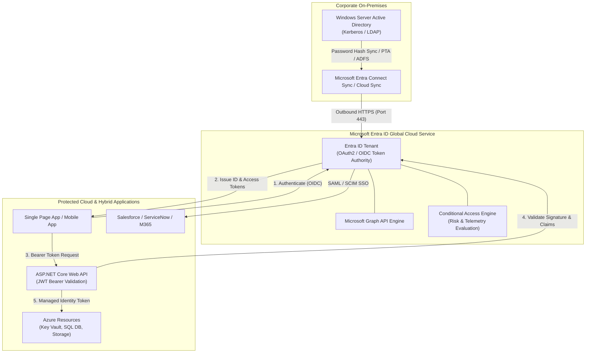
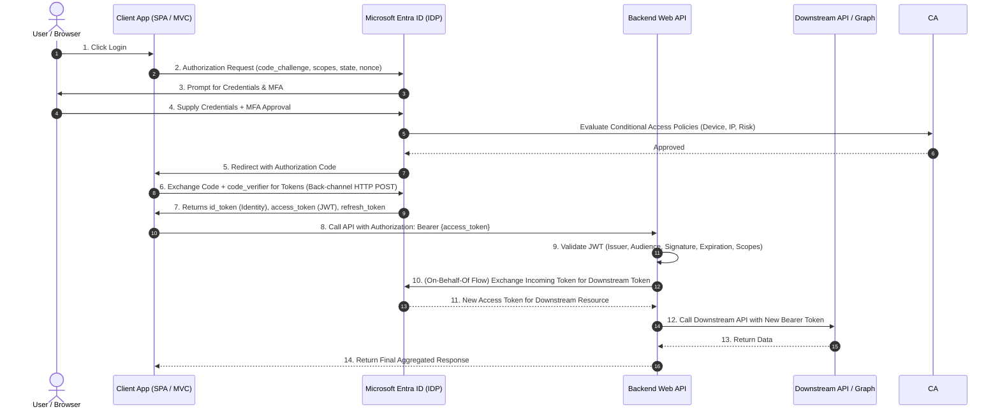

# Module 32: Microsoft Entra ID (Formerly Azure Active Directory) & Cloud Identity Architecture

> **Curriculum Navigation:**  
> ⏪ [Previous: Section 31 – Mathematical, Number & Bitwise Coding](./31_number_coding_problems.md) | 🏠 [Master Index](./README.md) | ⏩ [Next: Module 33 – Azure SQL Database & Cloud Relational Architecture](./33_azure_sql_database.md)

---

## 1. Executive Summary & Core Value Proposition

**Microsoft Entra ID** (formerly Azure Active Directory) is Microsoft's multi-tenant, cloud-based identity and access management (IAM) solution. Unlike Windows Server Active Directory (WS-AD), which relies on Kerberos, NTLM, and LDAP over an enterprise LAN/WAN, Entra ID is an internet-native identity provider engineered around RESTful HTTP protocols: **OAuth 2.0**, **OpenID Connect (OIDC)**, and **Security Assertion Markup Language (SAML 2.0)**.

In modern enterprise cloud architecture, **Identity is the New Security Perimeter**. Traditional network boundaries (firewalls, VPNs, subnets) fail in hybrid, multi-cloud, and remote-work paradigms. Entra ID provides the foundational control plane for implementing **Zero Trust Security** across three non-negotiable principles:
1. **Verify Explicitly**: Authenticate and authorize every transaction based on all available data points (user identity, device health, location, network, service context, and real-time risk telemetry).
2. **Use Least Privilege Access**: Restrict identities via Just-In-Time (JIT) and Just-Enough-Access (JEA) using Privileged Identity Management (PIM) and fine-grained Azure Role-Based Access Control (RBAC).
3. **Assume Breach**: Minimize the blast radius by segmenting access, mandating end-to-end encryption, and monitoring anomalies with automated threat intelligence.

---

## 2. Deep-Dive Cloud Architecture & Internal Mechanics

### 2.1 Entra ID vs. Windows Server Active Directory

| Architectural Dimension | Windows Server Active Directory (WS-AD) | Microsoft Entra ID |
| :--- | :--- | :--- |
| **Primary Protocols** | Kerberos, NTLM, LDAP, DNS, RPC | OpenID Connect, OAuth 2.0, SAML 2.0, WS-Fed, Microsoft Graph (REST/JSON) |
| **Network Boundary** | LAN/WAN, Site-to-Site VPN, ExpressRoute | Globally distributed, high-availability public HTTP/S endpoints |
| **Trust Topology** | Domain Controllers, Forests, Trees, Transitive Trusts | Tenants, Multi-Tenant Applications, B2B Guest Trusts, B2C User Flows |
| **Device Management** | Group Policy Objects (GPOs), Active Directory Join | Microsoft Intune, Entra Registered / Entra Joined / Hybrid Joined |
| **Query Mechanism** | LDAP queries (Port 389/636) | OData REST queries via Microsoft Graph API (`graph.microsoft.com`) |



### 2.2 Core Identity Objects & Hierarchy

1. **Tenant**: A dedicated, isolated instance of Entra ID representing an organization. It owns a globally unique GUID (`TenantId`) and domain namespace (`*.onmicrosoft.com`).
2. **User & Group**: Security principals representing human employees, contractors, or dynamic groups populated via attribute rules (e.g., `user.department -eq "Engineering"`).
3. **Application Registration vs. Enterprise Application**:
   - **App Registration**: The global blueprint and definition of an application within its home tenant (defines redirect URIs, exposed API scopes, app roles, credentials, and multi-tenant flags).
   - **Enterprise Application (Service Principal)**: The local instance of the application registration within a specific tenant that governs actual access, consent grants, and conditional access policies in that tenant.
4. **Managed Identity**: An automatically managed identity in Entra ID assigned to an Azure resource (such as Azure App Service, Function App, or Virtual Machine):
   - **System-Assigned**: Tied 1:1 to the lifecycle of the Azure resource. Deleted automatically when the resource is decommissioned. Zero credential exposure.
   - **User-Assigned**: Standalone Azure resource that can be assigned to one or more Azure resources. Persists independently of individual compute nodes.

### 2.3 OAuth 2.0 & OpenID Connect Flow Mechanics



---

## 3. Tier & SKU Decision Matrix

Choosing the correct Entra ID license governs identity governance, real-time threat intelligence, and automation capabilities:

| Feature / Capability | Entra ID Free | Entra ID P1 | Entra ID P2 | Governance / Workload Add-On |
| :--- | :--- | :--- | :--- | :--- |
| **Maximum User Objects** | 500,000 | Unlimited | Unlimited | Unlimited |
| **SSO & User Provisioning** | Unlimited SaaS apps | Unlimited SaaS + On-Premises via App Proxy | Unlimited SaaS + App Proxy | Advanced Lifecycle Workflows |
| **Multi-Factor Authentication** | Security Defaults only (All or Nothing) | Conditional Access MFA (Context-aware) | Risk-based Conditional Access MFA | Conditional Access Integration |
| **Conditional Access** | ❌ No | ✅ Yes (Location, Device, Apps) | ✅ Yes (User Risk + Sign-in Risk ML) | ✅ Yes |
| **Privileged Identity Management (PIM)** | ❌ No | ❌ No | ✅ Yes (JIT, Approvals, Elevation Audit) | ✅ Yes + Entitlement Management |
| **Access Reviews & Lifecycle** | ❌ No | ❌ Basic | ✅ Full Access Reviews | ✅ Automated Joiner/Mover/Leaver (JML) |
| **Identity Protection (ML Risk)** | ❌ No | ❌ No | ✅ Real-time Leaked Credential & Anomaly Detection | Included in P2 |
| **Recommended Scenario** | Development, POC, minimal internal apps | Standard enterprise, custom domain, conditional access per department | High-security enterprise, banking, healthcare, regulated workloads | Complex enterprise audit, automated HR-driven lifecycle management |

---

## 4. Production .NET 8 Implementation & Infrastructure as Code (IaC)

### 4.1 Production ASP.NET Core 8 Web API Configuration

Modern .NET 8 Web APIs leverage `Microsoft.Identity.Web` to validate incoming JWT access tokens emitted by Microsoft Entra ID.

#### `appsettings.json`
```json
{
  "AzureAd": {
    "Instance": "https://login.microsoftonline.com/",
    "Domain": "yourorg.onmicrosoft.com",
    "TenantId": "72f988bf-86f1-41af-91ab-2d7cd011db47",
    "ClientId": "11111111-2222-3333-4444-555555555555",
    "Audience": "api://payment-gateway-service",
    "Scopes": "Payment.Process,Payment.Read"
  },
  "Logging": {
    "LogLevel": {
      "Default": "Information",
      "Microsoft.IdentityModel": "Warning"
    }
  }
}
```

#### `Program.cs` (.NET 8 Minimal API with Token Validation & Authorization)
```csharp
using Microsoft.AspNetCore.Authentication.JwtBearer;
using Microsoft.AspNetCore.Authorization;
using Microsoft.Identity.Web;
using System.Security.Claims;

var builder = WebApplication.CreateBuilder(args);

// 1. Configure Entra ID Authentication & Token Validation
builder.Services.AddAuthentication(JwtBearerDefaults.AuthenticationScheme)
    .AddMicrosoftIdentityWebApi(builder.Configuration.GetSection("AzureAd"));

// 2. Configure Scopes and App Roles Policy Enforcement
builder.Services.AddAuthorization(options =>
{
    // Scopes are delegated permissions on behalf of a user
    options.AddPolicy("CanProcessPayments", policy =>
        policy.RequireAuthenticatedUser()
              .RequireClaim("http://schemas.microsoft.com/identity/claims/scope", "Payment.Process"));

    // Roles are application permissions for daemon/service-to-service calls
    options.AddPolicy("PaymentDaemonRole", policy =>
        policy.RequireAuthenticatedUser()
              .RequireRole("Payment.DaemonExecution"));
});

var app = builder.Build();

app.UseAuthentication();
app.UseAuthorization();

// Secure Endpoint requiring Delegated Scope
app.MapPost("/api/v1/payments", [Authorize(Policy = "CanProcessPayments")] (
    PaymentRequest request, 
    ClaimsPrincipal user) =>
{
    var callerOid = user.FindFirstValue("oid") ?? user.FindFirstValue(ClaimTypes.NameIdentifier);
    var tenantId = user.FindFirstValue("tid");

    // Process transaction securely tied to caller identity
    return Results.Accepted($"/api/v1/payments/{Guid.NewGuid()}", new 
    { 
        Status = "Processing", 
        InitiatedByOid = callerOid, 
        TenantId = tenantId 
    });
});

app.Run();

public record PaymentRequest(decimal Amount, string Currency, string Reference);
```

### 4.2 Modern Token Acquisition via `Azure.Identity` (`DefaultAzureCredential`)

In cloud microservices, hardcoding client secrets inside config files is a critical vulnerability. Production applications must use `DefaultAzureCredential` to acquire tokens automatically across local developer environments and cloud deployments:

```csharp
using Azure.Core;
using Azure.Identity;
using System.Net.Http.Headers;

public class DownstreamApiClient
{
    private readonly HttpClient _httpClient;
    private readonly TokenCredential _credential;
    private readonly string[] _targetScopes = ["api://downstream-inventory/.default"];

    public DownstreamApiClient(HttpClient httpClient)
    {
        _httpClient = httpClient;
        // DefaultAzureCredential tries: EnvironmentVariables -> WorkloadIdentity -> ManagedIdentity -> AzureCli -> VisualStudio
        _credential = new DefaultAzureCredential(new DefaultAzureCredentialOptions
        {
            ExcludeInteractiveBrowserCredential = true // Prevent UI popups on production servers
        });
    }

    public async Task<string> FetchInventoryAsync(string itemId, CancellationToken ct)
    {
        // 1. Acquire access token for downstream resource
        var tokenRequestContext = new TokenRequestContext(_targetScopes);
        AccessToken token = await _credential.GetTokenAsync(tokenRequestContext, ct);

        // 2. Attach JWT to outbound request
        using var request = new HttpRequestMessage(HttpMethod.Get, $"/api/v1/inventory/{itemId}");
        request.Headers.Authorization = new AuthenticationHeaderValue("Bearer", token.Token);

        using var response = await _httpClient.SendAsync(request, ct);
        response.EnsureSuccessStatusCode();

        return await response.Content.ReadAsStringAsync(ct);
    }
}
```

### 4.3 Infrastructure as Code (Bicep) for App Registration & Managed Identity

```bicep
param appName string = 'payment-service'
param location string = resourceGroup().location

// 1. User-Assigned Managed Identity for the Service
resource serviceIdentity 'Microsoft.ManagedIdentity/userAssignedIdentities@2023-01-31' = {
  name: '${appName}-identity'
  location: location
}

// 2. Azure App Service hosting the .NET 8 API with Assigned Identity
resource appServicePlan 'Microsoft.Web/serverfarms@2023-01-01' = {
  name: '${appName}-asp'
  location: location
  sku: {
    name: 'P1v3'
    tier: 'PremiumV3'
  }
}

resource webApp 'Microsoft.Web/sites@2023-01-01' = {
  name: '${appName}-app'
  location: location
  identity: {
    type: 'UserAssigned'
    userAssignedIdentities: {
      '${serviceIdentity.id}': {}
    }
  }
  properties: {
    serverFarmId: appServicePlan.id
    siteConfig: {
      netFrameworkVersion: 'v8.0'
      appSettings: [
        {
          name: 'AZURE_CLIENT_ID'
          value: serviceIdentity.properties.clientId
        }
      ]
    }
  }
}

output identityPrincipalId string = serviceIdentity.properties.principalId
output identityClientId string = serviceIdentity.properties.clientId
```

---

## 5. Real-World Enterprise Architecture Scenarios

### Scenario: Multi-Tier Fintech Banking Microservices with On-Behalf-Of (OBO) Flow
- **Challenge**: An external React Single Page Application (SPA) authenticates a banking customer. The SPA calls the `Banking-Frontend-API`. This API must validate the user and call the downstream `Core-Ledger-API`. The `Core-Ledger-API` must know the exact human caller's identity (for ledger audit logs) while preventing the SPA from having direct network access or direct scopes to the core ledger.
- **Architectural Solution**:
  1. User authenticates via **OAuth 2.0 Auth Code Flow with PKCE**, receiving an access token scoped to `api://banking-frontend/access`.
  2. The SPA transmits this token to `Banking-Frontend-API`.
  3. `Banking-Frontend-API` validates the token, extracts user claims, and executes the **OAuth 2.0 On-Behalf-Of (OBO) flow** with Microsoft Entra ID.
  4. Entra ID validates the frontend's client secret/certificate and issues a new access token scoped to `api://core-ledger/Ledger.Debit`, preserving the original user's `oid` and `sub` claims.
  5. `Core-Ledger-API` records the audit trail with non-repudiation: `CallerId: user-guid`, `ActingProxy: frontend-service-identity`.

---

## 6. Cost Traps, Scalability Bottlenecks & Security Anti-Patterns

1. **Client Secret Expiration Outages**:
   - *Trap*: Development teams create client secrets with 1-year expiration. One year later at 2:00 AM, production APIs throw HTTP 401 Unauthorized because the secret expired silently.
   - *Mitigation*: Eliminate client secrets entirely in favor of **Managed Identities** for Azure resources and **Workload Identity Federation (OIDC)** for GitHub Actions/Azure DevOps. For external apps, configure Azure Monitor alert rules on `AADApplicationKeyUsage` metric prior to expiration.
2. **N+1 Token Requests & Token Cache Starvation**:
   - *Trap*: Developers instantiate a new `DefaultAzureCredential()` on every HTTP request and invoke `GetTokenAsync()` without caching, triggering aggressive HTTP 429 throttling from Entra ID (`login.microsoftonline.com`).
   - *Mitigation*: Register `TokenCredential` as a **Singleton** in dependency injection. `DefaultAzureCredential` and `ConfidentialClientApplication` manage in-memory thread-safe token caching and proactively refresh tokens before expiration automatically.
3. **Over-Privileged Application Permissions (`App Role`) vs Delegated Permissions**:
   - *Trap*: A background reporting daemon requests `Directory.ReadWrite.All` or `Mail.ReadWrite` via client credentials flow. If the secret leaks, an attacker gains complete control over every mailbox and user in the tenant.
   - *Mitigation*: Apply **Role-Based Access Control (RBAC)** at the resource level (e.g., Azure Key Vault Secrets User) or use Application Access Policies to restrict daemon access to specific resource subsets.
4. **Conditional Access Loopholes (IPv6 & Exclusion Traps)**:
   - *Trap*: Conditional access is configured to bypass MFA from "Trusted Corporate Office IP ranges" (IPv4 only). Remote branch routers fallback to IPv6, causing users to get blocked or bypassing policies unexpectedly.
   - *Mitigation*: Mandate compliant/managed device checks (`Require Compliant Device` via Intune) rather than relying solely on IP whitelists.

---

## 7. Principal Cloud Architect Interview Scenarios

### Q1: "How would you design zero-trust authentication between a Kubernetes cluster (AKS) and Azure Key Vault without storing any secrets in Kubernetes manifests?"
**Architect Answer**:
> "I would implement **Microsoft Entra Workload Identity**. 
> 1. In AKS, we configure the cluster with the OIDC Issuer URL enabled.
> 2. We create a native Kubernetes Service Account in the target namespace.
> 3. In Entra ID, we create a User-Assigned Managed Identity and assign it the `Key Vault Secrets User` RBAC role on the target Key Vault.
> 4. We establish a **Federated Identity Credential** on the Managed Identity, binding it directly to the Kubernetes OIDC Issuer, Namespace, and Service Account name.
> 5. When the Pod starts, the Azure Workload Identity mutating webhook projects a signed service account OIDC token into the pod.
> 6. In the .NET 8 application, `DefaultAzureCredential` detects the `AZURE_FEDERATED_TOKEN_FILE` and exchanges the projected Kubernetes token with Entra ID for an Azure access token directly over HTTPS, achieving 100% secretless authentication with zero credential rotation overhead."

### Q2: "What is the architectural difference between Privileged Identity Management (PIM) and standard Azure RBAC role assignment, and why is standard RBAC unacceptable for Global Admin in enterprise environments?"
**Architect Answer**:
> "Standard Azure RBAC creates a **standing privilege** (permanent active assignment). If an administrator's credentials or workstation are compromised, the attacker immediately inherits Global Admin or Subscription Owner permissions with zero resistance.
> 
> **PIM** eliminates standing access by implementing **Eligible Roles**:
> 1. The principal has zero elevated rights during normal operations.
> 2. Elevation requires an explicit JIT (Just-In-Time) activation request specifying business justification, a maximum duration (e.g., 4 hours), and an IT service management ticket reference.
> 3. Activation can enforce mandatory step-up authentication (Phishing-resistant FIDO2 MFA), approval from a secondary security officer, and automated notification broadcasts.
> 4. Once the activation window expires, permissions revoke automatically, shrinking the threat exposure window by orders of magnitude."
