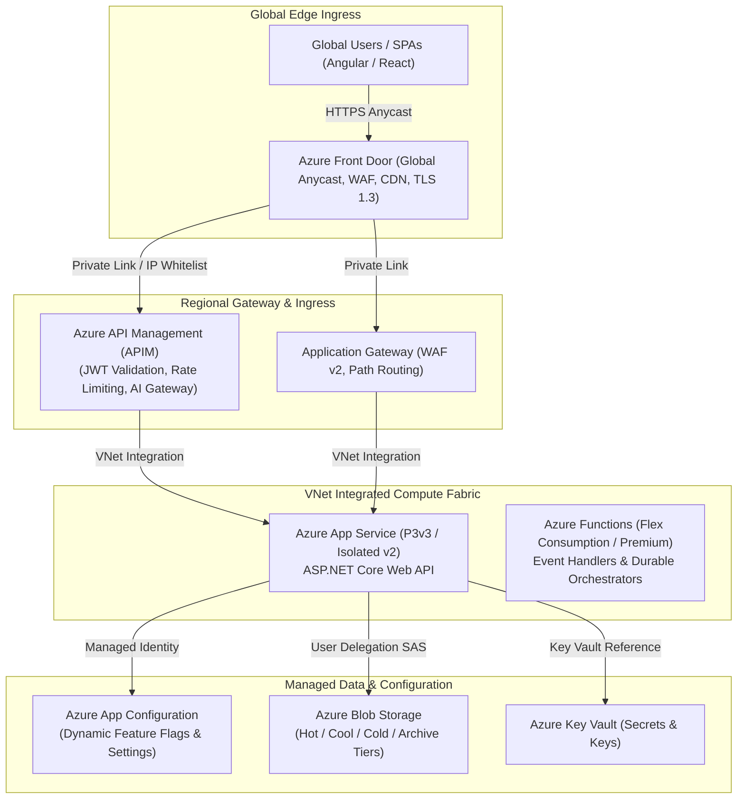
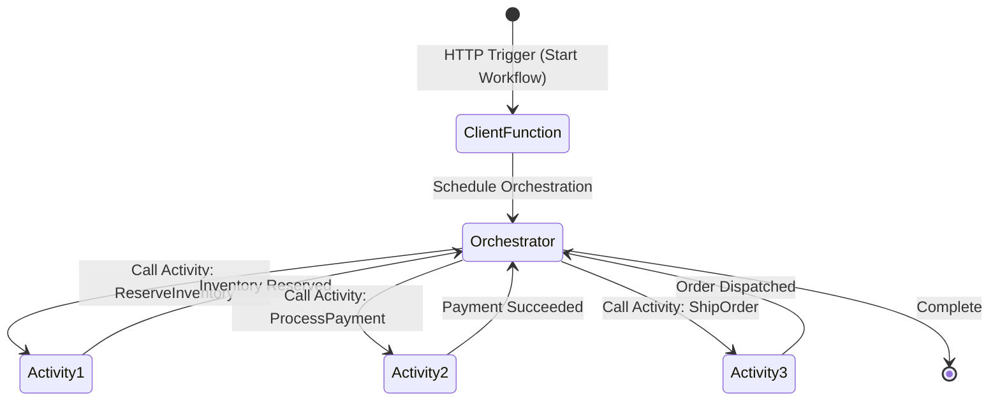

# Section 33: Azure App Service, Storage & Cloud Networking


> **Curriculum Navigation:**  
> ⏪ [Previous: Section 32 – Azure SQL Database & Cloud Relational](./320_azure_sql_database.md) | 🏠 [Master Index](./README.md) | ⏩ [Next: Section 34 – Azure Functions & Serverless Compute](./340_azure_functions.md)

---


## 1. Executive Summary & Core Concept

Enterprise cloud architectures require a unified computing, storage, and edge networking fabric. While compute platforms like **Azure App Service** and **Azure Functions** host execution pipelines, unstructured data storage relies on **Azure Blob Storage**, runtime configurations depend on **Azure App Configuration**, and edge ingress is governed by **Azure API Management (APIM)**, **Azure Front Door**, and **Layer 4/7 Load Balancers**.



---

## 2. Cloud Architecture & Runtime Internals

### 2.1 Azure App Service for ASP.NET Core

Azure App Service provides a fully managed Platform as a Service (PaaS) runtime for ASP.NET Core applications. Understanding its internals avoids common scaling and availability disasters:

1. **Host Architecture & Kestrel Behind IIS/Reverse Proxy**:
   - In Linux containers/hosts, App Service runs an internal Docker container hosting Kestrel behind an Envoy or Nginx front-end proxy.
   - On Windows App Service, requests flow through IIS worker processes (`w3wp.exe`) running the `AspNetCoreModuleV2` (ANCM) out-of-process or in-process. In modern .NET 8/9, in-process hosting ensures zero intra-process HTTP hop overhead.
2. **Deployment Slots & Zero-Downtime Swaps**:
   - Staging slots provide an identical sandbox environment.
   - During a slot swap, Azure performs **Warmup Probes**: Azure pings the configured warmup paths (`applicationInitialization` in `web.config` or HTTP health check paths) until HTTP 200 is verified *before* rerouting VIP traffic. This eliminates cold-start latency for users.
3. **VNet Integration & Private Endpoints**:
   - Regional VNet integration allows outbound traffic from App Service into an Azure Virtual Network to access private databases and internal microservices.
   - Private Endpoints secure inbound traffic so the App Service accepts requests *only* from an internal VNet or Azure Front Door via Microsoft backbone routing.

---

### 2.2 Blob Storage Access Tiers & Automated Lifecycle Policies

Azure Blob Storage optimizes cost across four distinct access tiers:

| Access Tier | Availability (LRS/GRS) | Access Latency | Storage Cost per GB | Retrieval Cost per GB | Minimum Retention Period | Best Use Case |
| :--- | :--- | :--- | :--- | :--- | :--- | :--- |
| **Hot** | 99.9% / 99.99% | Milliseconds | High | Lowest (Free reads) | None | Active data, current transaction logs, daily uploads |
| **Cool** | 99.0% / 99.9% | Milliseconds | Lower (~50% of Hot) | Moderate | 30 days | Monthly statements, raw audit trails accessed occasionally |
| **Cold** | 99.0% / 99.9% | Milliseconds | Very Low (~65% off Hot) | High | 90 days | Long-term backup, quarterly reporting data |
| **Archive** | 99.0% / 99.9% | Hours (Up to 15h) | Lowest (~90% off Hot) | Highest | 180 days | Regulatory archives, compliance audits, historical backups |

#### Automated Lifecycle Management Policy (ARM/JSON)
```json
{
  "rules": [
    {
      "enabled": true,
      "name": "MoveOldInvoicesToArchiveAndPurge",
      "type": "Lifecycle",
      "definition": {
        "filters": {
          "blobTypes": [ "blockBlob" ],
          "prefixMatch": [ "invoices/" ]
        },
        "actions": {
          "baseBlob": {
            "tierToCool": { "daysAfterModificationGreaterThan": 30 },
            "tierToCold": { "daysAfterModificationGreaterThan": 90 },
            "tierToArchive": { "daysAfterModificationGreaterThan": 180 },
            "delete": { "daysAfterModificationGreaterThan": 2555 }
          }
        }
      }
    }
  ]
}
```

---

### 2.3 Shared Access Signature (SAS) URLs: Security & Types

A Shared Access Signature (SAS) is a signed URI that grants restricted access rights to Azure Storage resources without exposing account keys.

```mermaid
flowchart LR
    Client["Client Browser"]
    API["ASP.NET Core API"]
    Entra["Microsoft Entra ID"]
    Blob["Azure Blob Storage"]

    API -->|1. Authenticate with Managed Identity| Entra
    Entra -->|2. Issue OAuth Token| API
    API -->|3. Request User Delegation Key| Blob
    Blob -->|4. Return Delegation Key| API
    API -->|5. Generate Signed SAS URL (5-min TTL)| Client
    Client -->|6. Direct Upload / Download PUT/GET| Blob
```

There are three types of SAS tokens:
1. **User Delegation SAS (Architectural Gold Standard)**: Secured with Microsoft Entra ID credentials rather than the storage account master key. Revoking user/app rights in Entra ID instantly invalidates the SAS.
2. **Service SAS**: Signed with the storage account key; grants access to a single resource (a container, directory, or blob).
3. **Account SAS**: Signed with the storage account key; grants access to anything across multiple storage services (Blob, Queue, Table, Files). *High security risk if leaked!*

> [!CAUTION]
> Never generate Service or Account SAS tokens using storage account primary keys in production. If compromised, the attacker controls the entire storage cluster. Always use **User Delegation SAS** backed by Managed Identity.

---

### 2.4 Azure App Configuration vs. Key Vault vs. App Settings

Enterprise .NET architectures differentiate between static configuration, secrets, and dynamic application settings:

| Capability | App Settings (App Service) | Azure Key Vault | Azure App Configuration |
| :--- | :--- | :--- | :--- |
| **Primary Purpose** | Environment-specific host overrides | Cryptographic secrets, certificates, keys | Centralized feature flags & dynamic app config |
| **Dynamic Reload Without Restart** | ❌ No (Triggers App Service restart) | ⚠️ Partial (via Key Vault provider polling) | ✅ **Yes (Sub-second refresh via Sentinel Key)** |
| **Feature Management (Flags)** | ❌ No native support | ❌ No | ✅ Native integration with `Microsoft.FeatureManagement` |
| **Encryption / Compliance** | At-rest (Storage encrypted) | FIPS 140-2 Level 2/3 HSM | Standard at-rest encryption |
| **Recommended Pattern** | Bootstrapping endpoints only | Store connection strings, API keys, private keys | Store UI themes, thresholds, feature flags, sentinel keys |

---

### 2.5 Azure Functions vs. Durable Functions & Trigger Matrix

Azure Functions provides serverless event-driven execution. However, long-running or coordinated workflows require **Durable Functions**:



1. **Stateful Orchestrator Mechanics**:
   - The Orchestrator function code must be **deterministic**: no `DateTime.UtcNow`, no `Guid.NewGuid()`, no direct I/O or random numbers.
   - When awaiting an Activity, the Orchestrator goes to sleep and frees compute resources. When the Activity finishes, Azure Functions wakes up the orchestrator and **replays** execution history from Azure Storage tables/blobs.
2. **Triggers vs. Bindings**:
   - **Trigger**: Defines *how* a function is invoked (exactly 1 trigger per function: HTTP, Timer, Service Bus, Cosmos DB Change Feed, Event Grid).
   - **Input Binding**: Declaratively pulls data into the function without explicit SDK client instantiation.
   - **Output Binding**: Declaratively pushes function execution output to external storage or messaging queues.

---

### 2.6 Edge Traffic Matrix: Load Balancer vs. App Gateway vs. Front Door vs. Traffic Manager

| Dimension | Azure Load Balancer | Application Gateway | Azure Front Door | Azure Traffic Manager |
| :--- | :--- | :--- | :--- | :--- |
| **OSI Layer** | **Layer 4** (TCP / UDP) | **Layer 7** (HTTP / HTTPS / WebSocket) | **Layer 7** (Global HTTP / HTTPS / Anycast) | **DNS-based Routing** |
| **Scope** | Regional | Regional | **Global (Edge Points of Presence)** | Global |
| **TLS Termination** | ❌ No (Pass-through) | ✅ Yes (Regional TLS termination) | ✅ **Yes (Global Edge TLS 1.3 termination)** | ❌ No (DNS answer only) |
| **Web Application Firewall (WAF)**| ❌ No | ✅ Yes (OWASP Core Rule Set) | ✅ **Yes (Global Edge WAF & Bot Defense)** | ❌ No |
| **Path-Based Routing** | ❌ No | ✅ Yes (`/api/orders` vs `/images`) | ✅ Yes | ❌ No |
| **Recommended Scenario** | Ultra-low latency internal TCP microservices, SQL Availability Groups | Regional intranet web apps, private Kubernetes ingress | **Global public web apps, Angular/React SPAs, multi-region APIs** | Multi-region disaster recovery for non-HTTP legacy endpoints |

---

### 2.7 Azure API Management (APIM) as an Enterprise & AI Gateway

Azure API Management sits between clients and backend microservices:
1. **Security & Governance**: Centralizes OAuth2 / JWT validation, preventing backend microservices from duplicating auth logic.
2. **Rate Limiting & Quotas**: Throttles callers using `rate-limit-by-key` (e.g., maximum 100 requests per minute per IP or Client ID).
3. **AI Gateway Capabilities**:
   - Balances traffic across multiple Azure OpenAI instances.
   - Enforces token bucket limits (Tokens Per Minute - TPM) per subscription key.
   - Emits semantic metrics and telemetry directly to Application Insights.

---

## 3. Production-Ready Code Implementation

The following production-grade implementation demonstrates:
1. Generating secure **User Delegation SAS URLs** with Managed Identity.
2. Configuring **Azure App Configuration** with dynamic refresh and Sentinel key monitoring in ASP.NET Core.
3. Implementing native **ASP.NET Core Rate Limiting** middleware.

```csharp
using System;
using System.Threading;
using System.Threading.Tasks;
using System.Threading.RateLimiting;
using Azure.Identity;
using Azure.Storage.Blobs;
using Azure.Storage.Blobs.Models;
using Azure.Storage.Sas;
using Microsoft.AspNetCore.Builder;
using Microsoft.AspNetCore.Http;
using Microsoft.AspNetCore.RateLimiting;
using Microsoft.Extensions.Configuration;
using Microsoft.Extensions.DependencyInjection;
using Microsoft.Extensions.Hosting;

namespace EnterpriseArchitecture.CloudEdge;

// ============================================================================
// 1. PRODUCTION SERVICE: User Delegation SAS URL Generator
// ============================================================================
public interface IBlobSasService
{
    Task<Uri> GenerateUserDelegationUploadSasUriAsync(
        string containerName, 
        string blobName, 
        TimeSpan validityDuration, 
        CancellationToken ct = default);
}

public sealed class BlobSasService : IBlobSasService
{
    private readonly BlobServiceClient _blobServiceClient;

    public BlobSasService(BlobServiceClient blobServiceClient)
    {
        _blobServiceClient = blobServiceClient ?? throw new ArgumentNullException(nameof(blobServiceClient));
    }

    public async Task<Uri> GenerateUserDelegationUploadSasUriAsync(
        string containerName, 
        string blobName, 
        TimeSpan validityDuration, 
        CancellationToken ct = default)
    {
        ArgumentException.ThrowIfNullOrWhiteSpace(containerName);
        ArgumentException.ThrowIfNullOrWhiteSpace(blobName);

        var containerClient = _blobServiceClient.GetBlobContainerClient(containerName);
        var blobClient = containerClient.GetBlobClient(blobName);

        DateTimeOffset startsOn = DateTimeOffset.UtcNow.AddMinutes(-5); // Mitigate clock skew
        DateTimeOffset expiresOn = DateTimeOffset.UtcNow.Add(validityDuration);

        // 1. Fetch User Delegation Key from Entra ID via Managed Identity
        UserDelegationKey delegationKey = await _blobServiceClient.GetUserDelegationKeyAsync(
            startsOn, 
            expiresOn, 
            ct);

        // 2. Build strictly scoped SAS permissions (Write + Create only)
        var sasBuilder = new BlobSasBuilder
        {
            BlobContainerName = containerName,
            BlobName = blobName,
            Resource = "b", // Blob-level scope
            StartsOn = startsOn,
            ExpiresOn = expiresOn
        };
        sasBuilder.SetPermissions(BlobSasPermissions.Create | BlobSasPermissions.Write);

        // 3. Generate token signed by the User Delegation Key
        BlobUriBuilder uriBuilder = new(blobClient.Uri)
        {
            Sas = sasBuilder.ToSasQueryParameters(delegationKey, _blobServiceClient.AccountName)
        };

        return uriBuilder.ToUri();
    }
}

// ============================================================================
// 2. ASP.NET CORE BOOTSTRAP: App Config Dynamic Refresh & Rate Limiting
// ============================================================================
public static class CloudHostConfigurator
{
    public static WebApplication BuildCloudApp(string[] args)
    {
        var builder = WebApplication.CreateBuilder(args);

        // A. Dynamic App Configuration with Sentinel Key Refresh
        string appConfigEndpoint = builder.Configuration["AzureAppConfig:Endpoint"] 
            ?? "https://appconfig-enterprise.azconfig.io";

        builder.Configuration.AddAzureAppConfiguration(options =>
        {
            options.Connect(new Uri(appConfigEndpoint), new DefaultAzureCredential())
                   .ConfigureRefresh(refresh =>
                   {
                       // Sentinel key monitors overall configuration updates
                       refresh.Register("Sentinel", refreshAll: true)
                              .SetCacheExpiration(TimeSpan.FromSeconds(30));
                   });
        });

        // B. Azure Blob Client with DefaultAzureCredential (Zero Secrets!)
        string storageUri = builder.Configuration["Storage:BlobEndpoint"] 
            ?? "https://corpblobstorage.blob.core.windows.net";
        builder.Services.AddSingleton(new BlobServiceClient(new Uri(storageUri), new DefaultAzureCredential()));
        builder.Services.AddSingleton<IBlobSasService, BlobSasService>();

        // C. Multi-Tier Fixed Window & Sliding Window Rate Limiting
        builder.Services.AddRateLimiter(options =>
        {
            options.RejectionStatusCode = StatusCodes.Status429TooManyRequests;
            
            // Partitioned by Client IP Address
            options.AddPolicy("UploadPolicy", httpContext =>
                RateLimitPartition.GetSlidingWindowLimiter(
                    partitionKey: httpContext.Connection.RemoteIpAddress?.ToString() ?? "anonymous",
                    factory: _ => new SlidingWindowRateLimiterOptions
                    {
                        PermitLimit = 10,
                        Window = TimeSpan.FromMinutes(1),
                        SegmentsPerWindow = 6,
                        QueueLimit = 2
                    }));
        });

        builder.Services.AddAzureAppConfiguration();

        var app = builder.Build();

        // Middleware Pipeline Order is Non-Negotiable
        app.UseAzureAppConfiguration();
        app.UseRateLimiter();

        app.MapPost("/api/documents/upload-ticket", async (
            string fileName, 
            IBlobSasService sasService, 
            CancellationToken ct) =>
        {
            string blobPath = $"uploads/{Guid.NewGuid()}_{fileName}";
            Uri uploadUri = await sasService.GenerateUserDelegationUploadSasUriAsync(
                "inbound-docs", 
                blobPath, 
                TimeSpan.FromMinutes(15), 
                ct);

            return Results.Ok(new { UploadUrl = uploadUri.ToString(), ExpiresInMinutes = 15 });
        })
        .RequireRateLimiting("UploadPolicy");

        return app;
    }
}
```

---

## 4. Line-by-Line Code Walkthrough

| Line Range | Architectural Mechanism | Technical Consequence |
| :--- | :--- | :--- |
| **Line 52–55** | `DateTimeOffset.UtcNow.AddMinutes(-5)` | Essential **clock skew buffer**. Prevents false "Signature Not Yet Valid" errors when server and storage cluster clocks differ by milliseconds. |
| **Line 58–61** | `GetUserDelegationKeyAsync` | Connects to Microsoft Entra ID via `DefaultAzureCredential` to obtain a temporary asymmetric signing key. Avoids accessing or exposing the master storage account key. |
| **Line 72** | `SetPermissions(BlobSasPermissions.Create \| BlobSasPermissions.Write)` | **Principle of Least Privilege**. Granting write permission without read permission prevents an unauthorized actor from inspecting existing storage contents. |
| **Line 97–107** | `AddAzureAppConfiguration` + `Register("Sentinel", refreshAll: true)` | Configures dynamic configuration polling. When the single "Sentinel" key is updated in Azure, all registered configuration values refresh in memory without restarting the App Service. |
| **Line 119–133** | `RateLimitPartition.GetSlidingWindowLimiter` | Partitions incoming upload requests by client IP. Enforces a maximum of 10 uploads per minute using 6 segments to avoid bursting at window boundaries. |

---

## 5. Real-World Enterprise Use Case

### Global Document Ingestion Portal (Fintech Architecture)
A major fintech processing 500,000 corporate tax filings per day needs to ingest PDFs ranging from 20 MB to 2 GB:
1. **The Anti-Pattern**: Uploading 2 GB files through the ASP.NET Core API server. This saturates the API's memory buffer, exhausts Kestrel worker threads, and causes HTTP 504 gateway timeouts.
2. **The Production Architecture**:
   - The browser calls `/api/documents/upload-ticket` through **Azure Front Door** and **APIM**.
   - APIM enforces rate limits (max 5 tickets per user/min).
   - The API uses **User Delegation SAS** to return a scoped direct upload URI.
   - The client browser uploads the 2 GB file directly to **Azure Blob Storage** via chunked block uploads.
   - Once completed, Blob Storage emits a `BlobCreated` event to **Azure Event Grid**, which triggers an **Azure Function** to validate, virus scan, and index the document.
   - Result: API memory usage stays flat at < 150 MB regardless of file size!

---

## 6. Common Pitfalls, Anti-Patterns & Failure Modes

1. **The Shared Access Signature Clock Skew Trap**:
   - *Failure*: Generating SAS tokens where `StartsOn = DateTimeOffset.UtcNow`. If the client machine clock is ahead of Azure's cluster clock by even 500ms, the request immediately fails with HTTP 403 `AuthenticationFailed: Signature not valid yet`.
   - *Mitigation*: Always subtract 5 to 15 minutes (`StartsOn = DateTime.UtcNow.AddMinutes(-15)`).
2. **Infinite Restart Loop via App Settings Overwrites**:
   - *Failure*: Storing dynamic settings (e.g., promotional banner active flag) in App Service App Settings and updating them via Azure CLI/ARM.
   - *Mitigation*: Every App Setting change restarts the web worker process (`w3wp`/Kestrel), dropping active user WebSocket and HTTP connections. Use **Azure App Configuration** with dynamic refresh instead.
3. **App Service Cold-Start Drop During Deployment Slot Swaps**:
   - *Failure*: Performing a deployment slot swap before the application has warmed up its JIT and database connection pools.
   - *Mitigation*: Configure the `<applicationInitialization>` section or define `WEBSITE_SWAP_WARMUP_PING_PATH = /health` in Application Settings so Azure verifies HTTP 200 before swapping the VIP address.

---

## 7. Senior / Principal Architect Interview Follow-ups

### Q1: "How would you deliver an Angular or React SPA with Azure Front Door vs Azure CDN?"
**Architect Response:**  
"For modern global single-page applications, **Azure Front Door (Standard/Premium)** is superior to classic Azure CDN:
1. **Anycast Routing & Global Edge Caching**: Front Door leverages Microsoft's global Anycast edge network to terminate TLS 1.3 at the nearest Point of Presence (PoP), caching static assets (`index.html`, bundles, chunks) right at the edge.
2. **Single Domain for SPA and Backend API**: Front Door routes `/` and `/*.js` to an Azure Blob Storage Static Website (origin), while routing `/api/*` to Azure API Management or App Service backend origins. This completely eliminates CORS preflight (`OPTIONS`) requests, cutting API latency in half.
3. **SPA URL Rewrite Rule**: To support Angular/React client-side HTML5 pushState routing, configure a URL rewrite rule in Front Door: if a requested path does not match a physical file, rewrite the request to `/index.html` with HTTP 200 rather than throwing HTTP 404."

### Q2: "When would you choose an Azure Load Balancer over Application Gateway?"
**Architect Response:**  
"Choose **Azure Load Balancer** when:
- Operating strictly at **Layer 4 (TCP/UDP)** with ultra-low sub-millisecond latencies (e.g., gaming UDP streams, internal database replication, Redis clustering, or non-HTTP protocols).
- Implementing High Availability for backend Virtual Machines (like SQL Server Always On Availability Group listener endpoints).
Choose **Application Gateway (v2)** or **Azure Front Door** when:
- Operating at **Layer 7** where features like HTTP header routing, URL path rewrites (`/cart` vs `/catalog`), TLS termination, cookie-based session affinity, and OWASP Web Application Firewall (WAF) rule sets are mandatory."
