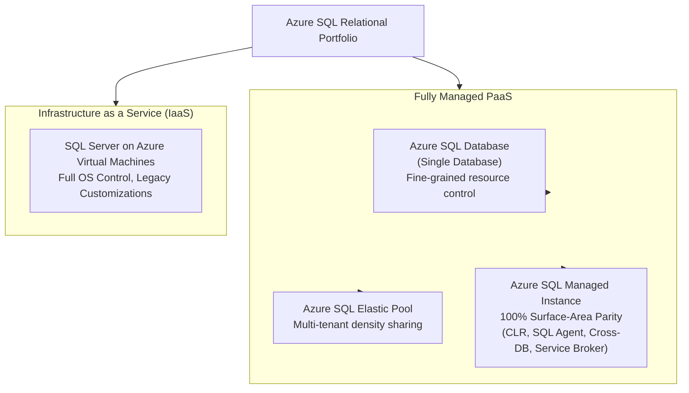
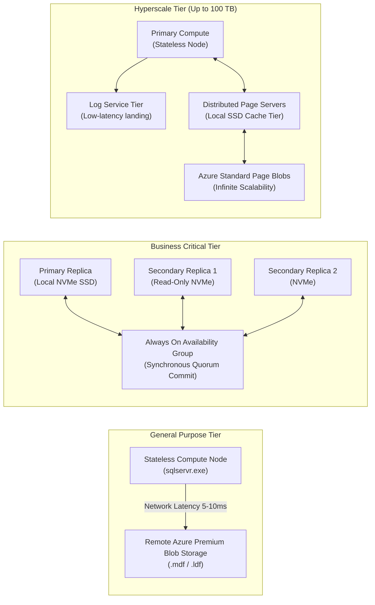
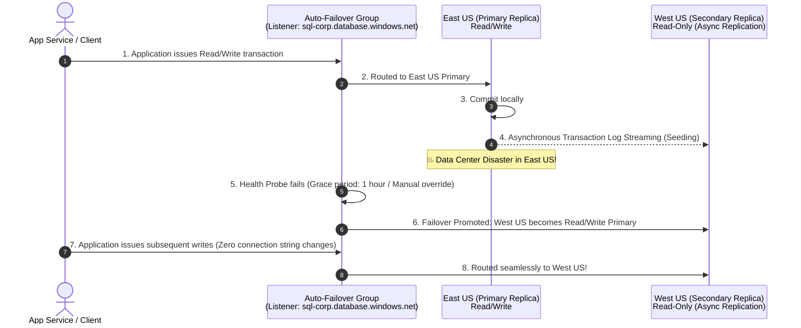

# Module 33: Azure SQL Database & Cloud Relational Architecture

---

## 1. Executive Summary & Core Value Proposition

**Azure SQL Database** is a fully managed Platform-as-a-Service (PaaS) relational database engine powered by the latest enterprise edition of Microsoft SQL Server. It abstracts away operating system patching, hardware provisioning, automated backups, and database engine upgrades while delivering a guaranteed 99.99% to 99.995% availability Service Level Agreement (SLA).

In enterprise cloud architecture, Azure SQL Database decouples compute from storage, allowing autonomous scalability from small edge apps to global planetary-scale systems exceeding 100 TB with sub-millisecond I/O (Hyperscale). It shifts developers and database administrators (DBAs) from routine infrastructure maintenance to schema optimization, index tuning, zero-trust security governance, and multi-region disaster recovery engineering.

---

## 2. Deep-Dive Cloud Architecture & Internal Mechanics

### 2.1 Azure SQL PaaS Flavors & Deployment Models



1. **Azure SQL Database (Single DB)**: Fully isolated database running on shared physical hardware with dedicated compute (vCores) and storage quotas. Best for modern greenfield microservices.
2. **Azure SQL Database (Elastic Pool)**: A collection of single databases sharing a unified pool of compute resources (eDTUs or vCores). Optimized for SaaS multi-tenant applications where individual tenant workloads peak at different times.
3. **Azure SQL Managed Instance (MI)**: Enterprise PaaS offering 99.9% compatibility with on-premises SQL Server instances. Native support for cross-database queries, SQL Server Agent, Linked Servers, CLR integration, and native VNet injection.
4. **SQL Server on Azure VMs (IaaS)**: Lift-and-shift legacy migration requiring direct Windows/Linux OS access, custom COM components, or SQL versions prior to 2016.

### 2.2 Compute & Storage Decoupling Across vCore Architectural Tiers



---

## 3. Tier & Purchasing Model Decision Matrix

Azure SQL offers two primary billing models: **vCore** (recommended for all modern architectures) and **DTU** (legacy bundled metrics).

### 3.1 DTU vs. vCore Comparison

| Dimension | DTU (Database Transaction Unit) | vCore (Virtual Core) |
| :--- | :--- | :--- |
| **Architectural Concept** | Blended ratio of CPU, Memory, and Read/Write I/O | Independent selection of Compute (vCore), Memory, and Storage GB |
| **Scaling Flexibility** | Pre-packaged tiers (Basic, Standard, Premium); scaling is rigid | Independent scaling of compute vCores and storage independently |
| **Azure Hybrid Benefit** | ❌ Not eligible | ✅ Up to 55% discount by reusing on-premise Windows/SQL licenses |
| **Reserved Instances** | ❌ Not eligible | ✅ 1-year or 3-year commitments provide up to 38-65% savings |
| **Recommended Usage** | Legacy applications with simple, steady, predictable workloads | Modern enterprise applications, high-scale services, cost governance |

### 3.2 vCore Service Tiers: General Purpose vs. Business Critical vs. Hyperscale vs. Serverless

| Metric / Capability | General Purpose | Business Critical | Hyperscale | Serverless (General Purpose) |
| :--- | :--- | :--- | :--- | :--- |
| **Target Workload** | Standard enterprise apps, Dev/Test, CRUD APIs | Mission-critical, low-latency OLTP, high transaction volume | Rapidly growing data (>4 TB up to 100 TB), bursty reads | Intermittent, unpredictable workloads with idle periods |
| **Compute Range** | 2 to 128 vCores | 2 to 128 vCores | 2 to 128 vCores | 0.5 to 40 vCores (Auto-scales dynamically) |
| **Storage Technology** | Remote Azure Premium Storage | Local NVMe SSD (fastest I/O) | Distributed multi-tiered Page Servers | Remote Azure Standard/Premium Storage |
| **I/O Latency** | 5ms to 10ms | 1ms to 2ms (Sub-millisecond reads) | 1ms to 5ms (Cached page reads) | 5ms to 10ms |
| **Maximum Storage** | 4 TB | 4 TB | **100 TB** | 4 TB |
| **High Availability** | Single node; fails over to spare node via Azure Service Fabric | Multi-node **Always On** cluster with 1 free read-only replica | Decoupled compute with up to 30 read replicas (Instant scale) | Single node with automated pause after inactivity |
| **Auto-Pause Billing** | ❌ No | ❌ No | ❌ No | ✅ Compute bills per second; **pauses to $0** when idle |
| **Backup Restoration** | Time proportional to database size | Time proportional to database size | **Instant snapshot restore** (Minutes for 50 TB) | Time proportional to database size |

---

## 4. Production .NET 8 Implementation & Infrastructure as Code (IaC)

### 4.1 Production EF Core 8 Configuration with Passwordless Entra ID Managed Identity

Hardcoding SQL credentials (`User Id=sa;Password=...`) in connection strings is a major compliance violation. Production .NET 8 services authenticate via **Microsoft Entra ID Managed Identity** using access tokens.

#### `appsettings.json`
```json
{
  "ConnectionStrings": {
    "SqlDatabase": "Server=tcp:sql-corp-prod.database.windows.net,1433;Database=OrderDb;Encrypt=True;TrustServerCertificate=False;"
  }
}
```

#### `Program.cs` (.NET 8 with Microsoft Entra ID Token Interception)
```csharp
using Azure.Core;
using Azure.Identity;
using Microsoft.Data.SqlClient;
using Microsoft.EntityFrameworkCore;

var builder = WebApplication.CreateBuilder(args);

var connectionString = builder.Configuration.GetConnectionString("SqlDatabase");

builder.Services.AddDbContext<OrderDbContext>(options =>
{
    // Configure SQL Server with resilient connection retries
    options.UseSqlServer(connectionString, sqlOptions =>
    {
        sqlOptions.EnableRetryOnFailure(
            maxRetryCount: 5,
            maxRetryDelay: TimeSpan.FromSeconds(30),
            errorNumbersToAdd: null);
    });
});

var app = builder.Build();

// Context definition with Managed Identity interceptor
public class OrderDbContext : DbContext
{
    private static readonly string[] AzureSqlScopes = ["https://database.windows.net/.default"];
    private readonly TokenCredential _credential = new DefaultAzureCredential();

    public OrderDbContext(DbContextOptions<OrderDbContext> options) : base(options) { }

    public DbSet<OrderRecord> Orders => Set<OrderRecord>();

    protected override void OnConfiguring(DbContextOptionsBuilder optionsBuilder)
    {
        base.OnConfiguring(optionsBuilder);

        // Intercept connection and inject OAuth access token
        var connection = (SqlConnection)Database.GetDbConnection();
        if (string.IsNullOrEmpty(connection.AccessToken))
        {
            var tokenContext = new TokenRequestContext(AzureSqlScopes);
            var token = _credential.GetToken(tokenContext);
            connection.AccessToken = token.Token;
        }
    }
}

public record OrderRecord(Guid Id, string CustomerEmail, decimal TotalAmount);
```

### 4.2 Infrastructure as Code: Azure SQL Server + Private Endpoint (Bicep)

```bicep
param sqlServerName string = 'sql-corp-prod'
param databaseName string = 'OrderDb'
param location string = resourceGroup().location
param adminEntraGroupOid string
param adminEntraGroupName string = 'SQL_Admins_Group'
param vnetSubnetId string

// 1. Logical Azure SQL Server with Entra-Only Authentication
resource sqlServer 'Microsoft.Sql/servers@2023-05-01-preview' = {
  name: sqlServerName
  location: location
  properties: {
    minimalTlsVersion: '1.2'
    publicNetworkAccess: 'Disabled' // Zero Public Internet Exposure
    administrators: {
      administratorType: 'ActiveDirectory'
      azureADOnlyAuthentication: true
      principalType: 'Group'
      login: adminEntraGroupName
      sid: adminEntraGroupOid
      tenantId: subscription().tenantId
    }
  }
}

// 2. Azure SQL Database (General Purpose vCore with Zone Redundancy)
resource sqlDatabase 'Microsoft.Sql/servers/databases@2023-05-01-preview' = {
  parent: sqlServer
  name: databaseName
  location: location
  sku: {
    name: 'GP_Gen5_4'
    tier: 'GeneralPurpose'
    capacity: 4
  }
  properties: {
    zoneRedundant: true
    readScale: 'Disabled'
    maxSizeBytes: 107374182400 // 100 GB
  }
}

// 3. Azure Private Endpoint (Secured inside enterprise VNet)
resource privateEndpoint 'Microsoft.Network/privateEndpoints@2023-05-01' = {
  name: '${sqlServerName}-pe'
  location: location
  properties: {
    subnet: {
      id: vnetSubnetId
    }
    privateLinkServiceConnections: [
      {
        name: '${sqlServerName}-plink'
        properties: {
          privateLinkServiceId: sqlServer.id
          groupIds: [
            'sqlServer'
          ]
        }
      }
    ]
  }
}
```

---

## 5. Real-World High Availability & Disaster Recovery Architecture



### Key Business Continuity Metrics:
- **RPO (Recovery Point Objective)**: Maximum allowable data loss measured in time. Active Geo-Replication provides an RPO `< 5 seconds` via asynchronous log replication.
- **RTO (Recovery Time Objective)**: Maximum allowable downtime. Auto-Failover Groups deliver an RTO `< 30 seconds` for automated failover switching DNS CNAME pointers.

---

## 6. Cost Traps, Scalability Bottlenecks & Security Anti-Patterns

1. **The Serverless Cold-Start "Auto-Pause Delay" Trap**:
   - *Trap*: Teams configure Serverless tier with a 1-hour auto-pause delay to save money. The first customer hitting the API in the morning experiences a **45-second HTTP 504 Gateway Timeout** while the SQL compute container unpauses and initializes memory.
   - *Mitigation*: For user-facing production APIs, avoid auto-pause or set the min vCore to `0.5` instead of `0` to keep compute active while benefiting from dynamic scale-up.
2. **Public Endpoint Firewall Misconfiguration**:
   - *Trap*: Checking "Allow Azure services and resources to access this server" in the SQL Firewall. This does **not** restrict access to your subscription; it allows *any* virtual machine or service deployed by *any customer* in global Azure to reach your SQL login prompt.
   - *Mitigation*: Disable public network access completely (`publicNetworkAccess: 'Disabled'`). Mandate **Azure Private Link** with Private Endpoints inside isolated subnets.
3. **Tempdb Bottlenecks in General Purpose Tiers**:
   - *Trap*: Heavy analytical queries with table variables, CTEs, and large sorting operations cause `tempdb` allocation contention (Page Free Space / Global Allocation Map latch contention), saturating remote storage IOPS.
   - *Mitigation*: Switch to the **Business Critical** or **Hyperscale** tier, where `tempdb` resides directly on physical local NVMe SSDs with zero remote network I/O latency.
4. **Neglecting Read-Scale Out on Business Critical**:
   - *Trap*: Running expensive reporting and BI queries against the primary write replica, degrading OLTP write throughput.
   - *Mitigation*: Enable `ApplicationIntent=ReadOnly` in reporting connection strings. Business Critical includes one high-performance read-only replica at **zero extra cost**.

---

## 7. Principal Cloud Architect Interview Scenarios

### Q1: "You have an e-commerce platform approaching Black Friday. The current SQL Database is General Purpose 8 vCores (4 TB storage). You expect a 10x traffic surge in reads and a 3x surge in order inserts. How do you architect this without causing downtime?"
**Architect Answer**:
> "I would execute an online migration to **Azure SQL Database Hyperscale**:
> 1. Hyperscale allows dynamic online compute scaling from 8 vCores to 32 or 64 vCores in minutes without moving physical data pages (since compute is completely decoupled from the Page Server storage tier).
> 2. For the 10x read surge, I would spin up **3 to 5 Hyperscale Named Read Replicas**. These replicas draw from the same shared page storage tier and spin up in under 5 minutes without data replication delay.
> 3. We split application traffic: write endpoints point to the Primary compute instance, while reporting, search, and catalog queries point to the Read Replicas using `ApplicationIntent=ReadOnly`.
> 4. Once Black Friday concludes, we scale compute back down to 8 vCores and terminate the read replicas, achieving elastic cloud unit economics."

### Q2: "What is the architectural difference between Transparent Data Encryption (TDE) and Always Encrypted with Secure Enclaves, and when is TDE insufficient?"
**Architect Answer**:
> "**TDE** provides **Encryption at Rest**. The database engine encrypts the `.mdf`, `.ldf`, and backup files when written to disk, and decrypts them when read into buffer pool memory. However, within SQL Server memory, plaintext data is completely exposed to cloud administrators, high-privileged DBAs, and any memory-scraping process.
> 
> **Always Encrypted with Secure Enclaves** provides **Client-Side Encryption in Use**:
> 1. Data is encrypted on the client side inside the .NET 8 application by the `Microsoft.Data.SqlClient` driver before it touches the network.
> 2. Cryptographic keys reside securely inside Azure Key Vault; the database engine never sees the plaintext keys.
> 3. Inside the database CPU, hardware-protected memory enclaves (Intel SGX or Virtualization-Based Security) allow SQL Server to perform computations, cryptographic index seeks, and string pattern matching inside encrypted memory without ever leaking plaintext data to the operating system or Azure hypervisor."
