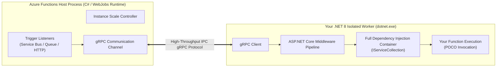
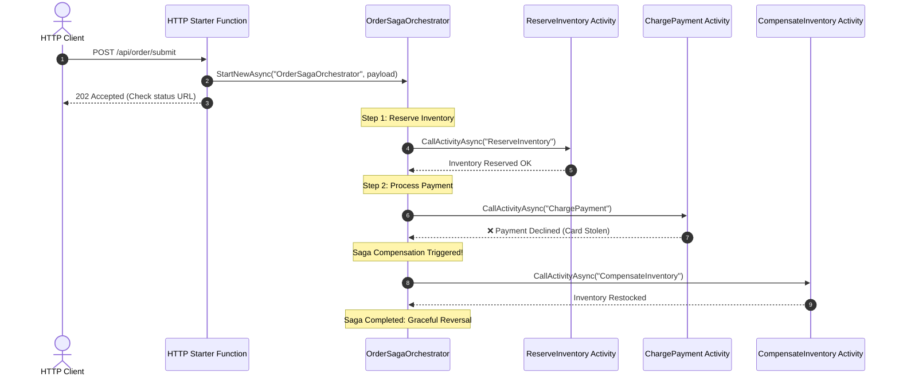

# Module 34: Azure Functions & Serverless Compute Architecture

> **Curriculum Navigation:**  
> ⏪ [Previous: Module 33 – Azure SQL Database & Cloud Relational Architecture](./33_azure_sql_database.md) | 🏠 [Master Index](./README.md) | ⏩ [Next: Module 35 – Azure Event Grid & Enterprise Messaging](./35_azure_event_grid_and_messaging.md)

---

## 1. Executive Summary & Core Value Proposition

**Azure Functions** is Microsoft’s event-driven, serverless compute platform. It enables software engineers to run discreet blocks of code (functions) triggered by cloud events without managing virtual machine infrastructure, operating system patching, or web server orchestration.

In enterprise microservice architectures, Azure Functions delivers:
1. **Event-Driven Efficiency**: Code executes strictly in response to external signals—HTTP requests, database mutations (Cosmos DB Change Feed), message arrivals (Azure Service Bus/Storage Queues), cloud telemetry (Event Grid/IoT Hub), or scheduled cron timers.
2. **Sub-Second Elastic Scalability**: Automatically scales out from zero to hundreds of concurrent instances during traffic spikes, and scales back down to zero when idle.
3. **Consumption Economics**: Pay strictly for the exact memory (GB-s) and CPU execution time consumed per millisecond, eliminating idle infrastructure waste.

---

## 2. Deep-Dive Cloud Architecture & Internal Mechanics

### 2.1 The Isolated Worker Process Model (.NET 8 / 9 Standard) vs. In-Process Legacy

Historically, .NET Azure Functions ran **in-process**, sharing the same CLR runtime process as the host runtime (`func.exe` / WebJobs Host). This created severe dependency conflicts (e.g., mismatched `Newtonsoft.Json` or `System.Text.Json` versions) and delayed .NET version adoption.

The modern **Isolated Worker Process Model** completely decouples the host runtime from your .NET 8 application:



### 2.2 Advantages of the Isolated Worker Model:
- **Zero Dependency Conflicts**: Complete control over all NuGet dependencies, framework versions, and assembly loading.
- **Full ASP.NET Core Middleware Pipeline**: Native support for custom authorization, correlation ID tracking, exception handling, and dependency injection.
- **Immediate Framework Support**: Day-1 support for modern .NET LTS and STS releases (.NET 8, .NET 9).

---

## 3. Hosting Plan Decision Matrix

Selecting the appropriate hosting plan determines latency guarantees, network isolation, compute timeouts, and cost profile:

| Architectural Metric | Consumption Plan (Y1) | Flex Consumption Plan (New) | Premium Plan (EP1 - EP3) | Dedicated (App Service Plan) |
| :--- | :--- | :--- | :--- | :--- |
| **Compute Billing** | Pay per execution & memory (GB-s). Zero when idle. | Pay per execution & memory. Granular instance sizing. | Monthly minimum per pre-warmed core + execution. | Fixed hourly VM cost regardless of utilization. |
| **Cold Starts** | Yes (1s to 5s cold start on scale-out from zero). | Minimal (Optimized fast cold-starts). | **Zero Cold Starts** (Guaranteed pre-warmed standby instances). | Zero (Instances are always warm). |
| **Virtual Network (VNet) Integration** | ❌ No outbound VNet injection. | ✅ **Yes** (Fast VNet connectivity). | ✅ **Yes** (Full regional VNet injection). | ✅ **Yes** (VNet injection enabled). |
| **Maximum Execution Timeout** | 5 minutes (default); 10 minutes (maximum). | Configurable (Up to 30 minutes). | 30 minutes (default); **Unbounded / Infinite** supported. | 30 minutes (default); **Unbounded / Infinite** supported. |
| **Maximum Scale-Out** | Up to 200 instances automatically. | Fast scale-out with custom concurrency limits. | Up to 100 instances with high CPU/Memory. | Limited by App Service Plan scale limit (10-30). |
| **Ideal Enterprise Use Case** | Sporadic background batch tasks, non-critical webhooks, low-budget dev/test. | High-scale modern serverless requiring private networking and fast scale. | Production APIs, mission-critical event processors, enterprise VNet Private Link. | Co-locating functions with existing App Service Web Apps to utilize idle capacity. |

---

## 4. Production .NET 8 Implementation & Infrastructure as Code (IaC)

### 4.1 Production .NET 8 Isolated Worker Function App

This production example demonstrates:
1. Native ASP.NET Core integration in .NET 8.
2. Custom correlation ID & logging middleware.
3. Azure Service Bus Trigger with **Dead-Letter Resiliency**.
4. Output binding publishing processed events to an Azure Storage Queue.

#### `Program.cs`
```csharp
using Microsoft.Azure.Functions.Worker;
using Microsoft.Extensions.DependencyInjection;
using Microsoft.Extensions.Hosting;
using Microsoft.Extensions.Logging;

var host = new HostBuilder()
    .ConfigureFunctionsWebApplication(builder =>
    {
        // Register custom middleware in the Isolated execution pipeline
        builder.UseMiddleware<FunctionCorrelationMiddleware>();
    })
    .ConfigureServices(services =>
    {
        services.AddApplicationInsightsTelemetryWorkerService();
        services.ConfigureFunctionsApplicationInsights();

        // Register domain services
        services.AddSingleton<IOrderProcessor, OrderProcessor>();
    })
    .Build();

host.Run();

// Custom Middleware for Tracing and Exception Shielding
public class FunctionCorrelationMiddleware : IFunctionsWorkerMiddleware
{
    public async Task Invoke(FunctionContext context, FunctionExecutionDelegate next)
    {
        var logger = context.GetLogger<FunctionCorrelationMiddleware>();
        var correlationId = Guid.NewGuid().ToString("N");

        using (logger.BeginScope(new Dictionary<string, object> { ["CorrelationId"] = correlationId }))
        {
            logger.LogInformation("Commencing serverless execution: {FunctionName}", context.FunctionDefinition.Name);
            await next(context);
            logger.LogInformation("Completed serverless execution successfully.");
        }
    }
}

public interface IOrderProcessor { Task<string> ProcessAsync(string payload); }
public class OrderProcessor : IOrderProcessor
{
    public Task<string> ProcessAsync(string payload) => Task.FromResult($"Processed: {payload}");
}
```

#### `OrderProcessingFunction.cs`
```csharp
using System.Text.Json;
using Azure.Messaging.ServiceBus;
using Microsoft.Azure.Functions.Worker;
using Microsoft.Extensions.Logging;

namespace Enterprise.Serverless;

public class OrderProcessingFunction
{
    private readonly ILogger<OrderProcessingFunction> _logger;
    private readonly IOrderProcessor _processor;

    public OrderProcessingFunction(ILogger<OrderProcessingFunction> logger, IOrderProcessor processor)
    {
        _logger = logger;
        _processor = processor;
    }

    [Function(nameof(ProcessIncomingOrder))]
    [QueueOutput("orders-audit-log", Connection = "AzureWebJobsStorage")]
    public async Task<string> ProcessIncomingOrder(
        [ServiceBusTrigger("orders-topic", "order-subscription", Connection = "ServiceBusConnectionString", IsBatched = false)] 
        ServiceBusReceivedMessage message,
        FunctionContext executionContext)
    {
        _logger.LogInformation("Processing Service Bus message ID: {MessageId}, DeliveryCount: {DeliveryCount}", 
            message.MessageId, message.DeliveryCount);

        // Defensive retry / poison message handling
        if (message.DeliveryCount > 3)
        {
            _logger.LogWarning("Message {MessageId} exceeded safe delivery threshold.", message.MessageId);
        }

        string rawJson = message.Body.ToString();
        var processedResult = await _processor.ProcessAsync(rawJson);

        // Return value automatically routes to Azure Queue Output Binding
        return JsonSerializer.Serialize(new
        {
            AuditId = Guid.NewGuid(),
            OriginalMessageId = message.MessageId,
            ProcessedAtUtc = DateTime.UtcNow,
            Summary = processedResult
        });
    }
}
```

### 4.2 Infrastructure as Code: Function App on Premium Plan with VNet Injection (Bicep)

```bicep
param appName string = 'fn-order-processor'
param location string = resourceGroup().location
param subnetId string
param storageAccountName string

// 1. Azure Storage Account (Required for Functions Host checkpointing & leases)
resource storageAccount 'Microsoft.Storage/storageAccounts@2023-01-01' = {
  name: storageAccountName
  location: location
  sku: { name: 'Standard_LRS' }
  kind: 'StorageV2'
}

// 2. Elastic Premium Plan (Zero Cold Starts, VNet Injection)
resource premiumPlan 'Microsoft.Web/serverfarms@2023-01-01' = {
  name: '${appName}-plan'
  location: location
  sku: {
    name: 'EP1'
    tier: 'ElasticPremium'
  }
  properties: {
    maximumElasticWorkerCount: 20
  }
}

// 3. Linux Function App (.NET 8 Isolated)
resource functionApp 'Microsoft.Web/sites@2023-01-01' = {
  name: appName
  location: location
  kind: 'functionapp,linux'
  properties: {
    serverFarmId: premiumPlan.id
    virtualNetworkSubnetId: subnetId // VNet Outbound Integration
    siteConfig: {
      linuxFxVersion: 'DOTNET-ISOLATED|8.0'
      appSettings: [
        {
          name: 'AzureWebJobsStorage'
          value: 'DefaultEndpointsProtocol=https;AccountName=${storageAccount.name};AccountKey=${storageAccount.listKeys().keys[0].value};EndpointSuffix=core.windows.net'
        }
        {
          name: 'FUNCTIONS_EXTENSION_VERSION'
          value: '~4'
        }
        {
          name: 'FUNCTIONS_WORKER_RUNTIME'
          value: 'dotnet-isolated'
        }
        {
          name: 'WEBSITE_CONTENTAZUREFILECONNECTIONSTRING'
          value: 'DefaultEndpointsProtocol=https;AccountName=${storageAccount.name};AccountKey=${storageAccount.listKeys().keys[0].value};EndpointSuffix=core.windows.net'
        }
        {
          name: 'WEBSITE_CONTENTSHARE'
          value: toLower(appName)
        }
      ]
    }
  }
}
```

---

## 5. Enterprise Stateful Orchestration: Durable Functions (Saga Pattern)

For complex distributed business workflows, plain functions cannot maintain state across multiple async steps without fragile database polling. **Durable Functions** uses the **Event Sourcing Pattern** over Azure Storage Queues and Tables to execute resilient workflows.



---

## 6. Cost Traps, Scalability Bottlenecks & Security Anti-Patterns

1. **Outbound SNAT Port Exhaustion**:
   - *Trap*: A Function App creates a `new HttpClient()` inside each function invocation. Under high load (thousands of invocations/min), hundreds of ephemeral TCP sockets get stuck in `TIME_WAIT` state, leading to **System.Net.Sockets.SocketException: No connection could be made**.
   - *Mitigation*: Register `HttpClient` via `services.AddHttpClient()` in `Program.cs` as a singleton, or use static long-lived instances.
2. **Infinite Recursive Trigger Execution**:
   - *Trap*: A Blob-triggered function processes a `.csv` file in container `inbound-data` and outputs the resulting `.csv` file back into the same `inbound-data` container. This triggers an infinite recursive loop that spins up 200 instances and drains the cloud budget within hours.
   - *Mitigation*: Strictly isolate trigger sources from output destinations (e.g., read from `raw-inbound`, write to `processed-output`).
3. **Storage Account Throttling & Bottlenecks**:
   - *Trap*: Hundreds of concurrent Function instances share a single standard Azure Storage Account for internal lock leases (`azure-webjobs-hosts`), trigger queues, and business telemetry. The storage account hits its 20,000 IOPS ceiling, causing massive function scheduling delays.
   - *Mitigation*: Isolate business telemetry into dedicated storage accounts or Azure Cosmos DB, leaving the `AzureWebJobsStorage` account exclusively for framework internal coordination.
4. **SQL Connection Pool Exhaustion on Scale-Out**:
   - *Trap*: 100 concurrent Function instances scale out rapidly in response to a queue burst. Each instance opens 50 connections to Azure SQL, slamming the database with 5,000 active connections and triggering severe CPU lockups and connection rejections.
   - *Mitigation*: Place **Azure SQL Database Elastic Pool** or **Azure SQL Database Hyperscale** with an **Azure Database Proxy (or Azure SQL Connection Pooler)** in front of the database, or limit maximum scale-out via `functionAppScaleLimit`.

---

## 7. Principal Cloud Architect Interview Scenarios

### Q1: "How does the Azure Functions Scale Controller detect and scale message-based workloads without polling the message queue from running instances?"
**Architect Answer**:
> "The **Scale Controller** is an autonomous background service that runs outside your Function App compute instances:
> 1. It periodically queries the metadata metrics of the target resource (e.g., querying Azure Service Bus for `ActiveMessageCount` or Azure Storage Queue for queue depth).
> 2. It calculates the rate of change and latency heuristics (e.g., if a single message takes 200ms to process and there are 10,000 active messages arriving per minute).
> 3. Based on the calculated scale metrics, the Scale Controller issues allocation commands to the underlying Azure infrastructure to add VM instances.
> 4. Once new instances boot up, the internal WebJobs listener binds to the queue and begins pulling messages.
> 5. Conversely, when queue depth reaches zero and instances remain idle past the scale-down timeout, the Scale Controller de-provisions workers incrementally until reaching zero or your pre-warmed minimum."

### Q2: "Why are Durable Functions orchestrator functions required to be deterministic, and what happens if you invoke `DateTime.UtcNow` or an asynchronous HTTP call directly inside an orchestrator?"
**Architect Answer**:
> "Durable Functions orchestrators rely on the **Event Sourcing Replay Pattern**:
> 1. When an orchestrator awaits an activity (`await context.CallActivityAsync(...)`), the framework saves the execution state to an Azure Storage Table history log and terminates the thread to avoid paying for idle compute.
> 2. When the activity finishes, the orchestrator function is **re-executed from the very first line of code**.
> 3. During replay, previously executed activities are not re-run; their results are fetched from the execution history log.
> 4. If non-deterministic code is written inside the orchestrator—such as calling `DateTime.UtcNow`, `Guid.NewGuid()`, or `new HttpClient().GetAsync()`—the values generated during the replay will differ from the original run. This violates history consistency and throws a fatal **NonDeterministicOrchestrationException**."
