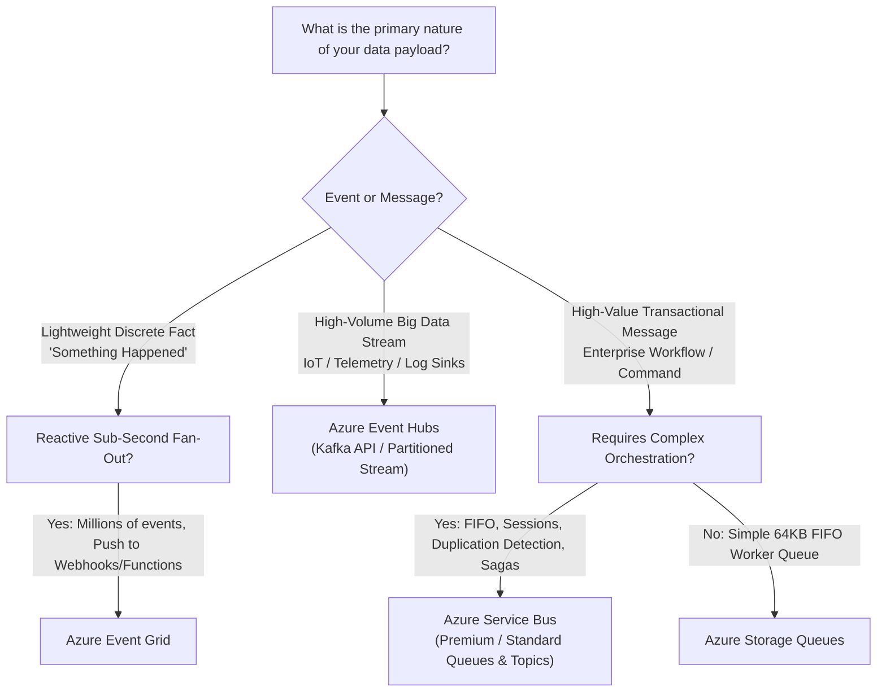
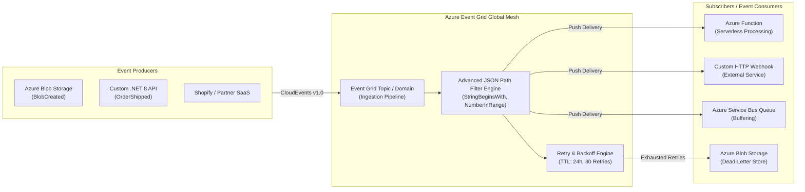
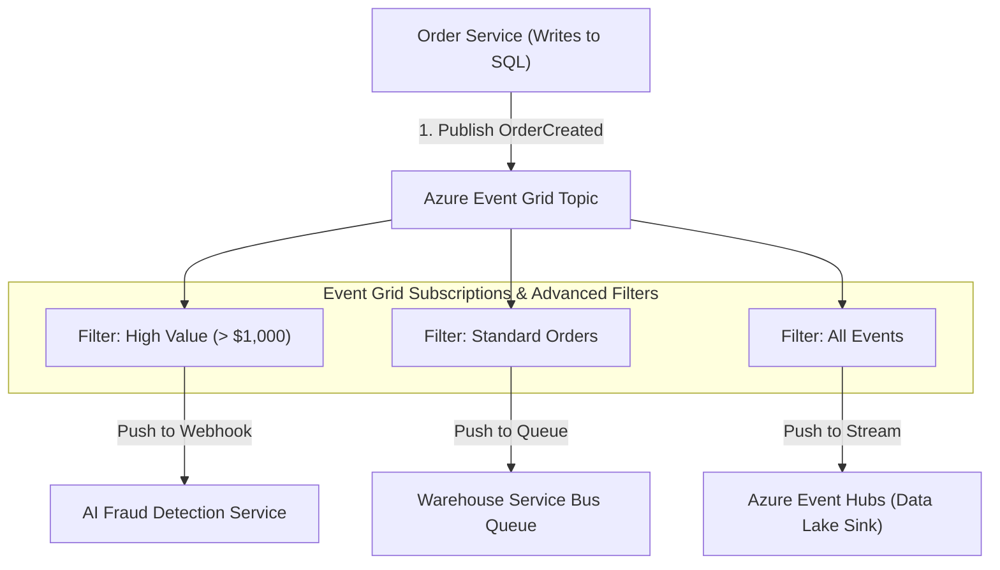

# Module 35: Azure Event Grid & Enterprise Cloud Messaging Architecture

> **Curriculum Navigation:**  
> ⏪ [Previous: Module 34 – Azure Functions & Serverless Compute Architecture](./34_azure_functions.md) | 🏠 [Master Index](./README.md) | ⏩ [Next: Module 36 – Azure DevOps, GitOps & CI/CD Pipelines](./36_azure_devops_ci_cd.md)

---

## 1. Executive Summary & Core Value Proposition

**Azure Event Grid** is a highly scalable, fully managed Pub/Sub event routing service engineered for event-driven reactive architectures. Operating at massive scale (handling millions of events per second with sub-100 millisecond latencies), it decouples event producers from event consumers across the enterprise.

In distributed systems, confusing **Events** with **Messages** leads to catastrophic architectural misalignments:
- **An Event** is a lightweight, immutable fact stating that something *has occurred* in the system (e.g., `OrderPlaced`, `BlobCreated`, `UserRegistered`). The publisher has zero expectation of who listens or what specific downstream action is performed.
- **A Message** is a raw data packet or command conveying intent from a sender to a designated recipient with a specific contract and processing expectation (e.g., `ProcessPayrollCommand`, `ChargeCreditCardRequest`).

Event Grid acts as the central nervous system of Azure, natively linking Azure resources, custom microservices, third-party SaaS platforms, and edge devices into a unified reactive event mesh.

---

## 2. Enterprise Messaging Decision Matrix: Event Grid vs. Service Bus vs. Event Hubs vs. Storage Queues

Selecting the wrong messaging technology is one of the most expensive architectural errors in cloud systems. Use this definitive architectural matrix:



| Architectural Metric | Azure Event Grid | Azure Service Bus | Azure Event Hubs | Azure Storage Queues |
| :--- | :--- | :--- | :--- | :--- |
| **Core Paradigm** | Reactive Event Distribution (Pub/Sub) | Enterprise Message Broker (Queues & Topics) | Big Data Streaming Ingestion Engine | Simple Asynchronous Work Dispatch Queue |
| **Typical Payload Size** | Small (~64 KB - 1 MB) | Up to 1 MB (Standard) / 100 MB (Premium) | Up to 1 MB per event | Up to 64 KB per message |
| **Throughput & Scale** | > 10,000,000 events/sec | Tens of thousands of messages/sec | **Millions of events/sec** (GB/s bandwidth) | Thousands of messages/sec |
| **Delivery Model** | **Push** (Webhooks, Functions) & **Pull** (CloudEvents) | **Pull** (Receiver polls or maintains AMQP link) | **Partitioned Pull** (Consumer groups read offsets) | **Pull** (Polling over HTTP/S) |
| **Ordering & Sessions** | ❌ No native strict ordering guarantee | ✅ **Strict FIFO** via Message Sessions | ✅ **Strict FIFO within each Partition** | ❌ At-least-once (no FIFO guarantee) |
| **Duplicate Detection** | ❌ Client must handle idempotency | ✅ Native Time-Window Deduplication | ❌ Offset-based (Client manages state) | ❌ None |
| **Transactions & Sagas** | ❌ None | ✅ Cross-Queue Atomic Transactions | ❌ None | ❌ None |
| **Dead-Lettering** | ✅ To Azure Blob Storage | ✅ Native Dead-Letter Queue (DLQ) | ❌ Application-managed | ✅ Via Poison Queue pattern |
| **Primary Protocols** | HTTPS, CloudEvents v1.0, MQTT v5 | AMQP 1.0, SBMP, HTTPS | AMQP 1.0, Apache Kafka Protocol, HTTPS | REST / HTTPS |
| **Best Scenario** | Reacting to cloud state changes, serverless fan-out, IoT alerts | Financial transactions, e-commerce order queues, enterprise workflows | Real-time analytics, telemetry, clickstreams, distributed log ingestion | Simple task processing between App Service and WebJobs |

---

## 3. Deep-Dive Cloud Architecture & Internal Mechanics



### 3.1 Event Schemas: CloudEvents v1.0 vs. Event Grid Schema
Modern enterprise designs mandate **CloudEvents v1.0** (CNCF open standard) rather than proprietary schemas, ensuring vendor neutrality across multi-cloud topologies:

```json
{
  "specversion": "1.0",
  "type": "com.enterprise.orders.OrderPlaced",
  "source": "/orders/services/order-service-eastus",
  "id": "A234-1234-1234",
  "time": "2026-09-13T12:00:00Z",
  "datacontenttype": "application/json",
  "data": {
    "orderId": "e5b6f37a-4c28-4859-bc36-3cb796a84d28",
    "customerId": 88412,
    "totalAmount": 1499.50,
    "currency": "USD"
  }
}
```

---

## 4. Production .NET 8 Implementation & Infrastructure as Code (IaC)

### 4.1 Publishing CloudEvents with `Azure.Messaging.EventGrid` in .NET 8

```csharp
using Azure;
using Azure.Core.Serialization;
using Azure.Identity;
using Azure.Messaging;
using Azure.Messaging.EventGrid;

public class OrderEventPublisher
{
    private readonly EventGridPublisherClient _client;

    public OrderEventPublisher(IConfiguration configuration)
    {
        var topicEndpoint = new Uri(configuration["EventGrid:TopicEndpoint"]!);
        
        // Zero-Trust: Authenticate using Managed Identity / Entra ID token
        _client = new EventGridPublisherClient(
            topicEndpoint, 
            new DefaultAzureCredential());
    }

    public async Task PublishOrderPlacedEventAsync(OrderPlacedDto order, CancellationToken ct)
    {
        // 1. Construct CNCF CloudEvent v1.0 specification object
        var cloudEvent = new CloudEvent(
            source: "/orders/checkout-service",
            type: "com.enterprise.orders.OrderPlaced",
            data: order)
        {
            Time = DateTimeOffset.UtcNow,
            Id = Guid.NewGuid().ToString("N")
        };

        // 2. Publish asynchronously with exponential backoff built-in
        await _client.SendEventAsync(cloudEvent, ct);
    }
}

public record OrderPlacedDto(Guid OrderId, int CustomerId, decimal TotalAmount);
```

### 4.2 Consuming and Validating Webhook Events in ASP.NET Core 8 Minimal API

When registering an HTTP Webhook subscription, Event Grid performs a mandatory **Validation Handshake** to prevent denial-of-service reflection attacks:

```csharp
using Azure.Messaging.EventGrid;
using Azure.Messaging.EventGrid.SystemEvents;

var builder = WebApplication.CreateBuilder(args);
var app = builder.Build();

app.MapPost("/api/events/webhook", async (HttpContext context) =>
{
    using var reader = new StreamReader(context.Request.Body);
    var requestBody = await reader.ReadToEndAsync();

    // Parse incoming Event Grid batch
    EventGridEvent[] events = EventGridEvent.ParseMany(BinaryData.FromString(requestBody));

    foreach (var eventGridEvent in events)
    {
        // Handshake: Respond immediately to the validation challenge
        if (eventGridEvent.TryGetSystemEventData(out object eventData))
        {
            if (eventData is SubscriptionValidationEventData validationData)
            {
                var responseData = new SubscriptionValidationResponse
                {
                    ValidationResponse = validationData.ValidationCode
                };
                return Results.Ok(responseData);
            }
        }

        // Process Custom Business Event
        if (eventGridEvent.EventType == "com.enterprise.orders.OrderPlaced")
        {
            var payload = eventGridEvent.Data.ToObjectFromJson<OrderPlacedDto>();
            app.Logger.LogInformation("Processing reactive event for Order: {OrderId}", payload.OrderId);
        }
    }

    return Results.Ok();
});

app.Run();
```

### 4.3 Infrastructure as Code: Event Grid Custom Topic with Dead-Lettering (Bicep)

```bicep
param topicName string = 'evgt-orders-prod'
param location string = resourceGroup().location
param deadLetterStorageAccountId string
param webhookEndpointUrl string

// 1. Event Grid Custom Topic configured for CloudEvents v1.0
resource eventGridTopic 'Microsoft.EventGrid/topics@2023-12-15-preview' = {
  name: topicName
  location: location
  properties: {
    inputSchema: 'CloudEventSchemaV1_0'
    publicNetworkAccess: 'Enabled'
  }
}

// 2. Event Subscription with Advanced Filtering & Dead-Lettering to Blob Storage
resource eventSubscription 'Microsoft.EventGrid/topics/eventSubscriptions@2023-12-15-preview' = {
  parent: eventGridTopic
  name: 'sub-order-notifications'
  properties: {
    deliveryWithResourceIdentity: {
      identity: { type: 'SystemAssigned' }
      destination: {
        endpointType: 'WebHook'
        properties: {
          endpointUrl: webhookEndpointUrl
          maxEventsPerBatch: 10
          preferredBatchSizeInKilobytes: 64
        }
      }
    }
    deadLetterWithResourceIdentity: {
      identity: { type: 'SystemAssigned' }
      destination: {
        endpointType: 'StorageBlob'
        properties: {
          resourceId: deadLetterStorageAccountId
          blobContainerName: 'event-grid-deadletters'
        }
      }
    }
    filter: {
      includedEventTypes: [
        'com.enterprise.orders.OrderPlaced'
      ]
      advancedFilters: [
        {
          operatorType: 'NumberGreaterThan'
          key: 'data.totalAmount'
          value: 100 // Only route high-value orders
        }
      ]
    }
    retryPolicy: {
      maxDeliveryAttempts: 30
      eventTimeToLiveInMinutes: 1440 // 24 Hours
    }
  }
}
```

---

## 5. Real-World Architecture: E-Commerce Reactive Event Mesh



---

## 6. Cost Traps, Scalability Bottlenecks & Security Anti-Patterns

1. **The Webhook Consumer Overwhelm Trap**:
   - *Trap*: Event Grid scales out rapidly, pushing 20,000 HTTP POST requests per second directly against an on-premises or internal API webhook. The target web server collapses under TCP connection saturation and returns HTTP 503.
   - *Mitigation*: Do not push high-volume bursts directly to fragile webhooks. Instead, configure Event Grid to deliver into an **Azure Service Bus Queue** or **Azure Storage Queue**. The consumer workers can then pull messages at their own controlled, throttled pace.
2. **Silent Event Loss (Missing Dead-Lettering)**:
   - *Trap*: Subscriptions are created without configuring a dead-letter destination. If the subscriber is offline past the 24-hour retry window, Event Grid permanently purges the failed events.
   - *Mitigation*: Mandate dead-letter configuration to an Azure Storage Blob container for every production event subscription.
3. **Webhook Validation Handshake Failures**:
   - *Trap*: Deploying a new subscriber endpoint without implementing the `SubscriptionValidationEvent` handshake. The subscription creation via CI/CD pipelines fails with `DeploymentFailed: Webhook validation handshake failed`.
   - *Mitigation*: Ensure your endpoint handles both synchronous validation code response and asynchronous validation URL callback.

---

## 7. Principal Cloud Architect Interview Scenarios

### Q1: "When should an architect choose Azure Event Grid over Azure Event Hubs, and can Event Grid replace Event Hubs for real-time telemetry streaming?"
**Architect Answer**:
> "No, Event Grid cannot replace Event Hubs for telemetry streaming because they solve completely different fundamental problems:
> - **Azure Event Grid** is optimized for **discrete, low-latency, reactive events**. It evaluates fine-grained routing and filtering rules per event and delivers them individually (or in small batches) via Push webhooks or serverless triggers. If you send 100,000 sensor readings per second through Event Grid, per-event routing overhead and cost will be prohibitive.
> - **Azure Event Hubs** is a **distributed append-only commit log** (equivalent to Apache Kafka). It is optimized for continuous high-throughput streams (gigabytes per second) where consumers pull data sequentially by managing partition offsets.
> - **The Ideal Hybrid Pattern**: Stream high-throughput raw telemetry into Event Hubs. When an anomaly is detected (e.g., `TurbineTemperatureExceededLimit`), emit a single discrete event into Event Grid to trigger reactive workflows across the enterprise."

### Q2: "How does Azure Event Grid achieve guaranteed at-least-once delivery, and how must consumers be engineered to prevent duplicate processing?"
**Architect Answer**:
> "Event Grid implements **at-least-once delivery** using an exponential backoff retry policy (retrying for up to 24 hours). If a subscriber endpoint successfully processes an event but encounters a network timeout before sending the HTTP 200 OK acknowledgment, Event Grid considers the delivery failed and resends the event.
> 
> Therefore, subscribers **must be strictly idempotent**:
> 1. Each event contains a globally unique `id` claim in the CloudEvent envelope.
> 2. Before executing business logic, the subscriber checks an idempotent deduplication cache (e.g., Redis with a 24-hour TTL or a SQL unique constraint table).
> 3. If the `id` has already been processed, the consumer acknowledges with HTTP 200 OK immediately and skips execution."
