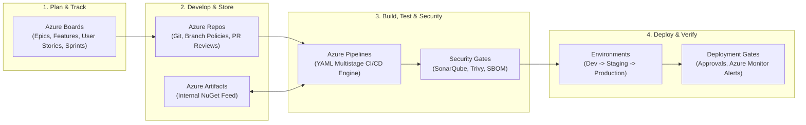
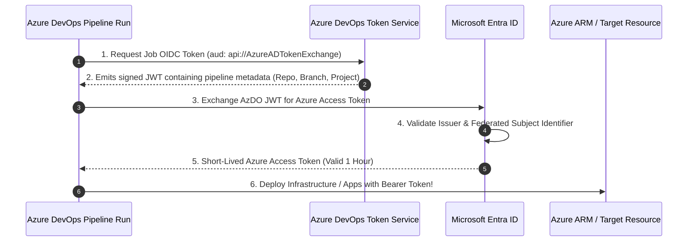
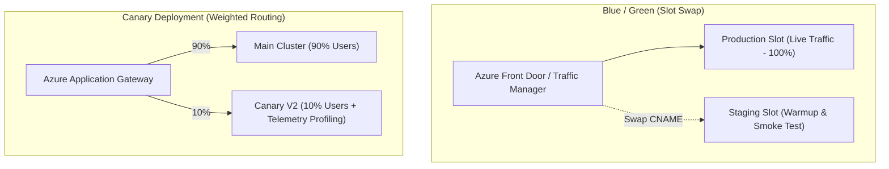

# Module 36: Azure DevOps, GitOps & Enterprise CI/CD Pipeline Architecture

---

## 1. Executive Summary & Core Value Proposition

**Azure DevOps** is Microsoft’s end-to-end enterprise Application Lifecycle Management (ALM) and DevOps platform. It provides a cohesive suite of services: **Azure Boards** (agile planning), **Azure Repos** (Git version control), **Azure Pipelines** (cross-platform CI/CD automation), **Azure Test Plans** (manual/exploratory testing), and **Azure Artifacts** (package hosting for NuGet, npm, Maven).

In enterprise cloud architecture, manual infrastructure deployments, developer workstation builds, and long-lived manual releases introduce human error, configuration drift, and catastrophic security vulnerabilities. Azure Pipelines enables **Automated GitOps, Continuous Integration, and Continuous Delivery (CI/CD)** via version-controlled YAML pipelines, automated security scanning, approval gates, and multi-stage cloud deployments.

---

## 2. Deep-Dive Cloud Architecture & Internal Mechanics

### 2.1 The Modern Azure DevOps Ecosystem



### 2.2 Agent Architecture: Microsoft-Hosted vs. Self-Hosted Agents

CI/CD pipelines require compute execution engines (Agents) to run builds, tests, and deployment commands:

| Architectural Metric | Microsoft-Hosted Agents | Self-Hosted VM / VMSS Agents | Containerized Agents (AKS / Docker) |
| :--- | :--- | :--- | :--- |
| **Maintenance & Patching** | 100% managed by Microsoft (Fresh VM per job) | Organization manages OS patching and tooling | Organization manages base Docker container |
| **Virtual Network Access** | ❌ Public internet only (Cannot reach private VNets) | ✅ **Native VNet Injection** (Access private databases & Key Vaults) | ✅ **Native VNet Injection** (Access private endpoints) |
| **Build Caching & Speed** | Ephemeral; clean disk every time; slower builds | Persistent disk caches (Faster `dotnet restore`) | Ephemeral or volume-mounted caching |
| **Concurrency & Cost** | Billed per parallel job minute | Billed for underlying Azure VM compute / VMSS | Highly efficient resource utilization on AKS |
| **Best Scenario** | Open-source repos, public cloud deployments, SaaS CI | Enterprise private networks, on-premises deployments, strict compliance | Dynamic elastic scaling on existing Kubernetes clusters |

---

## 3. Workload Identity Federation (OIDC): Secretless Service Connections

Traditionally, Azure DevOps pipelines connected to Azure subscriptions using **Service Principal Client Secrets**. When secrets expired, deployments failed; when secrets leaked, Azure subscriptions were compromised.

Modern enterprise pipelines use **Workload Identity Federation (OIDC)** to connect to Azure **without storing any secrets**:



---

## 4. Production Multi-Stage YAML Pipeline (`azure-pipelines.yml`)

This production-grade pipeline demonstrates:
1. Multi-stage deployment: **Build -> Deploy to Staging -> Manual Approval -> Deploy to Production**.
2. Workload Identity Federation (Secretless ARM Service Connection).
3. Software Bill of Materials (SBOM) generation & unit test reporting.
4. Deployment to Azure App Service using deployment slots (Zero Downtime).

```yaml
trigger:
  branches:
    include:
      - main

pool:
  vmImage: 'ubuntu-latest'

variables:
  buildConfiguration: 'Release'
  dotnetVersion: '8.0.x'
  azureServiceConnection: 'sc-azure-workload-identity' # OIDC Secretless Connection
  webAppName: 'app-enterprise-api-prod'

stages:
  # ==========================================
  # STAGE 1: Continuous Integration (CI)
  # ==========================================
  - stage: BuildAndTest
    displayName: 'Build, Test & Package'
    jobs:
      - job: Compile
        displayName: 'Compile .NET 8 Solution'
        steps:
          - task: UseDotNet@2
            displayName: 'Install .NET SDK $(dotnetVersion)'
            inputs:
              packageType: 'sdk'
              version: '$(dotnetVersion)'

          - task: DotNetCoreCLI@2
            displayName: 'Restore NuGet Packages'
            inputs:
              command: 'restore'
              projects: '**/*.sln'

          - task: DotNetCoreCLI@2
            displayName: 'Build Solution ($(buildConfiguration))'
            inputs:
              command: 'build'
              projects: '**/*.sln'
              arguments: '--configuration $(buildConfiguration) --no-restore'

          - task: DotNetCoreCLI@2
            displayName: 'Execute Automated Tests'
            inputs:
              command: 'test'
              projects: '**/*[Tt]ests/*.csproj'
              arguments: '--configuration $(buildConfiguration) --no-build --collect "Code Coverage"'

          - task: DotNetCoreCLI@2
            displayName: 'Publish Web API Artifacts'
            inputs:
              command: 'publish'
              publishWebProjects: true
              arguments: '--configuration $(buildConfiguration) --output $(Build.ArtifactStagingDirectory)'
              zipAfterPublish: true

          - task: PublishBuildArtifacts@1
            displayName: 'Upload Artifact to Pipeline Drop'
            inputs:
              PathtoPublish: '$(Build.ArtifactStagingDirectory)'
              ArtifactName: 'drop'

  # ==========================================
  # STAGE 2: Deploy to Staging Slot
  # ==========================================
  - stage: DeployStaging
    displayName: 'Deploy to Staging Environment'
    dependsOn: BuildAndTest
    jobs:
      - deployment: DeployStagingJob
        environment: 'staging'
        strategy:
          runOnce:
            deploy:
              steps:
                - task: AzureWebApp@1
                  displayName: 'Deploy Package to App Service (Staging Slot)'
                  inputs:
                    azureSubscription: '$(azureServiceConnection)'
                    appType: 'webAppLinux'
                    appName: '$(webAppName)'
                    deployToSlotOrASE: true
                    resourceGroupName: 'rg-enterprise-prod'
                    slotName: 'staging'
                    package: '$(Pipeline.Workspace)/drop/*.zip'

  # ==========================================
  # STAGE 3: Production Swap (With Approval Gate)
  # ==========================================
  - stage: DeployProduction
    displayName: 'Production Slot Swap'
    dependsOn: DeployStaging
    jobs:
      - deployment: SwapProductionJob
        environment: 'production' # Configured with Business Hours Approvals & Health Gates
        strategy:
          runOnce:
            deploy:
              steps:
                - task: AzureAppServiceManage@0
                  displayName: 'Zero-Downtime Slot Swap (Staging -> Production)'
                  inputs:
                    azureSubscription: '$(azureServiceConnection)'
                    Action: 'Swap Slots'
                    WebAppName: '$(webAppName)'
                    ResourceGroupName: 'rg-enterprise-prod'
                    SourceSlot: 'staging'
```

---

## 5. Deployment Strategies: Blue/Green vs. Canary vs. Rolling



---

## 6. Cost Traps, Scalability Bottlenecks & Security Anti-Patterns

1. **The Long-Lived Client Secret Catastrophe**:
   - *Trap*: Using static Service Principal client secrets inside Service Connections. Secrets expire unexpectedly or get committed into source control, granting adversaries full Contributor access to production subscriptions.
   - *Mitigation*: Mandate **Workload Identity Federation (OIDC)** across all Azure DevOps service connections.
2. **Missing Build Artifact Caching**:
   - *Trap*: Running `dotnet restore` from scratch on every build step across large multi-project repositories, pulling hundreds of packages over public NuGet and blowing past build minute quotas.
   - *Mitigation*: Implement the `Cache@2` task to cache `~/.nuget/packages` keyed by `**/packages.lock.json`.
3. **Deploying Directly to Production without Warm-Up**:
   - *Trap*: Overwriting production files directly on live compute instances (`in-place deployment`). Users experience HTTP 502/503 errors during file replacement and high latency while JIT compilation warms up.
   - *Mitigation*: Mandate **Deployment Slots**. Deploy to a staging slot, execute automated HTTP health checks to trigger JIT pre-compilation, and perform an instant DNS swap.

---

## 7. Principal Cloud Architect Interview Scenarios

### Q1: "How do you implement a compliance-enforced CI/CD governance model ensuring developers cannot bypass code reviews or deploy unapproved code directly to Production?"
**Architect Answer**:
> "I enforce a multi-layered **Zero-Trust Governance Model**:
> 1. **Branch Policies in Azure Repos**: Protect the `main` branch by enforcing minimum reviewer approvals (e.g., 2 senior engineers), mandating linked work items, and blocking PR completion until the CI build succeeds.
> 2. **Azure DevOps Environments & Approval Gates**: The `production` environment requires mandatory manual approvals from release managers and automated **Deployment Gates** (e.g., querying Azure Monitor alerts and checking that error rate is `< 0.01%`).
> 3. **Azure RBAC Permissions**: Developers are granted `Reader` access on production resource groups; only the pipeline's federated service principal has deployment permissions.
> 4. **Pipeline Execution Guardrails**: Restrict production service connections strictly to protected branches (`refs/heads/main`), preventing rogue feature branches from triggering production deployments."

### Q2: "What is the architectural difference between Classic Release Pipelines and YAML Multi-Stage Pipelines in Azure DevOps?"
**Architect Answer**:
> "**Classic Release Pipelines** are configured via a graphical UI and stored as opaque JSON metadata outside the source repository:
> - They lack version control, code review history, and pull request validation.
> - They create severe configuration drift between source code branches and release steps.
> 
> **YAML Multi-Stage Pipelines** implement **Pipeline as Code**:
> - The entire CI and CD pipeline definition resides in `azure-pipelines.yml` inside the Git repository.
> - Pipelines are version-controlled, branchable, testable, and reviewed via standard Pull Requests.
> - Teams can leverage reusable modular templates (`templates/`) across multiple repositories to enforce enterprise security standards globally."
