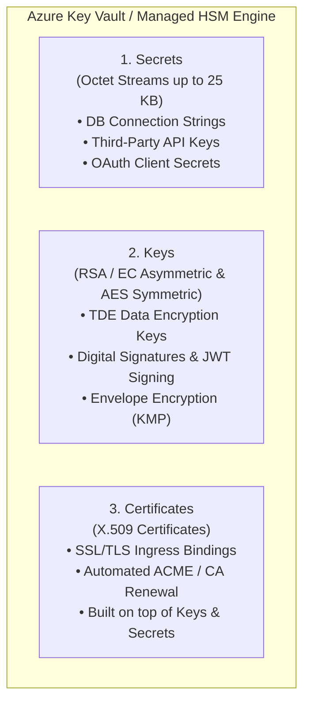
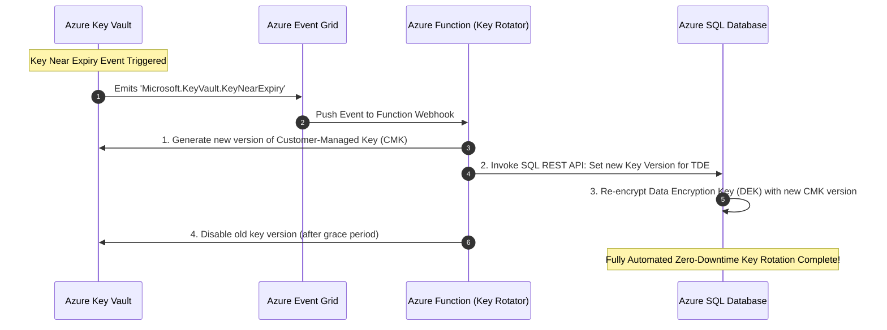

# Module 37: Azure Key Vault, Managed HSM & Cloud Cryptographic Architecture

> **Curriculum Navigation:**  
> ⏪ [Previous: Module 36 – Azure DevOps, GitOps & CI/CD Pipelines](./36_azure_devops_ci_cd.md) | 🏠 [Master Index](./README.md) | 🏁 [Curriculum Completed]

---

## 1. Executive Summary & Core Value Proposition

**Azure Key Vault** is a cloud-hosted hardware security module (HSM) and cryptographic management service. It safeguards sensitive cryptographic keys, secrets (connection strings, passwords, API tokens), and X.509 certificates used by cloud applications and services.

In modern enterprise architectures, hardcoding secrets in source code, configuration files, or environment variables is one of the most common causes of massive enterprise security breaches. Azure Key Vault provides:
1. **Centralized Secret Management**: A single secure vault for managing access, versioning, auditing, and revocation.
2. **Hardware Security Module (HSM) Protection**: Keys are protected by FIPS 140-validated cryptographic hardware, guaranteeing that plaintext private keys are never exposed in software memory or to Microsoft personnel.
3. **Seamless Zero-Trust Identity Integration**: Cloud services authenticate to Key Vault passwordlessly via **Microsoft Entra ID Managed Identities** and Azure RBAC.

---

## 2. Deep-Dive Cloud Architecture & Internal Mechanics

### 2.1 The Three Core Object Types: Secrets vs. Keys vs. Certificates



1. **Secrets**: Arbitrary byte arrays up to 25 KB stored as encrypted strings with versioning. Applications retrieve the raw secret value over HTTPS using authorized Entra ID tokens.
2. **Keys**: Cryptographic keys (RSA 2048/3072/4096-bit, Elliptic Curve P-256/P-384, or AES 128/256-bit). **Key Vault never exports the private key**. Cryptographic operations (signing, verification, encryption, decryption) are performed *inside the Key Vault HSM*.
3. **Certificates**: X.509 certificate management built on top of Keys and Secrets. Automates issuance, renewal, and binding with integrated Certificate Authorities (DigiCert, GlobalSign, or custom internal PKI).

---

## 3. Tier & Security Boundary Decision Matrix: Standard vs. Premium vs. Managed HSM

| Architectural Dimension | Standard Key Vault | Premium Key Vault | Azure Managed HSM |
| :--- | :--- | :--- | :--- |
| **FIPS 140 Validation** | FIPS 140-2 Level 2 (Software Protected) | FIPS 140-2 Level 2 (Secrets) & Level 3 (HSM Keys) | **FIPS 140-2 Level 3** (100% Hardware Isolated) |
| **Multi-Tenancy** | Multi-tenant shared infrastructure | Multi-tenant shared infrastructure with HSM partition | **Single-Tenant Dedicated HSM Cluster** |
| **Supported Key Types** | Software Keys (RSA, EC) | Software + HSM-protected Keys (RSA-HSM, EC-HSM) | Hardware Keys (RSA-HSM, EC-HSM, AES Symmetric) |
| **Cryptographic Operations** | Software-based cryptographic acceleration | HSM hardware acceleration | Dedicated hardware cryptographic acceleration |
| **Throughput & Limits** | 2,000 transactions per 10 seconds per vault | 2,000 transactions per 10 seconds per vault | **Thousands of operations per second** per pool |
| **Security Domain** | Managed by Microsoft | Managed by Microsoft | **Customer-Managed Security Domain** (Custody of recovery keys) |
| **Cost Profile** | Pay-per-transaction (~$0.03 per 10k ops) | Pay-per-transaction + HSM key fee ($1/key/month) | Fixed monthly cluster fee (~$3,000 - $4,500/month) |
| **Best Scenario** | General enterprise apps, web apps, microservices | Financial apps requiring HSM key attestation | Top-tier banking, payment gateways (PCI-DSS Level 1), sovereign cloud |

---

## 4. Production .NET 8 Implementation & Infrastructure as Code (IaC)

### 4.1 Production .NET 8 Secret Retrieval with Resilient Caching

In production, applications must **never** call `GetSecretAsync()` on every incoming HTTP request. Key Vault enforces strict throttling (HTTP 429). Applications must leverage in-memory caching and `DefaultAzureCredential`.

#### `Program.cs`
```csharp
using Azure.Identity;
using Azure.Security.KeyVault.Secrets;
using Microsoft.Extensions.Caching.Memory;

var builder = WebApplication.CreateBuilder(args);

// Register Key Vault Secret Client as a Singleton with DefaultAzureCredential
var keyVaultUrl = new Uri(builder.Configuration["KeyVault:VaultUri"]!);
builder.Services.AddSingleton(new SecretClient(keyVaultUrl, new DefaultAzureCredential()));

// Register Caching Secret Service
builder.Services.AddMemoryCache();
builder.Services.AddSingleton<ISecretManager, ResilientSecretManager>();

var app = builder.Build();

app.MapGet("/api/v1/health/gateway", async (ISecretManager secretManager) =>
{
    var apiKey = await secretManager.GetSecretCachedAsync("StripePaymentApiKey");
    return Results.Ok(new { Status = "Gateway Key Available", KeyLength = apiKey.Length });
});

app.Run();

public interface ISecretManager
{
    Task<string> GetSecretCachedAsync(string secretName);
}

public class ResilientSecretManager : ISecretManager
{
    private readonly SecretClient _client;
    private readonly IMemoryCache _cache;
    private readonly ILogger<ResilientSecretManager> _logger;

    public ResilientSecretManager(SecretClient client, IMemoryCache cache, ILogger<ResilientSecretManager> logger)
    {
        _client = client;
        _cache = cache;
        _logger = logger;
    }

    public async Task<string> GetSecretCachedAsync(string secretName)
    {
        return await _cache.GetOrCreateAsync(secretName, async entry =>
        {
            // Cache secret for 30 minutes to eliminate Key Vault transaction overhead
            entry.AbsoluteExpirationRelativeToNow = TimeSpan.FromMinutes(30);
            
            _logger.LogInformation("Fetching fresh secret '{SecretName}' from Azure Key Vault...", secretName);
            KeyVaultSecret secret = await _client.GetSecretAsync(secretName);
            return secret.Value;
        }) ?? throw new InvalidOperationException($"Secret '{secretName}' could not be resolved.");
    }
}
```

### 4.2 Key Vault References in Azure App Service / Azure Functions

The most elegant architectural pattern for App Service and Azure Functions avoids writing any C# Key Vault client code. You reference secrets directly in Application Settings:

```
@Microsoft.KeyVault(VaultName=kv-corp-prod;SecretName=DatabaseConnectionString)
```

The Azure App Service platform automatically fetches the secret using the app's **System-Assigned Managed Identity** and injects it as an environment variable at container startup.

### 4.3 Infrastructure as Code: Azure Key Vault with Azure RBAC & Private Endpoint (Bicep)

```bicep
param vaultName string = 'kv-enterprise-prod'
param location string = resourceGroup().location
param vnetSubnetId string

// 1. Azure Key Vault configured with Azure RBAC (Modern Standard)
resource keyVault 'Microsoft.KeyVault/vaults@2023-07-01' = {
  name: vaultName
  location: location
  properties: {
    sku: {
      family: 'A'
      name: 'standard'
    }
    tenantId: subscription().tenantId
    enableRbacAuthorization: true // RBAC enabled, legacy access policies disabled
    enableSoftDelete: true
    softDeleteRetentionInDays: 90
    enablePurgeProtection: true // Prevents immediate accidental or malicious deletion
    publicNetworkAccess: 'Disabled' // Zero Public Internet Exposure
    networkAcls: {
      bypass: 'AzureServices'
      defaultAction: 'Deny'
    }
  }
}

// 2. Private Endpoint inside Corporate Subnet
resource privateEndpoint 'Microsoft.Network/privateEndpoints@2023-05-01' = {
  name: '${vaultName}-pe'
  location: location
  properties: {
    subnet: {
      id: vnetSubnetId
    }
    privateLinkServiceConnections: [
      {
        name: '${vaultName}-plink'
        properties: {
          privateLinkServiceId: keyVault.id
          groupIds: [
            'vault'
          ]
        }
      }
    ]
  }
}
```

---

## 5. Automated Cryptographic Key Rotation Architecture



---

## 6. Cost Traps, Scalability Bottlenecks & Security Anti-Patterns

1. **Key Vault Request Throttling (HTTP 429)**:
   - *Trap*: A high-throughput microservice queries Key Vault on every single incoming user transaction. The vault reaches its 2,000 transactions/10 seconds limit and begins returning HTTP 429 Too Many Requests, causing widespread system outages.
   - *Mitigation*: Implement in-memory caching with a 15 to 30-minute TTL or leverage native **App Service Key Vault References**.
2. **Missing Purge Protection (Ransomware Vulnerability)**:
   - *Trap*: A malicious actor or compromised admin account deletes the Key Vault. If **Purge Protection** is disabled, the attacker calls `Purge Deleted Vault`, permanently obliterating all cryptographic keys and leaving encrypted databases permanently unrecoverable.
   - *Mitigation*: Enable both `enableSoftDelete: true` and `enablePurgeProtection: true`. Once enabled, a deleted vault cannot be purged until the retention period (90 days) elapses.
3. **Legacy Vault Access Policies vs. Azure RBAC**:
   - *Trap*: Using legacy Access Policies grants coarse, vault-wide permissions (e.g., granting "Get Secret" allows reading *every single secret* in the entire vault).
   - *Mitigation*: Enable **Azure RBAC Authorization** (`enableRbacAuthorization: true`). RBAC allows fine-grained role assignments (e.g., `Key Vault Secrets User`) scoped to an individual secret object.

---

## 7. Principal Cloud Architect Interview Scenarios

### Q1: "How does Envelope Encryption work in Azure Key Vault, and why do cloud databases use Envelope Encryption instead of encrypting table data directly with Key Vault keys?"
**Architect Answer**:
> "**Envelope Encryption** is a two-tiered cryptographic hierarchy:
> 1. **Data Encryption Key (DEK)**: A symmetric AES-256 key generated locally by the database engine (e.g., Azure SQL or Cosmos DB). The DEK encrypts the actual database pages at wire speed with sub-millisecond latency.
> 2. **Key Encryption Key (KEK)**: An asymmetric RSA or EC key stored securely inside Azure Key Vault (the Customer-Managed Key).
> 
> **Why we use this pattern**:
> - Encrypting gigabytes of raw database rows directly through Key Vault would be catastrophic for network latency and exceed Key Vault transaction limits within seconds.
> - Instead, the database engine sends the small 256-bit DEK to Key Vault once during startup to be wrapped (encrypted) by the KEK.
> - The encrypted DEK is stored alongside the database data.
> - In-memory encryption operations use the fast local DEK. If the KEK is revoked in Key Vault, the database can no longer decrypt the DEK, instantly locking down all data."

### Q2: "What is the difference between Soft Delete and Purge Protection, and can an Azure Subscription Owner purge a Key Vault when Purge Protection is active?"
**Architect Answer**:
> "- **Soft Delete** ensures that when a Key Vault or cryptographic object is deleted, it is not erased from disk immediately. Instead, it enters a transitional 'soft-deleted' state for a configurable retention window (7 to 90 days), during which it can be fully recovered.
> - **Purge Protection** is a mandatory security enforcement layer built on top of Soft Delete. When active, **nobody—not even the Subscription Owner or Microsoft Support—can permanently purge the vault** before the retention period expires.
> - This provides critical defense against insider threats, credential compromise, and ransomware attacks."
