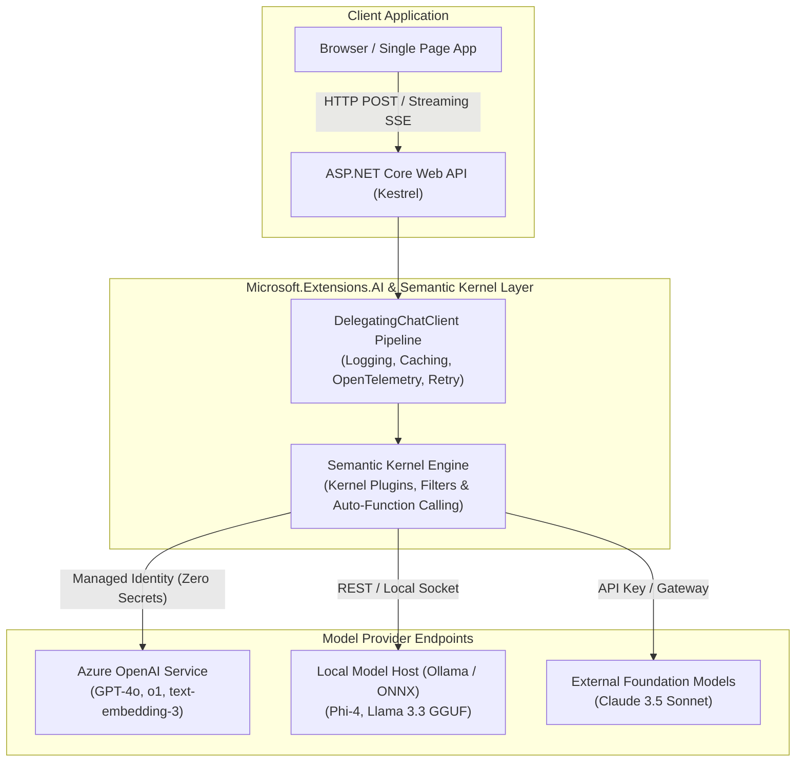
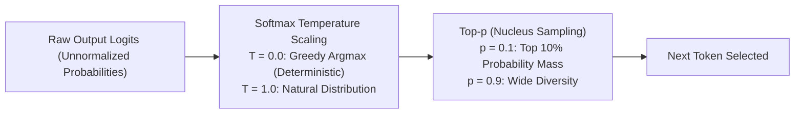

# Section 38: AI Engineering: LLM Fundamentals & .NET AI Stack


> **Curriculum Navigation:**  
> ⏪ [Previous: Section 37 – Azure DevOps, GitOps & CI/CD Pipelines](./370_azure_devops_ci_cd.md) | 🏠 [Master Index](./README.md) | ⏩ [Next: Section 39 – AI Engineering: RAG, Vector Search, Agents & MCP](./390_ai_rag_vector_search_and_agents_mcp.md)

---


## 1. Executive Summary & Senior Interview Mindset (2026 Edition)

In modern enterprise software engineering, **AI is not a novelty; it is a core system capability**. Interviewers assessing senior, lead, and architect .NET engineers do not care if you can write a superficial prompt in ChatGPT. They test your mastery of:
1. **Runtime Mechanics & Cost Governance**: Token budget math, Key-Value (KV) cache reuse, model latency, and rate limits (HTTP 429).
2. **Determinism & Structural Integrity**: Constraining stochastic LLMs to output strict, compile-time type-safe JSON schemas.
3. **Architecture Abstractions**: Leveraging Microsoft's native libraries—**`Microsoft.Extensions.AI`** and **Semantic Kernel**—to decouple enterprise business logic from underlying foundational model providers.
4. **Cloud & Local Hybrid Deployment**: Deploying enterprise workloads across Azure OpenAI, .NET Aspire, and on-premises local SLMs (Phi-4, Ollama, ONNX Runtime).



---

## 2. LLM Core Fundamentals: Mechanics, Sampling & Representation

### 2.1 Tokens, Tokenizers & Byte-Pair Encoding (BPE)

- **What is a Token?**: Large Language Models do not process raw words, letters, or ASCII codes. Text is converted into integers via **Byte-Pair Encoding (BPE)** tokenizers (such as OpenAI's `cl100k_base` or `o200k_base`).
- **Rule of Thumb**: In English text, **1,000 tokens $\approx$ 750 words**. In code (C#, JSON, SQL), whitespace, punctuation, and camelCase syntax significantly inflate token counts:
  - `public async Task<IActionResult>` can consume 7–10 tokens.
- **Developer Impact**: Every API call costs money per input (prompt) and output (completion) token. Memory usage in LLM servers is strictly bound to token sequence lengths.

---

### 2.2 Context Windows, KV Caching & "Lost in the Middle"

- **Context Window**: The maximum total tokens (Input Prompt + Output Generation) the model can process in a single forward pass (e.g., 128,000 tokens for GPT-4o).
- **KV Cache (Key-Value Cache)**: During generation, self-attention keys and values for preceding tokens are cached in GPU VRAM to avoid recalculating past tokens at each step.
  - *Prompt Caching*: Modern endpoints (Azure OpenAI, Anthropic) automatically detect identical prompt prefixes (e.g., static system instructions) and discount input costs by up to 50–80% with near-zero latency.
- **The "Lost in the Middle" Phenomenon**: LLM attention weights are highest at the very beginning and very end of long prompts. Critical instructions placed in the middle of a 50k-token prompt are frequently ignored or misconstrued.

---

### 2.3 Sampling Controls: Temperature, Top-p & Top-k



| Parameter | Function | Value for Enterprise C# Coding / Structured JSON | Value for Creative Writing / Brainstorming |
| :--- | :--- | :--- | :--- |
| **Temperature ($T$)** | Divides logits before Softmax. $T=0$ collapses distribution to greedy maximum likelihood (deterministic). | **0.0 to 0.2** (Strict factual answers, zero variation) | **0.7 to 1.0** (Creative diversity, varied phrasing) |
| **Top-p (Nucleus)** | Restricts sampling pool to the smallest set of tokens whose cumulative probability exceeds $p$. | **0.1 to 0.2** | **0.9 to 0.95** |

> [!TIP]
> Never tune *both* Temperature and Top-p simultaneously in production. Fix `Top-p = 1.0` and vary `Temperature`, or vice versa, to maintain predictable behavior.

---

### 2.4 Hallucinations: Causes, Detection & Grounding

- **Root Cause**: LLMs are autoregressive probability distributions over token sequences; they lack internal truth-state or fact-checking engines. They generate mathematically plausible text, not guaranteed truth.
- **Mitigation Framework**:
  1. **Grounding (RAG)**: Never ask an LLM to recall private enterprise data from memory. Provide authoritative source documents in the prompt and instruct: *"Answer strictly from provided sources. If unknown, state 'Information not available in context'."*
  2. **Chain-of-Thought (CoT)**: Force the model to explain reasoning steps before outputting final answers.
  3. **Low Temperature**: Set `Temperature = 0.0`.

---

### 2.5 Vector Embeddings & Similarity Math

An embedding is a vector of floating-point numbers (e.g., 1,536 dimensions for `text-embedding-3-small`) representing the semantic meaning of text in multi-dimensional space.
- **Cosine Similarity**: Measures the cosine of the angle between two vectors $A$ and $B$:
$$\text{Cosine Similarity} = \frac{A \cdot B}{\|A\| \|B\|}$$
- Range: $-1.0$ (opposite) to $+1.0$ (identical meaning). In normalized embeddings, cosine similarity equals the Dot Product, which executes in nanoseconds on SIMD/AVX hardware!

---

### 2.6 Zero-Shot vs. Few-Shot vs. Fine-Tuning Decision Matrix

| Strategy | Definition | Latency & Cost | When to Use in Enterprise .NET |
| :--- | :--- | :--- | :--- |
| **Zero-Shot** | Providing only instructions without examples. | Lowest cost, fastest setup | Standard general queries, simple summarization. |
| **Few-Shot Prompting** | Providing 2 to 5 high-quality input/output exemplars in the prompt. | Moderate cost (uses extra input tokens) | Complex domain classification, specific JSON formatting requirements. |
| **Fine-Tuning (PEFT / LoRA)** | Training model weights on thousands of paired examples. | High upfront compute cost, ongoing hosted model cost | Specialized domain dialects (e.g., proprietary legal code, medical triage), custom tone, extreme latency reduction. |

---

### 2.7 Reasoning Models (o1, o3, DeepSeek-R1)

Unlike standard models that immediately output the first token, **Reasoning Models** perform *test-time compute scaling*:
- They generate internal hidden **Chain-of-Thought (CoT)** tokens before emitting user-visible answers.
- **Pros**: Drastically superior at advanced mathematics, algorithm design, distributed systems debugging, and complex code refactoring.
- **Cons**: High latency (often 5 to 30 seconds before first token), higher token consumption (hidden thinking tokens are billed), and cannot stream partial thinking tokens in standard configurations.

---

### 2.8 Reliable Structured Output: JSON Mode vs. Constrained Grammars

Early LLMs frequently broke JSON parsing with markdown backticks (````json`) or trailing commas.
- **Modern Structured Outputs (`json_schema`)**: The inference engine uses **Grammar-Based Constrained Decoding**. During token sampling, tokens that violate the target JSON schema are mathematically assigned probability zero.
- **Result in .NET**: Guaranteed 100% syntactically valid JSON matching your C# classes without regex cleanup or parse exceptions!

---

## 3. The Modern .NET AI Stack

### 3.1 `Microsoft.Extensions.AI` Architecture

Introduced in .NET 9, **`Microsoft.Extensions.AI`** is Microsoft’s official unified abstraction layer for AI integration in .NET:
- **`IChatClient`**: The core interface for conversational models.
- **`IEmbeddingGenerator<TInput, TEmbedding>`**: The core interface for vector embeddings.
- **Middleware Pipeline (`DelegatingChatClient`)**: Just like ASP.NET Core HTTP message handlers, AI requests flow through a chain of modular interceptors:
  - Caching middleware (`DistributedCacheChatClient`)
  - Logging and Telemetry (`OpenTelemetryChatClient`)
  - Automatic Function Invocation (`FunctionInvokingChatClient`)
  - Rate limiting & Resiliency (`PollyChatClient`)

---

### 3.2 Semantic Kernel: Kernel, Plugins, Functions & Filters

**Semantic Kernel (SK)** is Microsoft's enterprise agent orchestration framework:
1. **The `Kernel`**: The dependency injection container and execution coordinator.
2. **Plugins & Native Functions**: C# classes annotated with `[KernelFunction]` and `[Description]` attributes that the model can invoke autonomously.
3. **Kernel Filters**: Cross-cutting interceptors:
   - `IFunctionInvocationFilter`: Runs before/after any native function execution (security guards, audit logging).
   - `IPromptRenderFilter`: Inspects or mutates raw prompts before they are dispatched to the model.

---

### 3.3 Semantic Kernel vs. `Microsoft.Extensions.AI`

| Feature | `Microsoft.Extensions.AI` | Semantic Kernel |
| :--- | :--- | :--- |
| **Primary Focus** | Low-level unified provider abstraction & pipeline middleware | High-level agent orchestration, plugins, planning, and memory |
| **Relationship** | The foundational bedrock layer | Built on top of `Microsoft.Extensions.AI` (SK uses `IChatClient` internally) |
| **Recommendation** | Use for simple chat endpoints, RAG embeddings, or custom pipelines | Use for complex multi-tool agents, planning workflows, and prompt templates |

---

### 3.4 ML.NET vs. Generative LLMs

- **ML.NET**: Classical predictive machine learning running locally in-process on CPU/GPU. Zero network latency, zero per-token cost. Best for tabular data prediction, fraud scoring, demand forecasting, sentiment classification at 100,000 req/sec.
- **Generative LLMs**: Foundation models capable of unstructured reasoning, natural language synthesis, coding, and dynamic task planning.

---

### 3.5 Running Models Locally: Ollama, ONNX Runtime & Small Language Models (SLMs)

- **Small Language Models (SLMs)**: Models like Microsoft's **Phi-3.5** and **Phi-4** (3.8B to 14B parameters) match or exceed GPT-3.5 quality while running on commodity laptops or isolated on-premises servers.
- **Ollama**: Local containerized model runner exposing an OpenAI-compatible REST API.
- **ONNX Runtime GenAI**: Microsoft's ultra-optimized C++/.NET native engine running quantized (INT4) models directly on client hardware (DirectML on Windows, Metal on macOS).

---

## 4. Production-Ready Code Implementation

The following production code implements an enterprise-grade ASP.NET Core AI service using **`Microsoft.Extensions.AI`**, **Azure OpenAI**, **Managed Identity**, **Streaming Server-Sent Events (SSE)**, and **Guaranteed Structured Output**.

```csharp
using System;
using System.Collections.Generic;
using System.ComponentModel;
using System.Runtime.CompilerServices;
using System.Text.Json;
using System.Text.Json.Serialization;
using System.Threading;
using System.Threading.Tasks;
using Azure.Identity;
using Azure.AI.OpenAI;
using Microsoft.AspNetCore.Builder;
using Microsoft.AspNetCore.Http;
using Microsoft.Extensions.AI;
using Microsoft.Extensions.DependencyInjection;
using Microsoft.Extensions.Hosting;

namespace EnterpriseArchitecture.AI;

// ============================================================================
// 1. DOMAIN CONTRACTS: Structured Outputs via Strict JSON Schema
// ============================================================================
[Description("Security audit analysis and risk classification of an API endpoint.")]
public sealed record SecurityAuditReport(
    [property: JsonPropertyName("riskScore"), Description("Calculated risk score between 1 (safe) and 100 (critical).")]
    int RiskScore,

    [property: JsonPropertyName("vulnerabilities"), Description("Identified security vulnerabilities.")]
    List<string> Vulnerabilities,

    [property: JsonPropertyName("mitigationPlan"), Description("Concrete recommended remediation steps.")]
    string MitigationPlan
);

// ============================================================================
// 2. PRODUCTION SERVICE: Enterprise AI Service with MEAI
// ============================================================================
public interface IEnterpriseAiService
{
    IAsyncEnumerable<string> StreamAnalysisAsync(string prompt, CancellationToken ct = default);
    Task<SecurityAuditReport> GenerateAuditReportAsync(string codeSnippet, CancellationToken ct = default);
}

public sealed class EnterpriseAiService : IEnterpriseAiService
{
    private readonly IChatClient _chatClient;

    public EnterpriseAiService(IChatClient chatClient)
    {
        _chatClient = chatClient ?? throw new ArgumentNullException(nameof(chatClient));
    }

    // A. Streaming Response via Server-Sent Events (SSE)
    public async IAsyncEnumerable<string> StreamAnalysisAsync(
        string prompt, 
        [EnumeratorCancellation] CancellationToken ct = default)
    {
        var messages = new List<ChatMessage>
        {
            new(ChatRole.System, "You are a Principal Software Architect. Provide concise, expert guidance."),
            new(ChatRole.User, prompt)
        };

        var options = new ChatOptions
        {
            Temperature = 0.2f // Low temperature for factual guidance
        };

        await foreach (var update in _chatClient.CompleteStreamingAsync(messages, options, ct))
        {
            if (!string.IsNullOrEmpty(update.Text))
            {
                yield return update.Text;
            }
        }
    }

    // B. Guaranteed Type-Safe Structured Output
    public async Task<SecurityAuditReport> GenerateAuditReportAsync(string codeSnippet, CancellationToken ct = default)
    {
        var messages = new List<ChatMessage>
        {
            new(ChatRole.System, "You are an automated AppSec scanner. Analyze the provided C# code."),
            new(ChatRole.User, $"Audit this code snippet:\n```csharp\n{codeSnippet}\n```")
        };

        // Leverage JSON Schema-enforced structured generation
        var options = new ChatOptions
        {
            Temperature = 0.0f,
            ResponseFormat = ChatResponseFormat.ForJsonSchema(
                schema: AIJsonUtilities.CreateJsonSchema(typeof(SecurityAuditReport)),
                schemaName: "SecurityAuditReport")
        };

        ChatCompletion response = await _chatClient.CompleteAsync(messages, options, ct);
        
        string rawJson = response.Message.Text ?? throw new InvalidOperationException("Model returned empty response.");
        return JsonSerializer.Deserialize<SecurityAuditReport>(rawJson) 
               ?? throw new InvalidOperationException("Failed to deserialize structured audit report.");
    }
}

// ============================================================================
// 3. ASP.NET CORE PIPELINE BOOTSTRAP: Microsoft.Extensions.AI Pipeline
// ============================================================================
public static class AiHostBootstrapper
{
    public static WebApplication BuildAiApplication(string[] args)
    {
        var builder = WebApplication.CreateBuilder(args);

        string endpoint = builder.Configuration["AzureOpenAI:Endpoint"] 
            ?? "https://corp-openai.openai.azure.com/";
        string deployment = builder.Configuration["AzureOpenAI:Deployment"] ?? "gpt-4o";

        // Register Azure OpenAI Client with Managed Identity (Zero Secrets!)
        var azureClient = new AzureOpenAIClient(new Uri(endpoint), new DefaultAzureCredential());

        // Build Microsoft.Extensions.AI Middleware Pipeline
        IChatClient coreChatClient = azureClient.AsChatClient(deployment);

        IChatClient resilientPipeline = new ChatClientBuilder(coreChatClient)
            .UseOpenTelemetry() // Emit distributed traces (tokens, latency)
            .UseDistributedCache(new MemoryDistributedCacheChatClientStorage()) // Semantic / Exact caching
            .Build();

        builder.Services.AddSingleton<IChatClient>(resilientPipeline);
        builder.Services.AddSingleton<IEnterpriseAiService, EnterpriseAiService>();

        var app = builder.Build();

        // Streaming Server-Sent Events (SSE) Endpoint
        app.MapPost("/api/ai/stream", async (
            string query, 
            IEnterpriseAiService aiService, 
            HttpContext context, 
            CancellationToken ct) =>
        {
            context.Response.Headers.ContentType = "text/event-stream";
            context.Response.Headers.CacheControl = "no-cache";

            await foreach (string token in aiService.StreamAnalysisAsync(query, ct))
            {
                await context.Response.WriteAsync($"data: {token}\n\n", ct);
                await context.Response.Body.FlushAsync(ct);
            }
        });

        // Structured Audit Report Endpoint
        app.MapPost("/api/ai/audit", async (
            string code, 
            IEnterpriseAiService aiService, 
            CancellationToken ct) =>
        {
            SecurityAuditReport report = await aiService.GenerateAuditReportAsync(code, ct);
            return Results.Ok(report);
        });

        return app;
    }

    private sealed class MemoryDistributedCacheChatClientStorage : Microsoft.Extensions.Caching.Distributed.IDistributedCache
    {
        // Internal in-memory cache stub for pipeline demonstration
        public byte[]? Get(string key) => null;
        public Task<byte[]?> GetAsync(string key, CancellationToken token = default) => Task.FromResult<byte[]?>(null);
        public void Refresh(string key) { }
        public Task RefreshAsync(string key, CancellationToken token = default) => Task.CompletedTask;
        public void Remove(string key) { }
        public Task RemoveAsync(string key, CancellationToken token = default) => Task.CompletedTask;
        public void Set(string key, byte[] value, Microsoft.Extensions.Caching.Distributed.DistributedCacheEntryOptions options) { }
        public Task SetAsync(string key, byte[] value, Microsoft.Extensions.Caching.Distributed.DistributedCacheEntryOptions options, CancellationToken token = default) => Task.CompletedTask;
    }
}
```

---

## 5. Line-by-Line Code Walkthrough

| Line Range | Architectural Mechanism | Technical Consequence |
| :--- | :--- | :--- |
| **Line 21–29** | `SecurityAuditReport` record | The target data contract. Decorated with `[Description]` attributes that the underlying inference engine uses to create the JSON Schema definition. |
| **Line 63–76** | `CompleteStreamingAsync` | Implements true token streaming via `IAsyncEnumerable<string>`. Tokens are yielded the instant they are generated by the model, slashing Perceived Latency from 8 seconds to 300ms. |
| **Line 90–97** | `ChatResponseFormat.ForJsonSchema` | Activates **Constrained Grammar Decoding**. The Azure OpenAI inference engine mathematically forces output to adhere to the generated JSON schema. |
| **Line 126–135** | `ChatClientBuilder` pipeline | Configures modular middleware: `UseOpenTelemetry()` captures standard W3C traces, while caching middleware skips model execution entirely on repeated queries. |
| **Line 144–154** | `text/event-stream` & `FlushAsync` | Standard Server-Sent Events (SSE) protocol. Flushes each token chunk immediately over the HTTP socket directly to the web browser. |

---

## 6. Real-World Enterprise Use Case: Automated PR Security Gatekeeper

A cloud-native financial services platform runs 1,200 microservices. Developers submit 400 pull requests daily:
1. **The Challenge**: Human security architects cannot review 400 PRs daily without blocking delivery pipelines.
2. **The Production Architecture**:
   - Azure DevOps pipelines trigger an internal ASP.NET Core service on every PR.
   - The service extracts modified C# files and calls `GenerateAuditReportAsync()`.
   - Azure OpenAI runs with `Temperature = 0.0` and strict JSON schema output.
   - If `RiskScore > 75`, the service automatically posts inline comments on the PR and blocks merging via branch policy gates.
   - Result: 94% reduction in OWASP vulnerability leakage into production with zero increase in human architect headcount.

---

## 7. Common Pitfalls, Anti-Patterns & Failure Modes

1. **The Parsing Retry Anti-Pattern**:
   - *Failure*: Prompting the model with *"Return JSON"* without setting `ResponseFormat`, then catching `JsonException` and looping 3 times to ask the model to fix its JSON.
   - *Result*: Triple latency, tripled token cost, and frequent production outages.
   - *Fix*: Always use `ChatResponseFormat.ForJsonSchema(...)`.
2. **Buffering Streaming Responses in the Controller**:
   - *Failure*: Calling a streaming API but accumulating all tokens into a `StringBuilder` before returning `Ok(sb.ToString())`.
   - *Result*: Zero perceived latency benefit for users; identical to non-streaming calls.
   - *Fix*: Write chunks immediately using `text/event-stream` and `context.Response.Body.FlushAsync()`.
3. **Hardcoding AI Vendor SDKs Directly in Controllers**:
   - *Failure*: Instantiating `OpenAIClient` or `AnthropicClient` directly in endpoints.
   - *Fix*: Depend strictly on `Microsoft.Extensions.AI.IChatClient`. This enables swapping vendors (Azure OpenAI $\to$ Ollama $\to$ AWS Bedrock) via a single line in `Program.cs`.

---

## 8. Senior / Principal Architect Interview Follow-ups

### Q1: "How do you avoid vendor lock-in when building generative AI features into an enterprise .NET system?"
**Architect Response:**  
"To eliminate vendor lock-in:
1. **Rely on `Microsoft.Extensions.AI` (`IChatClient` & `IEmbeddingGenerator`)**: Build all business logic, services, and endpoints against these vendor-agnostic abstractions rather than vendor-specific SDK classes.
2. **Configuration-Driven Provider Factories**: Register the concrete implementation in `Program.cs` based on configuration (e.g., using `AzureOpenAIClient.AsChatClient()` for cloud production, and `OllamaChatClient` for local development or on-premises compliance).
3. **Prompt Portability**: Avoid model-specific prompt tricks. Use standard Markdown delimiters (`### Instruction`, `### Context`) and standard JSON schema contracts supported universally across all frontier models."

### Q2: "What is the Key-Value (KV) Cache, and why does Prompt Caching dramatically alter AI architecture economics?"
**Architect Response:**  
"In Transformer attention mechanisms, calculating the relationship between tokens requires Key ($K$) and Value ($V$) matrices. Because preceding tokens do not change during autoregressive generation, their $K$ and $V$ matrices are cached in GPU VRAM (the **KV Cache**).

**Architectural Economics**:
1. Without prompt caching, a 20,000-token system prompt and context document costs full compute on every single request.
2. Modern providers (Azure OpenAI, Anthropic) check the hash of incoming prompt prefixes against the KV Cache. When a match occurs, the model skips recalculation:
   - **Cost**: Input tokens drop by 50% to 80%.
   - **Time to First Token (TTFT)**: Latency drops from ~3 seconds to under 400 milliseconds.
3. *Architectural Best Practice*: Structure prompts hierarchically: place static system rules and shared context **at the very beginning** of the prompt, and place variable user queries **at the very end** to maximize KV cache hit rates."
