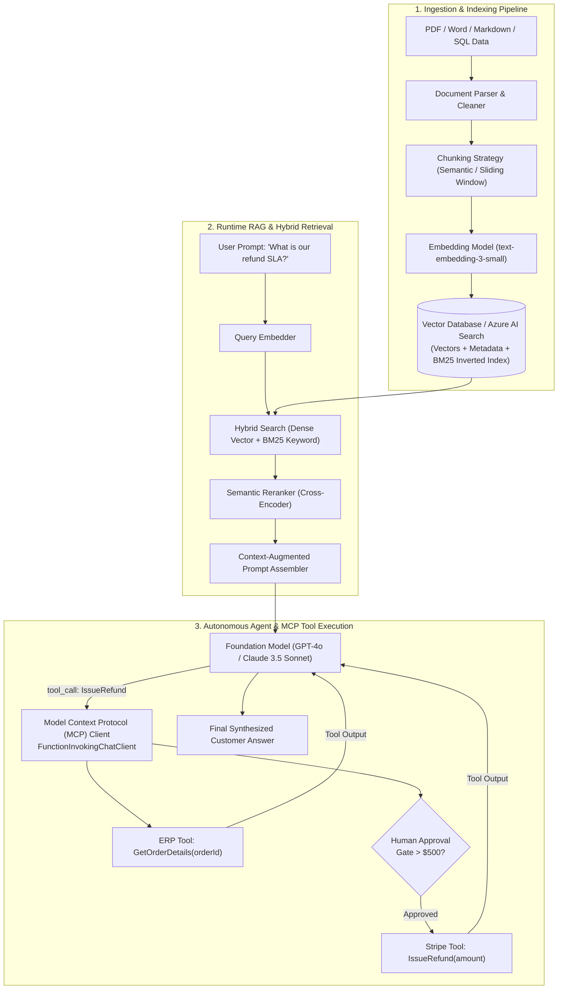
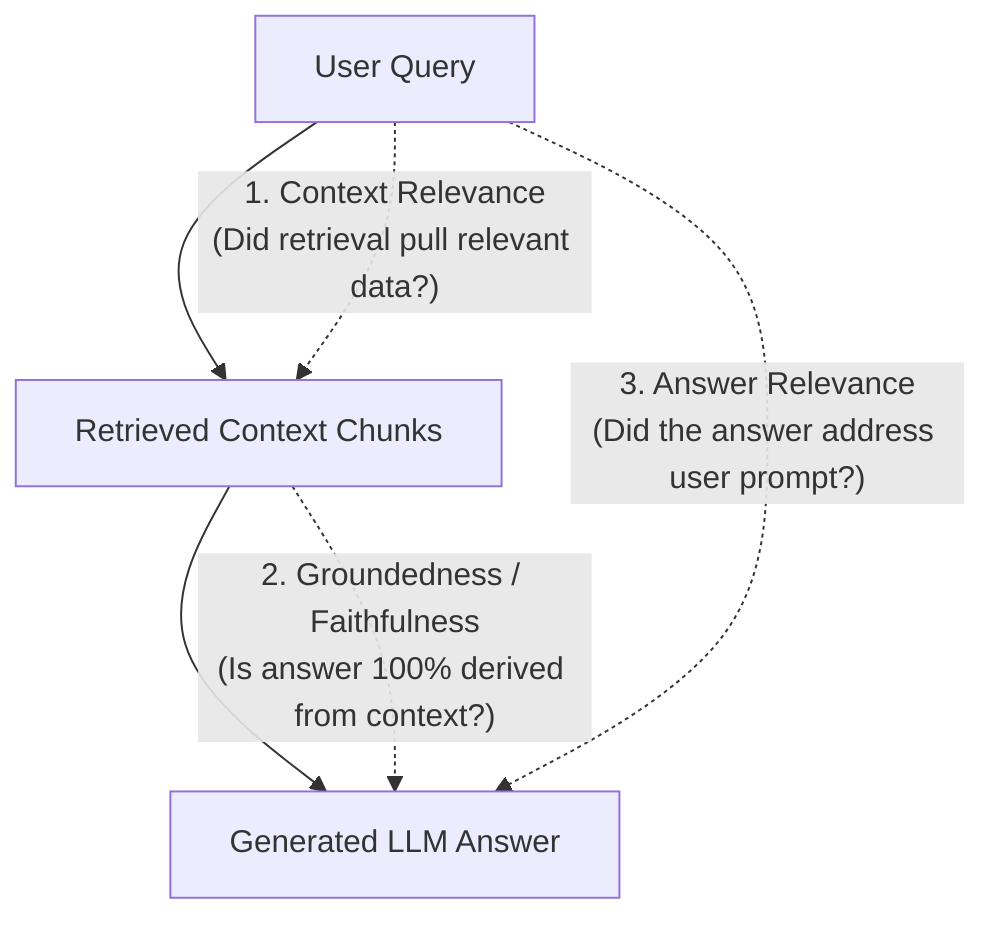

# Section 39: AI Engineering: RAG, Vector Search, Agents & MCP


> **Curriculum Navigation:**  
> ⏪ [Previous: Section 38 – AI Engineering: LLM Fundamentals & .NET AI Stack](./380_ai_engineering_llm_fundamentals_and_dotnet_stack.md) | 🏠 [Master Index](./README.md) | ⏩ [Next: Section 40 – AI Engineering: Production Architecture & UX](./400_ai_production_architecture_security_and_frontend_ux.md)

---


## 1. Executive Summary & Core Concept

**Retrieval-Augmented Generation (RAG)** and **Autonomous AI Agents** represent the two foundational pillars of enterprise generative AI:
- **RAG** grounds LLMs in dynamic, private, and verifiable enterprise knowledge bases, eliminating hallucinations and ensuring real-time data accuracy without expensive model fine-tuning.
- **AI Agents** move beyond text completion into autonomous goal execution using the **ReAct (Reasoning + Acting)** paradigm. Through tool calling and the open **Model Context Protocol (MCP)**, agents read enterprise databases, query APIs, perform calculations, and trigger business workflows under strict architectural guardrails.



---

## 2. RAG & Vector Search Architecture

### 2.1 RAG vs. Fine-Tuning: Architectural Decision Matrix

| Metric | Retrieval-Augmented Generation (RAG) | Model Fine-Tuning (LoRA / PEFT) |
| :--- | :--- | :--- |
| **Knowledge Freshness** | **Instantaneous**: Add or delete document chunks in the vector database with immediate effect. | **Stale**: Requires retraining, validation, and re-deployment pipelines to update facts. |
| **Hallucination Risk** | **Extremely Low**: Output is strictly grounded in retrieved citations. | **Moderate to High**: Models still invent facts plausibly. |
| **Access Control (Security)** | **Native**: Filter by tenant ID, user role, and document ACLs at retrieval time. | **Impossible**: Once knowledge is baked into model weights, all users can extract it. |
| **Compute Cost** | Low upfront cost; pay only for embedding and vector storage. | High GPU training and dedicated model hosting costs. |
| **Best Scenario** | Internal wikis, customer support, policies, live databases. | Custom domain tone/style, highly specialized syntax, low-latency classification. |

---

### 2.2 Chunking Strategies & Trade-offs

Chunking divides unstructured documents into discrete text passages before embedding:

1. **Fixed-Size Chunking (Character / Token)**: Splits text every $N$ tokens (e.g., 500 tokens) with a 10–20% sliding window overlap (50 tokens). Simple, but frequently splits sentences and destroys context across boundaries.
2. **Recursive Character Chunking**: Splits sequentially on double newlines (`\n\n`), single newlines (`\n`), and spaces (` `). Preserves paragraphs and logical sections.
3. **Markdown / Document-Aware Chunking**: Respects H1/H2/H3 headers, markdown tables, and code blocks. Essential for software documentation and technical manuals.
4. **Semantic Chunking**: Computes embedding vectors for adjacent sentences and calculates cosine distance. When semantic distance spikes above a threshold, a chunk boundary is placed. Produces the highest retrieval quality at higher ingestion compute cost.

---

### 2.3 Vector Databases in the .NET Ecosystem

| Vector Store | Hosting Model | Indexing Algorithms | .NET Integration | Best Scenario |
| :--- | :--- | :--- | :--- | :--- |
| **Azure AI Search** | Fully Managed Azure PaaS | HNSW (Hierarchical Navigable Small World), Vector + Lexical | `Azure.Search.Documents` | **Enterprise Azure Standard**: Hybrid search, semantic reranking, built-in security. |
| **PostgreSQL (`pgvector`)** | Self-Hosted / Managed (Azure Flexible Server) | HNSW, IVFFlat | `Npgsql` / Entity Framework Core | Existing PostgreSQL apps wanting to co-locate relational data and vectors. |
| **Qdrant** | Cloud / Docker Container | HNSW, Quantization (Scalar & Product) | Official `Qdrant.Client` gRPC SDK | High-throughput, low-latency standalone vector clustering. |
| **Milvus** | Distributed Kubernetes Cluster | HNSW, DiskANN, IVF_SQ8 | gRPC SDK | Massive scale (> 100M+ vectors). |

---

### 2.4 Hybrid Search & Reciprocal Rank Fusion (RRF)

Pure vector search struggles with exact keywords, part numbers, SKUs, and domain codes (e.g., `Error 0x80070002` or `SKU-99214-X`). **Hybrid Search** combines two complementary retrieval passes:
1. **Dense Vector Search**: Captures conceptual and semantic intent using cosine distance.
2. **Sparse Lexical Search (BM25)**: Matches exact keywords, acronyms, and codes using inverted indexes.
3. **Reciprocal Rank Fusion (RRF)**: Merges the two ranked lists without needing score normalization:

$$RRF(d) = \sum_{m \in M} \frac{1}{k + r_m(d)}$$

*(Where $r_m(d)$ is the rank of document $d$ in system $m$, and $k$ is a smoothing constant, typically 60).*

---

### 2.5 Semantic Reranking

After Hybrid Search retrieves the top 50 candidates, a **Semantic Reranker (Cross-Encoder)** analyzes the full query and document passage simultaneously through a specialized transformer model. Unlike bi-encoders (which compare separate vectors), cross-encoders capture deep token-level interactions, reordering the top 50 items to place the top 3–5 most relevant passages at the very top of the prompt.

---

### 2.6 Multi-Tenant Security Trimming

In enterprise SaaS, Tenant A must never see Tenant B’s data:
- **Pre-Filtering (Architectural Standard)**: Pass the user’s `tenant_id` and authorized `role_ids` directly into the vector database query filter (e.g., `$filter = "tenant_id eq 'tenant-42' and search.in(role, 'Admin,Finance')"`). The search engine restricts the vector graph traversal *only* to authorized nodes.
- **Post-Filtering (Anti-Pattern)**: Retrieving top 10 vectors globally and filtering in C# memory. If 9 out of 10 items belong to other tenants, the user is left with only 1 relevant result!

---

### 2.7 Measuring RAG Quality: The RAG Triad & RAGAS

To avoid subjective testing, enterprise RAG systems measure quality across the **RAG Triad**:



1. **Context Relevance**: Percentage of retrieved chunks directly relevant to the user query.
2. **Groundedness / Faithfulness**: Evaluates whether the generated claims can be inferred strictly from the retrieved context (detects hallucinations).
3. **Answer Relevance**: Evaluates whether the response directly answers the user's intent without rambling.

---

## 3. Function Calling, AI Agents & Model Context Protocol (MCP)

### 3.1 Function (Tool) Calling Internals

Function calling does **not** execute code on the LLM server:
1. The developer passes JSON Schema definitions of available C# tools to the model.
2. If the user prompt requires an external action, the model pauses text generation and returns a structured payload:
   `tool_calls: [{ "name": "GetOrderDetails", "arguments": "{\"orderId\": 4892}" }]`.
3. Your .NET application intercepts this, executes the real C# method, and sends the result back as a `tool` role message.
4. The LLM reads the tool output and synthesizes the final user-facing answer.

---

### 3.2 Automatic Tool Invocation in .NET

With **`Microsoft.Extensions.AI`**, you do not need manual parsing loops. The `FunctionInvokingChatClient` wraps your `IChatClient`, automatically detects `tool_calls`, invokes the designated C# methods via reflection, handles serialization, and loops until the model outputs a final completion!

---

### 3.3 Model Context Protocol (MCP) in .NET

The **Model Context Protocol (MCP)**, open-sourced by Anthropic, is an open standard that replaces fragmented tool calling with a unified, interoperable protocol:
- **Architecture**:
  - **MCP Host**: The application orchestrating LLMs (e.g., your ASP.NET Core service or Claude Desktop).
  - **MCP Client**: Maintains connections to MCP servers.
  - **MCP Server**: Lightweight, isolated microservices that expose **Tools** (executable functions), **Resources** (readable contextual data), and **Prompts** (pre-built templates).
- **Transport**: Communicates over standard JSON-RPC 2.0 via `STDIO` (local processes) or `SSE / HTTP` (remote web microservices).

---

### 3.4 Agent Safety & Human-in-the-Loop (HITL) Guardrails

Autonomous agents with write permissions must be governed by strict architectural guardrails:
1. **Read/Write Segregation**: Separate read-only query tools from state-mutating command tools.
2. **Two-Phase Confirmation (HITL Gate)**: Actions exceeding risk or monetary thresholds (e.g., `IssueRefund > $100` or `DropDatabaseTable`) return a pending confirmation token. The agent pauses execution until a human administrator approves the action via a dashboard or webhook.

---

## 4. Production-Ready Code Implementation

The following production implementation demonstrates:
1. Building an enterprise **Semantic Search & RAG Service** using `Microsoft.Extensions.AI`.
2. Configuring **Automatic Function Invocation** with native C# tools.
3. Implementing safety guardrails and multi-tenant security filters.

```csharp
using System;
using System.Collections.Generic;
using System.ComponentModel;
using System.Text.Json;
using System.Threading;
using System.Threading.Tasks;
using Microsoft.Extensions.AI;
using Microsoft.Extensions.DependencyInjection;

namespace EnterpriseArchitecture.AI.Agents;

// ============================================================================
// 1. TOOL DEFINITION: Enterprise Order Management Plugin
// ============================================================================
public interface IOrderManagementService
{
    Task<string> GetOrderStatusAsync(string orderId, CancellationToken ct);
    Task<string> RequestRefundAsync(string orderId, decimal amount, CancellationToken ct);
}

public sealed class OrderManagementTools
{
    private readonly IOrderManagementService _orderService;

    public OrderManagementTools(IOrderManagementService orderService)
    {
        _orderService = orderService ?? throw new ArgumentNullException(nameof(orderService));
    }

    [Description("Fetches the real-time fulfillment and tracking status of a customer order.")]
    public async Task<string> GetOrderStatus(
        [Description("The unique alphanumeric order identifier, e.g., ORD-9482")] string orderId,
        CancellationToken ct = default)
    {
        return await _orderService.GetOrderStatusAsync(orderId, ct);
    }

    [Description("Initiates an automated customer refund. Requires amount and order ID.")]
    public async Task<string> ProcessRefund(
        [Description("The unique order identifier.")] string orderId,
        [Description("The exact monetary refund amount in USD.")] decimal amount,
        CancellationToken ct = default)
    {
        // Safety Guardrail: Human-in-the-loop requirement
        if (amount > 200.00m)
        {
            return JsonSerializer.Serialize(new
            {
                status = "PENDING_HUMAN_APPROVAL",
                reason = "Refund amount exceeds $200.00 autonomous threshold. Routed to supervisory queue.",
                orderId,
                amount
            });
        }

        return await _orderService.RequestRefundAsync(orderId, amount, ct);
    }
}

// ============================================================================
// 2. PRODUCTION AGENT ORCHESTRATOR: RAG + Auto-Function Calling
// ============================================================================
public sealed class EnterpriseSupportAgent
{
    private readonly IChatClient _agentClient;

    public EnterpriseSupportAgent(IChatClient baseChatClient, OrderManagementTools tools)
    {
        // 1. Convert C# methods into AIFunction definitions
        AIFunction getStatusFunc = AIFunctionFactory.Create(tools.GetOrderStatus);
        AIFunction refundFunc = AIFunctionFactory.Create(tools.ProcessRefund);

        // 2. Wrap client with FunctionInvokingChatClient for autonomous loop execution
        _agentClient = new ChatClientBuilder(baseChatClient)
            .UseFunctionInvocation() // Automatic tool call execution pipeline
            .Build();

        // 3. Register available tools
        _availableTools = new List<AIFunction> { getStatusFunc, refundFunc };
    }

    private readonly List<AIFunction> _availableTools;

    public async Task<string> HandleCustomerInquiryAsync(
        string customerTenantId, 
        string userQuery, 
        string retrievedRagContext, 
        CancellationToken ct = default)
    {
        var messages = new List<ChatMessage>
        {
            new(ChatRole.System, $"""
                You are an enterprise AI customer support agent for Tenant: {customerTenantId}.
                Answer questions strictly using the provided context or by invoking available tools.
                Do not speculate. If an action requires human approval, inform the customer gracefully.

                ### Grounding RAG Knowledge Context:
                {retrievedRagContext}
                """),
            new(ChatRole.User, userQuery)
        };

        var chatOptions = new ChatOptions
        {
            Temperature = 0.1f, // Deterministic tool selection
            Tools = _availableTools
        };

        // CompleteAsync automatically runs the tool invocation loop until final text is ready!
        ChatCompletion response = await _agentClient.CompleteAsync(messages, chatOptions, ct);

        return response.Message.Text ?? "Unable to complete request.";
    }
}
```

---

## 5. Line-by-Line Code Walkthrough

| Line Range | Architectural Mechanism | Technical Consequence |
| :--- | :--- | :--- |
| **Line 28–34** | `[Description]` attributes | Supplies the LLM with semantic descriptions for the function and each parameter. The model uses this description to decide when and how to invoke the tool. |
| **Line 40–51** | `if (amount > 200.00m)` | **Safety Guardrail**: Autonomous monetary limit. Halts automatic refund execution if the value exceeds $200.00, returning a structured pending status for human review. |
| **Line 66–69** | `AIFunctionFactory.Create` | Generates reflection-based JSON Schemas from the C# methods, ensuring strict parameter typing (`string orderId`, `decimal amount`). |
| **Line 72–74** | `.UseFunctionInvocation()` | Injects the `FunctionInvokingChatClient` into the pipeline. Completely abstracts the multi-turn loop (detect tool call $\to$ execute method $\to$ submit tool result $\to$ get final answer). |
| **Line 105–109** | `Tools = _availableTools` | Publishes the tool schemas in the model request. If the user asks *"Where is my order ORD-123?"*, the model emits `GetOrderStatus(orderId: "ORD-123")` rather than hallucinating an answer. |

---

## 6. Real-World Enterprise Use Case: Multi-Tenant HR & IT Helpdesk

A Fortune 500 enterprise with 80,000 employees deploys an internal Helpdesk Agent across 12 business units:
1. **The Challenge**: Each business unit has private leave policies and payroll rules. Standard LLMs leak cross-departmental secrets.
2. **The Architecture**:
   - The user asks: *"How much paternity leave do I get, and what is my current vacation balance?"*
   - **RAG Step**: The system queries Azure AI Search with pre-filtering: `$filter = "business_unit eq 'Engineering' and geography eq 'US'"`. Only the US Engineering leave policy is retrieved.
   - **Tool Step**: The agent calls `GetEmployeeVacationBalance(employeeId: "E-9812")` through an internal Workday MCP Server.
   - **Synthesis**: The LLM combines the retrieved policy text (12 weeks paternity leave) with the live API tool output (15 days accrued vacation) into a single, personalized response.
   - Result: 85% first-contact resolution with zero cross-tenant data leakage.

---

## 7. Common Pitfalls, Anti-Patterns & Failure Modes

1. **The Naive Top-K Vector Trap**:
   - *Failure*: Setting `TopK = 3` in a simple vector search without hybrid or reranking.
   - *Result*: Critical context is missed if the exact keyword was phrased slightly differently, leading to hallucinated or incomplete answers.
   - *Fix*: Always use **Hybrid Search (BM25 + Dense Vectors) with Reciprocal Rank Fusion**, followed by a **Semantic Reranker**.
2. **Unconstrained Autonomous Tool Execution**:
   - *Failure*: Exposing destructive tools (`DeleteAccount`, `ExecuteSqlQuery`, `TransferFunds`) to an autonomous agent loop without approval gates.
   - *Result*: Malicious prompt injection or model hallucination can trigger irreversible data loss.
   - *Fix*: Enforce read-only tool scopes for general agents. Require two-phase human confirmation tokens for destructive actions.
3. **Context Window Exhaustion via Bloated Chunks**:
   - *Failure*: Storing 3,000-token chunks in the vector database and stuffing 10 chunks into the prompt (30,000 tokens).
   - *Result*: Extreme latency, astronomical token bills, and model degradation due to "lost in the middle".
   - *Fix*: Use focused 300–500 token chunks with 50-token overlap.

---

## 8. Senior / Principal Architect Interview Follow-ups

### Q1: "How do you enforce security trimming in a multi-tenant enterprise RAG system?"
**Architect Response:**  
"Security trimming must **never** be performed in application memory post-retrieval. It must be enforced at the search engine level using **Pre-Retrieval Metadata Filtering**:
1. When indexing document chunks, store authorization attributes in document metadata fields: `TenantId`, `DepartmentId`, and `AllowedUserAcls`.
2. At query time, extract the authenticated caller's identity and claims from their verified JWT (`ClaimsPrincipal`).
3. Construct a deterministic filter predicate passed into the vector search query:  
   `$filter = "TenantId eq 'T1' and (AllowedRoles/any(r: r eq 'Finance') or AllowedUsers/any(u: u eq 'john@corp.com'))"`.
4. The vector engine prunes search graph traversal to only permitted documents, guaranteeing that unauthorized chunks are mathematically impossible to retrieve, while preserving full Top-K density."

### Q2: "What is the Model Context Protocol (MCP), and why is it superior to custom REST tool integrations?"
**Architect Response:**  
"The Model Context Protocol (MCP) solves the $M \times N$ integration problem in generative AI:
- Previously, if you had $M$ client applications (web apps, IDEs, desktop agents) and $N$ data sources (GitHub, PostgreSQL, Jira, internal ERPs), you had to build $M \times N$ custom tool-calling wrappers.
- **MCP establishes a universal open standard**:
  1. Data sources and enterprise services expose an **MCP Server** implementing standard JSON-RPC contracts for Tools, Resources, and Prompts.
  2. Any AI agent or client implementing an **MCP Client** can instantly discover, inspect schemas, and invoke capabilities on that MCP server without writing custom integration code.
  3. It separates tool execution from application code, allowing tools to run in sandboxed, permission-controlled microservice containers with standardized logging, authentication, and transport."
