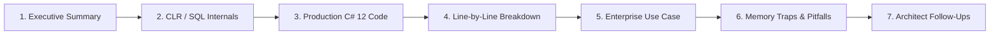

# .NET, C# & SQL Enterprise Mastery

[](https://dotnet.microsoft.com/)
[](https://learn.microsoft.com/en-us/dotnet/csharp/)
[](https://www.microsoft.com/en-us/sql-server/)
[](./25_solid_principles.md)
[](https://opensource.org/licenses/MIT)
[](https://github.com/)

> **The Definitive Encyclopedia, Practical Architectural Handbook, and Interview Compendium for .NET, C#, SQL Server, and Distributed Systems.**  
> Spanning **31 Specialized Modules**, **253 Rigorous Deep-Dive Questions**, and planned companion **Production Code Samples & Benchmark Suites**.

---

## 🌟 Overview & Pedagogical Standard

This repository is engineered to serve as a world-class, production-grade reference manual for software engineers ranging from junior developers to enterprise solutions architects. 

Rather than superficial one-line interview answers, every single topic is dissected through an unyielding **7-Part Architectural Framework**:



1. **Executive Summary & Core Concept**: Clear, intuitive, high-signal explanation.
2. **Deep-Dive Architecture & Runtime Internals**: Memory layout (Stack vs. Heap), CoreCLR execution, RyuJIT compilation, B-Tree index structures, or ASP.NET Core middleware pipelines.
3. **Production-Ready Code Implementation**: Modern C# 12 / .NET 8/9 / T-SQL code with strict nullability, defensive guards, DI, and asynchronous patterns.
4. **Line-by-Line Code Walkthrough**: Detailed mechanics of types, keywords, instructions, and memory boundaries.
5. **Real-World Enterprise Use Case**: Architecture patterns drawn from fintech, e-commerce, and high-scale cloud platforms.
6. **Common Pitfalls, Memory Traps & Anti-Patterns**: Hidden memory leaks, thread contention, boxing penalties, deadlocks, and Cartesian explosions.
7. **Senior / Architect Interview Follow-ups**: Edge cases, performance trade-offs, and high-signal responses expected in Principal / Staff / Architect interviews.

---

## 📚 Complete 31-Section Master Syllabus

| # | Module Title | Question Range | Topics Covered | Link |
| :-: | :--- | :---: | :--- | :---: |
| **01** | **Introduction – OOPS & Core Basics** | Q1 – Q10 | OOP Pillars, Class vs Object, Structs, Value vs Reference | [Module 01](./01_introduction_oops_and_basics.md) |
| **02** | **OOPS – Inheritance, Polymorphism & Abstraction** | Q11 – Q26 | Virtual/Override, New Shadowing, Multiple Inheritance, Sealed | [Module 02](./02_oops_inheritance_abstraction_encapsulation_polymorphism.md) |
| **03** | **OOPS – Abstract Classes & Interfaces** | Q27 – Q37 | Abstract vs Interface, Explicit Interface, Diamond Problem | [Module 03](./03_abstract_class_and_interface.md) |
| **04** | **Access Modifiers & Boxing/Unboxing** | Q38 – Q47 | Public/Private/Protected/Internal, Type Safety, Boxing Internals | [Module 04](./04_access_specifiers_boxing_unboxing.md) |
| **05** | **Control Flow & Exception Handling** | Q48 – Q56 | Loops, Jump Statements, Throw vs Throw ex, Custom Exceptions | [Module 05](./05_loops_conditions_exception_handling.md) |
| **06** | **Generics & High-Performance Collections** | Q57 – Q64 | Generics Constraints, List vs Array, Dictionary vs Hashtable | [Module 06](./06_generics_and_collections.md) |
| **07** | **Constructors & Object Lifecycle** | Q65 – Q76 | Static/Private Constructors, Constructor Chaining, Copy | [Module 07](./07_constructors.md) |
| **08** | **Method Parameters, Delegates & Events** | Q77 – Q88 | Ref, Out, In, Params, Multicast Delegates, Func/Action, Events | [Module 08](./08_method_parameters_delegates_and_events.md) |
| **09** | **Important C# Keywords & Modifiers** | Q89 – Q98 | this, using, is/as, readonly vs const, static, var vs dynamic, yield | [Module 09](./09_important_keywords.md) |
| **10** | **LINQ (Language Integrated Query)** | Q99 – Q102 | LINQ Architecture, Deferred Execution, Lambdas, FirstOrDefault | [Module 10](./10_linq.md) |
| **11** | **.NET Framework & CLR Internals** | Q103 – Q109 | CLR, Assemblies, GAC, Reflection, Serialization, Windows Services | [Module 11](./11_dotnet_framework_basics.md) |
| **12** | **Garbage Collection & Memory Management** | Q110 – Q114 | GC Generations (0/1/2), LOH/POH, Dispose vs Finalize | [Module 12](./12_dotnet_garbage_collection.md) |
| **13** | **Threading, Concurrency & Async/Await** | Q115 – Q119 | Process vs Thread, Tasks vs Threads, Async/Await State Machine | [Module 13](./13_dotnet_threading_and_concurrency.md) |
| **14** | **SQL Server Fundamentals & RDBMS** | Q120 – Q127 | DBMS vs RDBMS, Constraints, Primary vs Unique, Triggers, Views | [Module 14](./14_sql_basics.md) |
| **15** | **SQL Server Joins & Index Internals** | Q128 – Q136 | Inner/Outer/Self Joins, Clustered vs Non-Clustered B-Trees | [Module 15](./15_sql_joins_and_indexes.md) |
| **16** | **Stored Procedures, Functions & Transactions** | Q137 – Q145 | SP vs UDF, Cursors, CTEs, Delete vs Truncate, Nth Salary, ACID | [Module 16](./16_sql_stored_procedures_functions_and_more.md) |
| **17** | **ADO.NET & Entity Framework Core** | Q171 – Q181 | Connected vs Disconnected, EF Core Change Tracker, DbContext | [Module 17](./17_ado_dotnet_and_entity_framework.md) |
| **18** | **ASP.NET Core Web API Fundamentals** | Q182 – Q189 | RESTful Constraints, HTTP Verbs, Web API vs MVC, HttpClient | [Module 18](./18_web_api_basics.md) |
| **19** | **Web API Authentication & JWT Deep-Dive** | Q190 – Q196 | Basic Auth, API Key, JWT Architecture, ClaimsPrincipal | [Module 19](./19_web_api_authentication_and_jwt.md) |
| **20** | **Advanced Web API: ConNeg, Formatters & Testing** | Q197 – Q203 | WebApplicationFactory, ActionResult\<T\>, ConNeg, HTTP Codes | [Module 20](./20_web_api_advanced.md) |
| **21** | **.NET Core Architecture & Hosting Pipeline** | Q204 – Q212 | .NET Core vs .NET 5+, Program.cs, Request Pipeline, Metapackage | [Module 21](./21_dotnet_core_basics.md) |
| **22** | **.NET Core Dependency Injection** | Q213 – Q216 | IoC Container, Constructor Injection, Keyed Services, View DI | [Module 22](./22_dotnet_core_dependency_injection.md) |
| **23** | **Service Lifetimes, Middleware & Kestrel** | Q217 – Q224 | Transient/Scoped/Singleton, Custom Middleware, Kestrel vs IIS | [Module 23](./23_dotnet_core_service_lifetimes_middleware_hosting.md) |
| **24** | **Routing, Configuration, CORS & Caching** | Q225 – Q233 | Endpoint Routing, Static Files, Options Pattern, CORS, Distributed Cache | [Module 24](./24_dotnet_core_routing_files_cors_and_more.md) |
| **25** | **SOLID Principles & Clean Architecture** | Q234 – Q240 | Single Responsibility, Open-Closed, Liskov, ISP, DIP, DRY | [Module 25](./25_solid_principles.md) |
| **26** | **Design Patterns (GoF & Enterprise)** | Q241 – Q250 | Creational, Structural, Behavioral, Thread-Safe Singleton, Factories | [Module 26](./26_design_patterns.md) |
| **27** | **Array Algorithmic Challenges (Core Mechanics)** | Q251 – Q257 | Sum, Average, Min, Max, Second Largest (Single Pass O(N)) | [Module 27](./27_array_coding_problems.md) |
| **28** | **Array Algorithmic Challenges (Modular Functions)** | Q258 – Q262 | Equality Check, Sorted Check, Two-Pointer Sorted Merge, In-Place Removal | [Module 28](./28_array_coding_problems_using_functions.md) |
| **29** | **String Manipulation & Memory Allocation** | Q263 – Q266 | UTF-16 Code Units vs Runes vs Graphemes, Reversal, Palindrome | [Module 29](./29_string_coding_problems.md) |
| **30** | **String Algorithmic Challenges (Modular Functions)** | Q270 – Q271 | Longest Word, Whitespace Stripping, Vowels (SIMD), Anagrams | [Module 30](./30_string_coding_problems_using_functions.md) |
| **31** | **Mathematical, Number & Bitwise Coding** | Q272 – Q278 | Factorial (BigInteger), ++i vs i++ CIL, Prime (6k±1), Swaps, GCD, Fibonacci | [Module 31](./31_number_coding_problems.md) |

---

## 🚀 Repository Roadmap & Upcoming Code Projects

To evolve this repository into a complete hands-on learning laboratory, the following companion projects and code samples are scheduled:

```
dotnet-csharp-sql-mastery/
│
├── docs/                                # All 31 Comprehensive Markdown Modules
│   ├── 01_introduction_oops_and_basics.md
│   └── ...
│
├── samples/                             # [PLANNED] Runnable Sample Projects (.NET 8/9)
│   ├── 01_OopsAndBasics/
│   ├── 13_ConcurrencyAndThreading/      # Async/await benchmarks & synchronization demos
│   ├── 17_EntityFrameworkCore/          # EF Core performance optimizations, compiled queries
│   ├── 19_WebApiSecurityJwt/            # Complete working ASP.NET Core JWT Auth & Refresh Tokens
│   ├── 23_CustomMiddlewareKestrel/      # Custom rate-limiting & correlation ID middleware
│   └── 26_DesignPatterns/               # Production GoF & Enterprise pattern implementations
│
├── benchmarks/                          # [PLANNED] BenchmarkDotNet Performance Suites
│   ├── MemoryAllocations/               # String vs Span vs string.Create benchmarks
│   ├── CollectionsBenchmark/            # List vs Array vs FrozenDictionary performance
│   └── LinqVsLoops/                     # LINQ vs SIMD Vectorized array operations
│
└── database/                            # [PLANNED] SQL Server Lab Scripts & Schemas
    ├── 01_IndexesAndPerformance.sql     # Clustered/Non-clustered execution plan tests
    ├── 02_StoredProcsAndCte.sql         # Window functions, recursion, and CTE scripts
    └── docker-compose.sql.yml           # Instant local SQL Server 2022 via Docker
```

---

## 🎯 Target Audience & Study Pathways

### 1. Junior Software Engineer (0 – 2 Years)
- **Primary Modules**: [01](./01_introduction_oops_and_basics.md), [02](./02_oops_inheritance_abstraction_encapsulation_polymorphism.md), [04](./04_access_specifiers_boxing_unboxing.md), [05](./05_loops_conditions_exception_handling.md), [07](./07_constructors.md), [14](./14_sql_basics.md), [21](./21_dotnet_core_basics.md), [27](./27_array_coding_problems.md), [29](./29_string_coding_problems.md), [31](./31_number_coding_problems.md).
- **Core Goals**: Master C# syntax, understand class vs. struct memory mechanics, loops, conditionals, basic SQL queries, and fundamental algorithmic patterns.

### 2. Mid-Level Software Engineer (2 – 5 Years)
- **Primary Modules**: [03](./03_abstract_class_and_interface.md), [06](./06_generics_and_collections.md), [08](./08_method_parameters_delegates_and_events.md), [09](./09_important_keywords.md), [10](./10_linq.md), [15](./15_sql_joins_and_indexes.md), [16](./16_sql_stored_procedures_functions_and_more.md), [17](./17_ado_dotnet_and_entity_framework.md), [18](./18_web_api_basics.md), [19](./19_web_api_authentication_and_jwt.md), [22](./22_dotnet_core_dependency_injection.md), [25](./25_solid_principles.md).
- **Core Goals**: Master interfaces, generics, delegates, LINQ execution pipelines, SQL indexing/joins, EF Core querying, REST Web API design, DI lifetimes, and clean code principles.

### 3. Senior Engineer / Technical Lead (5 – 8 Years)
- **Primary Modules**: [11](./11_dotnet_framework_basics.md), [12](./12_dotnet_garbage_collection.md), [13](./13_dotnet_threading_and_concurrency.md), [20](./20_web_api_advanced.md), [23](./23_dotnet_core_service_lifetimes_middleware_hosting.md), [24](./24_dotnet_core_routing_files_cors_and_more.md), [26](./26_design_patterns.md).
- **Core Goals**: Deep CLR internals, Garbage Collection generations and LOH/POH compaction, zero-allocation memory slicing (`Span<T>`), async synchronization contexts, lock-free concurrency, advanced middleware, and GoF patterns.

### 4. Principal / Solutions Architect (8+ Years)
- **Primary Modules**: Holistic mastery across all 31 sections with specific focus on:
  - System scalability tradeoffs in high-throughput cloud environments.
  - SQL Server B-Tree execution plans, lock escalation, and distributed transactional consistency (ACID vs. BASE).
  - Resilient microservice architecture, API Gateways, and event-driven patterns.
  - Memory leak forensics, thread pool starvation debugging, and GC pause tuning.

---

## 🛠️ Recommended Git Repository Setup

To push this repository to your GitHub account:

```bash
# 1. Navigate to the project folder
cd "/path/to/Dot_Net"

# 2. Initialize Git
git init

# 3. Add all files to staging (respecting .gitignore)
git add .

# 4. Commit the initial encyclopedic documentation
git commit -m "feat: initial commit of complete 31-section .NET, C# and SQL mastery suite"

# 5. Set the default branch to main
git branch -M main

# 6. Link to your GitHub remote repository (replace with your repo URL)
git remote add origin https://github.com/<YOUR-USERNAME>/dotnet-csharp-sql-mastery.git

# 7. Push to GitHub
git push -u origin main
```

---

## 📄 License & Contributions

This project is licensed under the **MIT License**. Contributions, fixes, and additions of runnable code samples and benchmarks are warmly welcomed! Feel free to open an issue or submit a Pull Request.
