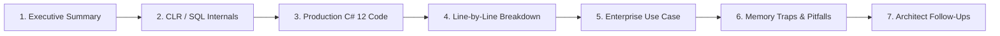
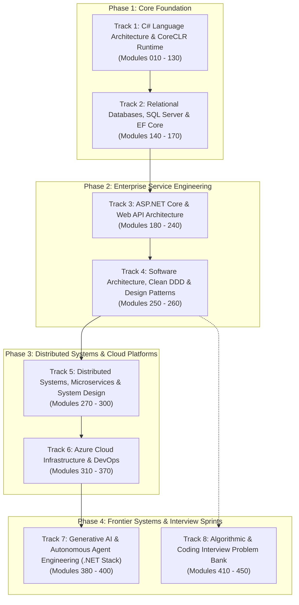

# .NET, C# & SQL Enterprise Mastery

[](https://dotnet.microsoft.com/)
[](https://learn.microsoft.com/en-us/dotnet/csharp/)
[](https://www.microsoft.com/en-us/sql-server/)
[](./250_solid_principles.md)
[](https://opensource.org/licenses/MIT)
[](https://github.com/sreekanthap89/dotnet-csharp-sql-mastery/pulls)
[](https://github.com/sreekanthap89/dotnet-csharp-sql-mastery/actions)

> **The Definitive Encyclopedia, Practical Architectural Handbook, and Interview Compendium for .NET, C#, SQL Server, Distributed Systems, Cloud & AI.**  
> Spanning **45 Specialized Reference Modules**, **265+ Rigorous Architectural Deep-Dives**, and companion **Production Code Samples, Tests & Benchmark Suites**.

---

## 🌟 Overview & Pedagogical Standard

This repository is engineered to serve as a world-class, production-grade reference manual for software engineers ranging from junior developers to enterprise solutions architects. 

Rather than superficial one-line interview answers, every single topic is dissected through an unyielding **7-Part Architectural Framework**:


```mermaid
flowchart LR
    A["1. Executive Summary"] --> B["2. CLR / SQL Internals"]
    B --> C["3. Production C# 12 Code"]
    C --> D["4. Line-by-Line Breakdown"]
    D --> E["5. Enterprise Use Case"]
    E --> F["6. Memory Traps & Pitfalls"]
    F --> G["7. Architect Follow-Ups"]
```

1. **Executive Summary & Core Concept**: Clear, intuitive, high-signal explanation.
2. **Deep-Dive Architecture & Runtime Internals**: Memory layout (Stack vs. Heap), CoreCLR execution, RyuJIT compilation, B-Tree index structures, or ASP.NET Core middleware pipelines.
3. **Production-Ready Code Implementation**: Modern C# 12 / .NET 8/9 / T-SQL code with strict nullability, defensive guards, DI, and asynchronous patterns.
4. **Line-by-Line Code Walkthrough**: Detailed mechanics of types, keywords, instructions, and memory boundaries.
5. **Real-World Enterprise Use Case**: Architecture patterns drawn from fintech, e-commerce, and high-scale cloud platforms.
6. **Common Pitfalls, Memory Traps & Anti-Patterns**: Hidden memory leaks, thread contention, boxing penalties, deadlocks, and Cartesian explosions.
7. **Senior / Architect Interview Follow-ups**: Edge cases, performance trade-offs, and high-signal responses expected in Principal / Staff / Architect interviews.

---

## 🗺️ Master Domain Progression & Architecture Roadmap

The curriculum is structured into **8 Cohesive Architectural Tracks**, progressing naturally from low-level runtime mechanics to distributed cloud, generative AI, and algorithmic mastery:


```mermaid
flowchart TD
    subgraph Fundamentals["Phase 1: Core Foundation"]
        T1["Track 1: C# Language Architecture & CoreCLR Runtime<br/>(Modules 010 - 130)"]
        T2["Track 2: Relational Databases, SQL Server & EF Core<br/>(Modules 140 - 170)"]
        T1 --> T2
    end

    subgraph ServiceLayer["Phase 2: Enterprise Service Engineering"]
        T3["Track 3: ASP.NET Core & Web API Architecture<br/>(Modules 180 - 240)"]
        T4["Track 4: Software Architecture, Clean DDD & Design Patterns<br/>(Modules 250 - 260)"]
        T2 --> T3
        T3 --> T4
    end

    subgraph DistributedCloud["Phase 3: Distributed Systems & Cloud Platforms"]
        T5["Track 5: Distributed Systems, Microservices & System Design<br/>(Modules 270 - 300)"]
        T6["Track 6: Azure Cloud Infrastructure & DevOps<br/>(Modules 310 - 370)"]
        T4 --> T5
        T5 --> T6
    end

    subgraph FrontierEngineering["Phase 4: Frontier Systems & Interview Sprints"]
        T7["Track 7: Generative AI & Autonomous Agent Engineering (.NET Stack)<br/>(Modules 380 - 400)"]
        T8["Track 8: Algorithmic & Coding Interview Problem Bank<br/>(Modules 410 - 450)"]
        T6 --> T7
        T4 -.-> T8
    end
```

---

## 📚 Thematic Mastery Curriculum (45 Modules)

### Track 1: C# Language Architecture & CoreCLR Runtime
*Master the execution engine, memory layout, GC generations, asynchronous state machines, and concurrency.*

| Module | Title | Architectural Highlights | Link |
| :-: | :--- | :--- | :--- |
| **010** | **Introduction – OOPS & Core Basics** | Class vs Object, Structs vs Classes, Value vs Reference Types, OOP Pillars | [Module 010](./010_introduction_oops_and_basics.md) |
| **020** | **OOPS – Inheritance & Polymorphism** | Virtual table (vtable), Method shadowing with `new`, Sealed classes | [Module 020](./020_oops_inheritance_abstraction_encapsulation_polymorphism.md) |
| **030** | **OOPS – Abstract Classes & Interfaces** | Default interface methods, Explicit implementation, Multiple inheritance | [Module 030](./030_abstract_class_and_interface.md) |
| **040** | **Access Modifiers & Memory Layout** | Boxing/Unboxing IL mechanics, MethodTable, SyncBlock, Internal/Protected | [Module 040](./040_access_specifiers_boxing_unboxing.md) |
| **050** | **Control Flow & Exception Handling** | Structured exception handling (SEH), `throw` vs `throw ex`, Filter `when` | [Module 050](./050_loops_conditions_exception_handling.md) |
| **060** | **Generics & High-Performance Collections** | Constraints, `List<T>` geometric growth, `Dictionary<TKey, TValue>` hash buckets | [Module 060](./060_generics_and_collections.md) |
| **070** | **Constructors & Object Lifecycle** | Static constructors, Type initializers, Constructor chaining, Copy semantics | [Module 070](./070_constructors.md) |
| **080** | **Method Parameters, Delegates & Events** | `ref`, `out`, `in`, `readonly ref`, Multicast delegates, `Action`/`Func`, Event leaks | [Module 080](./080_method_parameters_delegates_and_events.md) |
| **090** | **Important C# Keywords & Modifiers** | `readonly` vs `const`, `static`, `var` vs `dynamic`, `yield return` state machine | [Module 090](./090_important_keywords.md) |
| **100** | **LINQ Internals & Expression Trees** | Deferred execution, `IEnumerable` vs `IQueryable` vs `ICollection`, Expressions | [Module 100](./100_linq.md) |
| **110** | **.NET Framework & CLR Internals** | RyuJIT compilation, Assemblies, Metadata, Reflection, Windows Services | [Module 110](./110_dotnet_framework_basics.md) |
| **120** | **Garbage Collection & Memory Management** | Gen 0/1/2 collection, LOH & POH, Finalizer queue, GC suspension & pauses | [Module 120](./120_dotnet_garbage_collection.md) |
| **130** | **Threading, Concurrency & Async/Await** | ThreadPool, Async state machine, Thread-pool starvation, `.Result` deadlocks | [Module 130](./130_dotnet_threading_and_concurrency.md) |

---

### Track 2: Relational Databases, SQL Server Engine & Data Access
*Master relational theory, index structures, concurrency isolation, query optimization, and high-performance ORMs.*

| Module | Title | Architectural Highlights | Link |
| :-: | :--- | :--- | :--- |
| **140** | **SQL Server Fundamentals & RDBMS** | DBMS vs RDBMS, Constraints, Primary vs Unique, Triggers, Views, Normalization | [Module 140](./140_sql_basics.md) |
| **150** | **SQL Server Joins & Index Internals** | Inner/Outer/Cross Joins, Clustered vs Non-Clustered B-Trees, Index seek vs scan | [Module 150](./150_sql_joins_and_indexes.md) |
| **160** | **Stored Procedures, Functions, CTEs & Tuning** | SP vs UDF, CTE vs Temp Table, MERGE hazards, Table Partitioning, Query Store, 90% CPU triage | [Module 160](./160_sql_stored_procedures_functions_and_more.md) |
| **170** | **ADO.NET & Entity Framework Core** | Change Tracker, Unique constraint races (2601/2627), `AsNoTracking`, DTO projection, N+1 problem | [Module 170](./170_ado_dotnet_and_entity_framework.md) |

---

### Track 3: ASP.NET Core & Modern Web API Architecture
*Engineer ultra-fast, resilient web services with Kestrel, custom middleware pipelines, and enterprise security.*

| Module | Title | Architectural Highlights | Link |
| :-: | :--- | :--- | :--- |
| **180** | **ASP.NET Core Web API Fundamentals** | REST constraints, HTTP semantics, PUT vs PATCH vs POST, Minimal APIs vs Controllers | [Module 180](./180_web_api_basics.md) |
| **190** | **Web API Authentication & JWT Deep-Dive** | JWT token anatomy, ClaimsPrincipal, Signing keys, Policy & Object-Level (BOLA/IDOR) AuthZ | [Module 190](./190_web_api_authentication_and_jwt.md) |
| **200** | **Advanced Web API: ConNeg, Idempotency & Testing** | Content negotiation, `Idempotency-Key` distributed lock, High-volume `HttpClient` resilience | [Module 200](./200_web_api_advanced.md) |
| **210** | **.NET Core Architecture & Hosting Pipeline** | Generic Host, Kestrel server, Program.cs bootstrap, Request lifecycle | [Module 210](./210_dotnet_core_basics.md) |
| **220** | **Dependency Injection & IoC Internals** | Constructor injection, Keyed services, IoC resolution tree, Captive dependencies | [Module 220](./220_dotnet_core_dependency_injection.md) |
| **230** | **Service Lifetimes, Middleware & Global Exceptions** | Lifetimes, Middleware vs Filters, Modern `IExceptionHandler` & RFC 7807 ProblemDetails | [Module 230](./230_dotnet_core_service_lifetimes_middleware_hosting.md) |
| **240** | **Routing, CORS, Caching & Production Triage** | Endpoint routing, CORS security, Correlation IDs, Fast Locally vs Slow in Prod Triage | [Module 240](./240_dotnet_core_routing_files_cors_and_more.md) |

---

### Track 4: Software Architecture, Clean DDD & Design Patterns
*Construct modular, decoupled systems adhering to SOLID principles, Domain-Driven Design, and design patterns.*

| Module | Title | Architectural Highlights | Link |
| :-: | :--- | :--- | :--- |
| **250** | **SOLID Principles & Clean Architecture** | Single Responsibility, Open/Closed, Liskov, ISP, DIP, Clean Architecture layers | [Module 250](./250_solid_principles.md) |
| **260** | **Design Patterns (GoF & Enterprise)** | Factory, Thread-Safe Singleton, Builder, Adapter, Decorator, Strategy, Observer | [Module 260](./260_design_patterns.md) |

---

### Track 5: Distributed Systems, Microservices & System Design
*Transition from monoliths to reliable, asynchronous, event-driven microservices with guaranteed messaging and planet-scale system design.*

| Module | Title | Architectural Highlights | Link |
| :-: | :--- | :--- | :--- |
| **270** | **Microservices Architecture & Azure Service Bus** | Monolith vs Microservices, CQRS, Peek-Lock, DLQ, Outbox Pattern, Sagas, MassTransit | [Module 270](./270_microservices_and_azure_service_bus.md) |
| **280** | **System Design: Fundamentals & Networking** | 12-Step Framework, Request Flow, CAP/PACELC, DNS, TLS 1.3, TCP Congestion, gRPC, YARP | [Module 280](./280_system_design_fundamentals_architecture_networking.md) |
| **290** | **System Design: Caching, Databases & Consensus** | Cache-Aside, Redis Mutex, Consistent Hashing (vnodes), 2PC, Raft Quorum, Redlock | [Module 290](./290_system_design_caching_databases_messaging_distributed_systems.md) |
| **300** | **System Design: Reliability, Observability & Cases** | Circuit Breakers (Polly), W3C TraceContext, 5 Case Studies (TinyURL, Chat, Flash Sale) | [Module 300](./300_system_design_reliability_security_observability_case_studies.md) |

---

### Track 6: Cloud Platform, Azure Infrastructure & DevOps
*Provision, secure, and operate mission-critical cloud backends using managed cloud services and GitOps.*

| Module | Title | Architectural Highlights | Link |
| :-: | :--- | :--- | :--- |
| **310** | **Microsoft Entra ID & Cloud Identity** | OAuth2/OIDC, PKCE, Managed Identities (System vs User), Zero-Trust RBAC | [Module 310](./310_azure_entra_id_and_identity.md) |
| **320** | **Azure SQL Database & Cloud Relational** | vCore vs DTU, Hyperscale, Elastic Pools, Active Geo-Replication, Private Link | [Module 320](./320_azure_sql_database.md) |
| **330** | **Azure App Service, Storage & Cloud Networking** | App Service slots, Blob tiers, SAS URLs, APIM, Load Balancers, Front Door | [Module 330](./330_azure_app_service_storage_networking.md) |
| **340** | **Azure Functions & Serverless Compute** | Isolated Worker, Consumption vs Flex vs Premium, Durable Orchestrations, Triggers | [Module 340](./340_azure_functions.md) |
| **350** | **Azure Event Grid & Enterprise Messaging** | Reactive event mesh, CloudEvents v1.0, Event Grid vs Service Bus vs Event Hubs | [Module 350](./350_azure_event_grid_and_messaging.md) |
| **360** | **Azure Key Vault, Managed HSM & Security** | Secrets, Keys, Certificates, RBAC vs Access Policies, FIPS 140-2 Level 3 | [Module 360](./360_azure_key_vault_and_security.md) |
| **370** | **Azure DevOps, GitOps & CI/CD Pipelines** | Multistage YAML, Environments, Branch policies, OIDC Workload Identity | [Module 370](./370_azure_devops_ci_cd.md) |

---

### Track 7: Generative AI & Autonomous Agent Engineering (.NET Stack)
*Build production AI features in C# with Semantic Kernel, Microsoft.Extensions.AI, RAG, and Model Context Protocol.*

| Module | Title | Architectural Highlights | Link |
| :-: | :--- | :--- | :--- |
| **380** | **AI Engineering: LLM Fundamentals & .NET Stack** | Tokens, Context, Embeddings, Azure OpenAI v2, Microsoft.Extensions.AI, Semantic Kernel | [Module 380](./380_ai_engineering_llm_fundamentals_and_dotnet_stack.md) |
| **390** | **AI Engineering: RAG, Vector Search, Agents & MCP** | RAG vs Fine-tuning, Chunking, Hybrid Search (RRF), Semantic Kernel Agents, MCP in C# | [Module 390](./390_ai_rag_vector_search_and_agents_mcp.md) |
| **400** | **AI Engineering: Production Architecture & UX** | Polly 429 backoff, Semantic caching, Prompt injection, BFF streaming, 6 AI Scenarios | [Module 400](./400_ai_production_architecture_security_and_frontend_ux.md) |

---

### Track 8: Algorithmic & Coding Interview Problem Bank
*Battle-tested algorithmic challenges implemented with idiomatic C# performance optimizations.*

| Module | Title | Problem Categories & Algorithmic Patterns | Link |
| :-: | :--- | :--- | :--- |
| **410** | **Array Challenges (Core Mechanics)** | Two Sum, Single-pass Second Largest, Max/Min, Running Average, In-place reversal | [Module 410](./410_array_coding_problems.md) |
| **420** | **Array Challenges (Modular Functions)** | Sorted validation, Two-pointer merge, In-place duplicate removal, Frequency map | [Module 420](./420_array_coding_problems_using_functions.md) |
| **430** | **String Manipulation & Memory** | UTF-16 Runes vs Graphemes, Two-pointer palindrome, In-place string reversal | [Module 430](./430_string_coding_problems.md) |
| **440** | **String Challenges (Modular Functions)** | Longest word, SIMD vowel counting, Anagram validation with frequency arrays | [Module 440](./440_string_coding_problems_using_functions.md) |
| **450** | **Mathematical, Number & Bitwise Coding** | Factorial BigInteger, ++i vs i++ CIL, Prime testing (6k±1), Bitwise XOR swaps, GCD | [Module 450](./450_number_coding_problems.md) |

---

## 🚀 Live Companion Code Projects & Benchmarks

This repository includes a fully compiling, runnable **.NET 8 multi-project solution** in the [`samples/`](./samples/README.md) directory, demonstrating the architectural patterns:

```
dotnet-csharp-sql-mastery/
│
├── 010_introduction_oops_and_basics.md  # 45 Exhaustive Architectural Reference Modules (010 to 450)
│   └── ...
│
└── samples/                             # [ACTIVE & RUNNABLE] .NET 8 / 9 Master Solution
    ├── EnterpriseMastery.slnx          # Solution linking all projects
    │
    ├── src/
    │   ├── Enterprise.Core/            # Domain Entities, Result Pattern, Interfaces, Outbox Model
    │   └── Enterprise.WebApi/          # ASP.NET Core 8 Web API, Polly v8, Middleware, Minimal APIs
    │
    ├── tests/
    │   └── Enterprise.Tests/           # xUnit, FluentAssertions, WebApplicationFactory Integration Tests
    │
    ├── benchmarks/
    │   └── Enterprise.Benchmarks/      # BenchmarkDotNet: Span vs Substring, FrozenDictionary vs Dictionary
    │
    └── database/
        ├── docker-compose.yml          # Instant local SQL Server 2022 + Redis Cluster
        ├── 01_schema_and_rcsi.sql      # Tables, E-S-R Non-Clustered Indexes, RCSI Enablement
        └── 02_deadlock_simulation.sql  # Deadlock Error 1205 reproduction & Extended Events
```

### Quick Commands:
```bash
# Build the entire solution (clean build):
dotnet build samples/EnterpriseMastery.slnx

# Run automated unit and integration tests (14 tests passed, 0 failures):
dotnet test samples/EnterpriseMastery.slnx

# Run the ASP.NET Core Web API (Swagger UI enabled):
dotnet run --project samples/src/Enterprise.WebApi/Enterprise.WebApi.csproj

# Run BenchmarkDotNet performance profiling:
dotnet run -c Release --project samples/benchmarks/Enterprise.Benchmarks/Enterprise.Benchmarks.csproj
```

---

## 🎯 Target Audience & Study Pathways

Whether you are preparing for a Senior, Staff, or Principal Engineer interview, or engineering mission-critical systems:

- **Junior to Mid-Level Engineers**:
  - Focus on **Tracks 1, 2, and 3** to build an ironclad foundation in the CLR runtime, memory layout, SQL indexes, and REST APIs.
- **Senior Software Engineers**:
  - Deep-dive into **Tracks 4, 5, and 6** to master SOLID, design patterns, microservices, transactional outbox, and cloud reliability patterns.
- **Lead / Staff / Principal Architects**:
  - Master **Track 5 (Microservices & System Design)**, **Track 6 (Cloud Infrastructure)**, and **Track 7 (Generative AI Engineering)** to ace high-level distributed systems design rounds and lead enterprise technical initiatives.
- **Interview Sprints**:
  - Work through **Track 8 (Modules 410 - 450)** for algorithmic coding practice with modern C# performance idioms.

---

## 🤝 Contributing & License

Contributions, corrections, and enterprise architectural extensions are welcome via [Pull Requests](https://github.com/sreekanthap89/dotnet-csharp-sql-mastery/pulls).  
Distributed under the **MIT License**. See `LICENSE` for details.
